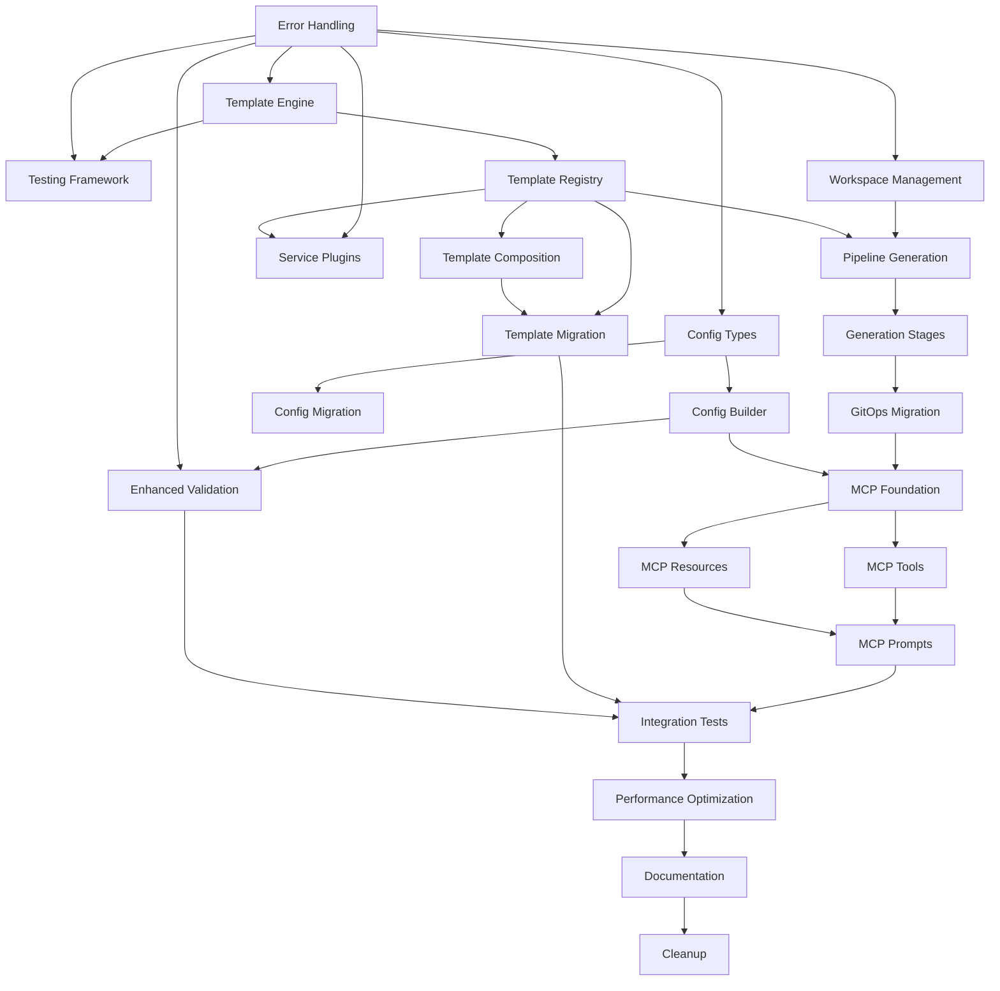

# Implementation Tasks

## Overview

This document breaks down the configuration system refactor into discrete, implementable tasks. Each task is designed to be completed independently while building toward the complete refactored system. Tasks are organized by implementation phases and include clear acceptance criteria.

## Phase 1: Foundation (Weeks 1-2)

### Task 1.1: Core Error Handling System
**Estimated Effort:** 2 days
**Dependencies:** None

**Description:** Implement the foundational error handling system with typed errors, context, and aggregation.

**Implementation Steps:**
1. Create `internal/errors/types.go` with error type definitions
2. Implement `OpenCenterError` struct with context and suggestions
3. Create `ErrorAggregator` interface and implementation
4. Add error wrapping utilities and context builders
5. Write comprehensive unit tests for error handling

**Acceptance Criteria:**
- [x] All error types are properly defined and documented
- [x] Error aggregation collects multiple errors correctly
- [x] Error context includes file paths, line numbers, and operation details
- [x] Error suggestions provide actionable guidance
- [x] Unit tests achieve 95%+ coverage

**Files to Create/Modify:**
- `internal/errors/types.go` (new)
- `internal/errors/aggregator.go` (new)
- `internal/errors/handler.go` (new)
- `internal/errors/errors_test.go` (new)

### Task 1.2: Template Engine Interface and Base Implementation
**Estimated Effort:** 3 days
**Dependencies:** Task 1.1

**Description:** Create the template engine abstraction and implement the Go template engine with caching and validation.

**Implementation Steps:**
1. Define `TemplateEngine` interface in `internal/template/engine.go`
2. Implement `GoTemplateEngine` with caching and function registration
3. Add template validation and error reporting with line numbers
4. Create template context management
5. Implement comprehensive testing including golden file tests

**Acceptance Criteria:**
- [x] Template engine interface is clean and extensible
- [x] Go template engine supports all existing template features
- [x] Template caching improves performance measurably
- [x] Template validation catches syntax errors before rendering
- [x] Error messages include line numbers and context
- [x] Golden file tests validate template output

**Files to Create/Modify:**
- `internal/template/engine.go` (new)
- `internal/template/cache.go` (new)
- `internal/template/context.go` (new)
- `internal/template/engine_test.go` (new)
- `internal/template/engine_golden_test.go` (new)
- `testdata/templates/` (new directory with test templates)

### Task 1.3: Testing Framework Setup
**Estimated Effort:** 2 days
**Dependencies:** Task 1.1, Task 1.2

**Description:** Establish the testing framework with property-based testing, mocks, and test utilities.

**Implementation Steps:**
1. Create test framework in `internal/testing/framework.go`
2. Implement mock implementations for all interfaces
3. Set up property-based testing with gopter
4. Create test data generators and fixtures
5. Add benchmark testing infrastructure

**Acceptance Criteria:**
- [x] Test framework provides consistent testing environment
- [x] Mock implementations support all interface methods
- [x] Property-based tests validate core invariants
- [x] Test data generators create realistic test scenarios
- [x] Benchmark tests measure performance regressions

**Files to Create/Modify:**
- `internal/testing/framework.go` (new)
- `internal/testing/mocks.go` (new)
- `internal/testing/generators.go` (new)
- `internal/testing/benchmarks.go` (new)
- `testdata/configs/` (new directory with test configurations)

## Phase 2: Configuration System (Weeks 3-4)

### Task 2.1: Enhanced Configuration Types
**Estimated Effort:** 2 days
**Dependencies:** Task 1.1

**Description:** Extend the configuration types with metadata, versioning, and enhanced validation support.

**Implementation Steps:**
1. Add `ConfigMetadata` to existing `Config` struct
2. Implement schema versioning in configuration
3. Add configuration annotations and tags
4. Create configuration comparison utilities
5. Update JSON schema generation for new fields

**Acceptance Criteria:**
- [x] Configuration includes creation/update timestamps
- [x] Schema versioning supports migration detection
- [x] Configuration metadata is preserved during operations
- [x] Configuration comparison detects all changes
- [x] JSON schema validates enhanced configuration structure

**Files to Create/Modify:**
- `internal/config/config.go` (modify existing)
- `internal/config/metadata.go` (new)
- `internal/config/comparison.go` (new)
- `internal/config/schema.go` (modify existing)

### Task 2.2: Configuration Builder Implementation
**Estimated Effort:** 4 days
**Dependencies:** Task 2.1, Task 1.2

**Description:** Implement the fluent configuration builder with type safety and validation.

**Implementation Steps:**
1. Create `ConfigBuilder` interface and `FluentConfigBuilder` implementation
2. Implement fluent API methods for all configuration sections
3. Add compile-time type safety for configuration paths
4. Implement validation aggregation and error reporting
5. Create builder-specific tests and property-based tests

**Acceptance Criteria:**
- [x] Fluent API supports method chaining for all configuration options
- [x] Type safety prevents invalid configuration paths at compile time
- [x] Validation errors are aggregated and reported with context
- [x] Builder supports conditional configuration based on provider
- [x] Property-based tests validate builder invariants

**Files to Create/Modify:**
- `internal/config/builder.go` (new)
- `internal/config/fluent.go` (new)
- `internal/config/validation.go` (modify existing)
- `internal/config/builder_test.go` (new)
- `internal/config/builder_property_test.go` (new)

### Task 2.3: Configuration Migration System
**Estimated Effort:** 3 days
**Dependencies:** Task 2.1

**Description:** Implement versioned configuration migration with validation and rollback support.

**Implementation Steps:**
1. Create `MigrationManager` interface and implementation
2. Define migration path validation and execution
3. Implement configuration version detection
4. Add migration dry-run and rollback capabilities
5. Create migration tests for all supported version transitions

**Acceptance Criteria:**
- [x] Migration manager supports all version transitions
- [x] Configuration values are preserved during migration
- [x] Migration validation prevents invalid version paths
- [x] Dry-run mode previews migration changes safely
- [x] Rollback capability restores original configuration

**Files to Create/Modify:**
- `internal/config/migration.go` (new)
- `internal/config/migrator.go` (new)
- `internal/config/versions.go` (new)
- `internal/config/migration_test.go` (new)
- `testdata/migrations/` (new directory with migration test cases)

### Task 2.4: Enhanced Configuration Validation
**Estimated Effort:** 2 days
**Dependencies:** Task 2.2, Task 1.1

**Description:** Enhance configuration validation with detailed error reporting and suggestions.

**Implementation Steps:**
1. Extend existing validator with enhanced error reporting
2. Add field-specific validation with suggestions
3. Implement cross-field validation rules
4. Add provider-specific validation logic
5. Create comprehensive validation test suite

**Acceptance Criteria:**
- [x] Validation errors include field paths and suggestions
- [x] Cross-field validation catches configuration conflicts
- [x] Provider-specific validation enforces provider requirements
- [x] Validation suggestions guide users to correct configurations
- [x] Validation performance is acceptable for large configurations

**Files to Create/Modify:**
- `internal/config/validator.go` (modify existing)
- `internal/config/rules.go` (new)
- `internal/config/suggestions.go` (new)
- `internal/config/validator_test.go` (modify existing)

## Phase 3: Template System (Weeks 5-6)

### Task 3.1: Template Registry Implementation
**Estimated Effort:** 3 days
**Dependencies:** Task 1.2

**Description:** Implement the template registry with metadata management and dependency resolution.

**Implementation Steps:**
1. Create `TemplateRegistry` interface and implementation
2. Implement template metadata management and storage
3. Add template dependency resolution and validation
4. Create provider and service-based template filtering
5. Implement template registry tests and benchmarks

**Acceptance Criteria:**
- [x] Template registry manages all template metadata correctly
- [x] Template dependencies are resolved in correct order
- [x] Provider filtering returns only compatible templates
- [x] Service filtering excludes disabled service templates
- [x] Template registration validates dependencies and conditions

**Files to Create/Modify:**
- `internal/template/registry.go` (new)
- `internal/template/metadata.go` (new)
- `internal/template/dependencies.go` (new)
- `internal/template/registry_test.go` (new)
- `internal/template/registry_benchmark_test.go` (new)

### Task 3.2: Template Composition System
**Estimated Effort:** 4 days
**Dependencies:** Task 3.1

**Description:** Implement template composition with base templates, overlays, and patches.

**Implementation Steps:**
1. Create `TemplateComposition` types and interfaces
2. Implement overlay application with priority ordering
3. Add patch system for targeted template modifications
4. Create composition validation and conflict resolution
5. Implement comprehensive composition tests

**Acceptance Criteria:**
- [x] Base templates can be extended with overlays correctly
- [x] Overlay priority ordering is deterministic and configurable
- [x] Patch system supports add, remove, and replace operations
- [x] Composition validation prevents incompatible combinations
- [x] Conflict resolution provides clear error messages

**Files to Create/Modify:**
- `internal/template/composition.go` (new)
- `internal/template/overlay.go` (new)
- `internal/template/patch.go` (new)
- `internal/template/composition_test.go` (new)
- `testdata/composition/` (new directory with composition test cases)

### Task 3.3: Service Plugin Architecture
**Estimated Effort:** 4 days
**Dependencies:** Task 1.1, Task 3.1

**Description:** Implement the service plugin system with dynamic loading and lifecycle management.

**Implementation Steps:**
1. Create `ServicePlugin` interface and manifest system
2. Implement service registry with dependency resolution
3. Add plugin loading and lifecycle management
4. Create built-in service plugins for existing services
5. Implement service plugin tests and integration tests

**Acceptance Criteria:**
- [ ] Service plugins can be loaded dynamically from manifests
- [ ] Service dependencies are resolved correctly with cycle detection
- [ ] Plugin lifecycle hooks execute at appropriate times
- [ ] Built-in services are migrated to plugin architecture
- [ ] Service status reporting provides accurate information

**Files to Create/Modify:**
- `internal/services/registry.go` (new)
- `internal/services/plugin.go` (new)
- `internal/services/lifecycle.go` (new)
- `internal/services/dependency.go` (new)
- `internal/services/plugins/` (new directory)
- `internal/services/registry_test.go` (new)

### Task 3.4: Template Migration from Legacy System
**Estimated Effort:** 3 days
**Dependencies:** Task 3.1, Task 3.2

**Description:** Migrate existing template processing to use the new template system while maintaining compatibility.

**Implementation Steps:**
1. Create compatibility layer for existing template calls
2. Migrate embedded templates to new registry system
3. Update template rendering in GitOps generation
4. Add feature flag for gradual migration
5. Validate output compatibility with legacy system

**Acceptance Criteria:**
- [ ] Existing template calls work without modification
- [ ] All embedded templates are registered in new system
- [ ] Template output is identical to legacy system
- [ ] Feature flag allows switching between old and new systems
- [ ] Migration path is documented and tested

**Files to Create/Modify:**
- `internal/template/legacy.go` (new)
- `internal/gitops/copy.go` (modify existing)
- `internal/gitops/embed.go` (modify existing)
- `internal/template/migration_test.go` (new)

## Phase 4: GitOps Generation (Weeks 7-8)

### Task 4.1: GitOps Workspace Management
**Estimated Effort:** 3 days
**Dependencies:** Task 1.1

**Description:** Implement workspace management with checkpointing and rollback capabilities.

**Implementation Steps:**
1. Create `GitOpsWorkspace` and `WorkspaceManager` implementations
2. Implement workspace checkpointing and restoration
3. Add atomic file operations and transaction support
4. Create workspace cleanup and resource management
5. Implement workspace tests and integration tests

**Acceptance Criteria:**
- [ ] Workspace provides isolated environment for generation
- [ ] Checkpointing captures workspace state at any point
- [ ] Rollback restores workspace to previous checkpoint
- [ ] Atomic operations prevent partial file writes
- [ ] Resource cleanup prevents workspace leaks

**Files to Create/Modify:**
- `internal/gitops/workspace.go` (new)
- `internal/gitops/checkpoint.go` (new)
- `internal/gitops/atomic.go` (new)
- `internal/gitops/workspace_test.go` (new)

### Task 4.2: Pipeline-Based GitOps Generation
**Estimated Effort:** 4 days
**Dependencies:** Task 4.1, Task 3.1

**Description:** Implement the pipeline-based GitOps generation system with staged execution and rollback.

**Implementation Steps:**
1. Create `GitOpsGenerator` interface and `PipelineGenerator` implementation
2. Define generation stages and stage interface
3. Implement stage execution with rollback capabilities
4. Add dry-run mode for generation preview
5. Create comprehensive generation tests

**Acceptance Criteria:**
- [ ] Generation executes in discrete, rollback-capable stages
- [ ] Stage failures trigger automatic rollback of previous stages
- [ ] Dry-run mode provides accurate preview without filesystem changes
- [ ] Generation progress is reported to users
- [ ] Generated repository structure meets all requirements

**Files to Create/Modify:**
- `internal/gitops/generator.go` (new)
- `internal/gitops/pipeline.go` (new)
- `internal/gitops/stages/` (new directory)
- `internal/gitops/dryrun.go` (new)
- `internal/gitops/generator_test.go` (new)

### Task 4.3: Generation Stage Implementations
**Estimated Effort:** 4 days
**Dependencies:** Task 4.2

**Description:** Implement specific generation stages for different aspects of GitOps repository creation.

**Implementation Steps:**
1. Create base directory structure generation stage
2. Implement infrastructure template generation stage
3. Add service template generation stage
4. Create configuration file generation stage
5. Implement validation and cleanup stages

**Acceptance Criteria:**
- [ ] Base structure stage creates correct directory layout
- [ ] Infrastructure stage generates provider-specific templates
- [ ] Service stage generates enabled service configurations
- [ ] Configuration stage creates cluster-specific configs
- [ ] Validation stage verifies repository completeness

**Files to Create/Modify:**
- `internal/gitops/stages/base.go` (new)
- `internal/gitops/stages/infrastructure.go` (new)
- `internal/gitops/stages/services.go` (new)
- `internal/gitops/stages/config.go` (new)
- `internal/gitops/stages/validation.go` (new)
- `internal/gitops/stages/stages_test.go` (new)

### Task 4.4: Legacy GitOps Generation Migration
**Estimated Effort:** 3 days
**Dependencies:** Task 4.3

**Description:** Migrate existing GitOps generation logic to use the new pipeline system.

**Implementation Steps:**
1. Create compatibility wrapper for existing generation calls
2. Map existing generation logic to new pipeline stages
3. Update CLI commands to use new generation system
4. Add feature flag for gradual migration
5. Validate output compatibility with existing system

**Acceptance Criteria:**
- [ ] Existing generation calls work without modification
- [ ] Generated output is identical to legacy system
- [ ] CLI commands use new generation system transparently
- [ ] Feature flag allows switching between systems
- [ ] Migration preserves all existing functionality

**Files to Create/Modify:**
- `internal/gitops/legacy_compat.go` (new)
- `cmd/cluster_init.go` (modify existing)
- `cmd/cluster_bootstrap.go` (modify existing)
- `internal/gitops/migration_test.go` (new)

## Phase 5: Integration and Testing (Weeks 9-12)

### Task 5.1: MCP Server Foundation
**Estimated Effort:** 4 days
**Dependencies:** Task 4.4, Task 2.2

**Description:** Implement the foundational MCP server with authentication, session management, and basic tool/resource framework.

**Implementation Steps:**
1. Create MCP server interface and implementation using mcp-go library
2. Implement authentication providers (file-based and OIDC)
3. Add session management with user context and permissions
4. Create audit logging system for MCP operations
5. Implement comprehensive MCP server tests

**Acceptance Criteria:**
- [ ] MCP server starts and accepts connections via stdio and HTTP transports
- [ ] Authentication providers validate user credentials correctly
- [ ] Session management maintains user context and permissions
- [ ] Audit logging captures all MCP operations with full context
- [ ] Security controls prevent unauthorized access to cluster operations

**Files to Create/Modify:**
- `internal/mcp/server.go` (new)
- `internal/mcp/auth.go` (new)
- `internal/mcp/session.go` (new)
- `internal/mcp/audit.go` (new)
- `internal/mcp/server_test.go` (new)
- `cmd/mcp_server.go` (new)

### Task 5.2: MCP Cluster Management Tools
**Estimated Effort:** 5 days
**Dependencies:** Task 5.1

**Description:** Implement MCP tools for cluster lifecycle operations with proper permission validation and error handling.

**Implementation Steps:**
1. Create cluster initialization tool with configuration validation
2. Implement cluster validation tool with detailed error reporting
3. Add GitOps generation tool with dry-run capabilities
4. Create cluster status and information tools
5. Implement cluster update and destroy tools with safety checks

**Acceptance Criteria:**
- [ ] Cluster init tool creates valid configurations through MCP interface
- [ ] Validation tool provides detailed feedback on configuration issues
- [ ] GitOps generation tool supports dry-run mode for safe previews
- [ ] Status tools provide real-time cluster information
- [ ] Destructive operations require explicit confirmation and proper permissions

**Files to Create/Modify:**
- `internal/mcp/tools/cluster.go` (new)
- `internal/mcp/tools/validation.go` (new)
- `internal/mcp/tools/gitops.go` (new)
- `internal/mcp/tools/status.go` (new)
- `internal/mcp/tools/cluster_test.go` (new)

### Task 5.3: MCP Configuration Resources
**Estimated Effort:** 3 days
**Dependencies:** Task 5.1

**Description:** Implement MCP resources for accessing and analyzing cluster configurations with proper access controls.

**Implementation Steps:**
1. Create configuration resource handlers for reading cluster configs
2. Implement template resource access with provider filtering
3. Add schema resource for configuration validation assistance
4. Create service registry resource for available services
5. Implement configuration comparison and diff resources

**Acceptance Criteria:**
- [ ] Configuration resources respect organization and cluster scoping
- [ ] Template resources filter based on provider and service enablement
- [ ] Schema resources provide up-to-date validation information
- [ ] Service resources show available services with dependency information
- [ ] Diff resources provide clear configuration comparison capabilities

**Files to Create/Modify:**
- `internal/mcp/resources/config.go` (new)
- `internal/mcp/resources/templates.go` (new)
- `internal/mcp/resources/schema.go` (new)
- `internal/mcp/resources/services.go` (new)
- `internal/mcp/resources/resources_test.go` (new)

### Task 5.4: MCP Guidance Prompts
**Estimated Effort:** 3 days
**Dependencies:** Task 5.2, Task 5.3

**Description:** Create MCP prompts that guide AI assistants in cluster management best practices and troubleshooting.

**Implementation Steps:**
1. Create cluster initialization guidance prompts with provider-specific advice
2. Implement troubleshooting prompts for common configuration issues
3. Add best practices prompts for security and performance optimization
4. Create service selection guidance based on use case requirements
5. Implement migration assistance prompts for configuration updates

**Acceptance Criteria:**
- [ ] Initialization prompts guide users through provider-specific setup
- [ ] Troubleshooting prompts help diagnose and resolve common issues
- [ ] Best practices prompts promote secure and performant configurations
- [ ] Service selection prompts recommend appropriate services for use cases
- [ ] Migration prompts assist with safe configuration updates

**Files to Create/Modify:**
- `internal/mcp/prompts/initialization.go` (new)
- `internal/mcp/prompts/troubleshooting.go` (new)
- `internal/mcp/prompts/best_practices.go` (new)
- `internal/mcp/prompts/services.go` (new)
- `internal/mcp/prompts/prompts_test.go` (new)

### Task 5.5: End-to-End Integration Tests
**Estimated Effort:** 3 days
**Dependencies:** All previous tasks

**Description:** Create comprehensive integration tests that validate the complete refactored system including MCP server functionality.

**Implementation Steps:**
1. Create integration test framework for complete workflows including MCP
2. Implement tests for all supported provider configurations via MCP
3. Add tests for service combinations and edge cases through MCP interface
4. Create performance regression tests including MCP overhead
5. Implement compatibility tests with legacy configurations

**Acceptance Criteria:**
- [ ] Integration tests cover all major workflow scenarios including MCP paths
- [ ] Provider-specific tests validate all supported providers via MCP
- [ ] Service combination tests verify plugin interactions through MCP
- [ ] Performance tests detect regressions including MCP server overhead
- [ ] Compatibility tests ensure backward compatibility through all interfaces

**Files to Create/Modify:**
- `tests/integration/complete_workflow_test.go` (modify existing)
- `tests/integration/mcp_server_test.go` (new)
- `tests/integration/provider_test.go` (modify existing)
- `tests/integration/service_test.go` (modify existing)
- `tests/integration/performance_test.go` (modify existing)

### Task 5.6: Performance Optimization
**Estimated Effort:** 2 days
**Dependencies:** Task 5.5

**Description:** Optimize system performance including MCP server responsiveness based on benchmark results and profiling.

**Implementation Steps:**
1. Profile system performance with realistic workloads including MCP operations
2. Optimize template caching and rendering performance for MCP resource access
3. Improve configuration building and validation speed for MCP tools
4. Optimize GitOps generation for large repositories via MCP
5. Validate performance improvements with benchmarks including MCP overhead

**Acceptance Criteria:**
- [ ] MCP server response times meet acceptable thresholds for interactive use
- [ ] Template rendering performance meets or exceeds legacy system via MCP
- [ ] Configuration building is faster than reflection-based approach via MCP
- [ ] GitOps generation scales well with repository size through MCP interface
- [ ] Memory usage is optimized for concurrent MCP sessions

**Files to Create/Modify:**
- `internal/template/optimization.go` (modify existing)
- `internal/config/optimization.go` (modify existing)
- `internal/gitops/optimization.go` (modify existing)
- `internal/mcp/optimization.go` (new)
- `benchmarks/mcp_benchmarks.go` (new)

### Task 5.7: Documentation and Examples
**Estimated Effort:** 4 days
**Dependencies:** Task 5.6

**Description:** Create comprehensive documentation and examples for the refactored system including MCP server usage.

**Implementation Steps:**
1. Document all new interfaces including MCP server API
2. Create migration guide from legacy system including MCP setup
3. Add examples for common configuration patterns via MCP
4. Document MCP server deployment and authentication setup
5. Create AI assistant integration guide and troubleshooting documentation

**Acceptance Criteria:**
- [ ] All public interfaces are documented with examples including MCP tools
- [ ] Migration guide provides clear step-by-step instructions including MCP setup
- [ ] Configuration examples cover common use cases accessible via MCP
- [ ] MCP server documentation enables easy deployment and integration
- [ ] AI assistant guide demonstrates effective cluster management workflows

**Files to Create/Modify:**
- `docs/architecture/refactored-system.md` (modify existing)
- `docs/mcp/server-setup.md` (new)
- `docs/mcp/ai-assistant-guide.md` (new)
- `docs/migration/legacy-to-refactored.md` (modify existing)
- `docs/examples/mcp-workflows.md` (new)

### Task 5.8: Feature Flag Removal and Cleanup
**Estimated Effort:** 3 days
**Dependencies:** All previous tasks

**Description:** Create comprehensive integration tests that validate the complete refactored system.

**Implementation Steps:**
1. Create integration test framework for complete workflows
2. Implement tests for all supported provider configurations
3. Add tests for service combinations and edge cases
4. Create performance regression tests
5. Implement compatibility tests with legacy configurations

**Acceptance Criteria:**
- [ ] Integration tests cover all major workflow scenarios
- [ ] Provider-specific tests validate all supported providers
- [ ] Service combination tests verify plugin interactions
- [ ] Performance tests detect regressions
- [ ] Compatibility tests ensure backward compatibility

**Files to Create/Modify:**
- `tests/integration/complete_workflow_test.go` (new)
- `tests/integration/provider_test.go` (new)
- `tests/integration/service_test.go` (new)
- `tests/integration/performance_test.go` (new)
- `tests/integration/compatibility_test.go` (new)

### Task 5.2: Performance Optimization
**Estimated Effort:** 2 days
**Dependencies:** Task 5.1

**Description:** Optimize system performance based on benchmark results and profiling.

**Implementation Steps:**
1. Profile system performance with realistic workloads
2. Optimize template caching and rendering performance
3. Improve configuration building and validation speed
4. Optimize GitOps generation for large repositories
5. Validate performance improvements with benchmarks

**Acceptance Criteria:**
- [ ] Template rendering performance meets or exceeds legacy system
- [ ] Configuration building is faster than reflection-based approach
- [ ] GitOps generation scales well with repository size
- [ ] Memory usage is optimized for large configurations
- [ ] Performance improvements are validated with benchmarks

**Files to Create/Modify:**
- `internal/template/optimization.go` (new)
- `internal/config/optimization.go` (new)
- `internal/gitops/optimization.go` (new)
- `benchmarks/` (new directory with comprehensive benchmarks)

### Task 5.3: Documentation and Examples
**Estimated Effort:** 3 days
**Dependencies:** Task 5.2

**Description:** Create comprehensive documentation and examples for the refactored system.

**Implementation Steps:**
1. Document all new interfaces and their usage
2. Create migration guide from legacy system
3. Add examples for common configuration patterns
4. Document plugin development guide
5. Create troubleshooting and debugging guide

**Acceptance Criteria:**
- [ ] All public interfaces are documented with examples
- [ ] Migration guide provides clear step-by-step instructions
- [ ] Configuration examples cover common use cases
- [ ] Plugin development guide enables third-party plugins
- [ ] Troubleshooting guide addresses common issues

**Files to Create/Modify:**
- `docs/architecture/refactored-system.md` (new)
- `docs/migration/legacy-to-refactored.md` (new)
- `docs/examples/configuration-patterns.md` (new)
- `docs/development/plugin-development.md` (new)
- `docs/troubleshooting/refactored-system.md` (new)

### Task 5.4: Feature Flag Removal and Cleanup
**Estimated Effort:** 2 days
**Dependencies:** Task 5.3

**Description:** Remove feature flags and legacy code after successful migration validation.

**Implementation Steps:**
1. Validate all functionality works with new system
2. Remove feature flags and legacy compatibility code
3. Clean up unused imports and dependencies
4. Update build and test configurations
5. Perform final validation of cleaned system

**Acceptance Criteria:**
- [ ] All functionality works without feature flags
- [ ] Legacy code is completely removed
- [ ] Build system is updated for new architecture
- [ ] Test suite passes completely
- [ ] System is ready for production use

**Files to Create/Modify:**
- Remove legacy compatibility files
- Update build configurations
- Clean up test configurations
- Update CI/CD pipelines

## Task Dependencies

## Risk Mitigation

### High-Risk Tasks
- **Task 3.4 & 4.4**: Legacy system migration - Risk of breaking existing functionality
- **Task 5.2**: Performance optimization - Risk of introducing bugs during optimization

### Mitigation Strategies
1. **Comprehensive Testing**: Each task includes extensive testing requirements
2. **Feature Flags**: Gradual migration with ability to rollback
3. **Compatibility Validation**: Automated comparison with legacy system output
4. **Incremental Delivery**: Each phase delivers working functionality
5. **Code Review**: All changes require thorough code review

## Success Criteria

The refactor is considered successful when:
1. All existing functionality works without modification
2. New system provides better maintainability and extensibility
3. Performance is equal to or better than legacy system
4. All tests pass including property-based and integration tests
5. Documentation enables easy adoption and contribution
6. Migration path is clear and well-documented