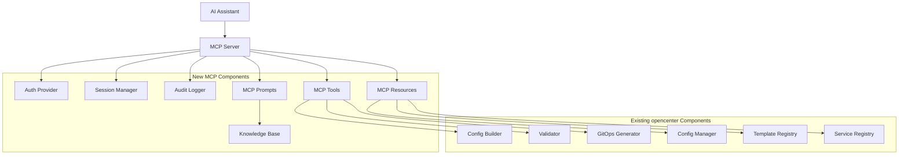

# Design Document: MCP Server Integration

## Overview

This design document outlines the integration of Model Context Protocol (MCP) server capabilities into opencenter CLI. The MCP server will expose cluster management operations, configuration resources, and guidance prompts to AI assistants through a standardized protocol, enabling natural language-based cluster management while maintaining security, audit controls, and backward compatibility with existing CLI workflows.

## Architecture

The MCP server integrates with existing opencenter components while adding new authentication, session management, and protocol handling layers:



## Components and Interfaces

### MCP Server Core

```go
// internal/mcp/server.go
package mcp

import (
    "context"
    
    "github.com/mark3labs/mcp-go/server"
    "github.com/rackerlabs/opencenter-cli/internal/config"
    "github.com/rackerlabs/opencenter-cli/internal/gitops"
    "github.com/rackerlabs/opencenter-cli/internal/services"
    "github.com/rackerlabs/opencenter-cli/internal/template"
)

// Server defines the MCP server interface for opencenter
type Server interface {
    // Start starts the MCP server with the given context
    Start(ctx context.Context) error
    
    // Stop gracefully stops the MCP server
    Stop(ctx context.Context) error
    
    // RegisterTools registers MCP tools for cluster operations
    RegisterTools(tools []Tool) error
    
    // RegisterResources registers MCP resources for configuration access
    RegisterResources(resources []Resource) error
    
    // RegisterPrompts registers MCP prompts for guidance
    RegisterPrompts(prompts []Prompt) error
    
    // SetAuthProvider sets the authentication provider
    SetAuthProvider(provider AuthProvider) error
}

// OpenCenterMCPServer implements the MCP server for opencenter
type OpenCenterMCPServer struct {
    server          *server.MCPServer
    config          *ServerConfig
    configManager   config.Manager
    templateEngine  template.TemplateEngine
    gitopsGenerator gitops.GitOpsGenerator
    serviceRegistry services.ServiceRegistry
    authProvider    AuthProvider
    sessionManager  SessionManager
    auditLogger     AuditLogger
}

// NewOpenCenterMCPServer creates a new MCP server instance
func NewOpenCenterMCPServer(cfg *ServerConfig) (*OpenCenterMCPServer, error) {
    // Implementation
}
```

### Authentication System

```go
// internal/mcp/auth.go
package mcp

import "context"

// AuthProvider defines the interface for authentication providers
type AuthProvider interface {
    // AuthenticateSession validates credentials and creates a session
    AuthenticateSession(ctx context.Context, credentials map[string]string) (Session, error)
    
    // ValidatePermission checks if a session has the required permission
    ValidatePermission(session Session, permission Permission) error
    
    // RefreshSession refreshes an existing session
    RefreshSession(ctx context.Context, session Session) error
}

// Permission represents a specific permission for MCP operations
type Permission struct {
    Resource string // cluster, config, template, service
    Action   string // read, write, create, delete, validate
    Scope    string // organization, cluster, global
}

// FileBasedAuthProvider implements authentication using a YAML file
type FileBasedAuthProvider struct {
    configPath string
    users      map[string]UserConfig
}

// OIDCAuthProvider implements authentication using OpenID Connect
type OIDCAuthProvider struct {
    issuer       string
    clientID     string
    clientSecret string
}

// UserConfig defines a user's authentication and authorization settings
type UserConfig struct {
    ID           string       `yaml:"id"`
    Name         string       `yaml:"name"`
    Email        string       `yaml:"email"`
    PasswordHash string       `yaml:"password_hash,omitempty"`
    Organization string       `yaml:"organization"`
    Permissions  []Permission `yaml:"permissions"`
    ConfigScope  ConfigScope  `yaml:"config_scope"`
    Active       bool         `yaml:"active"`
}

// ConfigScope defines what configurations a user can access
type ConfigScope struct {
    Organization string   `yaml:"organization"`
    Clusters     []string `yaml:"clusters"`
    ReadOnly     bool     `yaml:"read_only"`
}
```

### Session Management

```go
// internal/mcp/session.go
package mcp

import (
    "context"
    "time"
)

// SessionManager manages MCP sessions
type SessionManager interface {
    // CreateSession creates a new session for an authenticated user
    CreateSession(ctx context.Context, user UserConfig) (Session, error)
    
    // GetSession retrieves an existing session by ID
    GetSession(ctx context.Context, sessionID string) (Session, error)
    
    // RefreshSession updates the last activity time for a session
    RefreshSession(ctx context.Context, sessionID string) error
    
    // CloseSession terminates a session and cleans up resources
    CloseSession(ctx context.Context, sessionID string) error
    
    // CleanupExpiredSessions removes sessions that have exceeded timeout
    CleanupExpiredSessions(ctx context.Context) error
}

// Session represents an authenticated MCP session
type Session interface {
    // ID returns the unique session identifier
    ID() string
    
    // UserID returns the authenticated user's ID
    UserID() string
    
    // Organization returns the user's organization
    Organization() string
    
    // Permissions returns the user's permissions
    Permissions() []Permission
    
    // ConfigScope returns the user's configuration access scope
    ConfigScope() ConfigScope
    
    // AuditLog returns the audit logger for this session
    AuditLog() AuditLogger
    
    // CreatedAt returns when the session was created
    CreatedAt() time.Time
    
    // LastActivity returns when the session was last used
    LastActivity() time.Time
}

// SessionData holds session state
type SessionData struct {
    ID           string                 `json:"id"`
    UserID       string                 `json:"user_id"`
    Organization string                 `json:"organization"`
    Permissions  []Permission           `json:"permissions"`
    ConfigScope  ConfigScope            `json:"config_scope"`
    CreatedAt    time.Time              `json:"created_at"`
    LastActivity time.Time              `json:"last_activity"`
    Metadata     map[string]interface{} `json:"metadata"`
}
```

### MCP Tools

```go
// internal/mcp/tools/cluster.go
package tools

import (
    "context"
    
    "github.com/mark3labs/mcp-go/mcp"
    "github.com/rackerlabs/opencenter-cli/internal/config"
    "github.com/rackerlabs/opencenter-cli/internal/mcp"
)

// ClusterInitTool implements cluster initialization via MCP
type ClusterInitTool struct {
    configBuilder config.ConfigBuilder
    validator     config.ConfigValidatorInterface
}

// Name returns the tool name
func (t *ClusterInitTool) Name() string {
    return "cluster_init"
}

// Description returns the tool description
func (t *ClusterInitTool) Description() string {
    return "Initialize a new cluster configuration with validation"
}

// InputSchema returns the JSON schema for tool inputs
func (t *ClusterInitTool) InputSchema() map[string]interface{} {
    return map[string]interface{}{
        "type": "object",
        "properties": map[string]interface{}{
            "provider":     map[string]string{"type": "string", "enum": []string{"openstack", "aws", "baremetal", "kind"}},
            "organization": map[string]string{"type": "string"},
            "cluster_name": map[string]string{"type": "string"},
            "kubernetes_version": map[string]string{"type": "string"},
            // ... additional properties
        },
        "required": []string{"provider", "organization", "cluster_name"},
    }
}

// Execute runs the tool with the given session and request
func (t *ClusterInitTool) Execute(ctx context.Context, session mcp.Session, request mcp.CallToolRequest) (*mcp.CallToolResult, error) {
    // Validate permissions
    if err := session.ValidatePermission(mcp.Permission{
        Resource: "cluster",
        Action:   "create",
        Scope:    session.Organization(),
    }); err != nil {
        return nil, err
    }
    
    // Parse and validate inputs
    // Build configuration
    // Audit log the operation
    // Return result
}
```

### MCP Resources

```go
// internal/mcp/resources/config.go
package resources

import (
    "context"
    
    "github.com/mark3labs/mcp-go/mcp"
    "github.com/rackerlabs/opencenter-cli/internal/config"
    mcpinternal "github.com/rackerlabs/opencenter-cli/internal/mcp"
)

// ConfigResource provides access to cluster configurations
type ConfigResource struct {
    configManager config.Manager
}

// URIPattern returns the URI pattern for this resource
func (r *ConfigResource) URIPattern() string {
    return "config://{organization}/{cluster}"
}

// Description returns the resource description
func (r *ConfigResource) Description() string {
    return "Access cluster configuration files"
}

// MIMEType returns the resource MIME type
func (r *ConfigResource) MIMEType() string {
    return "application/yaml"
}

// Read retrieves the resource content
func (r *ConfigResource) Read(ctx context.Context, session mcpinternal.Session, request mcp.ReadResourceRequest) ([]mcp.ResourceContents, error) {
    // Validate permissions
    // Parse URI to extract organization and cluster
    // Check ConfigScope
    // Load configuration
    // Return as resource content
}
```

### MCP Prompts

```go
// internal/mcp/prompts/initialization.go
package prompts

import (
    "context"
    
    "github.com/mark3labs/mcp-go/mcp"
    mcpinternal "github.com/rackerlabs/opencenter-cli/internal/mcp"
)

// InitializationPrompt provides guidance for cluster initialization
type InitializationPrompt struct {
    name        string
    description string
}

// Name returns the prompt name
func (p *InitializationPrompt) Name() string {
    return "cluster_initialization_guide"
}

// Description returns the prompt description
func (p *InitializationPrompt) Description() string {
    return "Provides step-by-step guidance for initializing a new cluster"
}

// Arguments returns the prompt arguments schema
func (p *InitializationPrompt) Arguments() []mcp.PromptArgument {
    return []mcp.PromptArgument{
        {
            Name:        "provider",
            Description: "Cloud provider (openstack, aws, baremetal, kind)",
            Required:    true,
        },
        {
            Name:        "use_case",
            Description: "Primary use case (development, staging, production)",
            Required:    false,
        },
    }
}

// Generate generates the prompt content
func (p *InitializationPrompt) Generate(ctx context.Context, session mcpinternal.Session, args map[string]string) (string, error) {
    // Generate context-aware guidance based on provider and use case
    // Include best practices and common pitfalls
    // Provide example configurations
}
```

## Data Models

### Server Configuration

```go
// internal/mcp/types.go
package mcp

// ServerConfig defines the MCP server configuration
type ServerConfig struct {
    Name        string            `yaml:"name"`
    Version     string            `yaml:"version"`
    Description string            `yaml:"description"`
    Transport   TransportConfig   `yaml:"transport"`
    Auth        AuthConfig        `yaml:"auth"`
    Tools       []ToolConfig      `yaml:"tools"`
    Resources   []ResourceConfig  `yaml:"resources"`
    Prompts     []PromptConfig    `yaml:"prompts"`
    Security    SecurityConfig    `yaml:"security"`
    Logging     LoggingConfig     `yaml:"logging"`
}

// TransportConfig defines transport settings
type TransportConfig struct {
    Type    string            `yaml:"type"` // stdio, http
    Address string            `yaml:"address,omitempty"`
    Port    int               `yaml:"port,omitempty"`
    TLS     *TLSConfig        `yaml:"tls,omitempty"`
    Headers map[string]string `yaml:"headers,omitempty"`
}

// TLSConfig defines TLS settings
type TLSConfig struct {
    Enabled  bool   `yaml:"enabled"`
    CertFile string `yaml:"cert_file"`
    KeyFile  string `yaml:"key_file"`
    CAFile   string `yaml:"ca_file,omitempty"`
}

// AuthConfig defines authentication settings
type AuthConfig struct {
    Type     string                 `yaml:"type"` // none, file, oidc
    Config   map[string]interface{} `yaml:"config,omitempty"`
    Required bool                   `yaml:"required"`
}

// ToolConfig defines tool-specific settings
type ToolConfig struct {
    Name        string   `yaml:"name"`
    Enabled     bool     `yaml:"enabled"`
    Permissions []string `yaml:"permissions"`
    RateLimit   *int     `yaml:"rate_limit,omitempty"`
}

// ResourceConfig defines resource-specific settings
type ResourceConfig struct {
    Pattern     string   `yaml:"pattern"`
    Enabled     bool     `yaml:"enabled"`
    Permissions []string `yaml:"permissions"`
    CacheTTL    *int     `yaml:"cache_ttl,omitempty"`
}

// PromptConfig defines prompt-specific settings
type PromptConfig struct {
    Name    string `yaml:"name"`
    Enabled bool   `yaml:"enabled"`
}

// SecurityConfig defines security settings
type SecurityConfig struct {
    AuditLog        bool     `yaml:"audit_log"`
    RateLimiting    bool     `yaml:"rate_limiting"`
    AllowedOrigins  []string `yaml:"allowed_origins,omitempty"`
    MaxRequestSize  int      `yaml:"max_request_size"`
    SessionTimeout  int      `yaml:"session_timeout"`
    IPAllowlist     []string `yaml:"ip_allowlist,omitempty"`
}

// LoggingConfig defines logging settings
type LoggingConfig struct {
    Level      string `yaml:"level"` // debug, info, warn, error
    Format     string `yaml:"format"` // json, text
    Output     string `yaml:"output"` // stdout, stderr, file
    File       string `yaml:"file,omitempty"`
    MaxSize    int    `yaml:"max_size,omitempty"` // MB
    MaxBackups int    `yaml:"max_backups,omitempty"`
    MaxAge     int    `yaml:"max_age,omitempty"` // days
}
```

### Audit Logging

```go
// internal/mcp/audit.go
package mcp

import (
    "context"
    "time"
)

// AuditLogger defines the interface for audit logging
type AuditLogger interface {
    // LogToolExecution logs an MCP tool execution
    LogToolExecution(ctx context.Context, entry ToolExecutionEntry) error
    
    // LogResourceAccess logs an MCP resource access
    LogResourceAccess(ctx context.Context, entry ResourceAccessEntry) error
    
    // LogAuthEvent logs an authentication event
    LogAuthEvent(ctx context.Context, entry AuthEventEntry) error
    
    // LogSecurityEvent logs a security-related event
    LogSecurityEvent(ctx context.Context, entry SecurityEventEntry) error
}

// ToolExecutionEntry represents a tool execution audit log entry
type ToolExecutionEntry struct {
    Timestamp   time.Time              `json:"timestamp"`
    SessionID   string                 `json:"session_id"`
    UserID      string                 `json:"user_id"`
    ToolName    string                 `json:"tool_name"`
    Arguments   map[string]interface{} `json:"arguments"`
    Result      string                 `json:"result"` // success, error
    Error       string                 `json:"error,omitempty"`
    Duration    time.Duration          `json:"duration"`
    IPAddress   string                 `json:"ip_address,omitempty"`
}

// ResourceAccessEntry represents a resource access audit log entry
type ResourceAccessEntry struct {
    Timestamp   time.Time `json:"timestamp"`
    SessionID   string    `json:"session_id"`
    UserID      string    `json:"user_id"`
    ResourceURI string    `json:"resource_uri"`
    Result      string    `json:"result"` // success, error
    Error       string    `json:"error,omitempty"`
    IPAddress   string    `json:"ip_address,omitempty"`
}

// AuthEventEntry represents an authentication event audit log entry
type AuthEventEntry struct {
    Timestamp time.Time `json:"timestamp"`
    UserID    string    `json:"user_id"`
    Event     string    `json:"event"` // login, logout, refresh, failed_login
    Result    string    `json:"result"` // success, error
    Error     string    `json:"error,omitempty"`
    IPAddress string    `json:"ip_address,omitempty"`
}

// SecurityEventEntry represents a security event audit log entry
type SecurityEventEntry struct {
    Timestamp   time.Time `json:"timestamp"`
    SessionID   string    `json:"session_id,omitempty"`
    UserID      string    `json:"user_id,omitempty"`
    Event       string    `json:"event"` // rate_limit, permission_denied, suspicious_activity
    Description string    `json:"description"`
    IPAddress   string    `json:"ip_address,omitempty"`
}
```

## Correctness Properties

*A property is a characteristic or behavior that should hold true across all valid executions of a system-essentially, a formal statement about what the system should do. Properties serve as the bridge between human-readable specifications and machine-verifiable correctness guarantees.*

### Authentication and Authorization Properties

**Property 1: Authentication Validation**
*For any* MCP session creation attempt, authentication must be validated before granting access
**Validates: Requirements 2.2**

**Property 2: Permission Enforcement**
*For any* MCP tool execution, permissions must be checked before operation execution
**Validates: Requirements 2.3**

**Property 3: Session Timeout**
*For any* MCP session, it should be automatically terminated after the configured timeout period of inactivity
**Validates: Requirements 2.6, 3.5**

### Session Management Properties

**Property 4: Session Isolation**
*For any* two concurrent MCP sessions, they should maintain independent state and not interfere with each other
**Validates: Requirements 3.1, 3.2**

**Property 5: Config Scope Enforcement**
*For any* configuration access, only configurations within the session's ConfigScope should be accessible
**Validates: Requirements 3.3, 5.5**

### Tool Execution Properties

**Property 6: Input Validation**
*For any* MCP tool call, inputs must be validated against the tool's JSON schema before execution
**Validates: Requirements 4.6**

**Property 7: Destructive Operation Confirmation**
*For any* destructive operation (delete, destroy), explicit confirmation must be required
**Validates: Requirements 4.5**

### Resource Access Properties

**Property 8: Resource Permission Check**
*For any* MCP resource access, permissions must be validated before returning resource content
**Validates: Requirements 5.5**

**Property 9: Resource Caching Consistency**
*For any* cached resource, it should be invalidated after the configured TTL expires
**Validates: Requirements 5.6**

### Audit Logging Properties

**Property 10: Complete Audit Trail**
*For any* MCP operation (tool execution or resource access), an audit log entry must be created
**Validates: Requirements 7.1, 7.2**

**Property 11: Audit Log Integrity**
*For any* audit log entry, it must include timestamp, user context, and operation result
**Validates: Requirements 7.3**

### Security Properties

**Property 12: Rate Limiting**
*For any* session exceeding the configured rate limit, subsequent requests should be rejected
**Validates: Requirements 8.1**

**Property 13: Input Sanitization**
*For any* user input, it must be sanitized to prevent injection attacks
**Validates: Requirements 8.2**

**Property 14: TLS Enforcement**
*For any* HTTP transport connection, TLS must be enforced when configured
**Validates: Requirements 8.4**

### Error Handling Properties

**Property 15: Structured Error Responses**
*For any* operation failure, a structured error response with error code and message must be returned
**Validates: Requirements 9.1**

**Property 16: Error Aggregation**
*For any* validation failure with multiple errors, all errors should be collected and returned together
**Validates: Requirements 9.5**

### Performance Properties

**Property 17: Concurrent Session Support**
*For any* number of concurrent sessions up to the configured limit, the server should maintain acceptable performance
**Validates: Requirements 10.1**

**Property 18: Async Operation Progress**
*For any* long-running operation, progress updates should be provided to the client
**Validates: Requirements 10.3**

## Error Handling Strategy

### Error Types

```go
// internal/mcp/errors.go
package mcp

// ErrorType represents the category of MCP error
type ErrorType string

const (
    ErrorTypeAuthentication ErrorType = "authentication"
    ErrorTypeAuthorization  ErrorType = "authorization"
    ErrorTypeValidation     ErrorType = "validation"
    ErrorTypeExecution      ErrorType = "execution"
    ErrorTypeResource       ErrorType = "resource"
    ErrorTypeSession        ErrorType = "session"
    ErrorTypeSystem         ErrorType = "system"
)

// MCPError represents an MCP-specific error
type MCPError struct {
    Type        ErrorType              `json:"type"`
    Code        string                 `json:"code"`
    Message     string                 `json:"message"`
    Details     map[string]interface{} `json:"details,omitempty"`
    Suggestions []string               `json:"suggestions,omitempty"`
}
```

## Testing Strategy

### Unit Testing

- Test each authentication provider independently
- Test session management lifecycle
- Test tool execution with various inputs
- Test resource access with different permissions
- Test audit logging completeness

### Integration Testing

- Test complete MCP workflows (init → validate → generate)
- Test authentication and authorization flows
- Test session timeout and cleanup
- Test concurrent session handling
- Test error handling and recovery

### Property-Based Testing

- Test session isolation with random concurrent operations
- Test permission enforcement with random permission sets
- Test input validation with random inputs
- Test rate limiting with random request patterns

### Security Testing

- Test authentication bypass attempts
- Test authorization escalation attempts
- Test injection attack prevention
- Test rate limiting effectiveness
- Test TLS certificate validation

## Deployment Options

### Standalone Binary

```bash
# Start MCP server with stdio transport
opencenter mcp server --transport stdio --auth file --config mcp-server.yaml

# Start MCP server with HTTP transport
opencenter mcp server --transport http --port 8080 --auth oidc --config mcp-server.yaml
```

### Container Deployment

```dockerfile
FROM golang:1.25 AS builder
WORKDIR /app
COPY . .
RUN mise run build

FROM alpine:latest
RUN apk --no-cache add ca-certificates
COPY --from=builder /app/bin/opencenter /usr/local/bin/
ENTRYPOINT ["opencenter", "mcp", "server"]
```

### Kubernetes Deployment

```yaml
apiVersion: apps/v1
kind: Deployment
metadata:
  name: opencenter-mcp-server
spec:
  replicas: 3
  selector:
    matchLabels:
      app: opencenter-mcp
  template:
    metadata:
      labels:
        app: opencenter-mcp
    spec:
      containers:
      - name: mcp-server
        image: opencenter/mcp-server:latest
        ports:
        - containerPort: 8080
        env:
        - name: MCP_TRANSPORT
          value: "http"
        - name: MCP_AUTH_TYPE
          value: "oidc"
        volumeMounts:
        - name: config
          mountPath: /etc/opencenter
      volumes:
      - name: config
        configMap:
          name: mcp-server-config
```

## Migration Strategy

The MCP server is a new capability and does not require migration from existing functionality. However, integration with existing opencenter components follows these principles:

1. **Reuse Existing Components**: MCP tools delegate to existing config, template, and gitops packages
2. **No Breaking Changes**: MCP server is an optional add-on, existing CLI workflows unchanged
3. **Gradual Adoption**: Users can start with read-only resources before enabling write operations
4. **Security First**: Authentication and authorization required before any operations

## Implementation Notes

### File Organization

```
internal/mcp/
├── server.go              # MCP server implementation
├── auth.go                # Authentication providers
├── session.go             # Session management
├── audit.go               # Audit logging
├── errors.go              # Error types and handling
├── types.go               # Configuration types
├── tools/                 # MCP tool implementations
│   ├── cluster.go         # Cluster management tools
│   ├── validation.go      # Validation tools
│   └── gitops.go          # GitOps generation tools
├── resources/             # MCP resource handlers
│   ├── config.go          # Configuration resources
│   ├── templates.go       # Template resources
│   ├── schema.go          # Schema resources
│   └── services.go        # Service registry resources
└── prompts/               # MCP guidance prompts
    ├── initialization.go  # Initialization guidance
    ├── troubleshooting.go # Troubleshooting guidance
    └── best_practices.go  # Best practices guidance

cmd/
└── mcp_server.go          # MCP server CLI command
```

### CLI Command Structure

```go
// cmd/mcp_server.go
package cmd

import (
    "github.com/spf13/cobra"
    "github.com/rackerlabs/opencenter-cli/internal/mcp"
)

func newMCPServerCmd() *cobra.Command {
    cmd := &cobra.Command{
        Use:   "server",
        Short: "Start the MCP server",
        Long:  "Start the Model Context Protocol server for AI assistant integration",
        RunE:  runMCPServer,
    }
    
    cmd.Flags().String("transport", "stdio", "Transport type (stdio, http)")
    cmd.Flags().Int("port", 8080, "HTTP port (when using http transport)")
    cmd.Flags().String("auth", "file", "Authentication type (none, file, oidc)")
    cmd.Flags().String("config", "", "Path to MCP server configuration file")
    
    return cmd
}
```

### Mise Tasks

```toml
# .mise.toml additions

[tasks]
# Start MCP server in development mode
mcp-dev = "go run ./cmd/opencenter mcp server --transport stdio --auth none --debug"

# Start MCP server with HTTP transport
mcp-http = "go run ./cmd/opencenter mcp server --transport http --port 8080 --auth file"

# Generate MCP server configuration
mcp-config = "go run ./cmd/opencenter mcp config --output mcp-server.yaml"

# Test MCP server
mcp-test = "go test ./internal/mcp/... -v"

# Run MCP integration tests
mcp-integration = "go test ./internal/mcp/... -tags=integration -v"
```
