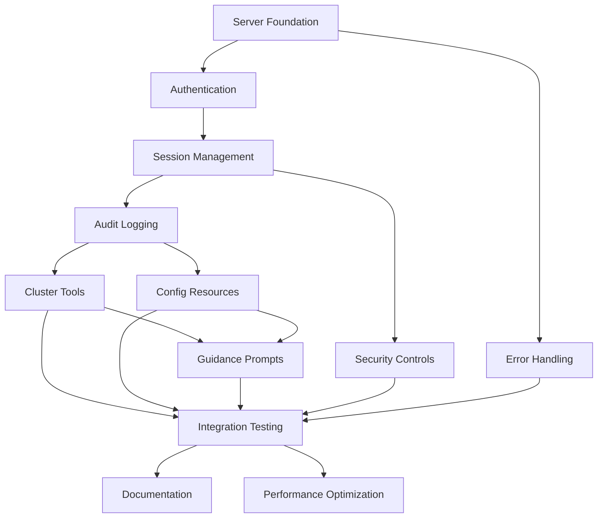

# Implementation Tasks: MCP Server Integration

## Overview

This document breaks down the MCP server integration into discrete, implementable tasks. The MCP server is a new capability that exposes opencenter's cluster management functionality to AI assistants through the Model Context Protocol, enabling natural language-based cluster operations while maintaining security and audit controls.

## Prerequisites

- Phases 1-4 of configuration-system-refactor spec must be complete
- Existing opencenter components (config, template, gitops) are available
- Go 1.25+ with mise for task management

## Task List

### Task 1: MCP Server Foundation
**Status:** NOT STARTED
**Estimated Effort:** 4 days
**Dependencies:** None

**Description:** Implement the foundational MCP server with transport handling, basic lifecycle management, and configuration loading.

**Implementation Steps:**
1. Add mcp-go library dependency to go.mod
2. Create MCP server interface and basic implementation
3. Implement stdio and HTTP transport support
4. Add server lifecycle management (start, stop, graceful shutdown)
5. Implement configuration loading from YAML and environment variables
6. Add health check endpoints for monitoring

**Acceptance Criteria:**
- [ ] MCP server starts and accepts connections via stdio transport
- [ ] MCP server starts and accepts connections via HTTP transport
- [ ] Server configuration loads from YAML file with validation
- [ ] Server supports graceful shutdown with cleanup
- [ ] Health check endpoints return server status
- [ ] Unit tests achieve 90%+ coverage

**Files to Create:**
- `internal/mcp/server.go`
- `internal/mcp/types.go`
- `internal/mcp/server_test.go`
- `cmd/mcp_server.go`

**Requirements Validated:** 1.1, 1.2, 1.3, 1.4, 1.5, 1.6

---

### Task 2: Authentication System
**Status:** NOT STARTED
**Estimated Effort:** 3 days
**Dependencies:** Task 1

**Description:** Implement authentication providers (file-based and OIDC) with permission validation and user management.

**Implementation Steps:**
1. Define AuthProvider interface and Permission types
2. Implement file-based authentication provider
3. Implement OIDC authentication provider
4. Add user configuration loading and validation
5. Implement permission checking logic
6. Add authentication tests with various scenarios

**Acceptance Criteria:**
- [ ] File-based auth provider validates users from YAML config
- [ ] OIDC auth provider integrates with identity providers
- [ ] Permission validation enforces resource and action constraints
- [ ] Invalid credentials are rejected with clear error messages
- [ ] User configuration supports role-based access control
- [ ] Unit tests cover all authentication scenarios

**Files to Create:**
- `internal/mcp/auth.go`
- `internal/mcp/auth_file.go`
- `internal/mcp/auth_oidc.go`
- `internal/mcp/auth_test.go`

**Requirements Validated:** 2.1, 2.2, 2.3, 2.4, 2.5

---

### Task 3: Session Management
**Status:** NOT STARTED
**Estimated Effort:** 3 days
**Dependencies:** Task 2

**Description:** Implement session management with timeout handling, activity tracking, and resource cleanup.

**Implementation Steps:**
1. Define Session and SessionManager interfaces
2. Implement in-memory session storage
3. Add session creation and validation
4. Implement session timeout and cleanup
5. Add ConfigScope enforcement for session-based access control
6. Implement session refresh mechanism

**Acceptance Criteria:**
- [ ] Sessions are created for authenticated users
- [ ] Sessions maintain user context and permissions
- [ ] Sessions expire after configured timeout period
- [ ] Expired sessions are automatically cleaned up
- [ ] ConfigScope limits access to authorized clusters
- [ ] Session refresh extends timeout without re-authentication

**Files to Create:**
- `internal/mcp/session.go`
- `internal/mcp/session_manager.go`
- `internal/mcp/session_test.go`

**Requirements Validated:** 3.1, 3.2, 3.3, 3.4, 3.5, 3.6

---

### Task 4: Audit Logging System
**Status:** NOT STARTED
**Estimated Effort:** 2 days
**Dependencies:** Task 3

**Description:** Implement comprehensive audit logging for all MCP operations with structured logging and log rotation.

**Implementation Steps:**
1. Define AuditLogger interface and entry types
2. Implement structured audit logging
3. Add tool execution logging
4. Add resource access logging
5. Add authentication event logging
6. Implement log rotation and retention

**Acceptance Criteria:**
- [ ] All tool executions are logged with user context
- [ ] All resource accesses are logged with permissions
- [ ] Authentication events are logged with results
- [ ] Audit logs use structured format (JSON)
- [ ] Log rotation prevents disk space issues
- [ ] Audit logs include timestamps and session IDs

**Files to Create:**
- `internal/mcp/audit.go`
- `internal/mcp/audit_logger.go`
- `internal/mcp/audit_test.go`

**Requirements Validated:** 7.1, 7.2, 7.3, 7.4, 7.5, 7.6

---

### Task 5: Cluster Management Tools
**Status:** NOT STARTED
**Estimated Effort:** 5 days
**Dependencies:** Task 4

**Description:** Implement MCP tools for cluster lifecycle operations (init, validate, generate, status, destroy).

**Implementation Steps:**
1. Define Tool interface and base implementation
2. Implement cluster_init tool with configuration building
3. Implement cluster_validate tool with detailed error reporting
4. Implement gitops_generate tool with dry-run support
5. Implement cluster_status and cluster_info tools
6. Implement cluster_destroy tool with confirmation
7. Add comprehensive tool tests

**Acceptance Criteria:**
- [ ] cluster_init tool creates valid configurations
- [ ] cluster_validate tool provides detailed validation feedback
- [ ] gitops_generate tool supports dry-run mode
- [ ] cluster_status tool returns real-time cluster information
- [ ] cluster_destroy tool requires explicit confirmation
- [ ] All tools validate inputs against JSON schemas
- [ ] All tools enforce permission checks

**Files to Create:**
- `internal/mcp/tools/tool.go`
- `internal/mcp/tools/cluster_init.go`
- `internal/mcp/tools/cluster_validate.go`
- `internal/mcp/tools/gitops_generate.go`
- `internal/mcp/tools/cluster_status.go`
- `internal/mcp/tools/cluster_destroy.go`
- `internal/mcp/tools/tools_test.go`

**Requirements Validated:** 4.1, 4.2, 4.3, 4.4, 4.5, 4.6

---

### Task 6: Configuration Resources
**Status:** NOT STARTED
**Estimated Effort:** 3 days
**Dependencies:** Task 4

**Description:** Implement MCP resources for accessing cluster configurations, templates, schemas, and service registry.

**Implementation Steps:**
1. Define Resource interface and base implementation
2. Implement config resource with organization scoping
3. Implement template resource with provider filtering
4. Implement schema resource for validation assistance
5. Implement service registry resource
6. Add resource caching with TTL
7. Add comprehensive resource tests

**Acceptance Criteria:**
- [ ] Config resources respect organization and cluster scoping
- [ ] Template resources filter by provider and service enablement
- [ ] Schema resources provide up-to-date validation schemas
- [ ] Service resources show available services with dependencies
- [ ] Resource caching improves performance
- [ ] All resources enforce permission checks

**Files to Create:**
- `internal/mcp/resources/resource.go`
- `internal/mcp/resources/config.go`
- `internal/mcp/resources/templates.go`
- `internal/mcp/resources/schema.go`
- `internal/mcp/resources/services.go`
- `internal/mcp/resources/resources_test.go`

**Requirements Validated:** 5.1, 5.2, 5.3, 5.4, 5.5, 5.6

---

### Task 7: Guidance Prompts
**Status:** NOT STARTED
**Estimated Effort:** 3 days
**Dependencies:** Task 5, Task 6

**Description:** Create MCP prompts that guide AI assistants in cluster management best practices and troubleshooting.

**Implementation Steps:**
1. Define Prompt interface and base implementation
2. Create initialization guidance prompts
3. Create troubleshooting prompts for common issues
4. Create best practices prompts for security and performance
5. Create service selection guidance prompts
6. Create migration assistance prompts
7. Add prompt tests

**Acceptance Criteria:**
- [ ] Initialization prompts provide provider-specific guidance
- [ ] Troubleshooting prompts help diagnose common issues
- [ ] Best practices prompts promote secure configurations
- [ ] Service selection prompts recommend appropriate services
- [ ] Migration prompts assist with configuration updates
- [ ] Prompts are context-aware based on current state

**Files to Create:**
- `internal/mcp/prompts/prompt.go`
- `internal/mcp/prompts/initialization.go`
- `internal/mcp/prompts/troubleshooting.go`
- `internal/mcp/prompts/best_practices.go`
- `internal/mcp/prompts/services.go`
- `internal/mcp/prompts/migration.go`
- `internal/mcp/prompts/prompts_test.go`

**Requirements Validated:** 6.1, 6.2, 6.3, 6.4, 6.5, 6.6

---

### Task 8: Security Controls
**Status:** NOT STARTED
**Estimated Effort:** 3 days
**Dependencies:** Task 3

**Description:** Implement security controls including rate limiting, input sanitization, TLS support, and IP allowlisting.

**Implementation Steps:**
1. Implement rate limiting per session and per user
2. Add input validation and sanitization
3. Implement TLS support for HTTP transport
4. Add maximum request size enforcement
5. Implement IP allowlisting
6. Add security event logging
7. Add security tests

**Acceptance Criteria:**
- [ ] Rate limiting prevents abuse
- [ ] Input sanitization prevents injection attacks
- [ ] TLS enforces encrypted connections
- [ ] Request size limits prevent DoS attacks
- [ ] IP allowlisting restricts access
- [ ] Security events are logged and monitored

**Files to Create:**
- `internal/mcp/security.go`
- `internal/mcp/rate_limiter.go`
- `internal/mcp/input_validator.go`
- `internal/mcp/security_test.go`

**Requirements Validated:** 8.1, 8.2, 8.3, 8.4, 8.5, 8.6

---

### Task 9: Error Handling and Reporting
**Status:** NOT STARTED
**Estimated Effort:** 2 days
**Dependencies:** Task 1

**Description:** Implement comprehensive error handling with structured error responses and actionable suggestions.

**Implementation Steps:**
1. Define MCPError types and error codes
2. Implement structured error responses
3. Add error aggregation for validation failures
4. Implement error suggestions based on error type
5. Add error localization support
6. Add error handling tests

**Acceptance Criteria:**
- [ ] Errors include error codes and types
- [ ] Error messages are actionable and clear
- [ ] Validation errors include field paths
- [ ] Multiple errors are aggregated and returned together
- [ ] Error suggestions help users resolve issues
- [ ] Errors distinguish between user and system errors

**Files to Create:**
- `internal/mcp/errors.go`
- `internal/mcp/error_handler.go`
- `internal/mcp/errors_test.go`

**Requirements Validated:** 9.1, 9.2, 9.3, 9.4, 9.5, 9.6

---

### Task 10: Integration Testing
**Status:** NOT STARTED
**Estimated Effort:** 4 days
**Dependencies:** All previous tasks

**Description:** Create comprehensive integration tests that validate complete MCP workflows and interactions.

**Implementation Steps:**
1. Create integration test framework for MCP server
2. Implement end-to-end workflow tests (init → validate → generate)
3. Add authentication and authorization flow tests
4. Add concurrent session handling tests
5. Add error handling and recovery tests
6. Add performance and load tests

**Acceptance Criteria:**
- [ ] Integration tests cover all major workflows
- [ ] Authentication and authorization flows are tested
- [ ] Concurrent session handling is validated
- [ ] Error handling and recovery work correctly
- [ ] Performance meets acceptable thresholds
- [ ] Load tests validate scalability

**Files to Create:**
- `internal/mcp/integration_test.go`
- `internal/mcp/workflow_test.go`
- `internal/mcp/auth_integration_test.go`
- `internal/mcp/performance_test.go`

**Requirements Validated:** All requirements

---

### Task 11: Documentation and Examples
**Status:** NOT STARTED
**Estimated Effort:** 4 days
**Dependencies:** Task 10

**Description:** Create comprehensive documentation for MCP server deployment, configuration, and usage.

**Implementation Steps:**
1. Write MCP server overview and architecture documentation
2. Create deployment guides for different environments
3. Write authentication setup guides for each provider
4. Create example AI assistant integrations
5. Write troubleshooting guides
6. Document security best practices
7. Create API reference documentation

**Acceptance Criteria:**
- [ ] Architecture documentation explains MCP server design
- [ ] Deployment guides cover standalone, container, and Kubernetes
- [ ] Authentication guides enable easy setup
- [ ] Example integrations demonstrate usage
- [ ] Troubleshooting guides help resolve common issues
- [ ] Security best practices are documented
- [ ] API reference is complete and accurate

**Files to Create:**
- `docs/mcp/overview.md`
- `docs/mcp/architecture.md`
- `docs/mcp/deployment.md`
- `docs/mcp/authentication.md`
- `docs/mcp/examples.md`
- `docs/mcp/troubleshooting.md`
- `docs/mcp/security.md`
- `docs/mcp/api-reference.md`

**Requirements Validated:** 13.1, 13.2, 13.3, 13.4, 13.5, 13.6

---

### Task 12: Performance Optimization
**Status:** NOT STARTED
**Estimated Effort:** 2 days
**Dependencies:** Task 10

**Description:** Optimize MCP server performance based on benchmark results and profiling.

**Implementation Steps:**
1. Profile MCP server with realistic workloads
2. Optimize resource caching strategies
3. Optimize session management performance
4. Optimize tool execution performance
5. Validate performance improvements with benchmarks
6. Document performance characteristics

**Acceptance Criteria:**
- [ ] MCP server supports 100+ concurrent sessions
- [ ] Resource caching reduces latency
- [ ] Session management is efficient
- [ ] Tool execution meets performance targets
- [ ] Memory usage is optimized
- [ ] Performance benchmarks validate improvements

**Files to Create:**
- `internal/mcp/optimization.go`
- `internal/mcp/benchmark_test.go`
- `docs/mcp/performance.md`

**Requirements Validated:** 10.1, 10.2, 10.3, 10.4, 10.5, 10.6

---

## Task Dependencies



## Summary

### Total Effort Estimate
- **12 tasks** across 4-6 weeks
- **Foundation & Core (Tasks 1-4)**: 12 days
- **Features (Tasks 5-7)**: 11 days
- **Quality & Polish (Tasks 8-12)**: 15 days

### Implementation Order
1. **Week 1-2**: Foundation (Tasks 1-4) - Server, auth, sessions, audit
2. **Week 3-4**: Features (Tasks 5-7) - Tools, resources, prompts
3. **Week 5-6**: Quality (Tasks 8-12) - Security, testing, docs, optimization

### Success Criteria

The MCP server integration is successful when:
1. MCP server starts and accepts connections via stdio and HTTP
2. Authentication and authorization work correctly
3. All cluster management tools are functional
4. Configuration resources are accessible with proper scoping
5. Guidance prompts help AI assistants effectively
6. Comprehensive audit logging tracks all operations
7. Security controls prevent abuse and unauthorized access
8. Integration tests validate all workflows
9. Documentation enables easy deployment and usage
10. Performance meets scalability requirements

### Risk Mitigation

**High-Risk Areas:**
- Security vulnerabilities in authentication/authorization
- Performance issues with concurrent sessions
- Integration complexity with existing opencenter components

**Mitigation Strategies:**
- Security review before production deployment
- Comprehensive testing including security and load tests
- Reuse existing opencenter components where possible
- Incremental rollout with monitoring

### Mise Tasks

Add these tasks to `.mise.toml`:

```toml
[tasks]
# MCP server development
mcp-dev = "go run ./cmd/opencenter mcp server --transport stdio --auth none --debug"
mcp-http = "go run ./cmd/opencenter mcp server --transport http --port 8080 --auth file"
mcp-config = "go run ./cmd/opencenter mcp config --output mcp-server.yaml"

# MCP testing
mcp-test = "go test ./internal/mcp/... -v"
mcp-integration = "go test ./internal/mcp/... -tags=integration -v"
mcp-benchmark = "go test ./internal/mcp/... -bench=. -benchmem"

# MCP documentation
mcp-docs = "go run ./hack/generate-mcp-docs.go"
```
