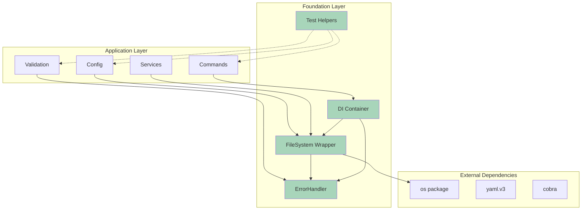
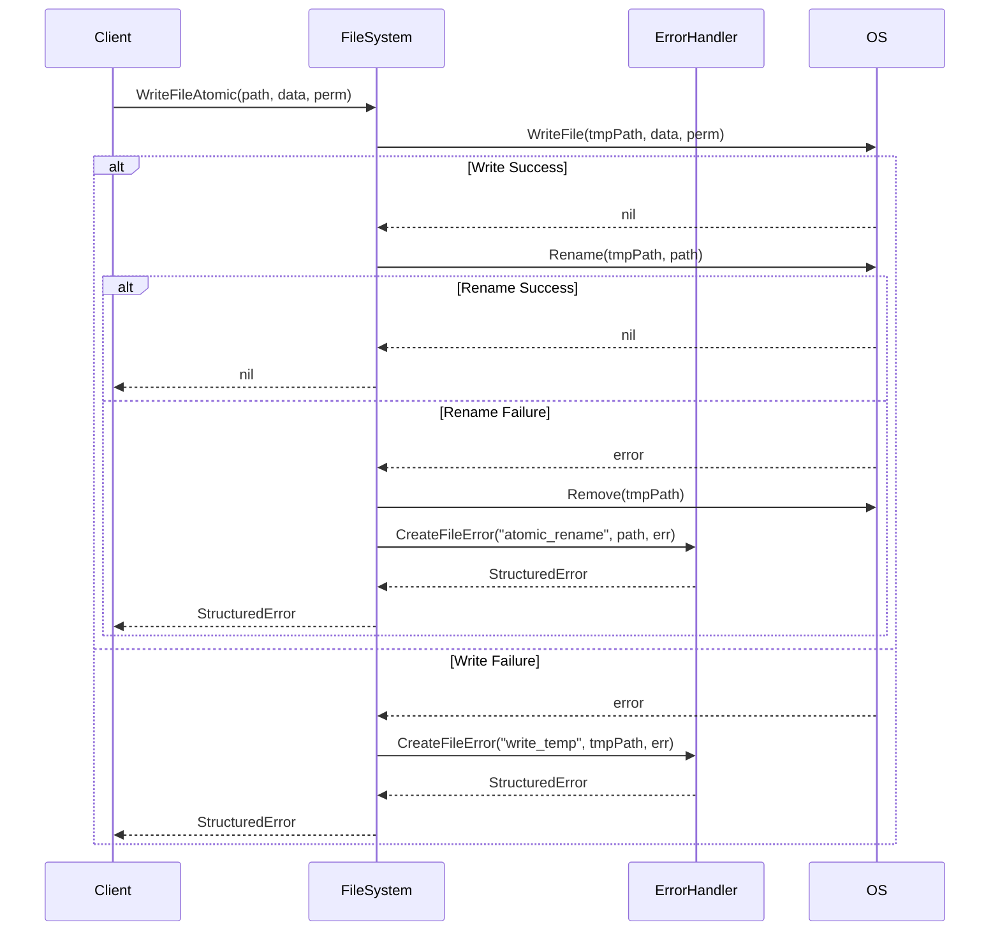
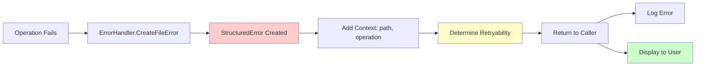
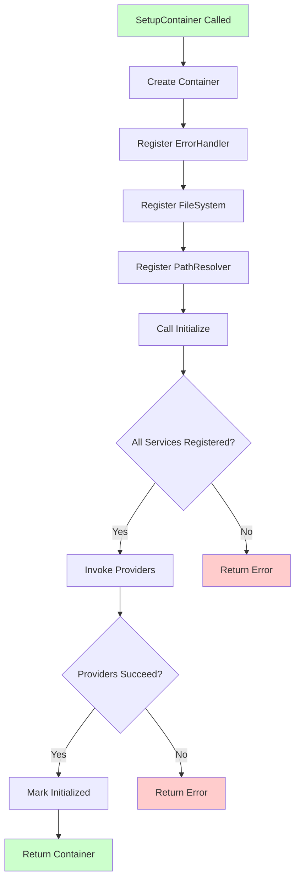

# Design Document: Phase 1 Foundation Utilities

## Table of Contents

- [Overview](#overview)
  - [Design Goals](#design-goals)
  - [Key Components](#key-components)
- [Architecture](#architecture)
  - [Component Diagram](#component-diagram)
  - [Layering Strategy](#layering-strategy)
  - [Design Principles](#design-principles)
- [Components and Interfaces](#components-and-interfaces)
  - [FileSystem Wrapper](#filesystem-wrapper)
  - [Structured Error System](#structured-error-system)
  - [Test Helper Library](#test-helper-library)
  - [DI Container Setup](#di-container-setup)
- [Data Models](#data-models)
  - [FileSystem Data Flow](#filesystem-data-flow)
  - [Error Context Flow](#error-context-flow)
  - [DI Container Initialization Flow](#di-container-initialization-flow)
- [Correctness Properties](#correctness-properties)
  - [Property Reflection](#property-reflection)
  - [Property 1: Atomic Write Operations](#property-1-atomic-write-operations)
  - [Property 2: Error Context Consistency](#property-2-error-context-consistency)
  - [Property 3: Thread-Safe Concurrent Operations](#property-3-thread-safe-concurrent-operations)
  - [Property 4: Error Retryability Determination](#property-4-error-retryability-determination)
  - [Property 5: Error Formatting Completeness](#property-5-error-formatting-completeness)
  - [Property 6: Error Wrapping Preservation](#property-6-error-wrapping-preservation)
  - [Property 7: Test Helper File Creation](#property-7-test-helper-file-creation)
  - [Property 8: DI Container Error Handling](#property-8-di-container-error-handling)
- [Error Handling](#error-handling)
  - [Error Categories](#error-categories)
  - [Error Handling Patterns](#error-handling-patterns)
  - [Error Recovery Strategies](#error-recovery-strategies)
  - [User-Facing Error Messages](#user-facing-error-messages)
- [Testing Strategy](#testing-strategy)
  - [Dual Testing Approach](#dual-testing-approach)
  - [Property-Based Testing Configuration](#property-based-testing-configuration)
  - [Unit Testing Strategy](#unit-testing-strategy)
  - [Test Coverage Targets](#test-coverage-targets)
  - [Testing Tools](#testing-tools)
  - [Test Organization](#test-organization)
  - [Continuous Integration](#continuous-integration)
  - [Test Maintenance](#test-maintenance)

## Overview

The Phase 1 Foundation Utilities provide essential infrastructure for the opencenter-cli project, establishing consistent patterns for file operations, error handling, testing, and dependency injection. These utilities serve as building blocks for all subsequent refactoring phases (Phases 2-4).

### Design Goals

1. **Safety First**: Atomic file operations prevent configuration corruption
2. **Consistency**: Unified error handling across all packages
3. **Developer Experience**: Consolidated test helpers reduce duplication and improve test writing speed
4. **Maintainability**: Single DI container initialization point eliminates confusion
5. **Performance**: Minimal overhead (<5%) for wrapper abstractions

### Key Components

- **FileSystem Wrapper**: Safe, atomic file operations with consistent error handling
- **Structured Error System**: Rich error context with suggestions and retryability information
- **Test Helper Library**: Unified test utilities eliminating 20+ duplicate implementations
- **DI Container Setup**: Single initialization point for all service registrations
- **Code Cleanup**: Removal of orphaned code reducing cognitive load

## Architecture

### Component Diagram



### Layering Strategy

The foundation utilities form the lowest layer of the application architecture:

1. **Foundation Layer** (Phase 1): FileSystem, ErrorHandler, Test Helpers, DI Container
2. **Domain Layer** (Phase 2-3): ValidationEngine, ConfigManager, PathResolver
3. **Service Layer** (Phase 4): Service plugins, manifest generators
4. **Command Layer**: CLI commands using all lower layers

### Design Principles

- **Dependency Inversion**: High-level modules depend on abstractions (interfaces), not concrete implementations
- **Single Responsibility**: Each utility has one clear purpose
- **Open/Closed**: Utilities are open for extension (interfaces) but closed for modification
- **Interface Segregation**: Small, focused interfaces rather than large monolithic ones
- **Fail-Safe Defaults**: Operations default to safe behavior (atomic writes, proper cleanup)

## Components and Interfaces

### FileSystem Wrapper

The FileSystem wrapper provides a safe abstraction over os package file operations.

#### Interface Definition

```go
// internal/util/fs/wrapper.go
package fs

import (
    "io/fs"
    "os"
    
    "github.com/opencenter-cloud/opencenter-cli/internal/util/errors"
)

// FileSystem provides safe file operations with consistent error handling
type FileSystem interface {
    // ReadFile reads the entire file at path
    ReadFile(path string) ([]byte, error)
    
    // WriteFile writes data to path with given permissions
    WriteFile(path string, data []byte, perm os.FileMode) error
    
    // WriteFileAtomic writes data atomically to prevent corruption
    WriteFileAtomic(path string, data []byte, perm os.FileMode) error
    
    // Exists checks if a file or directory exists at path
    Exists(path string) bool
    
    // MkdirAll creates directory and all parent directories
    MkdirAll(path string, perm os.FileMode) error
    
    // Remove removes the file or directory at path
    Remove(path string) error
    
    // Stat returns file information
    Stat(path string) (fs.FileInfo, error)
}
```

#### Implementation

```go
// DefaultFileSystem implements FileSystem using os package
type DefaultFileSystem struct {
    errorHandler errors.ErrorHandler
}

func NewDefaultFileSystem(errorHandler errors.ErrorHandler) *DefaultFileSystem {
    return &DefaultFileSystem{
        errorHandler: errorHandler,
    }
}

func (dfs *DefaultFileSystem) ReadFile(path string) ([]byte, error) {
    data, err := os.ReadFile(path)
    if err != nil {
        return nil, dfs.errorHandler.CreateFileError("read", path, err)
    }
    return data, nil
}

func (dfs *DefaultFileSystem) WriteFile(path string, data []byte, perm os.FileMode) error {
    if err := os.WriteFile(path, data, perm); err != nil {
        return dfs.errorHandler.CreateFileError("write", path, err)
    }
    return nil
}

func (dfs *DefaultFileSystem) WriteFileAtomic(path string, data []byte, perm os.FileMode) error {
    // Generate unique temporary file name
    tmpPath := path + ".tmp." + generateRandomString(8)
    
    // Write to temporary file
    if err := os.WriteFile(tmpPath, data, perm); err != nil {
        return dfs.errorHandler.CreateFileError("write_temp", tmpPath, err)
    }
    
    // Atomic rename (POSIX guarantees atomicity)
    if err := os.Rename(tmpPath, path); err != nil {
        // Cleanup temp file on failure
        os.Remove(tmpPath)
        return dfs.errorHandler.CreateFileError("atomic_rename", path, err)
    }
    
    return nil
}

func (dfs *DefaultFileSystem) Exists(path string) bool {
    _, err := os.Stat(path)
    return err == nil
}

func (dfs *DefaultFileSystem) MkdirAll(path string, perm os.FileMode) error {
    if err := os.MkdirAll(path, perm); err != nil {
        return dfs.errorHandler.CreateFileError("mkdir", path, err)
    }
    return nil
}

func (dfs *DefaultFileSystem) Remove(path string) error {
    if err := os.Remove(path); err != nil {
        return dfs.errorHandler.CreateFileError("remove", path, err)
    }
    return nil
}

func (dfs *DefaultFileSystem) Stat(path string) (fs.FileInfo, error) {
    info, err := os.Stat(path)
    if err != nil {
        return nil, dfs.errorHandler.CreateFileError("stat", path, err)
    }
    return info, nil
}

// generateRandomString creates a random alphanumeric string of given length
func generateRandomString(length int) string {
    const charset = "abcdefghijklmnopqrstuvwxyz0123456789"
    b := make([]byte, length)
    for i := range b {
        b[i] = charset[rand.Intn(len(charset))]
    }
    return string(b)
}
```

#### Thread Safety

The FileSystem wrapper is thread-safe because:
1. Each operation is independent (no shared mutable state)
2. Atomic writes use unique temporary file names (no collision)
3. os package operations are thread-safe at the syscall level

### Structured Error System

The error system provides rich context for debugging and user-facing error messages.

#### Error Types

```go
// internal/util/errors/structured.go
package errors

import (
    "fmt"
    "strings"
)

// ErrorType categorizes errors for handling and reporting
type ErrorType string

const (
    ValidationError  ErrorType = "validation"
    FileError        ErrorType = "file"
    ConfigError      ErrorType = "config"
    OperationalError ErrorType = "operational"
    NetworkError     ErrorType = "network"
)

// StructuredError provides rich error context
type StructuredError struct {
    Type        ErrorType
    Field       string                 // For validation errors
    Message     string
    Suggestions []string               // User-actionable suggestions
    Context     map[string]interface{} // Additional context
    Cause       error                  // Underlying error
    Operation   string                 // Operation that failed
    Retryable   bool                   // Can operation be retried
}

func (e *StructuredError) Error() string {
    var sb strings.Builder
    
    // Main message
    sb.WriteString(e.Message)
    
    // Add field context for validation errors
    if e.Field != "" {
        sb.WriteString(fmt.Sprintf(" (field: %s)", e.Field))
    }
    
    // Add operation context
    if e.Operation != "" {
        sb.WriteString(fmt.Sprintf(" [operation: %s]", e.Operation))
    }
    
    // Add cause if present
    if e.Cause != nil {
        sb.WriteString(fmt.Sprintf(": %v", e.Cause))
    }
    
    // Add suggestions
    if len(e.Suggestions) > 0 {
        sb.WriteString("\nSuggestions:\n")
        for _, suggestion := range e.Suggestions {
            sb.WriteString(fmt.Sprintf("  - %s\n", suggestion))
        }
    }
    
    return sb.String()
}

func (e *StructuredError) Unwrap() error {
    return e.Cause
}

func (e *StructuredError) Is(target error) bool {
    t, ok := target.(*StructuredError)
    if !ok {
        return false
    }
    return e.Type == t.Type
}
```

#### ErrorHandler Interface

```go
// ErrorHandler creates and formats structured errors
type ErrorHandler interface {
    CreateValidationError(field, message string, suggestions ...string) *StructuredError
    CreateFileError(operation, path string, cause error) *StructuredError
    CreateConfigError(message string, cause error) *StructuredError
    Wrap(err error, operation, context string) error
}

// DefaultErrorHandler implements ErrorHandler
type DefaultErrorHandler struct{}

func NewDefaultErrorHandler() *DefaultErrorHandler {
    return &DefaultErrorHandler{}
}

func (h *DefaultErrorHandler) CreateValidationError(field, message string, suggestions ...string) *StructuredError {
    return &StructuredError{
        Type:        ValidationError,
        Field:       field,
        Message:     message,
        Suggestions: suggestions,
        Operation:   "validation",
        Retryable:   false,
    }
}

func (h *DefaultErrorHandler) CreateFileError(operation, path string, cause error) *StructuredError {
    return &StructuredError{
        Type:      FileError,
        Message:   fmt.Sprintf("file operation failed: %s", operation),
        Cause:     cause,
        Operation: operation,
        Context:   map[string]interface{}{"path": path},
        Retryable: isRetryableFileError(cause),
    }
}

func (h *DefaultErrorHandler) CreateConfigError(message string, cause error) *StructuredError {
    return &StructuredError{
        Type:      ConfigError,
        Message:   message,
        Cause:     cause,
        Operation: "config_load",
        Retryable: false,
    }
}

func (h *DefaultErrorHandler) Wrap(err error, operation, context string) error {
    if err == nil {
        return nil
    }
    
    // If already a StructuredError, preserve it
    if se, ok := err.(*StructuredError); ok {
        return se
    }
    
    return &StructuredError{
        Type:      OperationalError,
        Message:   context,
        Cause:     err,
        Operation: operation,
        Retryable: false,
    }
}

// isRetryableFileError determines if a file error can be retried
func isRetryableFileError(err error) bool {
    if err == nil {
        return false
    }
    
    // Check for temporary errors
    errStr := err.Error()
    retryablePatterns := []string{
        "resource temporarily unavailable",
        "too many open files",
        "connection reset",
    }
    
    for _, pattern := range retryablePatterns {
        if strings.Contains(strings.ToLower(errStr), pattern) {
            return true
        }
    }
    
    return false
}
```

### Test Helper Library

Consolidated test utilities eliminate duplication and provide consistent test setup.

#### Test Helper Interface

```go
// internal/testing/helpers.go
package testing

import (
    "os"
    "path/filepath"
    "testing"
)

// CreateTempConfig creates a temporary config file for testing
func CreateTempConfig(t *testing.T, content string) string {
    t.Helper()
    
    tmpDir := t.TempDir()
    configPath := filepath.Join(tmpDir, "config.yaml")
    
    if err := os.WriteFile(configPath, []byte(content), 0644); err != nil {
        t.Fatalf("failed to write test config: %v", err)
    }
    
    return configPath
}

// CreateTempDir creates a temporary directory with specified files
func CreateTempDir(t *testing.T, files map[string]string) string {
    t.Helper()
    
    tmpDir := t.TempDir()
    
    for name, content := range files {
        path := filepath.Join(tmpDir, name)
        
        // Create parent directories
        if err := os.MkdirAll(filepath.Dir(path), 0755); err != nil {
            t.Fatalf("failed to create parent dir for %s: %v", name, err)
        }
        
        // Write file
        if err := os.WriteFile(path, []byte(content), 0644); err != nil {
            t.Fatalf("failed to write test file %s: %v", name, err)
        }
    }
    
    return tmpDir
}

// AssertNoError fails the test if err is not nil
func AssertNoError(t *testing.T, err error, message string) {
    t.Helper()
    if err != nil {
        t.Fatalf("%s: %v", message, err)
    }
}

// AssertError fails the test if err is nil
func AssertError(t *testing.T, err error, message string) {
    t.Helper()
    if err == nil {
        t.Fatalf("%s: expected error but got nil", message)
    }
}

// AssertEqual fails the test if got != want
func AssertEqual(t *testing.T, got, want interface{}, message string) {
    t.Helper()
    if got != want {
        t.Fatalf("%s: got %v, want %v", message, got, want)
    }
}

// AssertFileExists fails the test if file doesn't exist
func AssertFileExists(t *testing.T, path string) {
    t.Helper()
    if _, err := os.Stat(path); os.IsNotExist(err) {
        t.Fatalf("expected file to exist: %s", path)
    }
}

// AssertFileNotExists fails the test if file exists
func AssertFileNotExists(t *testing.T, path string) {
    t.Helper()
    if _, err := os.Stat(path); err == nil {
        t.Fatalf("expected file to not exist: %s", path)
    }
}
```

### DI Container Setup

Unified dependency injection initialization provides a single point for service registration.

#### Container Interface

```go
// internal/di/setup.go
package di

import (
    "fmt"
    
    "github.com/opencenter-cloud/opencenter-cli/internal/util/errors"
    "github.com/opencenter-cloud/opencenter-cli/internal/util/fs"
    "github.com/opencenter-cloud/opencenter-cli/internal/util/paths"
)

// Container manages service lifecycle and dependencies
type Container interface {
    Singleton(name string, provider interface{}) error
    Get(name string) (interface{}, error)
    Initialize() error
}

// SetupContainer creates and initializes the DI container with all services
func SetupContainer(baseDir string) (Container, error) {
    container := NewContainer()
    
    // Register ErrorHandler (no dependencies)
    if err := container.Singleton("ErrorHandler", func() (errors.ErrorHandler, error) {
        return errors.NewDefaultErrorHandler(), nil
    }); err != nil {
        return nil, fmt.Errorf("registering ErrorHandler: %w", err)
    }
    
    // Register FileSystem (depends on ErrorHandler)
    if err := container.Singleton("FileSystem", func(c Container) (fs.FileSystem, error) {
        errorHandler, err := c.Get("ErrorHandler")
        if err != nil {
            return nil, err
        }
        return fs.NewDefaultFileSystem(errorHandler.(errors.ErrorHandler)), nil
    }); err != nil {
        return nil, fmt.Errorf("registering FileSystem: %w", err)
    }
    
    // Register PathResolver (depends on FileSystem)
    if err := container.Singleton("PathResolver", func(c Container) (*paths.PathResolver, error) {
        fileSystem, err := c.Get("FileSystem")
        if err != nil {
            return nil, err
        }
        return paths.NewPathResolver(baseDir, fileSystem.(fs.FileSystem)), nil
    }); err != nil {
        return nil, fmt.Errorf("registering PathResolver: %w", err)
    }
    
    // Initialize all services
    if err := container.Initialize(); err != nil {
        return nil, fmt.Errorf("initializing container: %w", err)
    }
    
    return container, nil
}
```

#### Container Implementation

```go
// internal/di/container.go
package di

import (
    "fmt"
    "reflect"
    "sync"
)

type serviceProvider struct {
    provider interface{}
    instance interface{}
    initialized bool
}

type defaultContainer struct {
    services map[string]*serviceProvider
    mu       sync.RWMutex
}

func NewContainer() Container {
    return &defaultContainer{
        services: make(map[string]*serviceProvider),
    }
}

func (c *defaultContainer) Singleton(name string, provider interface{}) error {
    c.mu.Lock()
    defer c.mu.Unlock()
    
    if _, exists := c.services[name]; exists {
        return fmt.Errorf("service %s already registered", name)
    }
    
    c.services[name] = &serviceProvider{
        provider:    provider,
        initialized: false,
    }
    
    return nil
}

func (c *defaultContainer) Get(name string) (interface{}, error) {
    c.mu.RLock()
    service, exists := c.services[name]
    c.mu.RUnlock()
    
    if !exists {
        return nil, fmt.Errorf("service %s not registered", name)
    }
    
    if service.initialized {
        return service.instance, nil
    }
    
    return nil, fmt.Errorf("service %s not initialized", name)
}

func (c *defaultContainer) Initialize() error {
    c.mu.Lock()
    defer c.mu.Unlock()
    
    for name, service := range c.services {
        if service.initialized {
            continue
        }
        
        instance, err := c.invokeProvider(service.provider)
        if err != nil {
            return fmt.Errorf("initializing service %s: %w", name, err)
        }
        
        service.instance = instance
        service.initialized = true
    }
    
    return nil
}

func (c *defaultContainer) invokeProvider(provider interface{}) (interface{}, error) {
    providerValue := reflect.ValueOf(provider)
    providerType := providerValue.Type()
    
    // Check if provider is a function
    if providerType.Kind() != reflect.Func {
        return nil, fmt.Errorf("provider must be a function")
    }
    
    // Build arguments
    var args []reflect.Value
    for i := 0; i < providerType.NumIn(); i++ {
        argType := providerType.In(i)
        
        // If argument is Container, pass self
        if argType.Name() == "Container" {
            args = append(args, reflect.ValueOf(c))
        } else {
            return nil, fmt.Errorf("unsupported provider argument type: %s", argType)
        }
    }
    
    // Invoke provider
    results := providerValue.Call(args)
    
    // Check for error return
    if len(results) == 2 {
        if !results[1].IsNil() {
            return nil, results[1].Interface().(error)
        }
        return results[0].Interface(), nil
    }
    
    if len(results) == 1 {
        return results[0].Interface(), nil
    }
    
    return nil, fmt.Errorf("provider must return (value, error) or (value)")
}
```

## Data Models

### FileSystem Data Flow



### Error Context Flow



### DI Container Initialization Flow




## Correctness Properties

*A property is a characteristic or behavior that should hold true across all valid executions of a system—essentially, a formal statement about what the system should do. Properties serve as the bridge between human-readable specifications and machine-verifiable correctness guarantees.*

### Property Reflection

After analyzing all acceptance criteria, I identified the following testable properties and performed reflection to eliminate redundancy:

**Identified Properties:**
1. Atomic write operations (1.2, 1.3) - Can be combined into one comprehensive atomicity property
2. Error context consistency (1.4, 1.5) - Can be combined into one property about error structure
3. Thread safety (1.7) - Standalone property
4. Error retryability determination (2.5) - Standalone property
5. Error formatting (2.6) - Standalone property
6. Error wrapping (2.7) - Standalone property
7. Test helper file creation (4.4) - Standalone property
8. DI container error handling (5.7) - Standalone property

**Redundancy Analysis:**
- Properties 1.2 and 1.3 both test atomicity - combined into Property 1
- Properties 1.4 and 1.5 both test error structure - combined into Property 2
- No other logical redundancies found

**Final Property Set:** 8 properties providing unique validation value

### Property 1: Atomic Write Operations

*For any* file path and data content, when WriteFileAtomic is called, either the complete data is written to the target file OR the target file remains unchanged and no temporary files remain.

**Validates: Requirements 1.2, 1.3**

**Testing Approach:**
- Generate random file paths and data content
- Call WriteFileAtomic
- If operation succeeds: verify file contains exact data
- If operation fails: verify original file unchanged (if existed) and no .tmp files remain
- Test with concurrent writes to same path
- Test with filesystem errors (disk full, permission denied)

### Property 2: Error Context Consistency

*For any* FileSystem operation that fails, the returned error SHALL be a StructuredError containing the operation type, file path, and underlying cause.

**Validates: Requirements 1.4, 1.5**

**Testing Approach:**
- Generate random file operations (read, write, mkdir, etc.)
- Force failures through invalid paths, permissions, etc.
- Verify all returned errors are StructuredError type
- Verify error contains operation field matching the operation type
- Verify error context contains path field
- Verify error cause is preserved

### Property 3: Thread-Safe Concurrent Operations

*For any* set of concurrent FileSystem operations on different files, all operations SHALL complete without race conditions or data corruption.

**Validates: Requirements 1.7**

**Testing Approach:**
- Generate random sets of file operations
- Execute operations concurrently using goroutines
- Run with Go race detector enabled
- Verify no race conditions detected
- Verify all files contain expected data after operations complete
- Test with 10-100 concurrent operations

### Property 4: Error Retryability Determination

*For any* underlying error cause, when CreateFileError is called, the Retryable field SHALL be true if and only if the error matches known retryable patterns.

**Validates: Requirements 2.5**

**Testing Approach:**
- Generate errors with retryable patterns ("resource temporarily unavailable", "too many open files")
- Generate errors with non-retryable patterns ("permission denied", "file not found")
- Verify retryable errors have Retryable=true
- Verify non-retryable errors have Retryable=false
- Test edge cases (nil error, empty error message)

### Property 5: Error Formatting Completeness

*For any* StructuredError, the formatted error string SHALL include the message, operation (if present), field (if present), cause (if present), and suggestions (if present).

**Validates: Requirements 2.6**

**Testing Approach:**
- Generate random StructuredErrors with various field combinations
- Call Error() method
- Verify formatted string contains all non-empty fields
- Verify formatting is human-readable
- Test with nested error causes

### Property 6: Error Wrapping Preservation

*For any* chain of wrapped errors, calling Unwrap() repeatedly SHALL traverse the entire cause chain until reaching the root error.

**Validates: Requirements 2.7**

**Testing Approach:**
- Generate random error chains of varying depths (1-10 levels)
- Wrap errors using StructuredError
- Unwrap repeatedly and verify each level
- Verify root error is reached
- Test with mixed error types (StructuredError and standard errors)

### Property 7: Test Helper File Creation

*For any* map of file paths to content, CreateTempDir SHALL create all specified files with correct content and all necessary parent directories.

**Validates: Requirements 4.4**

**Testing Approach:**
- Generate random file structures (flat and nested)
- Call CreateTempDir with file map
- Verify all files exist at expected paths
- Verify all files contain expected content
- Verify parent directories created with correct permissions
- Test with edge cases (empty map, deeply nested paths, special characters)

### Property 8: DI Container Error Handling

*For any* invalid service registration or initialization failure, SetupContainer SHALL return a descriptive error and not panic.

**Validates: Requirements 5.7**

**Testing Approach:**
- Generate invalid service registrations (duplicate names, nil providers, circular dependencies)
- Call SetupContainer
- Verify error is returned (not panic)
- Verify error message describes the problem
- Test with provider functions that return errors
- Test with missing dependencies

## Error Handling

### Error Categories

The foundation utilities define four primary error categories:

1. **ValidationError**: Input validation failures
   - Field-specific errors with suggestions
   - Non-retryable
   - Example: "field 'name' is required"

2. **FileError**: File system operation failures
   - Includes operation type and path context
   - Retryability determined by underlying cause
   - Example: "file operation failed: write (path: /tmp/config.yaml): permission denied"

3. **ConfigError**: Configuration loading/parsing failures
   - Includes cause chain for debugging
   - Non-retryable
   - Example: "failed to parse config: invalid YAML syntax at line 42"

4. **OperationalError**: General operation failures
   - Catch-all for other error types
   - Retryability case-by-case
   - Example: "operation failed: network timeout"

### Error Handling Patterns

#### Pattern 1: File Operations

```go
func (dfs *DefaultFileSystem) ReadFile(path string) ([]byte, error) {
    data, err := os.ReadFile(path)
    if err != nil {
        // Wrap with context
        return nil, dfs.errorHandler.CreateFileError("read", path, err)
    }
    return data, nil
}
```

#### Pattern 2: Validation

```go
func ValidateConfig(cfg *Config) error {
    if cfg.Name == "" {
        return errorHandler.CreateValidationError(
            "name",
            "cluster name is required",
            "Provide a name using the --name flag",
            "Example: opencenter cluster init --name my-cluster",
        )
    }
    return nil
}
```

#### Pattern 3: Error Wrapping

```go
func LoadConfig(path string) (*Config, error) {
    data, err := fs.ReadFile(path)
    if err != nil {
        // Error already wrapped by FileSystem
        return nil, err
    }
    
    cfg, err := parseYAML(data)
    if err != nil {
        // Wrap parsing error
        return nil, errorHandler.CreateConfigError("failed to parse config", err)
    }
    
    return cfg, nil
}
```

### Error Recovery Strategies

1. **Retryable Errors**: Implement exponential backoff for operations marked as retryable
2. **Non-Retryable Errors**: Fail fast and provide clear user guidance
3. **Partial Failures**: Use atomic operations to prevent partial state
4. **Cleanup**: Always clean up temporary resources on failure

### User-Facing Error Messages

Error messages follow this format:

```
[ERROR TYPE] Main error message (field: fieldname) [operation: operation_name]: underlying cause

Suggestions:
  - First suggestion
  - Second suggestion
```

Example:

```
[validation] cluster name is required (field: name) [operation: validation]

Suggestions:
  - Provide a name using the --name flag
  - Example: opencenter cluster init --name my-cluster
```

## Testing Strategy

### Dual Testing Approach

The Phase 1 Foundation utilities require both unit tests and property-based tests for comprehensive coverage:

- **Unit Tests**: Verify specific examples, edge cases, and error conditions
- **Property Tests**: Verify universal properties across all inputs

Both testing approaches are complementary and necessary. Unit tests catch concrete bugs in specific scenarios, while property tests verify general correctness across a wide input space.

### Property-Based Testing Configuration

**Library Selection**: Use `gopter` for Go property-based testing

**Configuration**:
- Minimum 100 iterations per property test (due to randomization)
- Each property test must reference its design document property
- Tag format: `// Feature: phase-1-foundation-utilities, Property N: [property text]`

**Example Property Test Structure**:

```go
func TestProperty1_AtomicWriteOperations(t *testing.T) {
    // Feature: phase-1-foundation-utilities, Property 1: Atomic Write Operations
    
    parameters := gopter.DefaultTestParameters()
    parameters.MinSuccessfulTests = 100
    
    properties := gopter.NewProperties(parameters)
    
    properties.Property("atomic writes complete fully or not at all", prop.ForAll(
        func(path string, data []byte) bool {
            fs := NewDefaultFileSystem(NewDefaultErrorHandler())
            
            // Attempt atomic write
            err := fs.WriteFileAtomic(path, data, 0644)
            
            if err == nil {
                // Success: verify file contains exact data
                readData, readErr := os.ReadFile(path)
                if readErr != nil {
                    return false
                }
                return bytes.Equal(data, readData)
            } else {
                // Failure: verify no temp files remain
                tmpFiles, _ := filepath.Glob(path + ".tmp.*")
                return len(tmpFiles) == 0
            }
        },
        gen.AnyString(),
        gen.SliceOf(gen.UInt8()),
    ))
    
    properties.TestingRun(t)
}
```

### Unit Testing Strategy

Unit tests focus on:

1. **Specific Examples**: Concrete test cases demonstrating correct behavior
   - CreateTempConfig with valid YAML content
   - SetupContainer with all services registered
   - StructuredError formatting with all fields populated

2. **Edge Cases**: Boundary conditions and special inputs
   - Empty file content
   - Nil error causes
   - Empty file maps
   - Deeply nested directory structures

3. **Error Conditions**: Specific failure scenarios
   - Permission denied errors
   - Disk full errors
   - Invalid YAML syntax
   - Circular dependencies in DI

4. **Integration Points**: Component interactions
   - FileSystem using ErrorHandler
   - DI Container resolving dependencies
   - Test helpers with actual file system

### Test Coverage Targets

| Component | Unit Test Coverage | Property Test Coverage | Total Target |
|-----------|-------------------|----------------------|--------------|
| FileSystem | >90% | >80% | >95% |
| StructuredError | >85% | >70% | >80% |
| Test Helpers | >85% | >60% | >80% |
| DI Container | >85% | >60% | >80% |

### Testing Tools

- **Unit Tests**: Standard Go testing package
- **Property Tests**: gopter library
- **Benchmarks**: Go testing package with -bench flag
- **Race Detection**: Go race detector (-race flag)
- **Coverage**: Go coverage tool (-cover flag)

### Test Organization

```
internal/
├── util/
│   ├── fs/
│   │   ├── wrapper.go
│   │   ├── wrapper_test.go              # Unit tests
│   │   └── wrapper_property_test.go     # Property tests
│   ├── errors/
│   │   ├── structured.go
│   │   ├── structured_test.go           # Unit tests
│   │   └── structured_property_test.go  # Property tests
│   └── testing/
│       ├── helpers.go
│       └── helpers_test.go              # Unit tests
├── di/
│   ├── container.go
│   ├── setup.go
│   ├── container_test.go                # Unit tests
│   └── setup_test.go                    # Unit tests
```

### Continuous Integration

All tests must pass in CI before merging:

```bash
# Run all tests with race detection
mise run test -race

# Run property tests with verbose output
go test -v ./internal/util/fs -run Property

# Run benchmarks
go test -bench=. ./internal/util/fs

# Check coverage
go test -cover ./internal/...
```

### Test Maintenance

- Keep unit tests focused and fast (<100ms per test)
- Property tests may take longer (1-5s per property)
- Update tests when requirements change
- Remove obsolete tests during refactoring
- Document complex test scenarios

