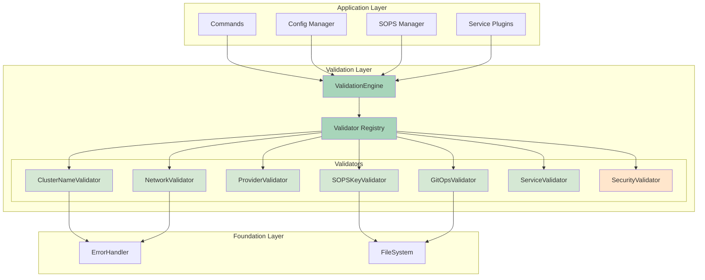
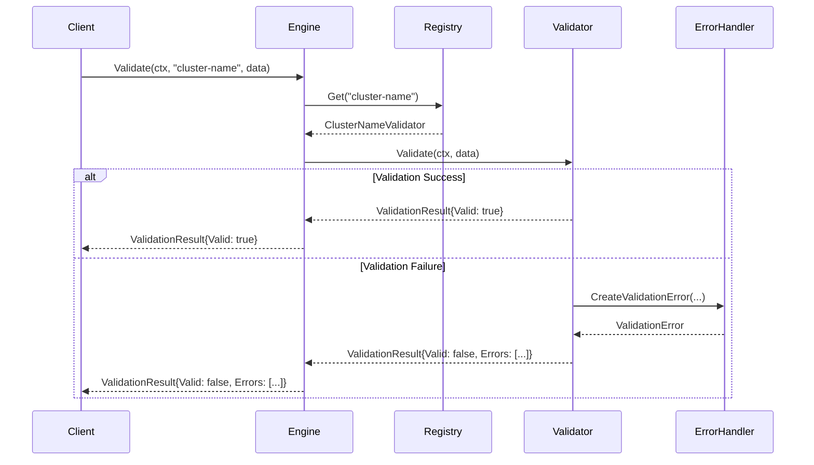
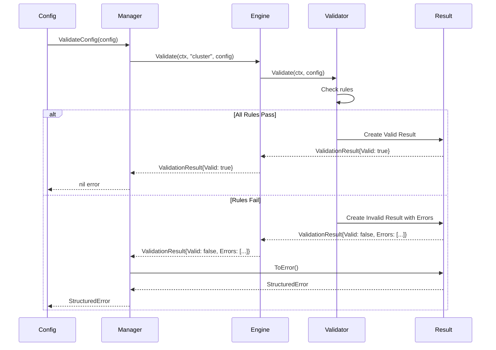
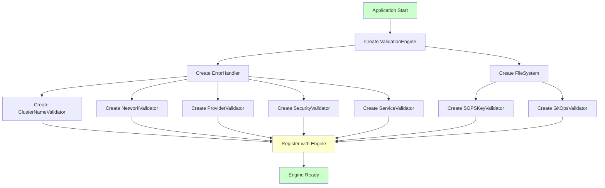
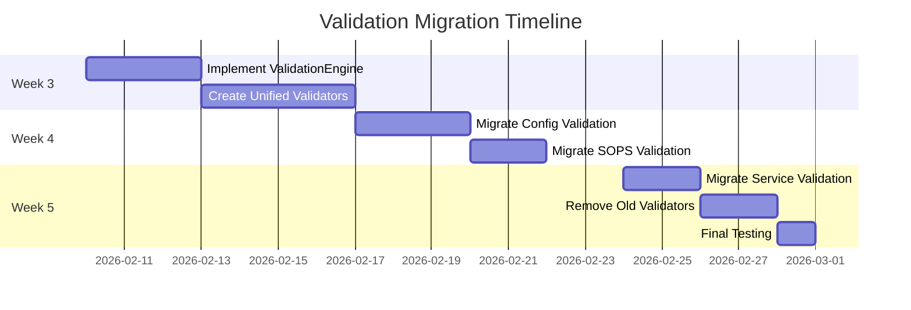

# Design Document: Phase 2 Validation Consolidation

## Table of Contents

- [Overview](#overview)
  - [Design Goals](#design-goals)
  - [Key Components](#key-components)
  - [Impact and Benefits](#impact-and-benefits)
- [Architecture](#architecture)
  - [Component Diagram](#component-diagram)
  - [Validation Flow](#validation-flow)
  - [Migration Strategy](#migration-strategy)
  - [Design Principles](#design-principles)
- [Components and Interfaces](#components-and-interfaces)
  - [ValidationEngine](#validationengine)
  - [Validator Interface](#validator-interface)
  - [Unified Validators](#unified-validators)
  - [ValidationResult](#validationresult)
- [Data Models](#data-models)
  - [Validation Data Flow](#validation-data-flow)
  - [Validator Registration Flow](#validator-registration-flow)
  - [Migration Timeline](#migration-timeline)
- [Correctness Properties](#correctness-properties)
- [Error Handling](#error-handling)
  - [Validation Error Categories](#validation-error-categories)
  - [Error Message Patterns](#error-message-patterns)
  - [Security Error Handling](#security-error-handling)
- [Testing Strategy](#testing-strategy)
  - [Dual Testing Approach](#dual-testing-approach)
  - [Property-Based Testing Configuration](#property-based-testing-configuration)
  - [Unit Testing Strategy](#unit-testing-strategy)
  - [Migration Testing](#migration-testing)
  - [Performance Testing](#performance-testing)

## Overview

Phase 2 consolidates validation logic scattered across 15+ packages into a unified ValidationEngine. This eliminates 1,800 lines of duplicate code, provides consistent error messages with actionable suggestions, and establishes a single source of truth for all validation rules.

### Design Goals

1. **Single Source of Truth**: All validation rules in one place, eliminating inconsistencies
2. **Consistent Error Messages**: Uniform error format with actionable suggestions across all validators
3. **Security First**: Centralized security validations prevent vulnerabilities
4. **Performance**: <1ms overhead per validation, <10ms for full validation
5. **Extensibility**: Easy to add new validators without modifying existing code

### Key Components

- **ValidationEngine**: Central registry and executor for all validators
- **Unified Validators**: Domain-specific validators (cluster, network, SOPS, services, security)
- **ValidationResult**: Rich result structure with errors, warnings, and suggestions

### Impact and Benefits

**Code Reduction:**
- Eliminates 1,800 LOC of duplicate validation code (64% reduction)
- Consolidates 15+ scattered validators into 6 unified validators
- Removes 3 overlapping config validators

**Quality Improvements:**
- Consistent validation rules prevent data corruption
- Unified error messages reduce user confusion
- Centralized security checks close vulnerability gaps
- Expected 60% reduction in validation-related bugs

**Developer Experience:**
- Single place to add new validation rules
- Clear validator registration pattern
- Comprehensive documentation and examples
- Faster code reviews with less duplication

## Architecture

### Component Diagram



### Validation Flow



### Migration Strategy

The migration follows a direct replacement approach:

**Implementation Approach:**
```go
// Replace old validation with new ValidationEngine
func (m *ConfigurationManager) Validate(ctx context.Context, config *Config) error {
    // Use ValidationEngine directly
    result, err := m.engine.Validate(ctx, "cluster", config)
    if err != nil {
        return fmt.Errorf("validation failed: %w", err)
    }
    
    if !result.Valid {
        return result.ToError()
    }
    
    return nil
}
```

**Migration Steps:**
1. **Week 3**: Implement ValidationEngine and all validators
2. **Week 4**: Replace old validators with ValidationEngine in config, SOPS, and services
3. **Week 5**: Remove old validation code and verify all tests pass

**Key Principles:**
- Direct replacement - no backward compatibility needed
- All validation goes through ValidationEngine from day one
- Old validation code removed immediately after replacement
- Comprehensive test coverage ensures correctness

### Design Principles

- **Separation of Concerns**: Each validator handles one domain
- **Open/Closed Principle**: Easy to add validators without modifying engine
- **Dependency Inversion**: Validators depend on abstractions (interfaces)
- **Single Responsibility**: ValidationEngine only manages validators, doesn't implement validation logic
- **Fail-Safe Defaults**: Security validators always run, cannot be disabled
- **Performance First**: Efficient data structures and minimal allocations

## Components and Interfaces

### ValidationEngine

The ValidationEngine is the central component managing validator registration and execution.

#### Interface Definition

```go
// internal/core/validation/engine.go
package validation

import (
    "context"
    "fmt"
    "sync"
    
    "github.com/rackerlabs/opencenter-cli/internal/util/errors"
)

// ValidationEngine manages validator registration and execution
type ValidationEngine struct {
    validators   map[string]Validator
    mu           sync.RWMutex
    errorHandler errors.ErrorHandler
}

// NewValidationEngine creates a new validation engine
func NewValidationEngine(errorHandler errors.ErrorHandler) *ValidationEngine {
    return &ValidationEngine{
        validators:   make(map[string]Validator),
        errorHandler: errorHandler,
    }
}

// Register adds a validator to the registry
func (e *ValidationEngine) Register(validator Validator) error {
    e.mu.Lock()
    defer e.mu.Unlock()
    
    name := validator.Name()
    if _, exists := e.validators[name]; exists {
        return fmt.Errorf("validator %s already registered", name)
    }
    
    e.validators[name] = validator
    return nil
}

// Validate executes a specific validator
func (e *ValidationEngine) Validate(ctx context.Context, validatorName string, data interface{}) (*ValidationResult, error) {
    e.mu.RLock()
    validator, exists := e.validators[validatorName]
    e.mu.RUnlock()
    
    if !exists {
        return nil, fmt.Errorf("validator %s not found", validatorName)
    }
    
    result := validator.Validate(ctx, data)
    return result, nil
}

// ValidateAll executes all registered validators
func (e *ValidationEngine) ValidateAll(ctx context.Context, data interface{}) (*ValidationResult, error) {
    aggregated := &ValidationResult{
        Valid:       true,
        Errors:      make([]*ValidationError, 0),
        Warnings:    make([]*ValidationWarning, 0),
        Suggestions: make([]string, 0),
    }
    
    e.mu.RLock()
    validators := make([]Validator, 0, len(e.validators))
    for _, v := range e.validators {
        validators = append(validators, v)
    }
    e.mu.RUnlock()
    
    for _, validator := range validators {
        result := validator.Validate(ctx, data)
        
        if !result.Valid {
            aggregated.Valid = false
            aggregated.Errors = append(aggregated.Errors, result.Errors...)
        }
        
        aggregated.Warnings = append(aggregated.Warnings, result.Warnings...)
        aggregated.Suggestions = append(aggregated.Suggestions, result.Suggestions...)
    }
    
    return aggregated, nil
}

// ListValidators returns names of all registered validators
func (e *ValidationEngine) ListValidators() []string {
    e.mu.RLock()
    defer e.mu.RUnlock()
    
    names := make([]string, 0, len(e.validators))
    for name := range e.validators {
        names = append(names, name)
    }
    return names
}
```

### Validator Interface

All validators implement this interface:

```go
// Validator defines the interface for all validators
type Validator interface {
    // Name returns the unique identifier for this validator
    Name() string
    
    // Validate performs validation and returns results
    Validate(ctx context.Context, data interface{}) *ValidationResult
    
    // Description returns human-readable description
    Description() string
}
```

### Unified Validators

#### ClusterNameValidator

```go
// internal/core/validation/validators/cluster_name.go
package validators

import (
    "context"
    "regexp"
    "strings"
    
    "github.com/rackerlabs/opencenter-cli/internal/core/validation"
    "github.com/rackerlabs/opencenter-cli/internal/util/errors"
)

type ClusterNameValidator struct {
    errorHandler errors.ErrorHandler
    namePattern  *regexp.Regexp
}

func NewClusterNameValidator(errorHandler errors.ErrorHandler) *ClusterNameValidator {
    return &ClusterNameValidator{
        errorHandler: errorHandler,
        namePattern:  regexp.MustCompile(`^[a-z0-9]([a-z0-9-]*[a-z0-9])?$`),
    }
}

func (v *ClusterNameValidator) Name() string {
    return "cluster-name"
}

func (v *ClusterNameValidator) Description() string {
    return "Validates cluster naming conventions"
}

func (v *ClusterNameValidator) Validate(ctx context.Context, data interface{}) *validation.ValidationResult {
    name, ok := data.(string)
    if !ok {
        return &validation.ValidationResult{
            Valid: false,
            Errors: []*validation.ValidationError{{
                Field:   "cluster_name",
                Message: "invalid data type for cluster name validation",
            }},
        }
    }
    
    result := &validation.ValidationResult{Valid: true}
    
    // Check length
    if len(name) == 0 {
        result.Valid = false
        result.Errors = append(result.Errors, &validation.ValidationError{
            Field:   "cluster_name",
            Message: "cluster name is required",
            Suggestions: []string{
                "Provide a name using the --name flag",
                "Example: opencenter cluster init my-cluster",
                "Name must be lowercase alphanumeric with hyphens",
            },
        })
        return result
    }
    
    if len(name) > 63 {
        result.Valid = false
        result.Errors = append(result.Errors, &validation.ValidationError{
            Field:   "cluster_name",
            Message: fmt.Sprintf("cluster name too long: %d characters (max 63)", len(name)),
            Suggestions: []string{
                "Shorten the cluster name to 63 characters or less",
                "Use abbreviations or shorter identifiers",
            },
        })
        return result
    }
    
    // Check pattern
    if !v.namePattern.MatchString(name) {
        result.Valid = false
        
        var suggestions []string
        if strings.ToLower(name) != name {
            suggestions = append(suggestions, "Convert name to lowercase")
        }
        if strings.HasPrefix(name, "-") || strings.HasSuffix(name, "-") {
            suggestions = append(suggestions, "Remove leading or trailing hyphens")
        }
        if strings.Contains(name, "_") {
            suggestions = append(suggestions, "Replace underscores with hyphens")
        }
        
        suggestions = append(suggestions, "Name must contain only lowercase letters, numbers, and hyphens")
        suggestions = append(suggestions, "Name must start and end with alphanumeric character")
        
        result.Errors = append(result.Errors, &validation.ValidationError{
            Field:       "cluster_name",
            Message:     fmt.Sprintf("invalid cluster name format: %s", name),
            Suggestions: suggestions,
        })
    }
    
    return result
}
```

#### NetworkValidator

```go
// internal/core/validation/validators/network.go
package validators

import (
    "context"
    "fmt"
    "net"
    
    "github.com/rackerlabs/opencenter-cli/internal/config"
    "github.com/rackerlabs/opencenter-cli/internal/core/validation"
    "github.com/rackerlabs/opencenter-cli/internal/util/errors"
)

type NetworkValidator struct {
    errorHandler errors.ErrorHandler
}

func NewNetworkValidator(errorHandler errors.ErrorHandler) *NetworkValidator {
    return &NetworkValidator{
        errorHandler: errorHandler,
    }
}

func (v *NetworkValidator) Name() string {
    return "network"
}

func (v *NetworkValidator) Description() string {
    return "Validates network configuration including CIDR ranges and IP addresses"
}

func (v *NetworkValidator) Validate(ctx context.Context, data interface{}) *validation.ValidationResult {
    networkConfig, ok := data.(*config.NetworkConfig)
    if !ok {
        return &validation.ValidationResult{
            Valid: false,
            Errors: []*validation.ValidationError{{
                Field:   "network",
                Message: "invalid data type for network validation",
            }},
        }
    }
    
    result := &validation.ValidationResult{Valid: true}
    
    // Validate pod CIDR
    if networkConfig.PodCIDR != "" {
        if err := v.validateCIDR(networkConfig.PodCIDR, "pod_cidr"); err != nil {
            result.Valid = false
            result.Errors = append(result.Errors, err)
        }
    }
    
    // Validate service CIDR
    if networkConfig.ServiceCIDR != "" {
        if err := v.validateCIDR(networkConfig.ServiceCIDR, "service_cidr"); err != nil {
            result.Valid = false
            result.Errors = append(result.Errors, err)
        }
    }
    
    // Check for CIDR overlap
    if networkConfig.PodCIDR != "" && networkConfig.ServiceCIDR != "" {
        if v.cidrsOverlap(networkConfig.PodCIDR, networkConfig.ServiceCIDR) {
            result.Valid = false
            result.Errors = append(result.Errors, &validation.ValidationError{
                Field:   "network",
                Message: "pod CIDR and service CIDR overlap",
                Suggestions: []string{
                    "Use non-overlapping CIDR ranges",
                    "Example: pod_cidr: 10.244.0.0/16, service_cidr: 10.96.0.0/12",
                },
            })
        }
    }
    
    // Validate DNS servers
    for i, dnsServer := range networkConfig.DNSServers {
        if net.ParseIP(dnsServer) == nil {
            result.Valid = false
            result.Errors = append(result.Errors, &validation.ValidationError{
                Field:   fmt.Sprintf("dns_servers[%d]", i),
                Message: fmt.Sprintf("invalid DNS server IP address: %s", dnsServer),
                Suggestions: []string{
                    "Provide a valid IPv4 or IPv6 address",
                    "Example: 8.8.8.8 or 2001:4860:4860::8888",
                },
            })
        }
    }
    
    return result
}

func (v *NetworkValidator) validateCIDR(cidr, field string) *validation.ValidationError {
    _, _, err := net.ParseCIDR(cidr)
    if err != nil {
        return &validation.ValidationError{
            Field:   field,
            Message: fmt.Sprintf("invalid CIDR format: %s", cidr),
            Suggestions: []string{
                "Use CIDR notation: <ip>/<prefix>",
                "Example: 10.244.0.0/16 or 2001:db8::/32",
            },
        }
    }
    return nil
}

func (v *NetworkValidator) cidrsOverlap(cidr1, cidr2 string) bool {
    _, net1, _ := net.ParseCIDR(cidr1)
    _, net2, _ := net.ParseCIDR(cidr2)
    
    return net1.Contains(net2.IP) || net2.Contains(net1.IP)
}
```

#### SOPSKeyValidator

```go
// internal/core/validation/validators/sops_key.go
package validators

import (
    "context"
    "fmt"
    "os"
    "strings"
    
    "github.com/rackerlabs/opencenter-cli/internal/core/validation"
    "github.com/rackerlabs/opencenter-cli/internal/util/errors"
    "github.com/rackerlabs/opencenter-cli/internal/util/fs"
)

type SOPSKeyValidator struct {
    errorHandler errors.ErrorHandler
    fileSystem   fs.FileSystem
}

func NewSOPSKeyValidator(errorHandler errors.ErrorHandler, fileSystem fs.FileSystem) *SOPSKeyValidator {
    return &SOPSKeyValidator{
        errorHandler: errorHandler,
        fileSystem:   fileSystem,
    }
}

func (v *SOPSKeyValidator) Name() string {
    return "sops-key"
}

func (v *SOPSKeyValidator) Description() string {
    return "Validates SOPS encryption key format and accessibility"
}

func (v *SOPSKeyValidator) Validate(ctx context.Context, data interface{}) *validation.ValidationResult {
    keyPath, ok := data.(string)
    if !ok {
        return &validation.ValidationResult{
            Valid: false,
            Errors: []*validation.ValidationError{{
                Field:   "sops_key",
                Message: "invalid data type for SOPS key validation",
            }},
        }
    }
    
    result := &validation.ValidationResult{Valid: true}
    
    // Check if key file exists
    if !v.fileSystem.Exists(keyPath) {
        result.Valid = false
        result.Errors = append(result.Errors, &validation.ValidationError{
            Field:   "sops_key",
            Message: fmt.Sprintf("SOPS key file not found: %s", keyPath),
            Suggestions: []string{
                "Generate a new Age key: age-keygen -o " + keyPath,
                "Or use: opencenter sops generate-key",
                "Verify the file path is correct",
            },
        })
        return result
    }
    
    // Read key file
    keyData, err := v.fileSystem.ReadFile(keyPath)
    if err != nil {
        result.Valid = false
        result.Errors = append(result.Errors, &validation.ValidationError{
            Field:   "sops_key",
            Message: fmt.Sprintf("cannot read SOPS key file: %v", err),
            Suggestions: []string{
                "Check file permissions (should be 0600)",
                "Verify you have read access to the file",
            },
        })
        return result
    }
    
    // Validate Age key format
    keyContent := string(keyData)
    if !strings.HasPrefix(keyContent, "AGE-SECRET-KEY-") {
        result.Valid = false
        result.Errors = append(result.Errors, &validation.ValidationError{
            Field:   "sops_key",
            Message: "invalid Age key format",
            Suggestions: []string{
                "Age keys must start with 'AGE-SECRET-KEY-'",
                "Generate a new key: age-keygen -o " + keyPath,
            },
        })
        return result
    }
    
    // Check file permissions
    info, err := v.fileSystem.Stat(keyPath)
    if err == nil {
        mode := info.Mode().Perm()
        if mode != 0600 {
            result.Warnings = append(result.Warnings, &validation.ValidationWarning{
                Field:   "sops_key",
                Message: fmt.Sprintf("insecure key file permissions: %o (should be 0600)", mode),
                Suggestions: []string{
                    fmt.Sprintf("Fix permissions: chmod 600 %s", keyPath),
                },
            })
        }
    }
    
    return result
}
```

#### SecurityValidator

```go
// internal/core/validation/validators/security.go
package validators

import (
    "context"
    "strings"
    
    "github.com/rackerlabs/opencenter-cli/internal/core/validation"
    "github.com/rackerlabs/opencenter-cli/internal/util/errors"
)

type SecurityValidator struct {
    errorHandler errors.ErrorHandler
}

func NewSecurityValidator(errorHandler errors.ErrorHandler) *SecurityValidator {
    return &SecurityValidator{
        errorHandler: errorHandler,
    }
}

func (v *SecurityValidator) Name() string {
    return "security"
}

func (v *SecurityValidator) Description() string {
    return "Validates input for security issues (path traversal, command injection, etc.)"
}

func (v *SecurityValidator) Validate(ctx context.Context, data interface{}) *validation.ValidationResult {
    input, ok := data.(string)
    if !ok {
        return &validation.ValidationResult{Valid: true} // Skip non-string data
    }
    
    result := &validation.ValidationResult{Valid: true}
    
    // Check for path traversal
    if strings.Contains(input, "..") {
        result.Valid = false
        result.Errors = append(result.Errors, &validation.ValidationError{
            Field:   "input",
            Message: "path traversal detected",
            Suggestions: []string{
                "Remove '..' from the path",
                "Use absolute paths instead",
            },
        })
    }
    
    // Check for command injection patterns
    dangerousChars := []string{";", "|", "&", "$", "`", "$(", "&&", "||"}
    for _, char := range dangerousChars {
        if strings.Contains(input, char) {
            result.Valid = false
            result.Errors = append(result.Errors, &validation.ValidationError{
                Field:   "input",
                Message: "potential command injection detected",
                Suggestions: []string{
                    "Remove shell metacharacters from input",
                    "Use parameterized commands instead",
                },
            })
            break
        }
    }
    
    return result
}
```

### ValidationResult

```go
// internal/core/validation/result.go
package validation

import (
    "fmt"
    "strings"
    
    "github.com/rackerlabs/opencenter-cli/internal/util/errors"
)

// ValidationResult contains the outcome of validation
type ValidationResult struct {
    Valid       bool
    Errors      []*ValidationError
    Warnings    []*ValidationWarning
    Suggestions []string
}

// ValidationError represents a validation failure
type ValidationError struct {
    Field       string
    Message     string
    Suggestions []string
    Context     map[string]interface{}
}

// ValidationWarning represents a non-fatal validation issue
type ValidationWarning struct {
    Field       string
    Message     string
    Suggestions []string
}

// Error implements the error interface
func (e *ValidationError) Error() string {
    var sb strings.Builder
    
    if e.Field != "" {
        sb.WriteString(fmt.Sprintf("[%s] ", e.Field))
    }
    
    sb.WriteString(e.Message)
    
    if len(e.Suggestions) > 0 {
        sb.WriteString("\nSuggestions:\n")
        for _, suggestion := range e.Suggestions {
            sb.WriteString(fmt.Sprintf("  - %s\n", suggestion))
        }
    }
    
    return sb.String()
}

// ToError converts ValidationResult to a StructuredError
func (r *ValidationResult) ToError() error {
    if r.Valid {
        return nil
    }
    
    if len(r.Errors) == 0 {
        return nil
    }
    
    // Aggregate all error messages
    var messages []string
    var allSuggestions []string
    
    for _, err := range r.Errors {
        messages = append(messages, err.Message)
        allSuggestions = append(allSuggestions, err.Suggestions...)
    }
    
    return &errors.StructuredError{
        Type:        errors.ValidationError,
        Message:     strings.Join(messages, "; "),
        Suggestions: allSuggestions,
        Operation:   "validation",
        Retryable:   false,
    }
}

// HasWarnings returns true if warnings exist
func (r *ValidationResult) HasWarnings() bool {
    return len(r.Warnings) > 0
}

// HasErrors returns true if errors exist
func (r *ValidationResult) HasErrors() bool {
    return len(r.Errors) > 0
}
```

## Data Models

### Validation Data Flow



### Validator Registration Flow



### Migration Timeline



## Correctness Properties

*A property is a characteristic or behavior that should hold true across all valid executions of a system—essentially, a formal statement about what the system should do. Properties serve as the bridge between human-readable specifications and machine-verifiable correctness guarantees.*


### Property Reflection

After analyzing all acceptance criteria, I identified the following testable properties and performed reflection to eliminate redundancy:

**Identified Properties:**
1. Validator registration (1.1) - Standalone property
2. Thread-safe concurrent access (1.6) - Standalone property
3. Result aggregation (1.7, 1.8) - Can be combined into one comprehensive aggregation property
4. Context propagation (1.9) - Standalone property
5. Cluster name length validation (2.2) - Part of cluster name validation
6. Cluster name character validation (2.3) - Part of cluster name validation
7. Cluster name format validation (2.4) - Part of cluster name validation
8. Validation errors include suggestions (2.10) - Standalone property
9. ToError conversion (3.9) - Standalone property
10. Service validator naming (6.2) - Standalone property
11. Service field validation (6.4) - Standalone property
12. Service error suggestions (6.9) - Covered by property 8
13. SOPS key format validation (5.2, 5.3, 5.4) - Can be combined into one SOPS validation property
14. SOPS key decryption validation (5.9) - Part of SOPS validation
15. Path traversal detection (7.2) - Part of security validation
16. Security pattern detection (7.5) - Part of security validation
17. Security error messages (7.8) - Standalone property
18. Security validators always run (7.10) - Standalone property
19. Validation result caching (8.8) - Standalone property
20. Validator prioritization (8.9) - Standalone property

**Redundancy Analysis:**
- Properties 1.7 and 1.8 both test result aggregation - combined into Property 3
- Properties 2.2, 2.3, and 2.4 all test cluster name validation - combined into Property 5
- Properties 2.10 and 6.9 both test suggestions in errors - 6.9 is redundant, covered by 2.10
- Properties 5.2, 5.3, 5.4, and 5.9 all test SOPS validation - combined into Property 8
- Properties 7.2 and 7.5 both test security validation - combined into Property 10

**Final Property Set:** 13 properties providing unique validation value

### Property 1: Validator Registration Uniqueness

*For any* validator, when Register is called, the validator SHALL be stored in the registry and retrievable by name, and attempting to register a validator with the same name SHALL return an error.

**Validates: Requirements 1.1, 1.2**

**Testing Approach:**
- Generate random validators with unique names
- Register each validator and verify it's retrievable
- Attempt to register a validator with duplicate name
- Verify error is returned for duplicate registration
- Test with 10-100 validators to ensure registry scales

### Property 2: Thread-Safe Concurrent Operations

*For any* set of concurrent validator registrations and validation operations, all operations SHALL complete without race conditions or data corruption.

**Validates: Requirements 1.6**

**Testing Approach:**
- Generate random sets of validators
- Perform concurrent registrations from multiple goroutines
- Perform concurrent validations from multiple goroutines
- Run with Go race detector enabled
- Verify no race conditions detected
- Verify all validators registered correctly
- Test with 10-100 concurrent operations

### Property 3: Validation Result Aggregation

*For any* set of validators where at least one returns errors, ValidateAll SHALL return a ValidationResult with Valid=false and all errors aggregated from all validators.

**Validates: Requirements 1.7, 1.8**

**Testing Approach:**
- Generate random sets of validators (some passing, some failing)
- Call ValidateAll with test data
- Verify result.Valid is false if any validator failed
- Verify result.Valid is true if all validators passed
- Verify all errors from all validators are present in result
- Test with various combinations (all pass, all fail, mixed)

### Property 4: Context Propagation

*For any* validation operation, the context passed to ValidationEngine.Validate SHALL be propagated to the validator's Validate method without modification.

**Validates: Requirements 1.9**

**Testing Approach:**
- Create context with specific values (user, operation, timeout)
- Call ValidationEngine.Validate with context
- Verify validator receives exact same context
- Test with various context types and values
- Verify context cancellation is respected

### Property 5: Cluster Name Validation Rules

*For any* cluster name, ClusterNameValidator SHALL accept names that are 1-63 characters, contain only lowercase alphanumeric and hyphens, and do not start or end with hyphens, and SHALL reject all other names with appropriate error messages.

**Validates: Requirements 2.2, 2.3, 2.4**

**Testing Approach:**
- Generate valid cluster names (random length 1-63, valid characters)
- Verify all valid names pass validation
- Generate invalid names (too long, uppercase, invalid chars, leading/trailing hyphens)
- Verify all invalid names fail validation
- Verify error messages describe the specific violation
- Test edge cases (empty string, exactly 63 chars, single character)

### Property 6: Validation Errors Include Suggestions

*For any* validation error returned by any validator, the ValidationError SHALL include at least one actionable suggestion.

**Validates: Requirements 2.10**

**Testing Approach:**
- Generate random invalid inputs for all validators
- Trigger validation failures
- Verify each ValidationError has non-empty Suggestions slice
- Verify suggestions are actionable (contain verbs like "use", "set", "check")
- Test across all validator types (cluster, network, SOPS, service, security)

### Property 7: ValidationResult ToError Conversion

*For any* ValidationResult, calling ToError SHALL return nil if Valid=true, and SHALL return a StructuredError containing all error messages if Valid=false.

**Validates: Requirements 3.9**

**Testing Approach:**
- Generate random ValidationResults (valid and invalid)
- Call ToError on each result
- Verify valid results return nil
- Verify invalid results return StructuredError
- Verify StructuredError contains all error messages
- Verify StructuredError has Type=ValidationError

### Property 8: SOPS Key Validation

*For any* SOPS key file path, SOPSKeyValidator SHALL verify the file exists, is readable, has correct permissions (0600), starts with "AGE-SECRET-KEY-", and can decrypt test data.

**Validates: Requirements 5.2, 5.3, 5.4, 5.9**

**Testing Approach:**
- Generate valid Age key files with correct format
- Verify validation passes for valid keys
- Generate invalid keys (wrong format, bad permissions, missing file)
- Verify validation fails with appropriate errors
- Test decryption capability with encrypted test data
- Verify warnings for insecure permissions (not 0600)

### Property 9: Service Validator Naming Convention

*For any* service plugin, when validating configuration, the validator name used SHALL be "service:{service_name}" where service_name matches the plugin name.

**Validates: Requirements 6.2**

**Testing Approach:**
- Generate random service names
- Create service plugins with those names
- Verify validation uses correct validator name format
- Test with various service name formats (lowercase, with-hyphens, etc.)
- Verify validator lookup succeeds with correct name

### Property 10: Security Validation Detection

*For any* input containing path traversal patterns ("..") or command injection patterns (";", "|", "&", "$", "`"), SecurityValidator SHALL detect and reject the input with a security error.

**Validates: Requirements 7.2, 7.5**

**Testing Approach:**
- Generate inputs with path traversal patterns
- Generate inputs with command injection patterns
- Verify all malicious inputs are rejected
- Generate safe inputs without patterns
- Verify safe inputs pass validation
- Test with various encoding attempts (URL encoding, etc.)

### Property 11: Security Error Messages

*For any* security validation failure, the error message SHALL describe the security issue without revealing system internals (file paths, system configuration, etc.).

**Validates: Requirements 7.8**

**Testing Approach:**
- Trigger security validation failures
- Verify error messages don't contain absolute file paths
- Verify error messages don't contain system configuration details
- Verify error messages describe the issue generically
- Test across all security validators

### Property 12: Security Validators Always Run

*For any* validation operation, security validators SHALL execute, ensuring security checks cannot be bypassed.

**Validates: Requirements 7.10**

**Testing Approach:**
- Perform validation with malicious input
- Verify security validators always execute
- Verify security violations are always detected
- Test with various validation scenarios

### Property 13: Validation Result Caching

*For any* identical validation operation performed multiple times, subsequent validations SHALL use cached results when appropriate, avoiding redundant validation work.

**Validates: Requirements 8.8**

**Testing Approach:**
- Perform validation with specific data
- Perform same validation again
- Verify second validation uses cache (faster execution)
- Modify data and validate again
- Verify cache is invalidated and new validation runs
- Test cache expiration and invalidation

## Error Handling

### Validation Error Categories

The validation system defines specific error categories for different validation failures:

1. **Field Validation Errors**: Errors related to specific configuration fields
   - Include field name for precise error location
   - Provide field-specific suggestions
   - Example: "cluster_name: name too long (65 characters, max 63)"

2. **Format Validation Errors**: Errors related to data format
   - Include format specification
   - Provide format examples
   - Example: "invalid CIDR format: 10.244.0/16 (expected: 10.244.0.0/16)"

3. **Security Validation Errors**: Errors related to security issues
   - Generic messages to avoid information disclosure
   - Security-focused suggestions
   - Example: "path traversal detected (remove '..' from path)"

4. **Dependency Validation Errors**: Errors related to missing or invalid dependencies
   - Include dependency information
   - Provide installation/configuration guidance
   - Example: "SOPS key file not found (generate with: age-keygen -o keyfile)"

### Error Message Patterns

All validation error messages follow consistent patterns:

**Pattern 1: Field Validation**
```
[field_name] error description (current: X, expected: Y)

Suggestions:
  - Specific action to fix the issue
  - Example of correct value
```

**Pattern 2: Security Validation**
```
security issue detected: generic description

Suggestions:
  - Remove problematic pattern
  - Use safe alternative
```

**Pattern 3: Format Validation**
```
invalid format: value (expected format: description)

Suggestions:
  - Format specification
  - Example of correct format
```

### Security Error Handling

Security validation errors require special handling:

1. **No Information Disclosure**: Error messages must not reveal system internals
2. **Audit Logging**: All security violations are logged for security monitoring
3. **Generic Messages**: Use generic descriptions like "path traversal detected" instead of specific paths
4. **Cannot Be Bypassed**: Security validators always run as part of the validation engine

Example security error handling:

```go
func (v *SecurityValidator) Validate(ctx context.Context, data interface{}) *ValidationResult {
    input := data.(string)
    
    if strings.Contains(input, "..") {
        // Log for security audit
        log.Warnf("Path traversal attempt detected from user %s", ctx.Value("user"))
        
        // Return generic error (no system details)
        return &ValidationResult{
            Valid: false,
            Errors: []*ValidationError{{
                Field:   "input",
                Message: "path traversal detected",
                Suggestions: []string{
                    "Remove '..' from the path",
                    "Use absolute paths instead",
                },
            }},
        }
    }
    
    return &ValidationResult{Valid: true}
}
```

## Testing Strategy

### Dual Testing Approach

The Phase 2 Validation Consolidation requires both unit tests and property-based tests for comprehensive coverage:

- **Unit Tests**: Verify specific examples, edge cases, and error conditions
- **Property Tests**: Verify universal properties across all inputs

Both testing approaches are complementary and necessary. Unit tests catch concrete bugs in specific scenarios, while property tests verify general correctness across a wide input space.

### Property-Based Testing Configuration

**Library Selection**: Use `gopter` for Go property-based testing

**Configuration**:
- Minimum 100 iterations per property test (due to randomization)
- Each property test must reference its design document property
- Tag format: `// Feature: phase-2-validation-consolidation, Property N: [property text]`

**Example Property Test Structure**:

```go
func TestProperty1_ValidatorRegistrationUniqueness(t *testing.T) {
    // Feature: phase-2-validation-consolidation, Property 1: Validator Registration Uniqueness
    
    parameters := gopter.DefaultTestParameters()
    parameters.MinSuccessfulTests = 100
    
    properties := gopter.NewProperties(parameters)
    
    properties.Property("validators are stored and retrievable by name", prop.ForAll(
        func(validatorNames []string) bool {
            engine := NewValidationEngine(errors.NewDefaultErrorHandler())
            
            // Register validators
            for _, name := range validatorNames {
                validator := &mockValidator{name: name}
                err := engine.Register(validator)
                if err != nil {
                    return false // Registration should succeed
                }
            }
            
            // Verify all validators are retrievable
            for _, name := range validatorNames {
                _, err := engine.Validate(context.Background(), name, nil)
                if err != nil {
                    return false // Should find validator
                }
            }
            
            return true
        },
        gen.SliceOf(gen.Identifier()),
    ))
    
    properties.Property("duplicate registration returns error", prop.ForAll(
        func(name string) bool {
            engine := NewValidationEngine(errors.NewDefaultErrorHandler())
            
            validator := &mockValidator{name: name}
            
            // First registration should succeed
            err1 := engine.Register(validator)
            if err1 != nil {
                return false
            }
            
            // Second registration should fail
            err2 := engine.Register(validator)
            return err2 != nil
        },
        gen.Identifier(),
    ))
    
    properties.TestingRun(t)
}
```

### Unit Testing Strategy

Unit tests focus on:

1. **Specific Examples**: Concrete test cases demonstrating correct behavior
   - Valid cluster name: "my-cluster-123"
   - Invalid cluster name: "My_Cluster" (uppercase and underscore)
   - Valid CIDR: "10.244.0.0/16"
   - Invalid CIDR: "10.244.0/16" (missing last octet)

2. **Edge Cases**: Boundary conditions and special inputs
   - Empty cluster name
   - Cluster name exactly 63 characters
   - Single character cluster name
   - CIDR with /32 prefix (single IP)
   - Empty validator registry

3. **Error Conditions**: Specific failure scenarios
   - Registering validator with duplicate name
   - Validating with non-existent validator
   - SOPS key file not found
   - SOPS key file with wrong permissions
   - Network CIDR overlap

4. **Integration Points**: Component interactions
   - ValidationEngine using ErrorHandler
   - Validators using FileSystem
   - ValidationResult converting to StructuredError

### Migration Testing

Migration testing ensures the new validation system works correctly:

**Validation Correctness Tests**:
```go
func TestValidation_Correctness(t *testing.T) {
    config := loadTestConfig()
    engine := setupValidationEngine()
    
    // Test validation with new engine
    result, err := engine.Validate(context.Background(), "cluster", config)
    if err != nil {
        t.Fatalf("validation failed: %v", err)
    }
    
    // Verify expected validation behavior
    if !result.Valid {
        t.Errorf("expected valid config, got errors: %v", result.Errors)
    }
}
```

**Backward Compatibility Tests**:
```go
func TestBackwardCompatibility_ExistingTestsPass(t *testing.T) {
    // Run all existing config validation tests
    // Verify they pass with new ValidationEngine
    
    existingTests := []func(*testing.T){
        testConfigValidation,
        testSOPSValidation,
        testServiceValidation,
        // ... all existing tests
    }
    
    for _, test := range existingTests {
        test(t)
    }
}
```

### Performance Testing

Performance tests ensure validation meets performance targets:

**Benchmark Tests**:
```go
func BenchmarkValidationEngine_SingleValidator(b *testing.B) {
    engine := setupEngine()
    data := generateTestData()
    ctx := context.Background()
    
    b.ResetTimer()
    for i := 0; i < b.N; i++ {
        engine.Validate(ctx, "cluster-name", data)
    }
}

func BenchmarkValidationEngine_AllValidators(b *testing.B) {
    engine := setupEngine()
    data := generateTestData()
    ctx := context.Background()
    
    b.ResetTimer()
    for i := 0; i < b.N; i++ {
        engine.ValidateAll(ctx, data)
    }
}

func BenchmarkValidationEngine_Concurrent(b *testing.B) {
    engine := setupEngine()
    data := generateTestData()
    ctx := context.Background()
    
    b.ResetTimer()
    b.RunParallel(func(pb *testing.PB) {
        for pb.Next() {
            engine.Validate(ctx, "cluster-name", data)
        }
    })
}
```

**Performance Assertions**:
```go
func TestPerformance_MeetsTargets(t *testing.T) {
    engine := setupEngine()
    data := generateTestData()
    ctx := context.Background()
    
    // Test single validation overhead
    start := time.Now()
    for i := 0; i < 1000; i++ {
        engine.Validate(ctx, "cluster-name", data)
    }
    avgTime := time.Since(start) / 1000
    
    if avgTime > 1*time.Millisecond {
        t.Errorf("Single validation too slow: %v (target: <1ms)", avgTime)
    }
    
    // Test full validation
    start = time.Now()
    engine.ValidateAll(ctx, data)
    fullTime := time.Since(start)
    
    if fullTime > 10*time.Millisecond {
        t.Errorf("Full validation too slow: %v (target: <10ms)", fullTime)
    }
}
```

### Test Coverage Targets

| Component | Unit Test Coverage | Property Test Coverage | Total Target |
|-----------|-------------------|----------------------|--------------|
| ValidationEngine | >85% | >80% | >85% |
| ClusterNameValidator | >90% | >85% | >90% |
| NetworkValidator | >85% | >80% | >85% |
| SOPSKeyValidator | >85% | >80% | >85% |
| SecurityValidator | >90% | >85% | >90% |
| ServiceValidator | >85% | >75% | >85% |
| ValidationResult | >85% | >70% | >85% |

### Test Organization

```
internal/
├── core/
│   └── validation/
│       ├── engine.go
│       ├── engine_test.go              # Unit tests
│       ├── engine_property_test.go     # Property tests
│       ├── result.go
│       ├── result_test.go              # Unit tests
│       ├── flags.go
│       ├── flags_test.go               # Unit tests
│       └── validators/
│           ├── cluster_name.go
│           ├── cluster_name_test.go
│           ├── cluster_name_property_test.go
│           ├── network.go
│           ├── network_test.go
│           ├── network_property_test.go
│           ├── sops_key.go
│           ├── sops_key_test.go
│           ├── sops_key_property_test.go
│           ├── security.go
│           ├── security_test.go
│           └── security_property_test.go
```

### Continuous Integration

All tests must pass in CI before merging:

```bash
# Run all tests with race detection
mise run test -race

# Run property tests with verbose output
go test -v ./internal/core/validation/... -run Property

# Run benchmarks
go test -bench=. ./internal/core/validation/...

# Check coverage
go test -cover ./internal/core/validation/...

# Verify performance targets
go test -v ./internal/core/validation/... -run TestPerformance
```

### Test Maintenance

- Keep unit tests focused and fast (<100ms per test)
- Property tests may take longer (1-5s per property)
- Update tests when requirements change
- Remove obsolete tests during migration
- Document complex test scenarios
- Maintain test data generators for property tests
