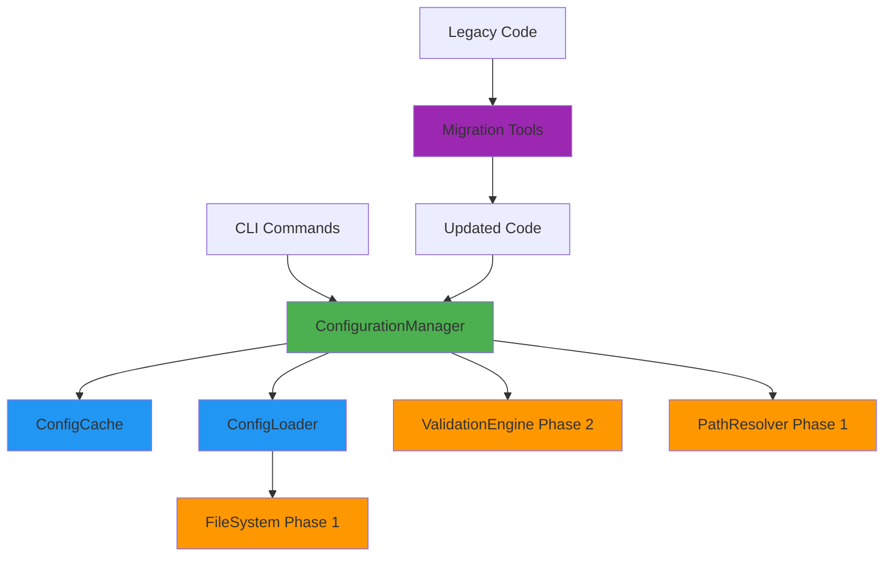
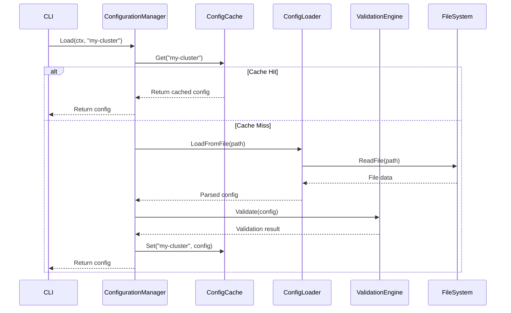

# Design Document: Phase 3 Configuration Unification

## Overview

This design consolidates three overlapping configuration management systems into a single unified ConfigurationManager. The unified system provides atomic file operations to prevent corruption, consistent caching for 40% performance improvement, and a clear API that integrates with Phase 1 (FileSystem, PathResolver) and Phase 2 (ValidationEngine) components.

The design follows a layered architecture:
- **API Layer**: ConfigurationManager with Load, Save, Validate, List, Delete operations
- **Caching Layer**: In-memory cache with invalidation support
- **I/O Layer**: ConfigLoader using atomic file operations from Phase 1
- **Validation Layer**: Integration with ValidationEngine from Phase 2
- **Migration Layer**: Tools and documentation for updating legacy code

## Table of Contents

- [Overview](#overview)
- [Architecture](#architecture)
  - [Component Diagram](#component-diagram)
  - [Data Flow](#data-flow)
- [Components and Interfaces](#components-and-interfaces)
  - [ConfigurationManager](#configurationmanager)
  - [ConfigCache](#configcache)
  - [ConfigLoader](#configloader)
  - [ConfigBuilder](#configbuilder)
  - [Migration Tools](#migration-tools)
- [Data Models](#data-models)
  - [Config](#config)
  - [CacheEntry](#cacheentry)
  - [Error Types](#error-types)
- [Correctness Properties](#correctness-properties)
  - [Property Reflection](#property-reflection)
  - [Core Properties](#core-properties)
- [Error Handling](#error-handling)
  - [Error Types](#error-types)
  - [Error Handling Strategy](#error-handling-strategy)
  - [Error Recovery](#error-recovery)
- [Testing Strategy](#testing-strategy)
  - [Dual Testing Approach](#dual-testing-approach)
  - [Property Test Configuration](#property-test-configuration)
  - [Test Coverage Requirements](#test-coverage-requirements)
  - [Integration Testing](#integration-testing)
  - [Performance Benchmarks](#performance-benchmarks)
  - [Migration Testing](#migration-testing)

## Architecture

### Component Diagram



### Data Flow



## Components and Interfaces

### ConfigurationManager

The central component that orchestrates all configuration operations.

```go
// ConfigurationManager provides unified configuration management
type ConfigurationManager struct {
    loader       *ConfigLoader
    validator    *ValidationEngine  // From Phase 2
    cache        *ConfigCache
    pathResolver *PathResolver      // From Phase 1
    fileSystem   fs.FileSystem      // From Phase 1
    mu           sync.RWMutex       // Protects concurrent access
}

// NewConfigurationManager creates a new manager with all dependencies
func NewConfigurationManager() (*ConfigurationManager, error) {
    fileSystem := filesystem.NewFileSystem()
    pathResolver := paths.NewPathResolver(fileSystem)
    validator := validation.NewValidationEngine()
    
    return &ConfigurationManager{
        loader:       NewConfigLoader(fileSystem),
        validator:    validator,
        cache:        NewConfigCache(),
        pathResolver: pathResolver,
        fileSystem:   fileSystem,
    }, nil
}

// Load loads a configuration from disk or cache
func (cm *ConfigurationManager) Load(ctx context.Context, name string) (*Config, error)

// Save saves a configuration to disk atomically
func (cm *ConfigurationManager) Save(ctx context.Context, config *Config) error

// Validate validates a configuration without saving
func (cm *ConfigurationManager) Validate(ctx context.Context, config *Config) error

// List returns all cluster names
func (cm *ConfigurationManager) List(ctx context.Context) ([]string, error)

// Delete removes a configuration
func (cm *ConfigurationManager) Delete(ctx context.Context, name string) error

// NewBuilder creates a configuration builder
func (cm *ConfigurationManager) NewBuilder(name string) *ConfigBuilder

// BuildFrom creates a builder from existing config
func (cm *ConfigurationManager) BuildFrom(config *Config) *ConfigBuilder

// ClearCache removes all cached configurations
func (cm *ConfigurationManager) ClearCache(ctx context.Context) error

// InvalidateCluster removes a specific cluster from cache
func (cm *ConfigurationManager) InvalidateCluster(ctx context.Context, name string) error
```

### ConfigCache

Thread-safe in-memory cache for loaded configurations.

```go
// ConfigCache provides thread-safe caching of configurations
type ConfigCache struct {
    entries map[string]*cacheEntry
    mu      sync.RWMutex
}

type cacheEntry struct {
    config    *Config
    loadedAt  time.Time
    expiresAt time.Time
}

// Get retrieves a configuration from cache
func (cc *ConfigCache) Get(ctx context.Context, name string) (*Config, bool)

// Set stores a configuration in cache
func (cc *ConfigCache) Set(ctx context.Context, name string, config *Config)

// Invalidate removes a specific entry
func (cc *ConfigCache) Invalidate(ctx context.Context, name string)

// Clear removes all entries
func (cc *ConfigCache) Clear(ctx context.Context)

// Size returns the number of cached entries
func (cc *ConfigCache) Size() int
```

### ConfigLoader

Handles low-level I/O operations for configuration files.

```go
// ConfigLoader handles configuration file I/O
type ConfigLoader struct {
    fileSystem fs.FileSystem
}

// LoadFromFile reads and parses a configuration file
func (cl *ConfigLoader) LoadFromFile(ctx context.Context, path string) (*Config, error)

// LoadFromBytes parses configuration from byte data
func (cl *ConfigLoader) LoadFromBytes(ctx context.Context, data []byte) (*Config, error)

// SaveToFile writes a configuration atomically
func (cl *ConfigLoader) SaveToFile(ctx context.Context, path string, config *Config) error

// MarshalConfig converts a config to YAML bytes
func (cl *ConfigLoader) MarshalConfig(config *Config) ([]byte, error)

// UnmarshalConfig parses YAML bytes into a config
func (cl *ConfigLoader) UnmarshalConfig(data []byte) (*Config, error)
```

### ConfigBuilder

Fluent API for building configurations programmatically.

```go
// ConfigBuilder provides a fluent API for building configurations
type ConfigBuilder struct {
    config    *Config
    manager   *ConfigurationManager
    errors    []error
}

// WithProvider sets the cloud provider
func (cb *ConfigBuilder) WithProvider(provider string) *ConfigBuilder

// WithRegion sets the region
func (cb *ConfigBuilder) WithRegion(region string) *ConfigBuilder

// WithOrganization sets the organization
func (cb *ConfigBuilder) WithOrganization(org string) *ConfigBuilder

// WithDefaults applies default values for the provider
func (cb *ConfigBuilder) WithDefaults() *ConfigBuilder

// Validate validates the current configuration
func (cb *ConfigBuilder) Validate() error

// Build returns the built configuration
func (cb *ConfigBuilder) Build() (*Config, error)

// Save builds and saves the configuration
func (cb *ConfigBuilder) Save(ctx context.Context) error
```

### Migration Tools

Tools to identify and update legacy configuration code.

```go
// MigrationScanner identifies files using legacy config patterns
type MigrationScanner struct {
    rootDir string
}

// Scan finds all files using legacy config functions
func (ms *MigrationScanner) Scan() (*MigrationReport, error)

// MigrationReport contains scan results
type MigrationReport struct {
    FilesUsingLegacyLoad     []string
    FilesUsingLegacySave     []string
    FilesUsingLegacyValidate []string
    TotalFilesToMigrate      int
}

// GenerateReport creates a markdown report of migration status
func (mr *MigrationReport) GenerateReport() string
```

## Data Models

### Config

The core configuration structure (existing, not modified in this phase).

```go
// Config represents a cluster configuration
type Config struct {
    APIVersion   string                 `yaml:"apiVersion"`
    Kind         string                 `yaml:"kind"`
    Metadata     ConfigMetadata         `yaml:"metadata"`
    Spec         ConfigSpec             `yaml:"spec"`
}

type ConfigMetadata struct {
    Name         string                 `yaml:"name"`
    Organization string                 `yaml:"organization"`
    Labels       map[string]string      `yaml:"labels,omitempty"`
}

type ConfigSpec struct {
    Provider     ProviderConfig         `yaml:"provider"`
    Cluster      ClusterConfig          `yaml:"cluster"`
    GitOps       GitOpsConfig           `yaml:"gitops"`
    // ... other fields
}
```

### CacheEntry

Internal structure for cache management.

```go
type cacheEntry struct {
    config    *Config
    loadedAt  time.Time
    expiresAt time.Time
}
```

### Error Types

Structured errors for different failure modes.

```go
// ConfigError represents configuration-related errors
type ConfigError struct {
    Operation string
    Name      string
    Cause     error
}

// ValidationError represents validation failures
type ValidationError struct {
    Field   string
    Message string
    Cause   error
}

// FileError represents file operation failures
type FileError struct {
    Operation string
    Path      string
    Cause     error
}
```

## Correctness Properties

A property is a characteristic or behavior that should hold true across all valid executions of a system—essentially, a formal statement about what the system should do. Properties serve as the bridge between human-readable specifications and machine-verifiable correctness guarantees.

### Property Reflection

After analyzing all acceptance criteria, I identified the following redundancies:
- Properties 10.2 and 10.3 are subsumed by the round-trip property 10.1
- Property 11.3 is a duplicate of 3.3 (cache invalidation on save)
- Property 11.4 is a duplicate of 6.2 (cache invalidation on delete)

These redundant properties will be consolidated into comprehensive properties that cover all cases.

### Core Properties

**Property 1: Save failure preserves original file**

*For any* configuration and any failure condition during save (validation failure, disk full, permission denied), the original configuration file should remain unchanged and readable.

**Validates: Requirements 2.2**

**Property 2: Concurrent saves are atomic**

*For any* set of concurrent save operations on different configurations, each save should complete atomically without corrupting any configuration file or interfering with other saves.

**Validates: Requirements 2.3**

**Property 3: Corrupted files are detected**

*For any* corrupted YAML file (invalid syntax, truncated content, encoding errors), Load should detect the corruption and return a descriptive error rather than returning invalid data.

**Validates: Requirements 2.4**

**Property 4: Backup created before overwrite**

*For any* existing configuration that is being saved with new content, a backup file should be created before the original is overwritten, and the backup should contain the original content.

**Validates: Requirements 2.5**

**Property 5: Cache checked before disk read**

*For any* Load operation, the cache should be checked first, and disk I/O should only occur if the cache does not contain the requested configuration.

**Validates: Requirements 3.1**

**Property 6: Disk loads populate cache**

*For any* configuration loaded from disk, the loaded configuration should be stored in the cache so subsequent loads can retrieve it from cache.

**Validates: Requirements 3.2**

**Property 7: Save invalidates cache**

*For any* save operation, the cache entry for that cluster should be invalidated, ensuring subsequent loads retrieve fresh data from disk.

**Validates: Requirements 3.3, 11.3**

**Property 8: ClearCache empties cache**

*For any* cache state (empty, partially filled, or full), calling ClearCache should result in an empty cache with zero entries.

**Validates: Requirements 3.4**

**Property 9: Cached loads are faster**

*For any* configuration, loading from cache should be at least 40% faster than loading from disk, measured over 100 iterations.

**Validates: Requirements 3.5**

**Property 10: Validation before save**

*For any* configuration being saved, validation should occur before any disk write, and if validation fails, no file should be written or modified.

**Validates: Requirements 4.2**

**Property 11: Invalid configs return validation errors**

*For any* configuration that fails validation (missing required fields, invalid values, schema violations), Load or Save should return a ValidationError with specific details about the failure.

**Validates: Requirements 4.3, 4.4, 9.2**

**Property 12: List returns all clusters**

*For any* set of configuration files in the configuration directory, List should return the names of all clusters, with no duplicates and no missing entries.

**Validates: Requirements 5.1**

**Property 13: Organization filter works correctly**

*For any* organization name, List with that organization filter should return only clusters belonging to that organization, excluding all others.

**Validates: Requirements 5.2**

**Property 14: Delete removes file and invalidates cache**

*For any* existing cluster configuration, Delete should remove the configuration file from disk and invalidate the cache entry, ensuring subsequent Load operations fail with "not found".

**Validates: Requirements 6.1, 6.2, 11.4**

**Property 15: Delete non-existent cluster fails**

*For any* cluster name that does not have a configuration file, Delete should return an error indicating the cluster was not found.

**Validates: Requirements 6.3**

**Property 16: Delete creates backup**

*For any* existing configuration being deleted, a backup file should be created before deletion, and the backup should contain the original configuration content.

**Validates: Requirements 6.4**

**Property 17: Builder validates on Build**

*For any* ConfigBuilder, calling Build should trigger validation, and if validation fails, Build should return an error without creating a configuration.

**Validates: Requirements 7.3**

**Property 18: Migration scanner finds legacy patterns**

*For any* Go source file containing legacy config function calls (config.Load, config.Save, config.Validate), the migration scanner should identify that file and include it in the migration report.

**Validates: Requirements 8.5, 12.1**

**Property 19: Migration report accuracy**

*For any* codebase with a known number of files using legacy patterns, the migration report should accurately count and list all files that need migration.

**Validates: Requirements 12.2, 12.5**

**Property 20: File not found returns FileError**

*For any* cluster name without a corresponding configuration file, Load should return a FileError containing the attempted file path.

**Validates: Requirements 9.1**

**Property 20: Path resolution failure returns PathError**

*For any* path resolution failure (invalid cluster name, missing organization, permission denied), the operation should return a PathError with the attempted path.

**Validates: Requirements 9.3**

**Property 21: YAML parse failure returns ParseError**

*For any* invalid YAML content (syntax errors, type mismatches), unmarshaling should return a ParseError with line and column information.

**Validates: Requirements 9.4**

**Property 22: Configuration round-trip preserves data**

*For any* valid configuration, marshaling to YAML then unmarshaling back should produce an equivalent configuration with all field values preserved, including nested structures and special characters.

**Validates: Requirements 10.1, 10.2, 10.3**

**Property 23: Cache is thread-safe**

*For any* set of concurrent cache operations (Get, Set, Invalidate, Clear) on the same or different entries, no race conditions should occur and all operations should complete correctly.

**Validates: Requirements 11.5**

## Error Handling

### Error Types

The ConfigurationManager uses structured errors from Phase 1 to provide clear, actionable error messages:

```go
// FileError for file operation failures
type FileError struct {
    Operation string // "read", "write", "delete"
    Path      string
    Cause     error
}

// ValidationError for validation failures
type ValidationError struct {
    Field   string
    Message string
    Cause   error
}

// PathError for path resolution failures
type PathError struct {
    ClusterName  string
    Organization string
    Cause        error
}

// ParseError for YAML parsing failures
type ParseError struct {
    Line   int
    Column int
    Cause  error
}
```

### Error Handling Strategy

1. **Wrap errors with context**: All errors include operation context and relevant identifiers
2. **Fail fast**: Validation occurs before any disk operations
3. **Preserve original state**: Failed operations never leave partial writes or corrupted files
4. **Detailed messages**: Errors include specific details (file paths, line numbers, field names)
5. **Structured types**: Use typed errors for programmatic error handling

### Error Recovery

```go
// Example error handling in Load
func (cm *ConfigurationManager) Load(ctx context.Context, name string) (*Config, error) {
    // Check cache first
    if cached, found := cm.cache.Get(ctx, name); found {
        return cached, nil
    }
    
    // Resolve path
    path, err := cm.pathResolver.ResolveConfigPath(name, "")
    if err != nil {
        return nil, &PathError{
            ClusterName: name,
            Cause:       err,
        }
    }
    
    // Read file
    data, err := cm.fileSystem.ReadFile(path)
    if err != nil {
        if os.IsNotExist(err) {
            return nil, &FileError{
                Operation: "read",
                Path:      path,
                Cause:     fmt.Errorf("configuration not found"),
            }
        }
        return nil, &FileError{
            Operation: "read",
            Path:      path,
            Cause:     err,
        }
    }
    
    // Parse YAML
    config, err := cm.loader.UnmarshalConfig(data)
    if err != nil {
        return nil, &ParseError{
            Cause: err,
        }
    }
    
    // Validate
    result, err := cm.validator.Validate(ctx, "config", config)
    if err != nil || !result.Valid {
        return nil, &ValidationError{
            Message: "configuration validation failed",
            Cause:   err,
        }
    }
    
    // Cache and return
    cm.cache.Set(ctx, name, config)
    return config, nil
}
```

## Testing Strategy

### Dual Testing Approach

This feature requires both unit tests and property-based tests:

**Unit Tests**: Verify specific examples, edge cases, and integration points
- Empty directory handling (edge case)
- Non-existent directory handling (edge case)
- Special character escaping (edge case)
- Integration with PathResolver, ValidationEngine, FileSystem
- Compatibility layer delegation
- Deprecation warning logging

**Property-Based Tests**: Verify universal properties across all inputs
- All 23 correctness properties listed above
- Each property test runs minimum 100 iterations
- Use gopter for property-based testing in Go

### Property Test Configuration

Each property test must:
1. Run at least 100 iterations with randomized inputs
2. Include a comment tag referencing the design property
3. Use gopter's property testing framework
4. Generate realistic test data (valid configs, invalid configs, edge cases)

Example property test structure:

```go
// Feature: phase-3-configuration-unification, Property 22: Configuration round-trip preserves data
func TestProperty_ConfigRoundTrip(t *testing.T) {
    properties := gopter.NewProperties(nil)
    
    properties.Property("marshal then unmarshal preserves config", 
        prop.ForAll(
            func(config *Config) bool {
                // Marshal to YAML
                data, err := yaml.Marshal(config)
                if err != nil {
                    return false
                }
                
                // Unmarshal back
                var restored Config
                err = yaml.Unmarshal(data, &restored)
                if err != nil {
                    return false
                }
                
                // Compare
                return reflect.DeepEqual(config, &restored)
            },
            genValidConfig(), // Generator for valid configs
        ))
    
    properties.TestingRun(t, gopter.ConsoleReporter(false))
}
```

### Test Coverage Requirements

- Minimum 85% code coverage for ConfigurationManager
- 100% coverage for critical paths (Load, Save, Delete)
- All error paths must be tested
- Concurrent access scenarios must be tested
- Performance benchmarks for cache effectiveness

### Integration Testing

Integration tests verify interaction with Phase 1 and Phase 2 components:

```go
func TestIntegration_LoadWithValidation(t *testing.T) {
    // Setup real FileSystem, PathResolver, ValidationEngine
    fs := filesystem.NewFileSystem()
    pathResolver := paths.NewPathResolver(fs)
    validator := validation.NewValidationEngine()
    
    // Create manager with real dependencies
    mgr := &ConfigurationManager{
        loader:       NewConfigLoader(fs),
        validator:    validator,
        cache:        NewConfigCache(),
        pathResolver: pathResolver,
        fileSystem:   fs,
    }
    
    // Test load with validation
    config, err := mgr.Load(context.Background(), "test-cluster")
    assert.NoError(t, err)
    assert.NotNil(t, config)
}
```

### Performance Benchmarks

Benchmarks verify the 40% performance improvement requirement:

```go
func BenchmarkLoad_WithCache(b *testing.B) {
    mgr := setupManager()
    ctx := context.Background()
    
    // Pre-populate cache
    mgr.Load(ctx, "test-cluster")
    
    b.ResetTimer()
    for i := 0; i < b.N; i++ {
        mgr.Load(ctx, "test-cluster")
    }
}

func BenchmarkLoad_WithoutCache(b *testing.B) {
    mgr := setupManager()
    ctx := context.Background()
    
    b.ResetTimer()
    for i := 0; i < b.N; i++ {
        mgr.ClearCache(ctx)
        mgr.Load(ctx, "test-cluster")
    }
}
```

### Migration Testing

Tests for the compatibility layer and gradual migration:

```go
func TestCompatibility_LegacyLoadDelegates(t *testing.T) {
    // Enable new manager
    os.Setenv("OPENCENTER_NEW_CONFIG_MANAGER", "true")
    defer os.Unsetenv("OPENCENTER_NEW_CONFIG_MANAGER")
    
    // Call legacy function
    config, err := Load("test-cluster")
    
    // Verify it works
    assert.NoError(t, err)
    assert.NotNil(t, config)
}

func TestCompatibility_DeprecationWarning(t *testing.T) {
    // Capture log output
    var buf bytes.Buffer
    log.SetOutput(&buf)
    defer log.SetOutput(os.Stderr)
    
    // Call legacy function
    Load("test-cluster")
    
    // Verify deprecation warning
    assert.Contains(t, buf.String(), "deprecated")
}
```
