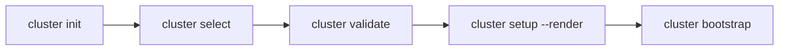

# openCenter (v0.0.1)

> Version: v0.0.1 • Language: Go 1.24 • Core libs: Cobra, Viper, text/template+Sprig, Godog • Tooling: mise


For detailed instructions on how to do local development refer to the [local development setup](docs/local-development.md).

### Prerequisites

- [podman](https://podman.io/get-started)/[orbstack](https://orbstack.dev/) installed and running
- [Mise](https://mise.jdx.dev/) for tool version management

### Initial Setup

#### 1. Install Mise

```bash
# macOS
brew install mise

# Linux
curl https://mise.run | sh

# Add to your shell profile
# or for fish
echo '' >> ~/.zshrc
# or for bash
echo 'eval "$(mise activate bash)"' >> ~/.bashrc
# or for zsh
echo 'eval "$(mise activate zsh)"' >> ~/.zshrc
```
A quick-start guide for local development with Go CLI tools, FluxCD, and Kubernetes using Kind and Mise.


#### 2. Install al tools and build the cli tool
```bash
mise install

mise tidy

mise build
```

There are more task available in the .mise.toml 

---

## 1) Purpose & Scope

**openCenter CLI** streamlines cluster bootstrapping by managing a *single, declarative cluster config* and turning it into a **GitOps working repository** that can be pushed to a remote. It aims to standardize how teams scaffold and validate Kubernetes/OpenStack-based environments while remaining provider-agnostic at the command layer.

### Primary goals
- **Configuration-first**: a grouped YAML becomes the single source of truth.
- **GitOps by default**: render embedded templates into a local repo (`gitops.git_dir`) and push to a remote (`gitops.git_url`).
- **Safe defaults** with **explicit validation** for common misconfigurations (e.g., VRRP vs Octavia).
- **UX & automation friendly**: interactive prompts on init/select, JSON Schema for IDE validation, and **Godog BDD** specs for regression tests and LLM-agent workflows.

### Non‑goals
- Directly provisioning cloud infrastructure (Terraform/Pulumi). The CLI produces a GitOps repo you can plug into your platform pipeline.
- Managing secrets in secure stores; secrets here are plain YAML unless you integrate something like SOPS/SealedSecrets outside the tool.

---

## 2) Personas & Usage Modes

- **Platform engineers** – author/edit cluster configs, validate invariants, render GitOps repos, push to a central Git service.
- **SREs/Operators** – view/inspect active cluster config, run preflight checks, use the shell `prompt` helper to show current context.
- **LLM agents** – consume JSON Schema for guardrails, Godog `.feature` files for acceptance criteria, and step templates for test execution.

---

## 3) High-Level Architecture

```
+-------------------------------+
|           User/CI             |
|  - CLI runner / BDD tests     |
+---------------+---------------+
                |
                v
+---------------+---------------+
|           Cobra Commands       |
|  cluster [list|select|info|...]|
+---------------+---------------+
                |
                v
+---------------+---------------+
|        Core Services           |
|  - Config (YAML, schema, val)  |
|  - GitOps (embed, render, git) |
|  - Cloud preflight (OpenStack) |
+---------------+---------------+
                |
                v
+---------------+---------------+
|          File System           |
| ~/.config/openCenter/*.yaml    |
| ~/.config/openCenter/active... |
| gitops.git_dir (repo)          |
+-------------------------------+
```

### Key Concepts
- **Config dir**: defaults to OS user config dir (e.g., `~/.config/openCenter`), overridable via `--config-dir` or `OPENCENTER_CONFIG_DIR`.
- **Cluster files**: one YAML per cluster (`<name>.yaml`).
- **Active cluster**: tracked by `active_cluster` file (just the name).
- **GitOps repo**: on `cluster setup`/`render`, embedded templates are materialized to `gitops.git_dir` and initialized as a git repo.
- **Prompt helper**: `openCenter prompt` prints `(openCenter:<name>)` when your shell is inside the configured `gitops.git_dir`.

---

## 4) Grouped YAML Model (Why & How)

Config keys are grouped for clarity and IDE ergonomics:

- `gitops.*` – local repo path, remote URL, and optional SSH key path
- `kubernetes.*` – counts, images, flavors, networking, Windows, and node roles
- `cloud.*` – `provider` (e.g., `openstack`), then provider-specific sections (e.g., `cloud.openstack.*`)

A **JSON Schema exporter** (`openCenter cluster schema`) emits a Draft 2020‑12 schema so editors can validate YAML and provide completions.

> **Invariant checks**: `openCenter cluster validate` enforces important cross-field rules (e.g., `use_octavia=false` requires `vrrp_ip`).

---

## 5) Command Surface & Flows

| Command | Purpose | Inputs | Output/Side Effects |
|---|---|---|---|
| `openCenter cluster` | Show help for cluster subcommands | — | Help text |
| `list` / `ls` | List clusters (file basenames) | `--config-dir` | Names from `*.yaml` |
| `select [name]` | Set active cluster (interactive if blank) | `name?` | Writes `active_cluster` |
| `current [-q]` | Print active cluster name | `-q` | stdout |
| `info [name]` | Print YAML of active or named cluster | `name?` | stdout YAML |
| `init [name]` | Create a new cluster YAML; interactive if no `name` | Prompts | `<name>.yaml` |
| `validate [name]` | Cross-field validation | `name?` | stdout warnings/errors |
| `preflight [name]` | Tooling/provider checks | `name?` | stdout checks |
| `setup [name] [--render]` | Copy or render embedded templates → `gitops.git_dir`, init git repo | `--render` | files + `.git` |
| `render [name]` | Render only `.tmpl` | `name?` | files |
| `bootstrap` | Commit & push to `gitops.git_url` | active cluster | `git push` |
| `schema [--out --pretty]` | JSON Schema export | path | file/stdout |
| `prompt` | Shell prompt helper | CWD | prints `(openCenter:<name>)` when in repo |

### Typical lifecycle



---

## 6) Rendering & GitOps

- Templates are **embedded** via `embed.FS` under `internal/gitops/templates/`.
- Rendering uses Go `text/template` + **Sprig** functions.
- Files with `.tmpl` are rendered; others are copied verbatim.
- `setup` will also ensure a Git repo is initialized and write an `.opencenter` context marker (used by `prompt`).

> **Example**: `KUSTOMIZATION.tmpl` will become `KUSTOMIZATION` with values from the cluster YAML (e.g., `{ .cluster_name }`, `{ .gitops.git_dir }` etc.).

---

## 7) Validation & Preflight

- **Validation** (`internal/config.Validate`) flags incompatible settings:
  - `kubernetes.networking.use_octavia=true` **incompatible** with `vrrp_enabled=true`
  - `use_octavia=false` requires `vrrp_ip`
  - `use_designate=true` requires `dns_zone_name`
  - Setting node counts requires corresponding flavors
  - `gitops.git_dir` must be set
- **Preflight** runs environment checks (presence of `git`, `kubectl`, `talosctl`, plus basic OpenStack hints). Provider-specific checks live under `internal/cloud/<provider>/` (OpenStack provided).

---

## 8) BDD with Godog (for humans & agents)

- `.feature` files in `features/` describe expected behavior.
- **Ready-to-run step suite** in `features/steps/`:
  - builds the CLI once per run,
  - isolates `~/.config/openCenter` via `OPENCENTER_CONFIG_DIR`,
  - provides steps to run commands, assert stdout, create clusters, modify YAML, and spin **bare Git remotes** for bootstrap tests.
- Run via `mise run bdd` (recommended, compiles with `go test`) or `mise run bdd:godog` (CLI).

---

## 9) Tooling via `mise`

` .mise.toml` pins Go and provides tasks:

- `build` – compile the binary
- `bdd` – run Godog tests via `go test`
- `bdd:godog` – run via the `godog` CLI
- `schema` – emit JSON Schema
- `preflight` / `validate` – convenience wrappers

---

## 10) Directory Structure (Authoritative)

```
openCenter-cli/
├─ cmd/                         # Cobra subcommands (cluster, schema, prompt, etc.)
│  ├─ cluster.go
│  ├─ cluster_list.go
│  ├─ cluster_select.go
│  ├─ cluster_current.go
│  ├─ cluster_info.go
│  ├─ cluster_init.go
│  ├─ cluster_validate.go
│  ├─ cluster_preflight.go
│  ├─ cluster_setup.go
│  ├─ cluster_render.go
│  └─ cluster_schema.go
│
├─ internal/
│  ├─ config/                   # YAML model, JSON Schema, validation, utilities
│  │  ├─ config.go
│  │  └─ schema.go
│  ├─ gitops/                   # Embedded templates, rendering, git helpers
│  │  ├─ embed.go
│  │  ├─ copy.go
│  │  └─ templates/
│  │     ├─ README.md
│  │     └─ KUSTOMIZATION.tmpl
│  └─ cloud/
│     └─ openstack/
│        └─ preflight.go
│
├─ features/                    # Acceptance specs for BDD
│  ├─ cluster.feature
│  ├─ gitops.feature
│  └─ steps/
│     ├─ helpers.go             # Build/run helpers, fs sandbox, git remote
│     └─ steps_test.go          # Godog suite integration
│
├─ docs/                        # Guides
│  ├─ USER_GUIDE.md
│  ├─ DEVELOPER.md
│  ├─ DIRECTORY_STRUCTURE.md
│  └─ SCHEMA.md
│
├─ schema/                      # Generated JSON Schemas (git-ignored)
├─ .mise.toml                   # Tool & tasks
├─ go.mod, main.go, README.md
```

> **Runtime state** (user machine): `~/.config/openCenter/` contains `active_cluster` and `*.yaml`. `gitops.git_dir` becomes a git repo with a `.opencenter` marker.

---

## 11) Extensibility Points

- **Add config keys**: extend `internal/config.NestedFields` (drives init prompts + schema), update `ClusterConfig` if you need typed access.
- **Add providers**: create `internal/cloud/<provider>/preflight.go` with a `Preflight(map[string]any) []string` function and branch in `cluster preflight`.
- **Add templates**: drop files under `internal/gitops/templates/`; use `.tmpl` for templating with Sprig helpers.
- **New commands**: add new `cmd/cluster_<name>.go` files and register under `clusterCmd` (or `rootCmd`).

---

## 12) Security Considerations

- Cluster YAML may hold **passwords** and **SSH keys** (paths). Files are written with mode **0600**.
- Prefer external secret management (SOPS, Vault, SealedSecrets) for long‑lived credentials.
- Git bootstrap uses your local git/SSH agent—ensure you trust the `gitops.git_url` destination and branch protections are configured upstream.

---

## 13) Error Handling & UX Notes

- Commands return non‑zero exit codes on failure (e.g., `validate` prints errors and exits non‑zero).
- Interactive prompts (init/select) use **bubbletea**; pass explicit names to avoid prompts in CI.
- `prompt` prints **nothing** if you’re not in the configured `gitops.git_dir`—safe for shells to call in `PS1`.

---

## 14) Environment & Configuration

- `--config-dir` flag or `OPENCENTER_CONFIG_DIR` env overrides default config path.
- Viper also respects `OPENCENTER_*` env for bound flags in the future if more persistent flags are added.
- YAML decoding is tolerant to unknown keys so you can evolve configs safely.

---

## 15) Data Lifecycle

1. **Authoring** — create or edit `<cluster>.yaml` under the config dir.
2. **Activation** — `select` writes `active_cluster` (name only).
3. **Materialization** — `setup --render` creates a working repo at `gitops.git_dir` with rendered manifests.
4. **Bootstrap** — `bootstrap` configures `origin` and pushes `main` to `gitops.git_url`.

---

## 16) Example Workflows

### A. First-time setup
```bash
mise install && go mod tidy && mise run build

./openCenter cluster init demo
./openCenter cluster select demo

# minimal network choice: use_octavia=false -> must set vrrp_ip
./openCenter cluster validate

./openCenter cluster setup --render
./openCenter cluster bootstrap
```

### B. IDE integration for YAML
```bash
./openCenter cluster schema --out schema/cluster.schema.json
# Point your editor's YAML plugin to schema/cluster.schema.json
```

### C. Run BDD regressions
```bash
mise run bdd          # uses go test
# or
mise run bdd:godog    # uses the godog CLI
```

---

## 17) Future Enhancements (roadmap ideas)

- [ ] **Cluster Deletion**: Implement `cluster delete` command.
- [ ] **Cluster Rename**: Implement `cluster rename` command.
- [ ] **AWS provider** preflight & config helpers.
- [ ] **Secrets**: SOPS-native support (encrypt on save / decrypt on read).
- [ ] **Plugins**: dynamic command discovery for providers, add-on modules.
- [ ] **CI templates**: GitHub Actions for build/test/schema artifact publish.

---
---

## Appendix A — Minimal YAML (illustrative)

```yaml
cluster_name: demo
gitops:
  git_dir: /tmp/opencenter-demo
  git_url: git@github.com:example/demo.git
kubernetes:
  ssh_user: ubuntu
  k8s_api_port: 443
  counts:
    master: 3
    worker: 5
  networking:
    use_octavia: true
    subnet_nodes: 10.0.0.0/16
cloud:
  provider: openstack
  openstack:
    auth_url: https://keystone.example.com/v3
    region: RegionOne
```

## Appendix B — Validation Rules (selected)

- `use_octavia=true` **and** `vrrp_enabled=true` → **error**
- `use_octavia=false` **and** `vrrp_ip` empty → **error**
- `use_designate=true` **and** `dns_zone_name` empty → **error**
- Node counts > 0 require corresponding flavors
- `gitops.git_dir` must be set

---

*Document updated on 2025-09-07.*

---
