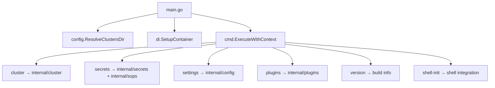

# openCenter CLI — Codemaps Index

**Last Updated:** 2026-05-19  
**Module:** `github.com/opencenter-cloud/opencenter-cli`  
**Language:** Go 1.23+  
**Entry Point:** `main.go` → `cmd.ExecuteWithContext()`

## Architecture Overview

## Codemaps

| Codemap | Scope | Key Packages |
|---------|-------|--------------|
| [CLI Commands](cli-commands.md) | Command tree, flags, registration | `cmd/` |
| [Config System](config-system.md) | Loading, validation, schema, types | `internal/config/`, `internal/config/v2/` |
| [GitOps Engine](gitops-engine.md) | Generation pipeline, templates, rendering | `internal/gitops/` |
| [Cluster Lifecycle](cluster-lifecycle.md) | Init, validate, setup, bootstrap, destroy | `internal/cluster/` |
| [Secrets Management](secrets-management.md) | Rotation, registry, sync, hooks, SOPS | `internal/secrets/`, `internal/sops/` |
| [Providers](providers.md) | Cloud provider abstraction, drift detection | `internal/cloud/` |
| [DI Container](di-container.md) | Dependency injection, service wiring | `internal/di/` |

## Package Map (all `internal/`)

| Package | Purpose | Codemap |
|---------|---------|---------|
| `ansible` | Kubespray inventory generation | [Cluster Lifecycle](cluster-lifecycle.md) |
| `barbican` | OpenStack Key Manager client | [Secrets](secrets-management.md) |
| `cloud` | Provider abstraction + drift detection | [Providers](providers.md) |
| `cluster` | Lifecycle domain services | [Cluster Lifecycle](cluster-lifecycle.md) |
| `config` | CLI settings management (`cli_settings.go`) | [Config System](config-system.md) |
| `config/v2` | Authoritative config pipeline (loader, validator, manager, cache, errors, io_handler, constants) | [Config System](config-system.md) |
| `config/defaults` | Provider-region defaults hydration | [Config System](config-system.md) |
| `config/flags` | CLI flag parsing + path-based mutation | [Config System](config-system.md) |
| `config/overlay` | GitOps overlay customization types | [Config System](config-system.md) |
| `config/persistence` | Path resolution for on-disk storage | [Config System](config-system.md) |
| `config/registry` | Config type registry | [Config System](config-system.md) |
| `config/services` | Typed service configs + validation | [Config System](config-system.md) |
| `config/v2schema` | JSON Schema generator for IDE support | [Config System](config-system.md) |
| `config/validation` | Shared validation utilities | [Config System](config-system.md) |
| `core/paths` | Path resolution, caching, identifier parsing | [Config System](config-system.md) |
| `core/validation` | Shared validation engine with pluggable validators | [Config System](config-system.md) |
| `credentials` | Cloud credential extraction | [Providers](providers.md) |
| `di` | Dependency injection | [DI Container](di-container.md) |
| `gitops` | GitOps repo generation | [GitOps Engine](gitops-engine.md) |
| `importer` | Live cluster import/scan | [Cluster Lifecycle](cluster-lifecycle.md) |
| `localdev` | Local dev environment (Kind, Gitea, Flux) | [Providers](providers.md) |
| `logging` | Structured logging (global logger, reconfiguration) | [DI Container](di-container.md) |
| `observability` | Log shipping, migration helpers | [DI Container](di-container.md) |
| `operations` | Drift detection, backup, disaster recovery | [Providers](providers.md) |
| `plugins` | External CLI plugin discovery | [CLI Commands](cli-commands.md) |
| `provision` | Embedded provisioning templates | [Cluster Lifecycle](cluster-lifecycle.md) |
| `resilience` | Retry, circuit breaker, distributed locks | [Cluster Lifecycle](cluster-lifecycle.md) |
| `secrets` | Multi-cluster secrets lifecycle | [Secrets](secrets-management.md) |
| `security` | Audit logging, input validation, command sanitization | [DI Container](di-container.md) |
| `services` | Platform service plugin registry | [Config System](config-system.md) |
| `sops` | SOPS encryption/decryption, Age key management | [Secrets](secrets-management.md) |
| `template` | Template engine with caching and sandboxing | [GitOps Engine](gitops-engine.md) |
| `testenv` | Test environment helpers | — (internal tooling) |
| `testing` | Unified test utilities | — (internal tooling) |
| `tofu` | OpenTofu/Terraform execution | [Cluster Lifecycle](cluster-lifecycle.md) |
| `ui` | Prompts, error formatting, guided flows | [CLI Commands](cli-commands.md) |
| `util` | Files, errors, crypto, security, metrics | — (shared utilities) |

## Cross-Cutting Concerns

- **Security**: `internal/security` provides audit logging, credential masking, input validation, and command sanitization used across all packages.
- **File I/O**: `internal/util/fs.FileSystem` interface abstracts all disk operations for testability.
- **Path Resolution**: `internal/core/paths.PathResolver` provides consistent cluster path resolution. `core/paths/identifier.go` handles cluster identifier parsing.
- **Validation**: `internal/core/validation.ValidationEngine` is the shared validation framework with pluggable validators.
- **Logging**: `internal/logging` provides the global structured logger with level/format reconfiguration. `internal/observability` adds log shipping (Loki, syslog).
