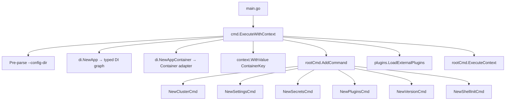

# CLI Commands Codemap

**Last Updated:** 2026-05-19  
**Entry Point:** `cmd/root.go` → `Execute()`  
**Package:** `cmd`

## Command Tree

```
opencenter (rootCmd)
├── cluster                         Manage cluster configurations
│   ├── list                        List configured clusters
│   ├── use [name]                  Set the active cluster
│   ├── active                      Show the active cluster
│   ├── env [name]                  Export cluster environment variables
│   ├── status [name]              Show cluster status
│   ├── sync-status [name]         Sync service status from live cluster
│   ├── describe [name]            Describe cluster config, paths, locks, state
│   ├── init [name]                Initialize a new cluster configuration
│   ├── configure [name]           Guided cluster configuration
│   ├── edit [name]                Edit config in preferred editor
│   ├── set [cluster] <path=val>   Set fields in cluster config
│   ├── normalize [name]           Add missing default fields
│   ├── export [name]              Export effective configuration
│   ├── validate [name]            Validate cluster configuration
│   ├── validate-manifests [name]  (hidden) Validate generated GitOps manifests
│   ├── doctor [name]              Check tools, credentials, provider readiness
│   ├── generate [name]            Generate GitOps repository
│   ├── template                   (hidden) Generate complete config template
│   ├── deploy [name]              Deploy a cluster
│   ├── destroy [name]             Destroy a cluster
│   ├── rotate-keys [name]         Rotate encryption keys (alias for secrets keys rotate)
│   ├── check-keys [name]          Check key expiration (alias for secrets keys check)
│   ├── revoke-key [name]          Revoke encryption keys (alias for secrets keys revoke)
│   ├── service                    Manage cluster services
│   │   ├── enable <svc>           Enable a service
│   │   ├── disable <svc>          Disable a service
│   │   ├── status                 Display service states
│   │   └── options <svc>          Show service config options
│   ├── drift                      Infrastructure drift operations
│   │   ├── detect [cluster]       Detect drift
│   │   ├── reconcile [cluster]    Reconcile drift
│   │   └── schedule [cluster]     Schedule periodic detection
│   ├── backup                     Cluster backup operations
│   │   ├── create [cluster]       Create backup
│   │   ├── restore <id>           Restore from backup
│   │   ├── list [cluster]         List backups
│   │   ├── delete <id>            Delete backup
│   │   └── schedule [cluster]     Schedule periodic backups
│   ├── lock [name]                Lock cluster
│   ├── unlock [name]              Unlock cluster
│   ├── import                     Import running clusters
│   │   ├── scan                   Scan GitOps repo
│   │   ├── report                 Render import artifact
│   │   └── apply                  Create/patch configs from artifact
│   └── migrate-layout --org <o>   Migrate legacy files to secure layout
├── secrets                         Manage secrets across backends
│   ├── login                       Create/refresh Keystone token
│   ├── list                        List secrets for current cluster
│   ├── describe <name>             Show secret metadata
│   ├── get <name>                  Download and decrypt a secret
│   ├── set <name>                  Create or update a secret
│   ├── delete <name>               Delete a secret
│   ├── sync [cluster]              Sync secrets to encrypted manifests
│   ├── validate [cluster]          Validate secrets for drift
│   ├── encrypt                     Encrypt secrets in YAML files
│   ├── decrypt                     Decrypt secrets in YAML files
│   ├── status                      Show encryption status
│   └── keys                        Manage SOPS encryption keys
│       ├── generate                Generate new Age key pair
│       ├── rotate                  Rotate encryption keys
│       ├── backup                  Backup Age keys
│       ├── validate                Validate key/SOPS setup
│       ├── check                   Check key expiration
│       └── revoke                  Revoke keys
├── settings                        Manage CLI settings
│   ├── view                        Display current settings
│   ├── set <key> <value>           Set a value (dot notation)
│   ├── get <key>                   Get a value
│   ├── reset                       Reset to defaults
│   ├── path                        Show settings file path
│   ├── edit                        Edit settings in editor
│   ├── explain                     Explain config effects
│   │   └── cluster-defaults        Show cluster_defaults application
│   └── ide                         Generate v2 schema + editor setup
├── plugins                         Manage plugins
│   └── list                        List discovered external plugins
├── version                         Display version and build info
└── shell-init                      Output shell integration script
```

## Global Flags

| Flag | Type | Default | Env Var | Description |
|------|------|---------|---------|-------------|
| `--config-dir` | string | `""` | `OPENCENTER_CONFIG_DIR` | Configuration directory |
| `--log-level` | string | `"warn"` | `OPENCENTER_LOG_LEVEL` | debug/info/warn/error |
| `--output` | string | `"text"` | — | Output format: text/json/yaml |
| `--quiet` | bool | `false` | — | Suppress nonessential output |
| `--yes` | bool | `false` | — | Auto-confirm prompts |
| `--dry-run` | bool | `false` | — | Preview without writing |

## Registration Flow



## Key Patterns

- **Cluster name resolution**: Commands accept optional `[name]` positional arg. Falls back to active cluster via `resolveClusterNameForCommand()`. Supports `org/cluster` format.
- **Lock management**: Destructive ops (deploy, destroy) acquire cluster locks via `AcquireLockWithPrompt()`.
- **Backend routing (secrets)**: `resolveBackend()` reads `secrets.backend` from config → routes to barbican/sops/file.
- **External plugins**: Scans `OPENCENTER_PLUGINS_DIR`, `<config-dir>/plugins`, and `PATH` for `opencenter-*` binaries.
- **Read-only annotation**: Commands marked with `markReadOnlyCommand(cmd)` reject `--dry-run`.

## Key Files

| File | Responsibility |
|------|---------------|
| `root.go` | Root command, global flags, DI setup, plugin loading |
| `cluster.go` | Cluster parent command, subcommand registration |
| `cluster_deploy.go` | Deploy command (no longer auto-commits to GitOps repo) |
| `cluster_deploy_plan.go` | Deploy dry-run plan formatting |
| `cluster_sync_status.go` | Sync service status from live cluster |
| `cluster_template.go` | (hidden) Generate complete config template |
| `cluster_rotate_keys.go` | Rotate encryption keys (cluster-level alias) |
| `cluster_check_keys.go` | Check key expiration (cluster-level alias) |
| `cluster_revoke_key.go` | Revoke encryption keys (cluster-level alias) |
| `cluster_status_inventory.go` | Node/network inventory from OpenTofu state + live cluster |
| `cluster_validate_manifests.go` | (hidden) Validate generated GitOps manifests |
| `config.go` | Settings command (Cobra Use: "settings") |
| `secrets.go` | Secrets parent + CRUD subcommands |
| `secrets_keys.go` | Key lifecycle subcommands |
| `secrets_keys_ops.go` | Key operations (generate, rotate, backup, validate) |
| `secrets_sync.go` | Secrets sync command |
| `secrets_sops.go` | Encrypt/decrypt/status commands |
| `secrets_sops_helpers.go` | SOPS encryption/decryption helper functions |
| `secrets_file_backend.go` | File-based secrets backend (config-mapped catalog) |
| `secrets_router.go` | Backend routing logic |
| `secrets_helpers.go` | Shared secrets helper functions |
| `plugins.go` | Plugins parent + list |
| `global_options.go` | GlobalOptions struct, parsing |
| `config_helpers.go` | Shared config loading utilities |
| `output_helpers.go` | Output formatting helpers (JSON/YAML/text) |
| `provider_availability.go` | Provider availability check (planned vs supported) |

## Dependencies

- `internal/di` — App and Container for service resolution
- `internal/config` — ConfigurationManager, paths, types
- `internal/config/v2` — Config struct, ConfigLoader
- `internal/cluster` — InitService, ValidateService, SetupService, BootstrapService
- `internal/secrets` — SecretsManager, KeyRegistry
- `internal/sops` — SOPSManager, Encryptor
- `internal/cloud/kind` — Kind provider for deploy/destroy
- `internal/security` — CommandRunner, AuditLogger
- `internal/ui` — Guided prompts, error formatting
- `internal/plugins` — External plugin discovery
- `internal/core/paths` — PathResolver
