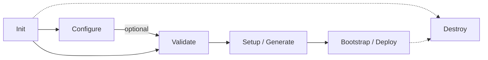

# Cluster Lifecycle Codemap

**Last Updated:** 2026-05-19  
**Entry Point:** `internal/cluster/` service types  
**Package:** `internal/cluster`

## Lifecycle Flow



## Services

| Service | File | CLI Command | Purpose |
|---------|------|-------------|---------|
| `InitService` | `init_service.go` | `cluster init` | Create config YAML, generate keys, create dirs |
| `ConfigureService` | `configure_service.go` | `cluster configure` | Interactive guided config with provider discovery |
| `ValidateService` | `validate_service.go` | `cluster validate` | Schema + business + connectivity validation |
| `SetupService` | `setup_service.go` | `cluster generate` | Generate GitOps repo via pipeline |
| `BootstrapService` | `bootstrap_service.go` | `cluster deploy` | Provision infrastructure + deploy cluster |
| `DestroyProvider` | `destroy_provider.go` | `cluster destroy` | Provider-specific teardown |

## Init Service

**Input:** `InitOptions` (name, org, provider, key gen flags)  
**Output:** `InitResult` (config path, keys generated)

Steps:
1. Resolve paths via `PathResolver`
2. Create directory structure (org dir, secrets dir, state dir)
3. Generate SSH key pair (`util/crypto`)
4. Generate SOPS Age key pair (`sops.KeyManager`)
5. Create config YAML via `v2.NewV2Default()` + defaults
6. Initialize git repo with pre-commit hooks
7. Write `.sops.yaml` configuration

## Configure Service

**Input:** `ConfigureOptions` (identifier, org, provider)  
**Output:** `ConfigureResult` (created, config, paths)

Steps:
1. Discover provider resources (OpenStack: catalog of images, flavors, networks, AZs)
2. Run guided prompts via `orchestration.PromptRunner`
3. Accumulate config patches in `changeReview`
4. Apply patches to config YAML
5. Write managed files (SSH keys, credentials)

**Capability handlers** (run after provider flow):
- `configure_git_auth.go` — Git authentication (SSH key or HTTPS token)
- `configure_dns.go` — DNS provider for cert-manager (Designate/Route53/Cloudflare)
- `configure_storage.go` — Object storage for Loki/Tempo (Swift/S3 credentials)

## Validate Service

**Input:** `ValidateOptions` (mode: online/offline, provider checks)  
**Output:** `ValidationResult` (valid, errors, warnings, issues)

Steps:
1. Load config via `v2.ConfigLoader` (validates schema on load)
2. Run `ValidateReadiness` business rules
3. If online mode: connectivity checks (OpenStack auth URL, API endpoints)
4. If provider checks: validate catalog (images exist, flavors available, networks reachable)
5. Aggregate results with severity levels

## Setup Service

**Input:** `SetupOptions` (dry run, skip validation)  
**Output:** `SetupResult` (gitops path, manifest count)

Steps:
1. Load and validate config
2. Invoke `gitops.PipelineGenerator.Generate()` (see [GitOps Engine](gitops-engine.md))
3. Run `ManifestValidator` on generated output
4. Run `ScanGitOpsSecrets` security scan
5. Encrypt overlay files via `sops.SOPSManager`

## Bootstrap Service

**Input:** `BootstrapOptions` (timeout, dry run, restart, step filter)  
**Output:** `BootstrapResult` (infra provisioned, cluster deployed, endpoint, duration)

Steps:
1. Build provider-specific step list (see provider routing below)
2. Load/create bootstrap state (JSON file for resume)
3. Execute steps sequentially with state persistence
4. Wait for cluster readiness via kubectl
5. Install FluxCD if configured

**Provider routing** (`buildBootstrapSteps`):
- **OpenStack**: `bootstrap_provider_infra.go` → opentofu init/plan/apply → kubespray → wait ready
- **VMware/vSphere**: `bootstrap_provider_infra.go` → opentofu init/plan/apply → kubespray → wait ready (validates vSphere credentials + bastion SSH)
- **Baremetal**: `bootstrap_provider_infra.go` → opentofu init/plan/apply → kubespray → wait ready (validates static node connectivity)
- **Kind**: `kind_bootstrap_provider.go` → kind create cluster → wait ready
- **AWS/GCP/Azure**: Generic make terraform → terraform init → terraform apply

**Note:** VMware, Baremetal, and OpenStack all share the `openstackBootstrapProvider` implementation in `bootstrap_provider_infra.go`. The provider-specific differences are handled via `buildProviderBootstrapEnvironment()` which extracts credentials and validates prerequisites per provider.

**Network plugin install** (`openstack_network_plugin.go`): After infrastructure provisioning, the bootstrap installs the selected CNI (Calico, Cilium, or Kube-OVN) via Helm or Kustomize+Helm, then waits for readiness.

**FluxCD bootstrap** (`openstack_flux_bootstrap.go`): Runs `flux bootstrap` for GitHub/GitLab/Gitea with token from config or file.

**GitOps push** (`openstack_gitops_push.go`): Pushes generated manifests to the remote GitOps repository with authenticated URL.

**Resume support:** Each step's state is persisted to `bootstrap-state.json`. On `--restart`, resumes from last incomplete step.

**Deploy no longer auto-commits:** As of May 2026, `cluster deploy` no longer automatically commits to the GitOps repository.

## Destroy

**Interface:** `lifecycleDestroyProvider`

Provider-specific implementations:
- **OpenStack**: `openstack_destroy_provider.go` — opentofu destroy
- **Kind**: delegates to `cloud/kind.DeleteCluster()`

## Supporting Packages

| Package | Role in Lifecycle |
|---------|------------------|
| `internal/ansible` | Generates Kubespray inventory from config |
| `internal/tofu` | Executes OpenTofu/Terraform commands (falls back to `terraform` if `tofu` not on PATH) |
| `internal/provision` | Embedded provisioning templates |
| `internal/cloud/kind` | Kind cluster create/delete/wait |
| `internal/cloud/vmware` | VMware/vSphere drift detection and state |
| `internal/resilience` | Distributed locks for deploy/destroy |
| `internal/importer` | Scans live clusters for import |
| `internal/cluster/orchestration` | Provider registry, capability registry, prompt runner |

## Key Types

```go
type InitOptions struct {
    Name, Org, Provider string
    NoKeygen, NoSopsKeygen, RegenerateKeys, Force bool
    ServerPools []string
}

type BootstrapOptions struct {
    Timeout time.Duration
    DryRun, Restart, ConfirmCommit, BreakLock bool
    Step, FromStep string  // step filtering for partial runs
}

type ValidationResult struct {
    Valid    bool
    Errors   []ValidationIssue
    Warnings []ValidationIssue
    Issues   []ValidationIssue
}
```

## Dependencies

- `internal/config` — CLI settings, path helpers
- `internal/config/v2` — Config, ConfigLoader, ConfigurationManager, ValidateReadiness
- `internal/config/defaults` — Registry for default values
- `internal/config/services` — Provider registry
- `internal/core/paths` — PathResolver, ClusterPaths
- `internal/core/validation` — ValidationEngine
- `internal/gitops` — PipelineGenerator, ManifestValidator
- `internal/sops` — KeyManager, SOPSManager
- `internal/security` — CommandRunner
- `internal/util/crypto` — SSH/Age key generation
- `internal/cloud/openstack` — DiscoveryClient for configure flow
- `internal/cloud/vmware` — VMware provider for drift/state
- `internal/logging` — Structured logging

## Related Areas

- [Config System](config-system.md) — config loading and validation
- [GitOps Engine](gitops-engine.md) — invoked by SetupService
- [Secrets](secrets-management.md) — key generation during init
- [Providers](providers.md) — provider-specific bootstrap/destroy logic
