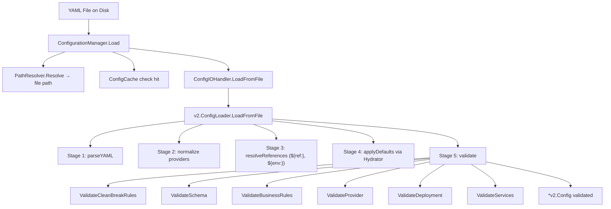
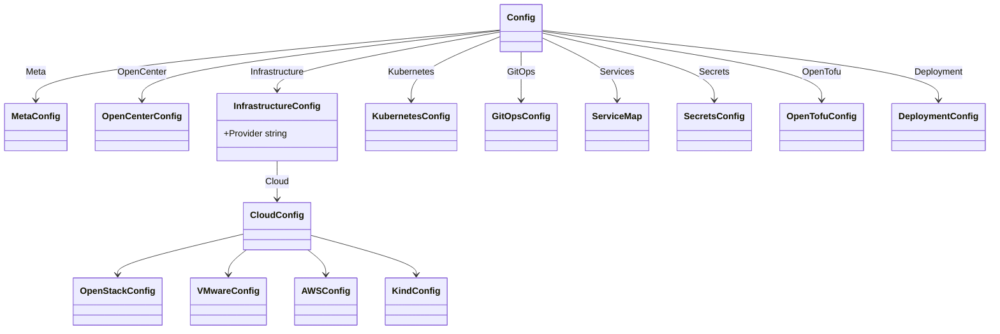

# Config System Codemap

**Last Updated:** 2026-05-19  
**Entry Point:** `internal/config/v2/manager.go` → `ConfigurationManager`  
**Packages:** `internal/config`, `internal/config/v2`, `internal/config/defaults`, `internal/config/flags`, `internal/config/services`

## Architecture

## Package Structure

The config system was consolidated in May 2026. The legacy monolithic `internal/config/` package (types, builder, resolver, cache, etc.) was removed. The remaining structure:

### `internal/config/` — CLI Settings Only

Only 6 files remain at the top level:

| File | Purpose | Key Exports |
|------|---------|-------------|
| `cli_settings.go` | CLI user preferences management | `ConfigManager` — Load, Save, SetValue, GetValue, Validate, Reset |
| `cli_settings_helpers.go` | Path resolution from CLI config | `ResolveClustersDir()`, `GetGitOpsDir()`, `GetSecretsDir()`, `GetStateDir()` |
| `manager.go` | Global manager singleton | `getGlobalManager()` |
| `persistence.go` | Config/state directory resolution | `ResolveConfigDir()`, `ResolveStateDir()`, `ParseClusterIdentifier()` |
| `status.go` | Cluster status updates | `UpdateStatus()` |
| `doc.go` | Package documentation | — |

### `internal/config/v2/` — Authoritative Config Pipeline

| File | Purpose | Key Exports |
|------|---------|-------------|
| `config.go` | Root config struct definition | `Config` (all nested types) |
| `infrastructure.go` | Infrastructure types (OpenStack, VMware, AWS, Kind, Baremetal) | `InfrastructureConfig`, `CloudConfig` |
| `cluster.go` | Cluster-level types | `ClusterConfig`, `KubernetesConfig` |
| `deployment.go` | Deployment method types | `DeploymentConfig`, `KamajiConfig` |
| `services.go` | Service map YAML marshaling | `ServiceMap` custom marshal/unmarshal |
| `loader.go` | 5-stage config loading pipeline | `ConfigLoader` — LoadFromFile, LoadFromBytes, SaveToFile |
| `manager.go` | High-level config lifecycle | `ConfigurationManager` — Load, Save, List, Delete, GetActive, SetActive, ClearCache |
| `cache.go` | In-memory config cache with TTL | `ConfigCache` — Get, Set, Clear, Invalidate, Size |
| `constants.go` | Shared constants | Config file naming, schema versions |
| `errors.go` | Typed config errors | `ConfigNotFoundError`, `NewValidationError`, `NewFileError`, `NewParseError` |
| `io_handler.go` | YAML I/O with atomic writes | `ConfigIOHandler` — LoadFromFile, SaveToFile, MarshalConfig, ValidateConfig |
| `validator.go` | Multi-stage validation | `Validator` — Validate, ValidateSchema, ValidateBusinessRules, ValidateProvider |
| `defaults.go` | Default config factory + full template | `NewV2Default()`, `RenderFullTemplateYAML()` |
| `resolver.go` | Cross-reference resolution | `ReferenceResolver` — resolves `${path.to.field}` with cycle detection |
| `provider.go` | Provider detection and validation | `GetProvider()`, `GetProviderName()`, `canonicalInfrastructureProvider()` |
| `readiness.go` | Deploy-readiness validation | `ValidateReadiness()` — checks secrets, git auth, provider config |
| `deployment_validator.go` | Deployment method validation | `ValidateCompatibility()`, `ValidateKamajiWorkerPool()` |
| `helpers.go` | Config accessor helpers | `ClusterName()`, `Provider()`, `GitOps()`, credential getters |

### `internal/config/defaults/` — Provider-Region Defaults

| File | Purpose |
|------|---------|
| `registry.go` | Global defaults registry | 
| `hydrator.go` | Applies defaults to empty fields |
| `openstack.go` | OpenStack region defaults (DFW3, SJC3, IAD3, ORD1) |
| `aws.go` | AWS region defaults (us-east-1, us-west-2, eu-west-1) |
| `gcp.go` | GCP region defaults |
| `export.go` | Effective config export with applied defaults |

### `internal/config/flags/` — CLI Flag Processing

Advanced flag parsing for `cluster set` and `cluster init`:

| File | Purpose |
|------|---------|
| `integration.go` | Main entry: `ProcessFlags()`, `ProcessFlagsWithValidation()` |
| `parser.go` | Flag routing to handlers |
| `reflection_engine.go` | Struct field mutation via reflection |
| `enhanced_flag_processor.go` | Orchestrates flag processing pipeline |
| `configuration_merger.go` | Merges multiple config sources |
| `template_processor.go` | Template variable resolution in flags |
| `security_flag_handler.go` | Sensitive value masking |
| `sops_integration.go` | SOPS-encrypted config loading |
| `output_formatter.go` | Diff/dry-run output |

### `internal/config/services/` — Service Configuration

| File | Purpose |
|------|---------|
| `base.go` | `BaseConfig` (Enabled, Namespace, Source, AdoptionMode) |
| `provider_registry.go` | Service-to-provider compatibility matrix |
| `provider_validator.go` | Validates service provider selections |
| `dependency_validator.go` | Service dependency graph validation |
| `secrets_validator.go` | Required secrets per service |

### Other Config Subpackages

| Package | Purpose |
|---------|---------|
| `config/v2schema/` | JSON Schema generator for IDE support (`Generate()`, `CheckFile()`) |
| `config/validation/` | Shared validators (`IsValidUUID`, `IsValidIP`, `IsValidCIDR`, `IsValidURL`, `SubnetsOverlap`) |
| `config/overlay/` | GitOps overlay customization types (`UnitsConfig`, `SOPSGenerationConfig`, `CustomerManagedConfig`) |
| `config/cache/` | Named cache utilities (`NewNamedCache`, `NewDefaultsCache`) |
| `config/persistence/` | Path resolution + YAML serialization (`ResolveConfigDir`, `MarshalYAML`, `UnmarshalYAML`) |
| `config/registry/` | Config type registry (`RegisterServiceConfig`, `GetServiceConfigType`, `IsRegistered`) |

### `internal/config/services/` — Per-Service Config Types

All services embed `BaseConfig` (Enabled, Namespace, Source, Image, AdoptionMode, HasOverrideValues):

| File | Service | Key Config Fields |
|------|---------|-------------------|
| `calico.go` | Calico | Mode, VXLAN, BGP, eBPF |
| `cilium.go` | Cilium | Mode, Hubble, BPF |
| `kube_ovn.go` | Kube-OVN | Mode, VLAN |
| `cert_manager.go` | cert-manager | Issuers, DNS providers |
| `keycloak.go` | Keycloak | Realm, clients, OIDC |
| `loki.go` | Loki | Storage backend, retention |
| `tempo.go` | Tempo | Storage, sampling |
| `prometheus_stack.go` | kube-prometheus-stack | Retention, alerting |
| `harbor.go` | Harbor | Storage, TLS |
| `velero.go` | Velero | Backup provider, schedule |
| `longhorn.go` | Longhorn | Replicas, storage class |
| `metallb.go` | MetalLB | Address pools |
| `gateway.go` | Gateway API | Routes, TLS |
| `headlamp.go` | Headlamp | OIDC, plugins |
| `opentelemetry.go` | OpenTelemetry | Collectors, exporters |
| `vsphere_csi.go` | vSphere CSI | Datastore, storage policy |
| `etcd_backup.go` | etcd-backup | Schedule, retention |
| `alert_proxy.go` | Alert Proxy | Endpoints, routing |

## Type Hierarchy (v2)

## Data Flow

1. **CLI** calls `ConfigurationManager.Load(ctx, "org/cluster")`
2. **PathResolver** maps name → `~/.config/opencenter/clusters/org/.cluster-config.yaml`
3. **ConfigCache** checks for cached version (invalidated on file mtime change)
4. **ConfigIOHandler** delegates to `v2.ConfigLoader` 5-stage pipeline
5. **Hydrator** fills empty fields from provider-region defaults
6. **Validator** runs schema + business + provider + deployment + services checks
7. **Validated Config** returned and cached

## Path Resolution (`internal/core/paths/`)

| File | Purpose |
|------|---------|
| `resolver.go` | `PathResolver` — Resolve, ResolveWithFallback, CreateClusterDirectories |
| `strategies.go` | `OrgBasedStrategy` — organization-based path layout |
| `cache.go` | `PathCache` — LRU cache with TTL for resolved paths |
| `identifier.go` | Cluster identifier parsing (org/name format) |
| `secure.go` | Path validation (traversal prevention, symlink checks) |
| `types.go` | Path types, resolution options |

## Related Areas

- [CLI Commands](cli-commands.md) — `settings` command manages CLI config
- [Cluster Lifecycle](cluster-lifecycle.md) — `InitService` creates configs via defaults
- [GitOps Engine](gitops-engine.md) — reads validated config for template rendering
