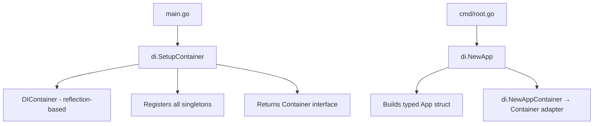
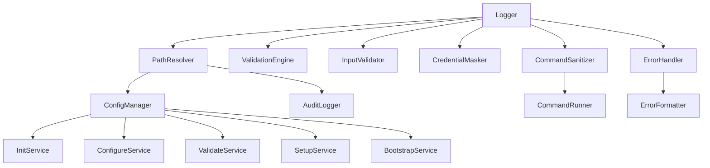

# DI Container Codemap

**Last Updated:** 2026-05-11  
**Entry Point:** `internal/di/setup.go` → `SetupContainer()`  
**Package:** `internal/di`

## Architecture



Two approaches coexist:
1. **`App` struct** (preferred) — explicit constructor chaining, type-safe
2. **`DIContainer`** (legacy) — reflection-based, resolves by parameter types

## Key Types

### Container Interface

```go
type Container interface {
    Register(name string, constructor interface{}) error
    Resolve(name string) (interface{}, error)
    ResolveAs(name string, target interface{}) error
    Singleton(name string, constructor interface{}) error
    Initialize() error
    Shutdown() error
}
```

### App Struct (Typed DI)

```go
type App struct {
    ErrorHandler      *util.ErrorHandler
    FileSystem        fs.FileSystem
    PathResolver      *paths.PathResolver
    Logger            *logrus.Logger
    ConfigManager     *config.ConfigurationManager
    ValidationEngine  *validation.ValidationEngine
    ErrorFormatter    *ui.ErrorFormatter
    AuditLogger       security.AuditLogger
    InputValidator    *security.InputValidator
    CredentialMasker  *security.CredentialMasker
    CommandSanitizer  *security.CommandSanitizer
    CommandRunner     security.CommandRunner
    InitService       *cluster.InitService
    ConfigureService  *cluster.ConfigureService
    ValidateService   *cluster.ValidateService
    SetupService      *cluster.SetupService
    BootstrapService  *cluster.BootstrapService
}
```

## Provider Functions

| Function | Returns | Purpose |
|----------|---------|---------|
| `ProvideLogger()` | `*logrus.Logger` | Structured logging |
| `ProvidePathResolver(baseDir)` | `*paths.PathResolver` | Cluster path resolution |
| `ProvideConfigManager()` | `*config.ConfigurationManager` | Config loading/saving |
| `ProvideValidationEngine()` | `*validation.ValidationEngine` | Registers all validators |
| `ProvideAuditLogger()` | `security.AuditLogger` | HMAC-signed audit log |
| `ProvideInputValidator()` | `*security.InputValidator` | User input sanitization |
| `ProvideCredentialMasker()` | `*security.CredentialMasker` | Log credential masking |
| `ProvideCommandSanitizer()` | `*security.CommandSanitizer` | Shell command sanitization |
| `ProvideCommandRunner()` | `security.CommandRunner` | Safe command execution |
| `ProvideInitService()` | `*cluster.InitService` | Cluster initialization |
| `ProvideValidateService()` | `*cluster.ValidateService` | Config validation |
| `ProvideConfigureService()` | `*cluster.ConfigureService` | Guided configuration |
| `ProvideSetupService()` | `*cluster.SetupService` | GitOps generation |
| `ProvideBootstrapService()` | `*cluster.BootstrapService` | Cluster deployment |

## Validation Engine Registration

`ProvideValidationEngine()` registers these validators:
- `ClusterNameValidator` — name format rules
- `OrganizationNameValidator` — org name rules
- `ConfigValidator` — structural config validation
- `FileValidator` — file existence/permission checks
- `SecurityValidator` — security policy enforcement

## Dependency Graph



## DIContainer (Reflection-Based)

- Automatic dependency resolution by matching constructor parameter types
- Circular dependency detection via `initOrder` tracking
- Thread-safe with `sync.RWMutex`
- Singleton caching (lazy initialization on first resolve)
- Graceful shutdown calling `Shutdown()` on components that implement it

## Usage in Commands

```go
// Preferred: typed access via App
app := cmd.GetApp(ctx)
result, err := app.InitService.Init(ctx, opts)

// Legacy: interface-based access via Container
container := cmd.GetContainer(ctx)
svc, _ := container.Resolve("initService")
```

## Security Components

| Component | Package | Purpose |
|-----------|---------|---------|
| `AuditLogger` | `internal/security` | HMAC-signed tamper-evident audit log |
| `InputValidator` | `internal/security` | Validates/sanitizes user input |
| `CredentialMasker` | `internal/security` | Masks secrets in log output |
| `CommandSanitizer` | `internal/security` | Prevents command injection |
| `CommandRunner` | `internal/security` | Executes shell commands safely |

## Observability (`internal/observability/`)

- Structured logging with credential masking
- Log shipping configuration
- Migration utilities for log format changes

## Related Areas

- [CLI Commands](cli-commands.md) — commands resolve services from container
- [Cluster Lifecycle](cluster-lifecycle.md) — lifecycle services are DI-managed
- [Config System](config-system.md) — ConfigManager is a DI singleton
