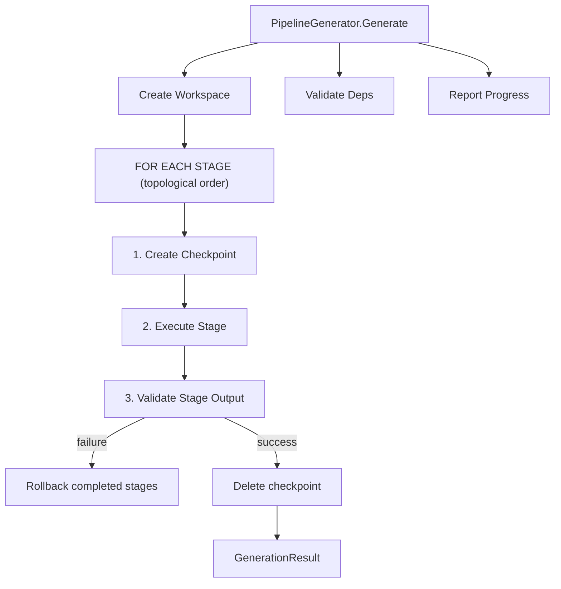
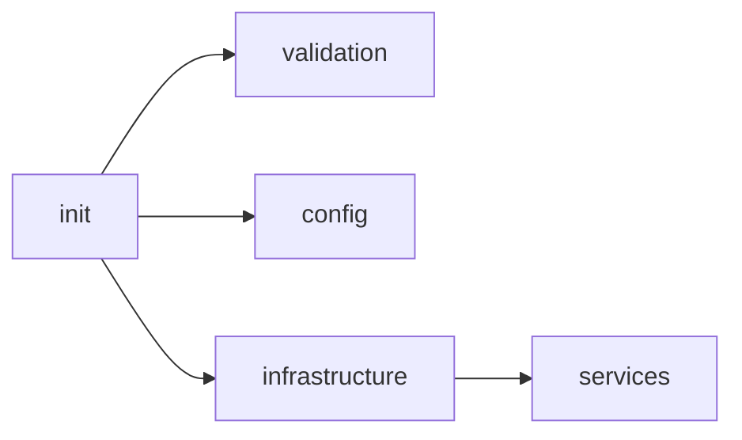
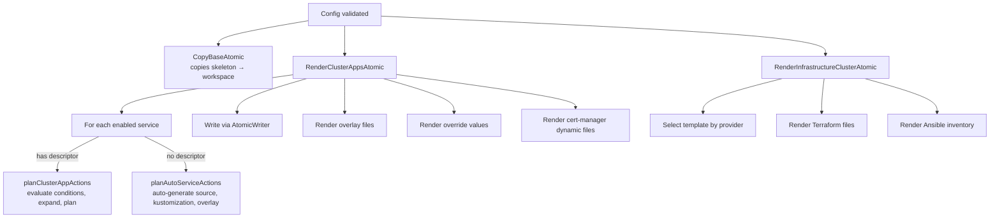

# GitOps Engine Codemap

**Last Updated:** 2026-05-19  
**Entry Point:** `internal/gitops/pipeline.go` → `PipelineGenerator`  
**Package:** `internal/gitops`

## Architecture



## Pipeline Stages



| Stage | File | Dependencies | Purpose |
|-------|------|-------------|---------|
| `init` | `stages/init_stage.go` | none | Creates base directory skeleton |
| `validation` | `stages/validation_stage.go` | init | Validates generated structure |
| `config` | `stages/config_stage.go` | init | Generates configuration files |
| `infrastructure` | `stages/infrastructure_stage.go` | init | Renders Terraform/Kubespray/Talos templates |
| `services` | `stages/service_stage.go` | init, infrastructure | Renders FluxCD kustomizations + overlays |

Each stage implements: `Execute()`, `Validate()`, `Rollback()`, `DryRun()`

## Key Modules

| File | Purpose | Key Exports |
|------|---------|-------------|
| `pipeline.go` | Staged execution with rollback | `PipelineGenerator`, `GenerationStage` interface |
| `generator.go` | Generation interface and options | `GitOpsGenerator`, `GenerationPlan`, `GenerationResult` |
| `workspace.go` | Isolated workspace lifecycle | `WorkspaceManager`, `DefaultWorkspaceManager` |
| `checkpoint.go` | Snapshot/restore for rollback | `CreateCheckpoint()`, `RestoreCheckpoint()` |
| `atomic.go` | Atomic file writes (temp+rename) | `AtomicWriter`, `Transaction` |
| `dryrun.go` | Simulated workspace (no I/O) | `DryRunWorkspace`, `DryRunWorkspaceManager` |
| `progress.go` | Terminal progress bars | `ProgressReporter`, `SimpleProgressReporter` |
| `copy.go` | Template rendering + file copying | `CopyBaseAtomic()`, `RenderClusterAppsAtomic()`, `RenderInfrastructureClusterAtomic()` |
| `descriptor_renderer.go` | Descriptor-driven rendering | `planClusterAppActions()`, `writeClusterAppActions()` |
| `auto_descriptor.go` | Auto-generates FluxCD manifests | `planAutoServiceActions()`, `renderAutoServiceActions()` |
| `validators.go` | Post-generation manifest validation | `ManifestValidator`, `validateFluxCDManifests()` |
| `security_scanner.go` | Leaked secrets detection | `ScanGitOpsSecrets()`, `SecretScanFinding` |
| `overlay_files_renderers.go` | Dynamic overlay file renderers | `getOverlayFilesRenderer()` |
| `override_values_renderers.go` | Per-service Helm values | `getOverrideValuesRenderer()` |
| `override_values_registry.go` | Renderer registration | `RegisterOverrideValuesRenderer()`, `RegisterOverlayFilesRenderer()` |
| `adoption.go` | Service adoption mode logic | `GetAdoptionMode()`, `IsServiceExternal()`, `ShouldRenderService()` |
| `overlay_units_validation.go` | Overlay unit config validation | `validateOverlayUnitConfig()`, `validateSOPSOverlay()` |
| `config_helpers.go` | Managed services list | `managedServices()` |
| `render_diagnostics.go` | Render diagnostics output | `JSON()` method |
| `embed.go` | Embeds templates into binary | `Files embed.FS` |

## Embedded Templates

```
gitops-base-dir/                    # Base repo skeleton (copied as-is)
├── README.md
├── .gitignore
├── infrastructure/clusters/
└── applications/overlays/

templates/
├── kind-config.yaml.tpl           # Kind cluster config
├── cluster-apps-base/             # Application overlay templates
│   ├── kustomization.yaml
│   ├── .sops.yaml.tpl
│   ├── services/                  # Per-service FluxCD manifests
│   ├── managed-services/
│   └── customer-managed/
└── infrastructure-cluster-template/  # Infrastructure templates
    ├── Makefile.tpl
    ├── variables.tf.tpl
    ├── main-default.tf.tpl        # OpenStack
    ├── main-vmware.tf.tpl         # VMware (subnet_nodes from networking CIDR)
    ├── main-baremetal.tf.tpl      # Baremetal
    ├── talos/                     # Talos provider
    └── inventory/                 # Ansible inventory
```

**VMware template notes:** `main-vmware.tf.tpl` derives `subnet_nodes` from the networking CIDR configuration and sets `kubelet_rotate_server_certificates = false` by default.

## Rendering Flow



## Design Patterns

- **Atomic writes**: All I/O via `AtomicWriter` (temp file → fsync → rename)
- **Checkpoint/rollback**: Filesystem snapshot before each stage; reverse rollback on failure
- **Dry-run transparency**: `AtomicWriter` detects dry-run mode → delegates to `DryRunAtomicWriter`
- **Descriptor-driven**: Services declare file layout in descriptors; conditions evaluated at render time
- **Auto-generation**: Services without explicit descriptors get FluxCD manifests auto-generated
- **Embedded templates**: All templates compiled into binary via `//go:embed`
- **Workspace isolation**: Each generation gets its own directory with automatic stale cleanup

## Validation

Post-generation validation checks:
- FluxCD Kustomization manifests (apiVersion, kind, spec.path)
- GitRepository sources (URL, branch, interval)
- cert-manager (issuers, certificates)
- Gateway API (HTTPRoutes, TLS)
- vSphere CSI (driver config)
- MetalLB (address pools)
- Security scan (leaked secrets, private keys, stub values, unencrypted K8s Secrets)

## Related Areas

- [Config System](config-system.md) — provides validated config as input
- [Cluster Lifecycle](cluster-lifecycle.md) — `SetupService` invokes the pipeline
- [Secrets](secrets-management.md) — SOPS encryption of generated overlay files
