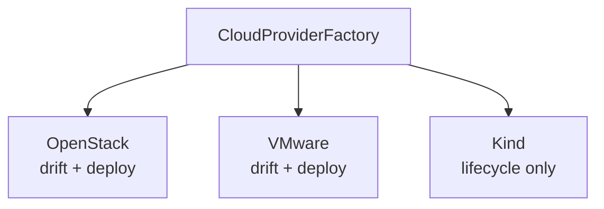
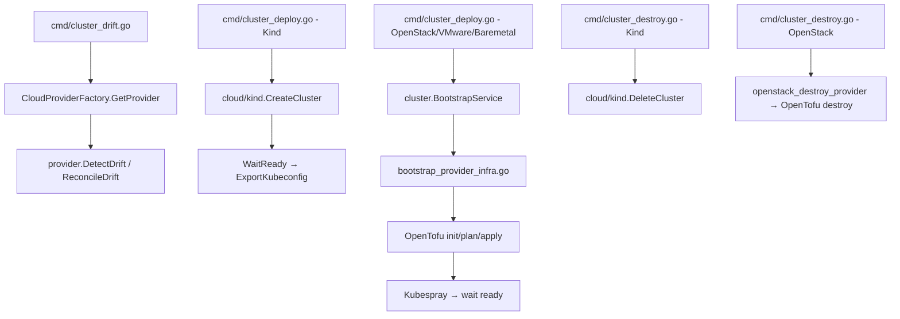

# Providers Codemap

**Last Updated:** 2026-05-19  
**Entry Point:** `internal/cloud/` factory pattern  
**Packages:** `internal/cloud`, `internal/credentials`, `internal/operations`, `internal/localdev`

## Architecture



## Cloud Provider Interface (Drift Detection)

```go
type CloudProvider interface {
    GetCurrentState(ctx context.Context, cfg v2.Config) (*InfrastructureState, error)
    DetectDrift(ctx context.Context, desired, actual *InfrastructureState) (*DriftReport, error)
    ReconcileDrift(ctx context.Context, drift *DriftReport) error
}
```

### State Types

| Type | Fields |
|------|--------|
| `InfrastructureState` | Servers, Networks, SecurityGroups, LoadBalancers, Volumes, FloatingIPs |
| `DriftReport` | DriftItems (list), Summary |
| `DriftItem` | ResourceType, Field, Expected, Actual, Severity, Reconcilable, Message |
| `DriftSummary` | TotalDrifts, ReconcilableCount |

Severity levels: `SeverityInfo`, `SeverityWarning`, `SeverityCritical`

## Provider Implementations

### OpenStack (`internal/cloud/openstack/`)

**Capabilities:** Drift detection + reconciliation  
**API Client:** gophercloud  
**Resources monitored:**
- Compute (servers, metadata)
- Network (networks, subnets, ports, security groups/rules)
- Load Balancers
- Block Storage (volumes)
- Floating IPs

**Reconciliation:** Server metadata updates, security group rule CRUD.

### VMware (`internal/cloud/vmware/`)

**Capabilities:** Drift detection + deploy (via shared `bootstrap_provider_infra.go`)  
**API Client:** govmomi (vSphere)  
**Deploy flow:** OpenTofu provisions VMs → Kubespray installs K8s → FluxCD bootstrap  
**Preflight checks:** vSphere credentials validation, bastion SSH connectivity, static node reachability

### Kind (`internal/cloud/kind/`)

**Capabilities:** Lifecycle only (not a drift provider)  
**Key Functions:**
- `CreateCluster(name, config)` — creates Kind cluster
- `DeleteCluster(name)` — deletes Kind cluster
- `ExportKubeconfig(name)` — exports kubeconfig
- `WaitReady(name, timeout)` — waits for API server
- `ClusterExists(name)` — checks existence
- `APIReady(name)` — checks API health

**Implementation:** Shells out to `kind` and `kubectl` via `security.CommandRunner`

## Credentials (`internal/credentials/`)

Extracts cloud provider credentials from cluster configuration:

| File | Provider | Extracts |
|------|----------|----------|
| `openstack.go` | OpenStack | Application credentials, auth URL, region, project |
| `aws.go` | AWS | Access key, secret key, region, session token |
| `extractor.go` | Generic | Credential extraction interface |

## Operations (`internal/operations/`)

Operational components built on top of providers:

| Component | Purpose |
|-----------|---------|
| Drift Detector | Periodic drift detection using CloudProvider interface |
| Backup Manager | Cluster config backup/restore |
| Disaster Recovery | Recovery workflows |

## Local Development (`internal/localdev/`)

Local development environment management:

| Subpackage | Purpose |
|-----------|---------|
| `gitops/` | Local Gitea + FluxCD for development |
| Kind integration | Local Kind clusters with registry |

## Integration Points



## Supported Providers Matrix

| Provider | Init | Configure | Validate | Generate | Deploy | Drift | Destroy |
|----------|------|-----------|----------|----------|--------|-------|---------|
| OpenStack | ✅ | ✅ (guided) | ✅ (online) | ✅ | ✅ | ✅ | ✅ |
| VMware | ✅ | ❌ | ✅ (offline) | ✅ | ✅ | ✅ | ❌ |
| Kind | ✅ | ❌ | ✅ (offline) | ✅ | ✅ | ❌ | ✅ |
| Baremetal | ✅ | ❌ | ✅ (offline) | ✅ | ✅ | ❌ | ❌ |
| AWS | ✅ | ❌ | ❌ | ✅ | ❌ | ❌ | ❌ |

**Notes:**
- VMware/Baremetal deploy shares the same bootstrap infrastructure as OpenStack (`bootstrap_provider_infra.go`)
- `tofu` binary is preferred; falls back to `terraform` if `tofu` is not on PATH
- Deploy no longer auto-commits to the GitOps repository

## Related Areas

- [Cluster Lifecycle](cluster-lifecycle.md) — uses providers for bootstrap/destroy
- [Config System](config-system.md) — provider-specific config types and validation
- [GitOps Engine](gitops-engine.md) — provider-specific infrastructure templates
