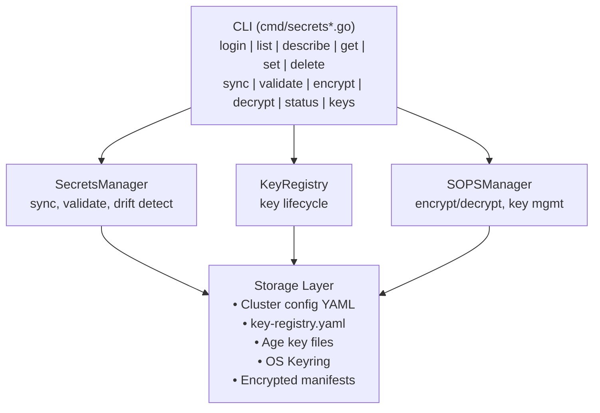
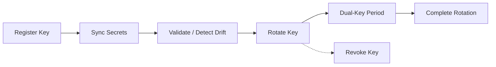
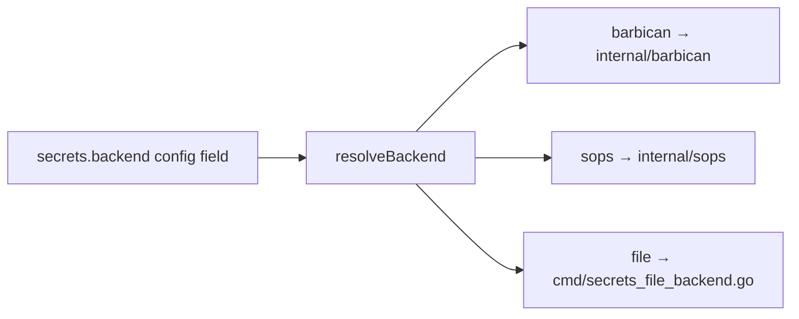

# Secrets Management Codemap

**Last Updated:** 2026-05-19  
**Entry Points:** `internal/secrets/manager.go`, `internal/sops/encrypt.go`  
**Packages:** `internal/secrets`, `internal/sops`

## Architecture



## Secrets Lifecycle



## `internal/secrets/` — Multi-Cluster Secrets Management

### Key Interfaces

| Interface | Methods | Purpose |
|-----------|---------|---------|
| `SecretsManager` | SyncSecrets, ValidateSecrets, DetectDrift, GetSecretSources | Core sync and validation |
| `KeyRegistry` | RegisterKey, GetKey, UpdateKeyStatus, ListKeys, CheckExpiration, RebuildFromFiles | Key metadata store |
| `KeyRotator` | RotateAgeKey, RotateSSHKey, CompleteRotation, GetRotationStatus | Dual-key rotation |
| `KeyRevoker` | RevokeByUser, RevokeByFingerprint, EmergencyRevoke | Key revocation |
| `HookManager` | InstallHooks, ValidatePreCommit, UninstallHooks | Git pre-commit hooks |
| `MultiClusterSyncer` | SyncAll | Parallel multi-cluster sync |
| `AuditLogger` | LogSecretsSync, LogDriftDetected, LogSecretsValidated | Tamper-evident audit |

### Key Files

| File | Purpose | Key Types |
|------|---------|-----------|
| `manager.go` | Core sync/validate/drift logic | `DefaultSecretsManager` |
| `interfaces.go` | All interface definitions | See table above |
| `registry.go` | SOPS-encrypted key registry | `DefaultKeyRegistry`, `KeyEntry` |
| `rotation.go` | Dual-key rotation workflow | `RotateOptions`, `RotationResult`, `RotationStatus` |
| `revocation.go` | Key revocation + emergency re-key | `RevokeOptions`, `RevocationResult` |
| `hooks.go` | Git pre-commit hook management | `DefaultHookManager`, `HookResult` |
| `multi_cluster.go` | Parallel multi-cluster operations | `MultiClusterSyncOptions`, `MultiClusterSyncResult` |
| `rollback.go` | Atomic operations with backup/restore | `RollbackManager` |
| `errors.go` | Typed errors | `ErrConfigNotFound`, `ErrDecryptionFailed`, etc. |
| `doc.go` | Package documentation | — |

### Domain Types

```go
type KeyEntry struct {
    Cluster, KeyType, Fingerprint, PublicKey string
    CreatedAt, ExpiresAt time.Time
    Status KeyStatus  // active | archived | revoked
    RotationMetadata, RevocationMetadata map[string]string
    UserEmail string
}

type SyncResult struct {
    Created, Updated, Unchanged []string
}

type DriftReport struct {
    Services []ServiceDrift  // per-service hash comparison
}

type ExpirationReport struct {
    Expired, Warning, Valid []KeyExpirationInfo
}
```

### Key Behaviors

- **Sync**: Reads secrets from cluster config → generates SOPS-encrypted manifests per service
- **Drift Detection**: Compares config values (hashed) against decrypted manifests
- **Rotation**: Generates new key → dual-key mode (both active) → re-encrypts → completes (removes old)
- **Revocation**: Removes key → re-encrypts without it; emergency mode generates new primary immediately
- **Expiration**: Age keys default 90 days, SSH keys 180 days
- **Hooks**: Pre-commit prevents committing plaintext secrets or drifted manifests
- **Multi-Cluster**: Parallel sync with configurable concurrency (default 4)
- **Rollback**: Atomic file operations with backup/restore on failure
- **Audit**: All operations logged with HMAC signatures for tamper detection

---

## `internal/sops/` — SOPS Encryption Engine

### Key Interfaces

| Interface | Methods | Purpose |
|-----------|---------|---------|
| `SOPSManager` | GetKeyManager, EncryptOverlayFiles, CreateSOPSConfig, ValidateEncryption | High-level SOPS operations |
| `Encryptor` | EncryptFile, EncryptFiles, DecryptFile, IsFileEncrypted, RotateKeys | File-level encrypt/decrypt |

### Key Files

| File | Purpose |
|------|---------|
| `encrypt.go` | `DefaultEncryptor` — shells out to `sops` binary |
| Manager files | `DefaultSOPSManager` — composes KeyManager + Encryptor |
| Key management | `EnhancedKeyManager` — OS keyring + file storage + backup |

### `DefaultEncryptor`

- Shells out to `sops` binary via `security.CommandRunner`
- Parallel encryption with configurable concurrency (default 4)
- Detects already-encrypted files (checks for `sops:` + `age:`/`pgp:` markers)
- Rich error diagnostics (checks `SOPS_AGE_KEY_FILE`, suggests `opencenter cluster env`)

### `EnhancedKeyManager`

- **Storage**: OS keyring (via `go-keyring`) + file-based (private 0600, public 0644)
- **Backup**: AES-256-GCM encrypted with Argon2 key derivation
- **Multi-key**: Supports multiple keys per cluster (`GenerateAdditionalKey`)
- **Migration**: `MigrateToKeyring()` moves file-based keys to OS keyring
- **Export**: Base64 import/export for portable key exchange

### `DefaultSOPSManager`

- `EncryptOverlayFiles`: Encrypts provider-specific files (OpenStack creds, vSphere creds, flux-system sync, base-repo source)
- `CreateSOPSConfig`: Generates `.sops.yaml` with path_regex rules
- `ValidateEncryption`: Validates files are properly encrypted
- `EncryptRepositorySecrets`: Walks secrets directory encrypting all YAML

## Backend Routing

The `secrets` CLI commands support multiple backends:



## Related Areas

- [CLI Commands](cli-commands.md) — `secrets` command tree
- [Cluster Lifecycle](cluster-lifecycle.md) — key generation during `cluster init`
- [GitOps Engine](gitops-engine.md) — overlay encryption after generation
- [Config System](config-system.md) — secrets type definitions
