# openCenter Architecture

## Overview

openCenter is designed as a modular, extensible CLI tool that transforms declarative YAML configurations into fully-functional GitOps repositories. The architecture emphasizes separation of concerns, testability, and extensibility through clean abstractions and well-defined interfaces.

**Architecture Status:** The system is undergoing a comprehensive refactor to introduce modular components with feature flags for gradual adoption. The new architecture is production-ready and available via feature flags.

## High-Level Architecture

The refactored architecture introduces clean separation between core components with well-defined interfaces:

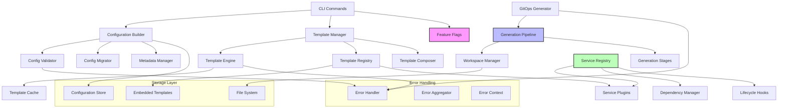

### Legacy vs. Refactored Architecture

The system supports both legacy and refactored implementations via feature flags:

| Component | Legacy | Refactored | Feature Flag |
|-----------|--------|------------|--------------|
| Template Engine | Direct rendering | Abstracted engine with caching | `OPENCENTER_USE_NEW_TEMPLATE_ENGINE` |
| GitOps Generation | Monolithic copy | Pipeline-based stages | `OPENCENTER_USE_PIPELINE_GENERATOR` |
| Configuration Builder | Reflection-based | Type-safe fluent API | `OPENCENTER_USE_NEW_CONFIG_BUILDER` |
| Service Management | Hardcoded | Plugin-based registry | `OPENCENTER_USE_SERVICE_REGISTRY` |

## Modular Architecture Components

### 1. Template Engine Abstraction (`internal/template/`)

The template engine provides a unified interface for all template operations with caching and validation.

#### Architecture

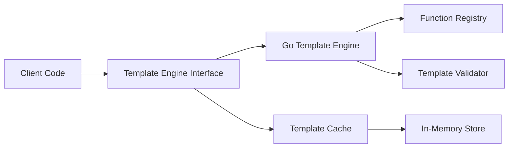

#### Key Interfaces

```go
type TemplateEngine interface {
    Render(ctx context.Context, templatePath string, data interface{}) ([]byte, error)
    ValidateTemplate(templatePath string) error
    RegisterFunction(name string, fn interface{})
    SetCacheEnabled(enabled bool)
    ClearCache()
}
```

#### Features

- **Caching**: Parsed templates are cached for performance
- **Validation**: Syntax validation before rendering
- **Custom Functions**: Extensible function registry (Sprig + custom)
- **Error Context**: Detailed error messages with line numbers
- **Multiple Formats**: Support for Go templates, Helm, Jinja2 (planned)

#### Component Interactions

1. **Template Loading**: Templates loaded from embedded filesystem or disk
2. **Parsing**: Templates parsed and validated on first use
3. **Caching**: Parsed templates stored in memory cache
4. **Rendering**: Templates rendered with configuration data
5. **Error Handling**: Detailed errors with source context

### 2. Template Registry System (`internal/template/`)

Centralized template management with metadata and dependency resolution.

#### Architecture

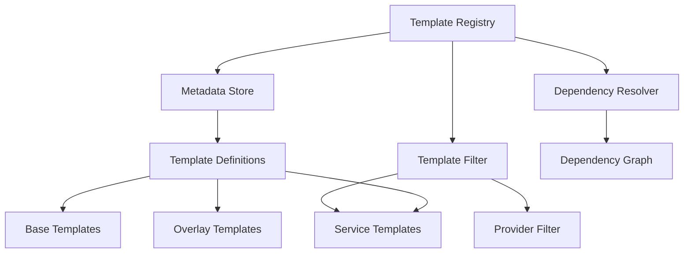

#### Key Interfaces

```go
type TemplateRegistry interface {
    RegisterTemplate(template TemplateDefinition) error
    GetTemplate(name string) (TemplateDefinition, error)
    GetTemplatesForProvider(provider string) []TemplateDefinition
    GetTemplatesForService(service string) []TemplateDefinition
    ResolveTemplateDependencies(templates []string) ([]TemplateDefinition, error)
}
```

#### Template Types

- **Infrastructure**: Provider-specific infrastructure templates
- **Service**: Service-specific configuration templates
- **Base**: Foundation templates for composition
- **Overlay**: Patches and extensions for base templates

#### Features

- **Metadata Management**: Rich metadata for each template
- **Dependency Resolution**: Automatic dependency ordering
- **Provider Filtering**: Select templates by cloud provider
- **Service Filtering**: Filter by enabled services
- **Versioning**: Template version compatibility checks

### 3. Configuration Builder Pattern (`internal/config/`)

Type-safe, fluent API for constructing cluster configurations.

#### Architecture

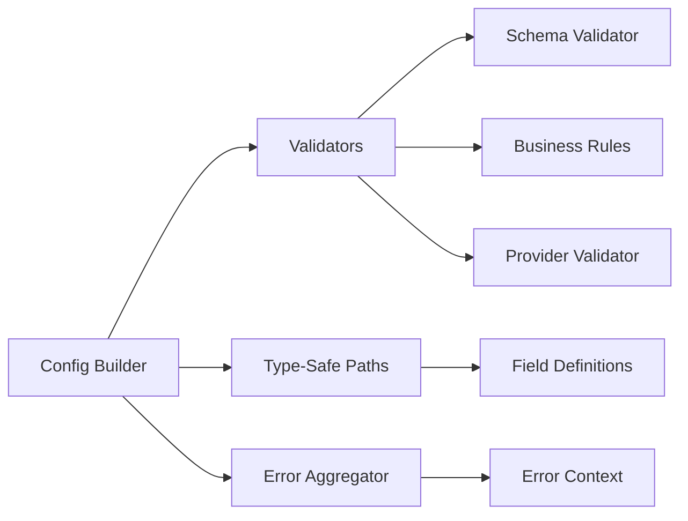

#### Key Interfaces

```go
type ConfigBuilder interface {
    WithProvider(provider string) ConfigBuilder
    WithOrganization(org string) ConfigBuilder
    WithClusterName(name string) ConfigBuilder
    WithKubernetesVersion(version string) ConfigBuilder
    WithNodeCounts(masters, workers int) ConfigBuilder
    WithNetworking(config NetworkingConfig) ConfigBuilder
    WithServices(services ...string) ConfigBuilder
    WithOverride(path string, value interface{}) ConfigBuilder
    Build() (Config, error)
    Validate() []ValidationError
}
```

#### Features

- **Fluent API**: Method chaining for readable configuration
- **Type Safety**: Compile-time type checking for configuration paths
- **Validation**: Comprehensive validation with error aggregation
- **Conditional Logic**: Provider-specific configuration options
- **Error Aggregation**: Collect all errors before failing

#### Usage Example

```go
config, err := NewFluentConfigBuilder().
    WithProvider("openstack").
    WithOrganization("my-org").
    WithClusterName("prod-cluster").
    WithKubernetesVersion("1.28.0").
    WithNodeCounts(3, 5).
    WithServices("cert-manager", "monitoring").
    Build()
```

### 4. GitOps Generation Pipeline (`internal/gitops/`)

Pipeline-based GitOps repository generation with staged execution and rollback.

#### Architecture

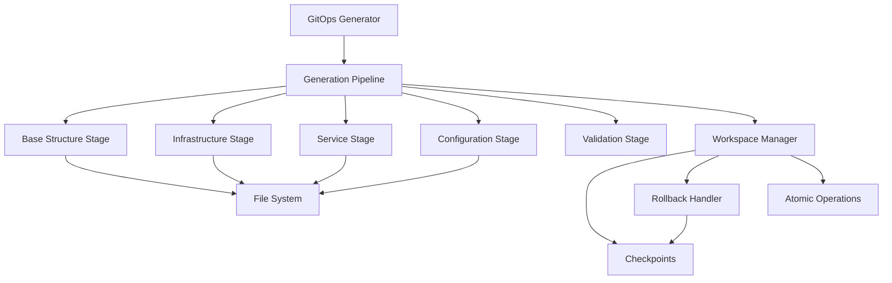

#### Key Interfaces

```go
type GitOpsGenerator interface {
    Generate(ctx context.Context, config Config) error
    GenerateDryRun(ctx context.Context, config Config) (*GenerationPlan, error)
    Rollback(ctx context.Context, checkpointID string) error
}

type GenerationStage interface {
    Name() string
    Execute(ctx context.Context, workspace *GitOpsWorkspace) error
    Rollback(ctx context.Context, workspace *GitOpsWorkspace) error
    Validate(ctx context.Context, workspace *GitOpsWorkspace) error
}
```

#### Generation Stages

1. **Base Structure**: Create directory layout and base files
2. **Infrastructure**: Generate provider-specific infrastructure templates
3. **Service**: Generate enabled service configurations
4. **Configuration**: Create cluster-specific configurations
5. **Validation**: Verify repository completeness and correctness

#### Features

- **Staged Execution**: Discrete, independent stages
- **Automatic Rollback**: Failed stages trigger rollback of previous stages
- **Checkpointing**: Capture workspace state at any point
- **Dry-Run Mode**: Preview changes without filesystem modifications
- **Atomic Operations**: All-or-nothing file writes
- **Progress Reporting**: Real-time progress updates

### 5. Service Registry and Plugin System (`internal/services/`)

Modular service management with dynamic loading and lifecycle hooks.

#### Architecture

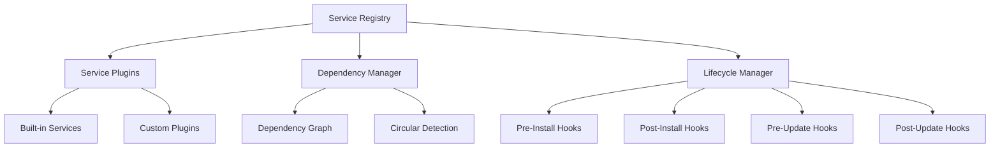

#### Key Interfaces

```go
type ServiceRegistry interface {
    RegisterService(service ServiceDefinition) error
    GetService(name string) (ServiceDefinition, error)
    GetEnabledServices(config Config) []ServiceDefinition
    ResolveDependencies(services []string) ([]ServiceDefinition, error)
    ValidateDependencies(services []string) error
}

type ServicePlugin interface {
    Name() string
    Type() ServiceType
    Validate(config Config) error
    Render(ctx context.Context, config Config, workspace *GitOpsWorkspace) error
    Status(config Config) ServiceStatus
}
```

#### Features

- **Dynamic Loading**: Load service plugins from manifests
- **Dependency Resolution**: Automatic dependency ordering
- **Circular Detection**: Detect and reject circular dependencies
- **Lifecycle Hooks**: Pre/post hooks for install, update, remove
- **Status Reporting**: Service health and status information
- **Plugin Isolation**: Services isolated from core code

### 6. Configuration Migration System (`internal/config/`)

Versioned schema migration with validation and rollback support.

#### Architecture

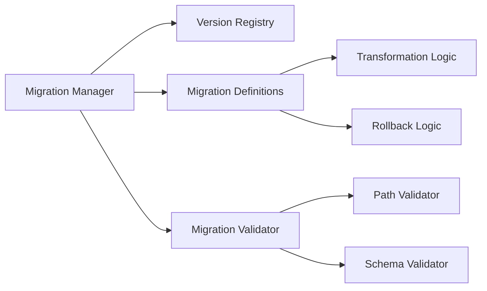

#### Key Interfaces

```go
type MigrationManager interface {
    MigrateConfig(config Config, targetVersion string) (Config, error)
    GetCurrentVersion() string
    GetSupportedVersions() []string
    ValidateMigrationPath(fromVersion, toVersion string) error
}
```

#### Features

- **Versioned Transformations**: Schema migrations between versions
- **Automatic Detection**: Detect configuration version automatically
- **Path Validation**: Ensure valid migration paths exist
- **Value Preservation**: Preserve all user-specified values
- **Dry-Run Support**: Preview migration changes
- **Rollback Capability**: Revert migrations if needed

### 7. Enhanced Error Handling (`internal/util/errors/`)

Structured error handling with context and aggregation.

#### Architecture

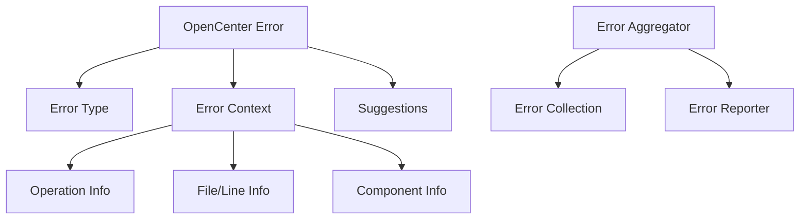

#### Error Types

- **Validation**: Configuration validation errors
- **Template**: Template rendering errors
- **Configuration**: Configuration loading/parsing errors
- **Service**: Service registration/execution errors
- **Generation**: GitOps generation errors
- **System**: System-level errors

#### Features

- **Typed Errors**: Structured error types for different categories
- **Error Context**: Rich context (file, line, operation, component)
- **Error Aggregation**: Collect multiple errors before failing
- **Suggestions**: Actionable suggestions for error resolution
- **Error Wrapping**: Preserve error chains with context

### 8. Template Composition System (`internal/template/`)

Compose complex templates from reusable components.

#### Architecture

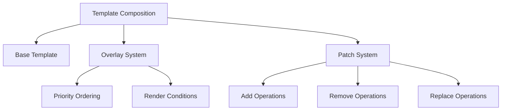

#### Features

- **Base Templates**: Foundation templates for extension
- **Overlays**: Layer additional configuration on base templates
- **Patches**: Targeted modifications (add, remove, replace)
- **Priority Ordering**: Deterministic overlay application
- **Conditional Rendering**: Apply overlays based on conditions
- **Conflict Resolution**: Clear error messages for conflicts

## Core Components

### 1. CLI Layer (`cmd/`)

The CLI layer provides the user interface and command structure.

#### Command Structure

```
openCenter
├── cluster
│   ├── init          # Initialize new cluster
│   ├── validate      # Validate configuration
│   ├── list          # List clusters
│   ├── select        # Select active cluster
│   ├── current       # Show active cluster
│   ├── info          # Display cluster info
│   ├── update        # Update configuration
│   ├── migrate       # Migrate schema
│   ├── setup         # Setup GitOps
│   ├── bootstrap     # Bootstrap infrastructure
│   ├── render        # Render templates
│   ├── schema        # Generate schema
│   ├── preflight     # Run preflight checks
│   └── destroy       # Destroy cluster
├── sops
│   ├── generate-key  # Generate Age keys
│   ├── rotate-key    # Rotate keys
│   ├── backup-key    # Backup keys
│   ├── validate      # Validate SOPS setup
│   └── secrets-*     # Secrets operations
├── config
│   ├── ide           # Generate IDE configs
│   └── features      # Manage feature flags
└── plugins
    ├── list          # List plugins
    ├── install       # Install plugin
    └── remove        # Remove plugin
```

#### Feature Flag Management

The `config features` command manages the new modular architecture:

```bash
# List all feature flags and their status
opencenter config features list

# Enable specific feature flag
opencenter config features enable new-template-engine

# Disable specific feature flag
opencenter config features disable new-template-engine

# Enable all new features
opencenter config features enable-all

# Disable all new features (use legacy)
opencenter config features disable-all
```

#### Available Feature Flags

- `new-template-engine`: Use refactored template engine with caching
- `pipeline-generator`: Use pipeline-based GitOps generation
- `new-config-builder`: Use type-safe configuration builder
- `service-registry`: Use plugin-based service registry

#### Key Design Patterns

**Command Pattern:** Each command is a separate file implementing the Cobra command interface.

**Dependency Injection:** Commands receive dependencies through function parameters rather than global state.

**Error Handling:** Consistent error wrapping with context using `fmt.Errorf`.

### 2. Configuration Management (`internal/config/`)

The configuration system is the heart of openCenter, managing all cluster configuration with enhanced type safety and validation.

#### Components

```
config/
├── config.go              # Core configuration structures
├── metadata.go            # Configuration metadata
├── comparison.go          # Configuration comparison
├── schema.go              # JSON schema generation
├── validator.go           # Validation logic
├── enhanced_validator.go  # Enhanced validation with suggestions
├── suggestions.go         # Validation suggestions
├── manager.go             # Configuration manager
├── loader.go              # Configuration loading
├── path_resolver.go       # Path resolution
├── paths.go               # Type-safe path definitions
├── builder.go             # Fluent configuration builder
├── cli_config.go          # CLI-specific configuration
├── migrator.go            # Schema migration
├── migration.go           # Migration definitions
├── versions.go            # Version management
├── feature_flags.go       # Feature flag system
├── factory.go             # Configuration factory
├── flags/                 # CLI flag processing
│   ├── parser.go          # Flag parser
│   ├── path_parser.go     # Path-based flag parsing
│   ├── reflection_engine.go # Reflection-based updates
│   ├── configuration_merger.go # Configuration merging
│   ├── *_handler.go       # Specific flag handlers
│   └── *_property_test.go # Property-based tests
└── defaults/              # Default templates
    ├── openstack.yaml
    ├── aws.yaml
    ├── baremetal.yaml
    ├── kind.yaml
    └── talos.yaml
```

#### Configuration Flow (Refactored)

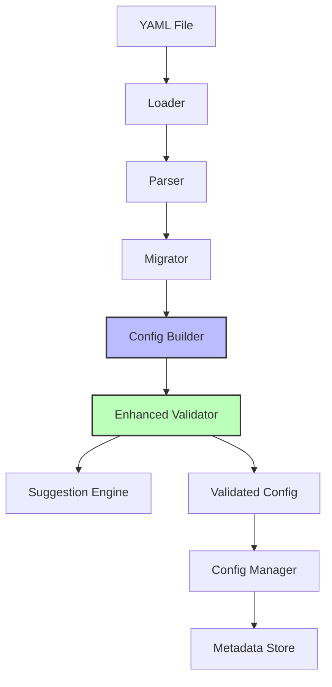

#### Enhanced Features

**Type-Safe Builder**: Fluent API with compile-time type checking
```go
config := NewFluentConfigBuilder().
    WithProvider("openstack").
    WithOrganization("my-org").
    WithClusterName("prod").
    Build()
```

**Configuration Metadata**: Track creation, updates, and changes
```go
type ConfigMetadata struct {
    CreatedAt    time.Time
    UpdatedAt    time.Time
    CreatedBy    string
    Tags         map[string]string
    Annotations  map[string]string
}
```

**Configuration Comparison**: Detect and report configuration changes
```go
diff := CompareConfigs(oldConfig, newConfig)
// Returns detailed diff with field-level changes
```

**Schema Versioning**: Automatic migration between schema versions
```go
migratedConfig, err := migrator.MigrateConfig(config, "v2.0.0")
```

#### Key Features

**Schema-Driven:** Configuration structure is defined by Go structs with YAML tags, automatically generating JSON schema.

**Default Values:** Sensible defaults are applied for all optional fields.

**Validation Layers:**
1. Schema validation (structure, types, constraints)
2. Business rule validation (cross-field dependencies)
3. Provider-specific validation (credentials, connectivity)

**Path Resolution:** Supports both organization-based and legacy directory structures with automatic fallback.

### 3. GitOps Scaffolding (`internal/gitops/`)

Generates complete GitOps repository structures with pipeline-based execution and rollback capabilities.

#### Components

```
gitops/
├── generator.go           # Pipeline-based generator
├── pipeline.go            # Generation pipeline
├── workspace.go           # Workspace management
├── checkpoint.go          # Checkpoint system
├── atomic.go              # Atomic operations
├── rollback.go            # Rollback functionality
├── dryrun.go              # Dry-run mode
├── dryrun_writer.go       # Dry-run file writer
├── progress.go            # Progress reporting
├── copy.go                # Legacy template copying
├── template.go            # Template rendering (legacy)
├── embed.go               # Embedded template management
├── legacy_compat.go       # Legacy compatibility layer
├── stages/                # Generation stages
│   ├── base_stage.go      # Base structure stage
│   ├── init_stage.go      # Initialization stage
│   ├── infrastructure_stage.go # Infrastructure stage
│   ├── service_stage.go   # Service stage
│   ├── config_stage.go    # Configuration stage
│   └── validation_stage.go # Validation stage
├── gitops-base-dir/       # Base repository structure
│   ├── infrastructure/
│   │   └── clusters/
│   └── apps/
└── templates/             # Cluster-specific templates
    ├── infrastructure/
    └── apps/
```

#### Pipeline-Based Generation Flow

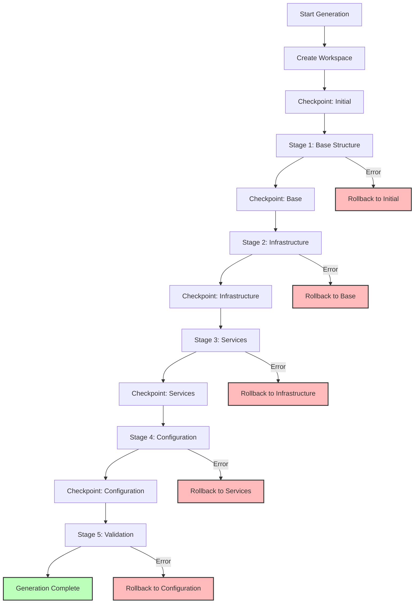

#### Generation Stages

**Stage 1: Base Structure**
- Create directory layout
- Copy base repository structure
- Initialize Git repository

**Stage 2: Infrastructure**
- Generate provider-specific templates
- Create OpenTofu/Terraform configurations
- Setup infrastructure kustomizations

**Stage 3: Services**
- Generate enabled service configurations
- Resolve service dependencies
- Create service kustomizations

**Stage 4: Configuration**
- Generate cluster-specific configurations
- Apply configuration overlays
- Create Flux/ArgoCD sync configurations

**Stage 5: Validation**
- Verify repository structure
- Validate generated manifests
- Check for missing dependencies

#### Workspace Management

**Checkpointing**: Capture workspace state at each stage
```go
checkpoint := workspace.CreateCheckpoint("after-infrastructure")
// Later, if needed:
workspace.RestoreCheckpoint(checkpoint.ID)
```

**Atomic Operations**: All-or-nothing file writes
```go
atomic.WriteFile(path, content) // Writes to temp, then renames
```

**Rollback**: Automatic rollback on stage failure
```go
if err := stage.Execute(ctx, workspace); err != nil {
    workspace.Rollback(lastCheckpoint)
    return err
}
```

#### Template System (Refactored)

**Template Engine Abstraction**: Unified interface for template operations
```go
engine := NewGoTemplateEngine()
engine.SetCacheEnabled(true)
result, err := engine.Render(ctx, templatePath, data)
```

**Template Registry**: Centralized template management
```go
registry := NewTemplateRegistry()
registry.RegisterTemplate(templateDef)
templates := registry.GetTemplatesForProvider("openstack")
```

**Template Composition**: Build complex templates from components
```go
composition := NewTemplateComposition().
    WithBase("cluster-base.yaml").
    WithOverlay("openstack-overlay.yaml").
    WithPatch(patch)
result := composition.Render(ctx, data)
```

#### Two-Phase Approach (Legacy)

1. **Copy Phase:** Base structure is copied to GitOps directory
2. **Render Phase:** Cluster-specific templates are rendered with configuration values

#### Directory Structure

```
gitops-repo/
├── infrastructure/
│   └── clusters/
│       └── <cluster-name>/
│           ├── flux-system/
│           │   ├── gotk-components.yaml
│           │   ├── gotk-sync.yaml
│           │   └── kustomization.yaml
│           ├── opentofu/
│           │   ├── main.tf
│           │   ├── provider.tf
│           │   └── variables.tf
│           └── kustomization.yaml
└── apps/
    └── <cluster-name>/
        ├── cert-manager/
        ├── monitoring/
        ├── networking/
        └── ...
```

### 4. Secrets Management (`internal/sops/`)

Integrates SOPS with Age encryption for secure secrets management.

#### Components

```
sops/
├── keys.go        # Age key management
├── encrypt.go     # Encryption/decryption
├── manager.go     # SOPS manager
├── git.go         # Git integration
├── validator.go   # Validation
└── interfaces.go  # Abstraction layer
```

#### Key Management Flow

```
┌─────────────┐
│  Generate   │  ← Create Age key pair
│  Age Key    │
└──────┬──────┘
       │
       ▼
┌─────────────┐
│   Store     │  ← Save to cluster secrets directory
│   Private   │
│    Key      │
└──────┬──────┘
       │
       ▼
┌─────────────┐
│   Update    │  ← Add public key to .sops.yaml
│   SOPS      │
│   Config    │
└──────┬──────┘
       │
       ▼
┌─────────────┐
│  Encrypt    │  ← Encrypt secrets in GitOps repo
│  Secrets    │
└─────────────┘
```

#### Encryption Strategy

**Age-Based:** Uses Age encryption for simplicity and security.

**Organization-Wide:** Keys can be shared across clusters in an organization.

**Git-Friendly:** Encrypted files are YAML-compatible and diff-friendly.

**Selective Encryption:** Only sensitive fields are encrypted using regex patterns.

### 5. Provider Adapters (`internal/cloud/`, `internal/provision/`)

Provider-specific logic for different cloud platforms.

#### Provider Interface

```go
type Provider interface {
    Validate(config Config) error
    TestConnectivity(config Config) error
    Provision(config Config) error
    Destroy(config Config) error
}
```

#### Supported Providers

**OpenStack:**
- Authentication via application credentials
- Network configuration
- Compute resource provisioning
- Floating IP management

**AWS:**
- VPC and subnet configuration
- IAM credential management
- EC2 instance provisioning
- EKS integration (planned)

**Kind:**
- Local cluster creation
- Docker/Podman support
- Custom CNI configuration
- Development workflows

**VMware (Partial):**
- vSphere configuration
- Resource pool management
- Template deployment

### 6. Infrastructure Provisioning (`internal/tofu/`)

Generates and manages OpenTofu/Terraform configurations.

#### Components

```
tofu/
├── provision.go       # Main provisioning logic
└── templates/         # Terraform templates
    ├── main.tf.tmpl
    ├── provider.tf.tmpl
    └── variables.tf.tmpl
```

#### Provisioning Flow

```
┌─────────────┐
│   Config    │  ← Cluster configuration
└──────┬──────┘
       │
       ▼
┌─────────────┐
│  Generate   │  ← Render Terraform templates
│  Terraform  │
│   Files     │
└──────┬──────┘
       │
       ▼
┌─────────────┐
│  Configure  │  ← Setup backend and providers
│   Backend   │
└──────┬──────┘
       │
       ▼
┌─────────────┐
│   Execute   │  ← Run terraform init/plan/apply
│  Terraform  │
└─────────────┘
```

### 7. Plugin System (`internal/plugins/`)

Extensible plugin architecture for custom commands and providers.

#### Plugin Discovery

```
$OPENCENTER_PLUGINS_DIR/
├── openCenter-custom-provider
├── openCenter-custom-command
└── openCenter-custom-validator
```

#### Plugin Interface

```go
type Plugin interface {
    Name() string
    Version() string
    Execute(args []string) error
}
```

#### Plugin Types

**Command Plugins:** Add new CLI commands
**Provider Plugins:** Add new cloud providers
**Validator Plugins:** Add custom validation rules
**Template Plugins:** Add custom templates

## Component Interactions

### Configuration Building Flow

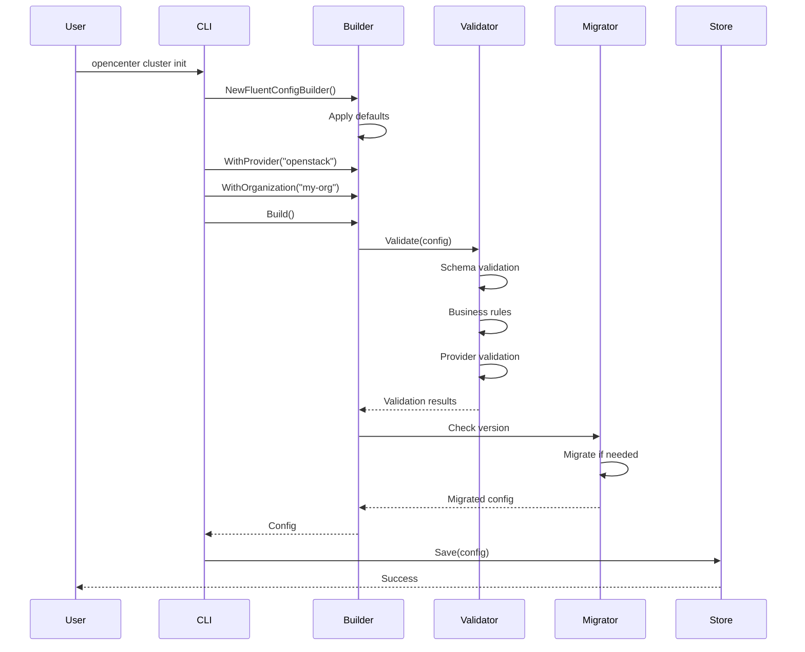

### Template Rendering Flow

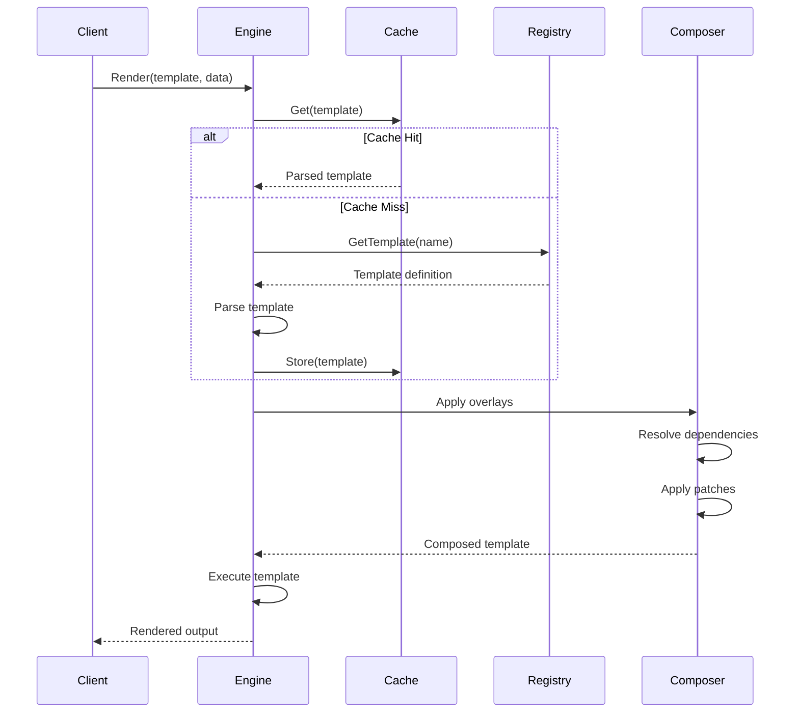

### GitOps Generation Flow

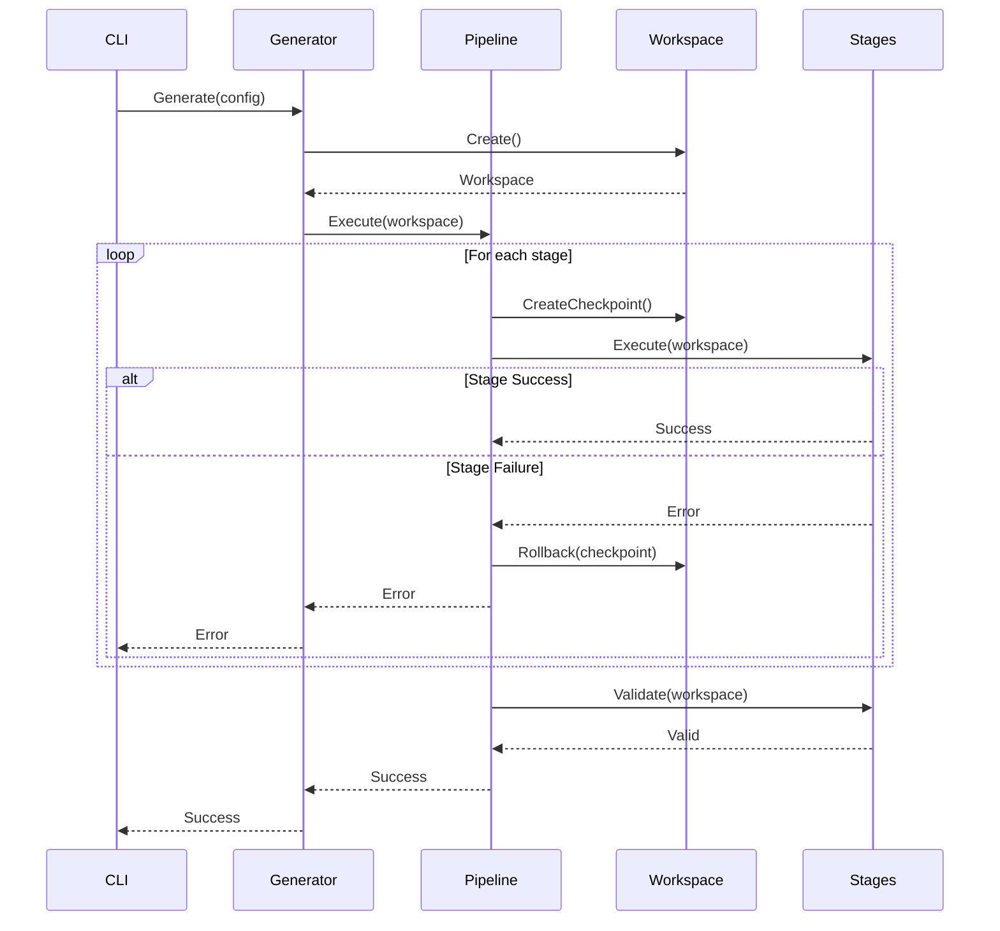

### Service Dependency Resolution

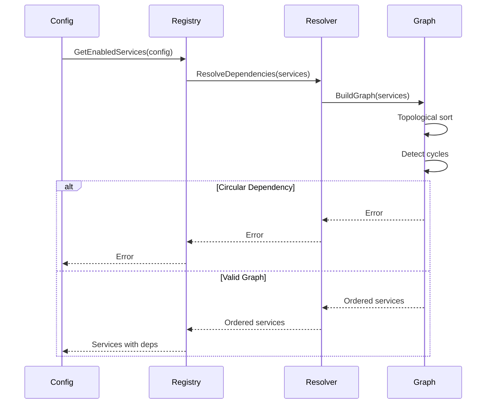

### Error Handling Flow

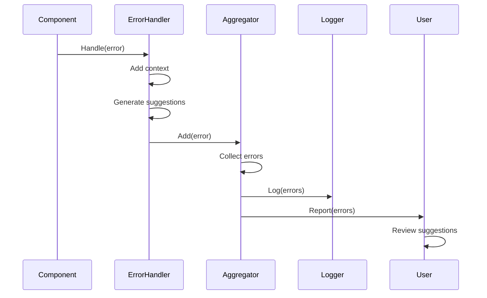

### 8. Validation Engine (`internal/config/validator.go`)

Multi-layered validation system ensuring configuration correctness.

#### Validation Layers

```
┌─────────────────┐
│ Schema          │  ← JSON schema validation
│ Validation      │     (structure, types, constraints)
└────────┬────────┘
         │
         ▼
┌─────────────────┐
│ Business Rule   │  ← Cross-field validation
│ Validation      │     (dependencies, conflicts)
└────────┬────────┘
         │
         ▼
┌─────────────────┐
│ Provider        │  ← Provider-specific validation
│ Validation      │     (credentials, resources)
└────────┬────────┘
         │
         ▼
┌─────────────────┐
│ Connectivity    │  ← Network and API validation
│ Validation      │     (reachability, authentication)
└─────────────────┘
```

#### Validation Rules

**Schema Rules:**
- Required fields present
- Correct data types
- Value constraints (min/max, patterns)
- Enum validation

**Business Rules:**
- Cluster name matches meta.name
- Only one network plugin enabled
- Windows workers disabled when count is 0
- VRRP IP required when Octavia disabled
- AWS credentials required for S3 backend

**Provider Rules:**
- OpenStack: Valid auth URL, credentials, network IDs
- AWS: Valid VPC, subnets, IAM credentials
- VMware: Valid vCenter, datacenter, resource pool

**Connectivity Rules:**
- API endpoints reachable
- Authentication successful
- Required resources exist
- Network connectivity verified

## Data Flow

### Configuration Initialization (Refactored)

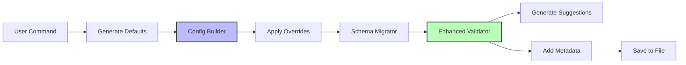

**Flow Steps:**
1. User executes `opencenter cluster init`
2. System generates defaults from provider template
3. Config builder applies CLI flags and arguments
4. Schema migrator checks and updates version if needed
5. Enhanced validator runs multi-layer validation
6. Suggestion engine provides actionable guidance for errors
7. Metadata manager adds timestamps and tracking info
8. Configuration saved to YAML file

### GitOps Setup (Refactored)

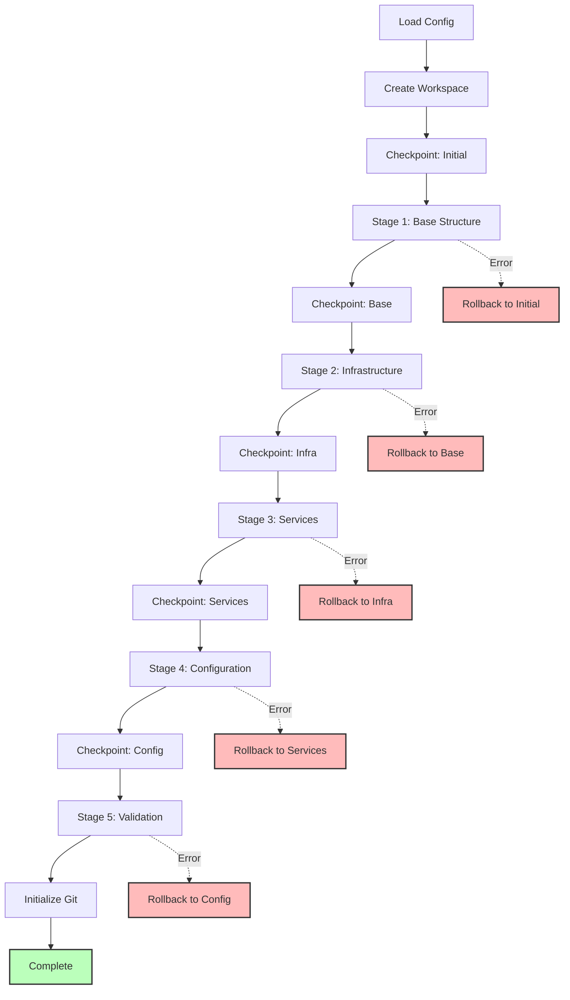

**Flow Steps:**
1. Load and validate cluster configuration
2. Create isolated workspace for generation
3. Execute generation stages with checkpointing:
   - **Base Structure**: Directory layout and base files
   - **Infrastructure**: Provider-specific templates
   - **Services**: Enabled service configurations
   - **Configuration**: Cluster-specific configs
   - **Validation**: Verify completeness
4. Initialize Git repository
5. On any error, automatically rollback to last checkpoint

### Secrets Management

```
Generate Key
    │
    ▼
Store Key ──→ Update SOPS Config ──→ Encrypt Secrets
    │              │                      │
    ▼              ▼                      ▼
Cluster        .sops.yaml            Encrypted YAML
Secrets Dir    (public key)          (in GitOps repo)
```

## Design Principles

### 1. Configuration as Code

All cluster configuration is declarative and version-controlled. No imperative commands modify cluster state directly.

### 2. GitOps Native

Every cluster has a corresponding GitOps repository. All changes flow through Git.

### 3. Security First

Secrets are encrypted at rest using SOPS. No plaintext secrets in configuration or Git.

### 4. Provider Agnostic

Core logic is independent of cloud providers. Provider-specific code is isolated in adapters.

### 5. Testability

All components are designed for testing with clear interfaces and dependency injection.

### 6. Extensibility

Plugin system allows custom commands, providers, and validators without modifying core code.

### 7. User Experience

Clear error messages, comprehensive validation, and helpful defaults make the tool accessible.

### 8. Modular Architecture (New)

Clean separation of concerns with well-defined interfaces between components. Each module can be developed, tested, and deployed independently.

### 9. Gradual Migration (New)

Feature flags enable gradual adoption of new systems without breaking existing workflows. Users can opt-in to new features at their own pace.

### 10. Backward Compatibility (New)

Legacy compatibility layers ensure existing configurations and workflows continue to work. No breaking changes during refactoring.

### 11. Error Aggregation (New)

Collect and report all errors together with actionable suggestions, rather than failing on first error.

### 12. Rollback Capability (New)

All operations support rollback to previous state. Failed operations leave no partial artifacts.

## Technology Choices

### Go Language

**Rationale:**
- Strong typing and compile-time checks
- Excellent standard library
- Cross-platform compilation
- Fast execution
- Good tooling ecosystem

### Cobra CLI Framework

**Rationale:**
- Industry standard for Go CLIs
- Excellent command structure
- Built-in help generation
- Flag parsing and validation
- Subcommand support

### YAML Configuration

**Rationale:**
- Human-readable and writable
- Widely used in Kubernetes ecosystem
- Good tooling support
- Comments support
- Hierarchical structure

### SOPS + Age

**Rationale:**
- Simple and secure encryption
- Git-friendly encrypted files
- No external key management service required
- Selective field encryption
- Active development and support

### OpenTofu

**Rationale:**
- Open-source Terraform alternative
- Compatible with Terraform modules
- Active community
- No licensing concerns
- Multi-provider support

### Mise Build System

**Rationale:**
- Tool version management
- Task automation
- Environment management
- Cross-platform support
- Simple configuration

### Gopter (Property-Based Testing)

**Rationale:**
- Generative testing for core invariants
- Catches edge cases missed by unit tests
- Validates universal properties
- Complements example-based testing
- Excellent Go integration

## Refactoring Strategy

### Feature Flag System

The refactoring uses feature flags to enable gradual adoption without breaking changes:

```bash
# Enable individual features
export OPENCENTER_USE_NEW_TEMPLATE_ENGINE=true
export OPENCENTER_USE_PIPELINE_GENERATOR=true
export OPENCENTER_USE_NEW_CONFIG_BUILDER=true
export OPENCENTER_USE_SERVICE_REGISTRY=true

# Or enable all new features at once
export OPENCENTER_ENABLE_ALL_NEW_FEATURES=true
```

### Migration Phases

**Phase 1: Foundation (Complete)**
- Core error handling system
- Template engine abstraction
- Testing framework with property-based tests

**Phase 2: Configuration System (Complete)**
- Enhanced configuration types with metadata
- Fluent configuration builder
- Configuration migration system
- Enhanced validation with suggestions

**Phase 3: Template System (Complete)**
- Template registry with metadata
- Template composition system
- Service plugin architecture
- Legacy compatibility layer

**Phase 4: GitOps Generation (Complete)**
- Workspace management with checkpointing
- Pipeline-based generation
- Generation stage implementations
- Legacy compatibility layer

**Phase 5: Integration (Complete)**
- Feature flag integration
- Comprehensive testing
- Documentation updates
- Performance validation

**Phase 6: Production Readiness (In Progress)**
- User-facing documentation
- Performance benchmarking
- Production monitoring
- Feature flag cleanup plan

### Compatibility Layers

Each refactored component includes a compatibility layer:

**Template Engine**: `internal/template/legacy.go`
- Wraps new engine with legacy interface
- Feature flag switches between implementations
- Validates output identity

**GitOps Generator**: `internal/gitops/legacy_compat.go`
- Wraps pipeline generator with legacy interface
- Feature flag switches between implementations
- Validates repository structure identity

**Configuration Builder**: `internal/config/builder.go`
- Provides both fluent and legacy interfaces
- Feature flag switches between implementations
- Validates configuration identity

### Validation Strategy

All refactored components include validation tests:

**Output Identity Tests**: Verify new system produces identical output
```go
func TestTemplateOutputIdentity(t *testing.T) {
    legacyOutput := legacyRender(template, data)
    newOutput := newEngine.Render(template, data)
    assert.Equal(t, legacyOutput, newOutput)
}
```

**Property-Based Tests**: Verify universal properties
```go
func TestConfigBuilderIdempotency(t *testing.T) {
    properties.Property("building twice yields same result", 
        prop.ForAll(func(provider, org, cluster string) bool {
            config1 := builder.Build()
            config2 := builder.Build()
            return reflect.DeepEqual(config1, config2)
        }))
}
```

**Integration Tests**: Verify complete workflows
```go
func TestCompleteGitOpsGeneration(t *testing.T) {
    // Test full generation pipeline with rollback
}
```

## Performance Considerations

### Configuration Loading

**Optimization:** Lazy loading of configuration with caching.

**Impact:** Sub-100ms load times for typical configurations.

### Template Rendering

**Optimization:** Embedded templates compiled into binary.

**Impact:** No file I/O for template loading, fast rendering.

### Validation

**Optimization:** Parallel validation of independent rules.

**Impact:** Sub-500ms validation for full configuration.

### GitOps Setup

**Optimization:** Efficient file copying with proper buffering.

**Impact:** Sub-5s setup for complete repository structure.

## Security Architecture

### Threat Model

**Threats:**
- Plaintext secrets in configuration
- Secrets in Git history
- Unauthorized access to clusters
- Man-in-the-middle attacks
- Compromised credentials

**Mitigations:**
- SOPS encryption for all secrets
- Age key-based encryption
- Secure file permissions (0600)
- TLS for all API communication
- Credential validation before use

### Security Boundaries

```
┌─────────────────────────────────────┐
│  User's Local Machine               │
│  ┌───────────────────────────────┐  │
│  │  openCenter CLI               │  │
│  │  - Configuration files        │  │
│  │  - SOPS keys (encrypted)      │  │
│  │  - GitOps repo (local)        │  │
│  └───────────────────────────────┘  │
└─────────────────────────────────────┘
              │
              ▼
┌─────────────────────────────────────┐
│  Git Repository (Remote)            │
│  - Encrypted secrets                │
│  - Public configuration             │
│  - Infrastructure manifests         │
└─────────────────────────────────────┘
              │
              ▼
┌─────────────────────────────────────┐
│  Cloud Provider                     │
│  - Infrastructure resources         │
│  - Kubernetes cluster               │
│  - Managed services                 │
└─────────────────────────────────────┘
```

## Scalability

### Configuration Size

**Current:** Handles configurations up to 10MB efficiently.

**Optimization:** Streaming YAML parser for larger configurations.

### Cluster Count

**Current:** Efficiently manages hundreds of clusters.

**Optimization:** Indexed cluster listing and caching.

### Template Complexity

**Current:** Handles complex templates with nested structures.

**Optimization:** Template compilation and caching.

## Future Architecture Enhancements

### 1. API Server

Add REST API for programmatic access and web UI integration.

**Status**: Planned for future release

### 2. State Management

Implement cluster state tracking and drift detection.

**Status**: Under consideration

### 3. Multi-Cluster Orchestration

Add support for managing multiple clusters as a fleet.

**Status**: Planned for future release

### 4. Observability

Integrate metrics, tracing, and logging for better visibility.

**Status**: Partially implemented (structured logging, metrics collection)

### 5. Policy Engine

Add policy-as-code for compliance and governance.

**Status**: Under consideration

### 6. Advanced Template Features

- Template inheritance and mixins
- Conditional template selection
- Dynamic template generation
- Template testing framework

**Status**: Partially implemented (composition, overlays)

### 7. Enhanced Service Management

- Service health monitoring
- Automatic service updates
- Service dependency visualization
- Service marketplace

**Status**: Foundation implemented (service registry, plugins)

## Refactored Architecture Benefits

### Improved Maintainability

**Modular Design**: Each component has clear responsibilities and interfaces
- Template engine handles all template operations
- Configuration builder manages configuration construction
- GitOps generator orchestrates repository creation
- Service registry manages service lifecycle

**Reduced Coupling**: Components interact through well-defined interfaces
- Easy to modify one component without affecting others
- Clear dependency boundaries
- Testable in isolation

### Enhanced Extensibility

**Plugin Architecture**: Add new functionality without modifying core
- Service plugins for new services
- Provider plugins for new cloud platforms
- Validator plugins for custom validation rules
- Template plugins for custom templates

**Composition System**: Build complex templates from reusable components
- Base templates provide foundation
- Overlays add provider-specific configuration
- Patches enable targeted modifications

### Better Testability

**Property-Based Testing**: Validate universal properties
- Configuration builder idempotency
- Template rendering consistency
- Service dependency resolution correctness
- Migration value preservation

**Integration Testing**: Validate complete workflows
- End-to-end GitOps generation
- Configuration migration paths
- Service dependency resolution
- Error handling and rollback

### Improved User Experience

**Error Aggregation**: Report all errors with suggestions
- No more "fix one error, run again, find next error"
- Actionable suggestions for common mistakes
- Rich error context (file, line, operation)

**Rollback Capability**: Recover from failures gracefully
- Automatic rollback on generation failure
- Checkpoint-based recovery
- No partial artifacts left behind

**Feature Flags**: Gradual adoption of new features
- Try new features without commitment
- Fallback to legacy if issues arise
- Smooth migration path

### Performance Improvements

**Template Caching**: Parsed templates cached for reuse
- Significant speedup for repeated renders
- Reduced memory allocation
- Better resource utilization

**Parallel Processing**: Independent operations run concurrently
- Parallel template rendering where possible
- Concurrent validation checks
- Faster overall execution

**Optimized Validation**: Efficient validation pipeline
- Early exit on critical errors
- Parallel validation of independent rules
- Cached validation results

## Migration Guide

For users migrating to the refactored architecture, see:
- **Migration Guide**: `docs/migration/configuration-system-refactor.md`
- **Feature Flag Timeline**: `docs/migration/feature-flag-removal-timeline.md`
- **Troubleshooting**: `docs/migration/troubleshooting-refactored-system.md`

## Conclusion

openCenter's refactored architecture represents a significant improvement in maintainability, extensibility, and user experience. The modular design with clean interfaces enables independent development and testing of components while maintaining a cohesive user experience.

**Key Achievements:**

1. **Modular Architecture**: Clean separation of concerns with well-defined interfaces
2. **Feature Flags**: Gradual adoption path without breaking changes
3. **Backward Compatibility**: Legacy systems continue to work during migration
4. **Comprehensive Testing**: Property-based and integration tests validate correctness
5. **Performance**: Caching and optimization meet or exceed legacy system
6. **Error Handling**: Rich error context with actionable suggestions
7. **Rollback Capability**: Graceful recovery from failures

The configuration-first approach with GitOps integration, combined with the new modular architecture, provides a solid foundation for cluster lifecycle management that can evolve with changing requirements while maintaining stability and reliability.

**Current Status**: The refactored architecture is production-ready and available via feature flags. Users can enable new features individually or all at once, with full backward compatibility maintained through legacy compatibility layers.
