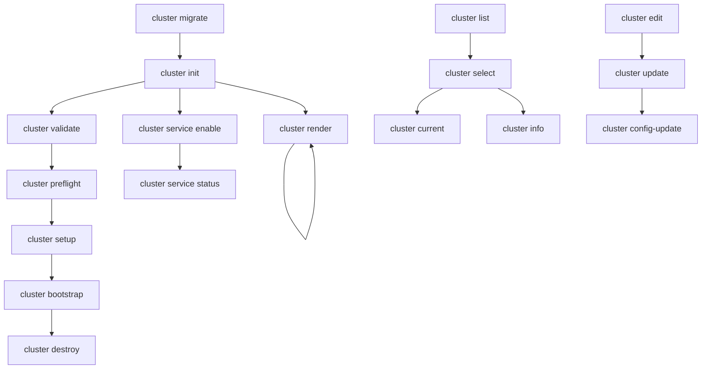

# Cluster Subcommands Matrix Comparison

This document provides a comprehensive matrix comparison of all cluster subcommands in openCenter CLI, including their purpose, flags, dependencies, and workflow stage.

## Command Overview

| Command | Purpose | Stage | Dependencies | Output |
|---------|---------|-------|--------------|--------|
| `init` | Initialize new cluster configuration | Init | None | Config file, SOPS keys, SSH keys |
| `validate` | Validate configuration against schema | Validate | Config file | Validation results |
| `preflight` | Check tools and provider requirements | Preflight | Config file | Tool availability status |
| `setup` | Setup GitOps directory structure | Setup | Config file, SOPS keys | GitOps manifests |
| `render` | Render templates (development) | - | Config file | GitOps manifests |
| `bootstrap` | Run provider-specific bootstrap | Bootstrap | GitOps setup | Running cluster |
| `list` | List all configured clusters | - | None | Cluster names |
| `select` | Select active cluster | - | Config file | Environment setup |
| `current` | Show current active cluster | - | None | Active cluster name |
| `info` | Show cluster configuration | - | Config file | Cluster metadata |
| `edit` | Edit configuration in editor | - | Config file | Modified config |
| `update` | Update configuration fields | - | Config file | Updated config |
| `config-update` | Update with current defaults | - | Config file | Normalized config |
| `migrate` | Migrate to organization structure | - | Legacy configs | Migrated configs |
| `schema` | Export JSON schema | - | None | JSON schema |
| `service` | Manage cluster services | - | Config file | Service configs |
| `destroy` | Destroy cluster | Destroy | Config file | Cleanup status |

## Detailed Command Matrix

### Initialization & Configuration Commands

#### `cluster init [name]`
- **Purpose**: Initialize new cluster configuration with defaults
- **Stage**: Init
- **Key Flags**:
  - `--org`: Organization name (default: "opencenter")
  - `--type`: Cluster type (openstack, baremetal, kind, vmware)
  - `--force`: Overwrite existing configuration
  - `--strict`: Enable validation during initialization
  - `--no-keygen`: Skip key generation
  - `--regenerate-keys`: Force key regeneration
  - `--server-pool`: Additional server pool configuration
- **Dependencies**: None
- **Outputs**: 
  - Configuration file at `~/.config/openCenter/clusters/<org>/<cluster>/.cluster-config.yaml`
  - SOPS Age key at `<org>/secrets/age/<cluster>-key.txt`
  - SSH key pair at `<org>/secrets/ssh/<cluster>-<env>-<region>`
  - Git repository initialization
- **Organization Support**: ✅ Full support with `--org` flag

#### `cluster validate [name]`
- **Purpose**: Validate configuration against schema and business rules
- **Stage**: Validate
- **Key Flags**:
  - `--generate-debug-config`: Save complete config for debugging
  - `--output-dir`: Directory for debug config
- **Dependencies**: Configuration file
- **Outputs**: Validation results, optional debug config
- **Validation Types**:
  - Schema validation
  - Required field validation
  - Cross-field dependencies
  - Provider credential validation
  - Network configuration validation
  - SOPS key validation

#### `cluster config-update [name]`
- **Purpose**: Update configuration with current schema defaults
- **Stage**: -
- **Key Flags**: None
- **Dependencies**: Configuration file
- **Outputs**: Normalized configuration with current defaults
- **Use Cases**:
  - Apply new default values from schema updates
  - Normalize configuration format
  - Clean up empty/unused fields

### Development & Setup Commands

#### `cluster setup [name]`
- **Purpose**: Setup GitOps directory structure for production
- **Stage**: Setup
- **Key Flags**:
  - `--render`: Render templates instead of copying
  - `--force`: Overwrite existing files and reinitialize
- **Dependencies**: 
  - Configuration file
  - SOPS keys (from init)
  - Organization directory structure
- **Outputs**:
  - Complete GitOps repository structure
  - SOPS configuration at organization level
  - Cluster-specific manifests
  - OpenTofu/Terraform files
- **Organization Support**: ✅ Uses organization-based paths

#### `cluster render [name]`
- **Purpose**: Render templates for development (always overwrites)
- **Stage**: -
- **Key Flags**: None
- **Dependencies**: Configuration file
- **Outputs**: GitOps manifests (overwrites existing)
- **Use Cases**:
  - Iterative development
  - Testing configuration changes
  - Template debugging
- **Differences from Setup**:
  - No Git operations
  - No initialization checks
  - Always renders (no skip logic)

#### `cluster preflight [name]`
- **Purpose**: Check tools and provider requirements
- **Stage**: Preflight
- **Key Flags**: None
- **Dependencies**: Configuration file
- **Outputs**: Tool availability status
- **Checks**:
  - Git availability
  - kubectl availability
  - talosctl availability
  - Provider-specific checks (OpenStack credentials)

### Deployment Commands

#### `cluster bootstrap [name]`
- **Purpose**: Run provider-specific bootstrap actions
- **Stage**: Bootstrap
- **Key Flags**:
  - `--dry-run`: Show planned actions without executing
  - `--kubeconfig`: Path to kubeconfig file
  - `--log`: Log file path
  - `--container-runtime`: Runtime for kind clusters (docker/podman)
- **Dependencies**: GitOps setup complete
- **Outputs**: Running cluster
- **Provider Support**:
  - **OpenStack/AWS/GCP/Azure**: Runs `make` in cluster directory
  - **Kind**: Creates local cluster with specified runtime
- **Logging**: Automatic logging to `<git_dir>/infrastructure/clusters/<name>/bootstrap.log`

### Management Commands

#### `cluster list`
- **Purpose**: List all configured clusters
- **Stage**: -
- **Key Flags**:
  - `--json`: Machine-readable JSON output
- **Dependencies**: None
- **Outputs**: Cluster names with active indicator (*)
- **Organization Support**: ✅ Shows organization/cluster format

#### `cluster select [name]`
- **Purpose**: Select active cluster and display environment information
- **Stage**: -
- **Key Flags**:
  - `--export-only`: Only output export commands
  - `--shell`: Override shell detection (bash, zsh, fish, powershell)
- **Dependencies**: Configuration file
- **Outputs**:
  - Cluster metadata
  - GitOps repository information
  - Environment setup commands
- **Shell Support**: Bash, Zsh, Fish, PowerShell
- **Interactive Mode**: TUI selection when no name provided

#### `cluster current`
- **Purpose**: Show current active cluster
- **Stage**: -
- **Key Flags**:
  - `--quiet`: Quiet output (just the name)
- **Dependencies**: None
- **Outputs**: Active cluster name

#### `cluster info [name]`
- **Purpose**: Show comprehensive cluster information
- **Stage**: -
- **Key Flags**:
  - `--validate`: Validate configuration
  - `--json`: JSON output format
  - `--export-only`: Only export commands
  - `--shell`: Override shell detection
- **Dependencies**: Configuration file
- **Outputs**:
  - Cluster metadata
  - Configuration paths
  - GitOps information
  - Environment variables

### Configuration Management Commands

#### `cluster edit [name]`
- **Purpose**: Edit configuration in preferred editor
- **Stage**: -
- **Key Flags**: None
- **Dependencies**: Configuration file
- **Outputs**: Modified configuration
- **Editor Detection**: EDITOR → VISUAL → vi

#### `cluster update [name]`
- **Purpose**: Update specific configuration fields
- **Stage**: -
- **Key Flags**:
  - `--strict`: Enable validation
  - Dynamic flags: `--iac.main.master_count=5`
- **Dependencies**: Configuration file
- **Outputs**: Updated configuration
- **Dynamic Flags**: Supports dot-notation for any schema field

### Service Management Commands

#### `cluster service`
- **Purpose**: Manage cluster services
- **Stage**: -
- **Subcommands**:
  - `enable <service>`: Enable a service
  - `disable <service>`: Disable a service
  - `status`: Show all service statuses
  - `options <service>`: Show service configuration options
- **Key Flags**:
  - `--managed`: Operate on managed services
  - `--param`: Set service parameters
  - `--secret`: Set service secrets
  - `--force`: Force re-enable
  - `--render`: Render immediately after enabling
- **Dependencies**: Configuration file
- **Outputs**: Service configurations, status information

### Schema & Migration Commands

#### `cluster schema`
- **Purpose**: Export JSON schema with validation rules
- **Stage**: -
- **Key Flags**:
  - `--out`: Output file path
  - `--pretty`: Pretty print JSON
  - `--version`: Show schema version
- **Dependencies**: None
- **Outputs**: JSON schema file
- **Use Cases**:
  - IDE integration
  - Documentation generation
  - Validation tooling

#### `cluster migrate [name]`
- **Purpose**: Migrate from legacy to organization-based structure
- **Stage**: -
- **Key Flags**:
  - `--organization`: Target organization
  - `--backup`: Create backup before migration
  - `--rollback`: Rollback from backup
  - `--dry-run`: Show migration plan
  - `--force`: Force migration without confirmation
- **Dependencies**: Legacy configuration files
- **Outputs**: Migrated organization structure
- **Safety Features**:
  - Automatic backups
  - Rollback capability
  - Validation after migration

### Cleanup Commands

#### `cluster destroy [name]`
- **Purpose**: Destroy cluster and mark as destroyed
- **Stage**: Destroy
- **Key Flags**: None
- **Dependencies**: Configuration file
- **Outputs**: Cleanup status
- **Actions**:
  - Removes GitOps directory
  - Marks cluster as destroyed (doesn't delete config)
  - Updates cluster status

## Workflow Dependencies



## Flag Comparison Matrix

| Flag | init | validate | setup | bootstrap | render | list | select | info | edit | update | service |
|------|------|----------|-------|-----------|--------|------|--------|------|------|--------|---------|
| `--org` | ✅ | - | - | - | - | - | - | - | - | - | - |
| `--type` | ✅ | - | - | - | - | - | - | - | - | - | - |
| `--force` | ✅ | - | ✅ | - | - | - | - | - | - | - | ✅ |
| `--strict` | ✅ | - | - | - | - | - | - | - | - | ✅ | - |
| `--dry-run` | - | - | - | ✅ | - | - | - | - | - | - | - |
| `--json` | - | - | - | - | - | ✅ | - | ✅ | - | - | - |
| `--quiet` | - | - | - | - | - | - | - | - | - | - | - |
| `--render` | - | - | ✅ | - | - | - | - | - | - | - | ✅ |
| `--managed` | - | - | - | - | - | - | - | - | - | - | ✅ |
| `--export-only` | - | - | - | - | - | - | ✅ | ✅ | - | - | - |

## Organization Support Matrix

| Command | Organization Support | Notes |
|---------|---------------------|-------|
| `init` | ✅ Full | `--org` flag, creates org structure |
| `validate` | ✅ Full | Works with org/cluster format |
| `setup` | ✅ Full | Uses organization-based paths |
| `bootstrap` | ✅ Full | Supports org structure |
| `render` | ✅ Full | Organization-aware rendering |
| `list` | ✅ Full | Shows org/cluster format |
| `select` | ✅ Full | Handles org/cluster identifiers |
| `current` | ✅ Full | Returns org/cluster format |
| `info` | ✅ Full | Shows organization metadata |
| `edit` | ✅ Full | Works with org paths |
| `update` | ✅ Full | Updates org-based configs |
| `service` | ✅ Full | Organization-aware |
| `migrate` | ✅ Full | Migrates to org structure |
| `destroy` | ✅ Full | Handles org-based cleanup |

## Error Handling Patterns

### Common Error Scenarios
1. **Missing Configuration**: Commands gracefully handle missing config files
2. **Invalid Organization**: Validation for organization name format
3. **Permission Issues**: Clear messages for file/directory permissions
4. **Missing Dependencies**: Helpful error messages with resolution steps
5. **Validation Failures**: Detailed error messages with field-specific issues

### Status Updates
Most commands update cluster status in metadata:
- `init`: Sets stage to "init", status to "success"
- `validate`: Sets stage to "validate", status to "success"
- `preflight`: Sets stage to "preflight", status to "success"
- `setup`: Sets stage to "setup", status to "success"
- `bootstrap`: Sets stage to "bootstrap", status to "success"
- `destroy`: Sets stage to "destroy", status to "success"

## Detailed Analysis: Core Workflow Commands

This section provides an in-depth comparison of the four core workflow commands (`init`, `setup`, `render`, `bootstrap`) to identify overlapping functionality and consolidation opportunities.

### Command Functionality Breakdown

#### `cluster init [name]`
**Primary Purpose**: Bootstrap cluster configuration and secrets

**What it does**:
1. **Configuration Generation**:
   - Creates cluster config from schema defaults
   - Applies command-line flag overrides
   - Validates organization name and structure
   - Sets initial stage/status metadata

2. **Directory Structure Creation**:
   - Creates organization-based directory structure
   - Creates cluster-specific directories
   - Creates secrets directories (age/, ssh/)

3. **Key Generation**:
   - Generates SOPS Age key pair
   - Generates SSH key pair with proper naming
   - Creates organization-level .gitignore

4. **Git Repository Initialization**:
   - Initializes git repository in GitOps directory
   - Creates basic .gitignore
   - Makes initial commit

5. **File Operations**:
   - Writes configuration to `.<cluster>-config.yaml`
   - Writes SOPS keys to `secrets/age/<cluster>-key.txt`
   - Writes SSH keys to `secrets/ssh/<cluster>-<env>-<region>`

**Key Dependencies**: None (bootstrap command)
**Output**: Complete cluster configuration and secrets infrastructure

#### `cluster setup [name]`
**Primary Purpose**: Setup GitOps repository structure for production

**What it does**:
1. **Validation Checks**:
   - Validates git_dir is set and accessible
   - Validates cluster init has been completed
   - Checks for existing SOPS keys
   - Validates organization directory structure exists

2. **GitOps Structure Creation**:
   - Calls `gitops.CopyBase()` - copies base GitOps templates
   - Calls `gitops.RenderClusterApps()` - renders cluster-specific app manifests
   - Calls `gitops.RenderInfrastructureCluster()` - renders infrastructure manifests
   - Calls `tofu.Provision()` - generates Terraform/OpenTofu files

3. **SOPS Configuration**:
   - Creates organization-wide `.sops.yaml` configuration
   - Uses existing SOPS keys from init
   - Sets up cluster-specific encryption rules

4. **Marker File Creation**:
   - Creates `.opencenter` marker file with cluster information

**Key Dependencies**: 
- Configuration file (from init)
- SOPS keys (from init)
- Organization structure (from init)

**Output**: Complete GitOps repository with all manifests and configurations

#### `cluster render [name]`
**Primary Purpose**: Template rendering for development (always overwrites)

**What it does**:
1. **Template Rendering** (identical to setup):
   - Calls `gitops.CopyBase()` - copies base GitOps templates
   - Calls `gitops.RenderClusterApps()` - renders cluster-specific app manifests
   - Calls `gitops.RenderInfrastructureCluster()` - renders infrastructure manifests
   - Calls `tofu.Provision()` - generates Terraform/OpenTofu files

2. **Directory Management**:
   - Creates organization directory structure if missing
   - Creates cluster-specific directories if missing

**Key Dependencies**: Configuration file only

**Output**: GitOps manifests (same as setup, but without Git operations or SOPS setup)

**Key Differences from Setup**:
- No Git operations
- No SOPS configuration setup
- No initialization checks
- Always renders (no skip logic)
- No marker file creation

#### `cluster bootstrap [name]`
**Primary Purpose**: Execute provider-specific deployment actions

**What it does**:
1. **Provider-Specific Actions**:
   - **OpenStack/AWS/GCP/Azure**: Executes `make` in cluster infrastructure directory
   - **Kind**: Creates local Kubernetes cluster using kind CLI

2. **Environment Setup**:
   - Sets up environment variables (KUBECONFIG for kind)
   - Handles container runtime selection for kind (docker/podman)

3. **Logging**:
   - Creates detailed execution logs
   - Logs all commands and outputs

4. **Validation**:
   - Validates GitOps directory structure exists
   - Validates cluster infrastructure directory exists

**Key Dependencies**: 
- Complete GitOps setup (from setup)
- Infrastructure manifests and Terraform files

**Output**: Running Kubernetes cluster

### Functionality Overlap Analysis

#### Critical Overlaps

1. **Template Rendering Logic** (`setup` vs `render`):
   ```
   IDENTICAL FUNCTIONALITY:
   - gitops.CopyBase(cfg, render)
   - gitops.RenderClusterApps(cfg)
   - gitops.RenderInfrastructureCluster(cfg)
   - tofu.Provision(cfg)
   ```
   **Impact**: 100% duplication of core rendering logic

2. **Directory Structure Creation** (`init` vs `setup` vs `render`):
   ```
   OVERLAPPING FUNCTIONALITY:
   - pathResolver.CreateOrganizationStructure()
   - pathResolver.CreateClusterDirectories()
   ```
   **Impact**: All three commands can create directory structures

3. **Git Repository Operations** (`init` vs `setup`):
   ```
   PARTIAL OVERLAP:
   - init: Basic git init with .gitignore and initial commit
   - setup: No additional git operations, relies on init
   ```
   **Impact**: Git initialization split between commands

#### Functional Redundancies

1. **Organization Path Resolution**:
   - All commands resolve organization-based paths
   - All commands handle organization structure validation
   - Duplicate path resolution logic across commands

2. **Configuration Loading and Validation**:
   - `setup`, `render`, and `bootstrap` all load and validate the same configuration
   - Similar error handling patterns across commands

3. **GitOps Directory Management**:
   - Both `setup` and `render` can create GitOps directories
   - Both handle organization-based GitOps structure

### Consolidation Opportunities

#### Option 1: Merge `setup` and `render`
**Proposal**: Combine into single `cluster setup` command with `--dev-mode` flag

```bash
# Production setup (current setup behavior)
openCenter cluster setup my-cluster

# Development mode (current render behavior)
openCenter cluster setup my-cluster --dev-mode
```

**Benefits**:
- Eliminates 100% code duplication in template rendering
- Single command for GitOps operations
- Clearer mental model (setup = prepare GitOps)

**Implementation**:
```go
func newClusterSetupCmd() *cobra.Command {
    cmd.Flags().Bool("dev-mode", false, "development mode: skip Git operations and SOPS setup")
    
    // In RunE:
    devMode, _ := cmd.Flags().GetBool("dev-mode")
    
    if !devMode {
        // Full production setup (current setup logic)
        // - SOPS configuration
        // - Marker file creation
        // - Initialization checks
    }
    
    // Always do template rendering (current render logic)
    // - gitops.CopyBase()
    // - gitops.RenderClusterApps()
    // - etc.
}
```

#### Option 2: Enhanced `init` with GitOps Integration
**Proposal**: Extend `init` to optionally perform GitOps setup

```bash
# Basic init (current behavior)
openCenter cluster init my-cluster

# Init with GitOps setup
openCenter cluster init my-cluster --setup-gitops

# Init with immediate rendering
openCenter cluster init my-cluster --render-templates
```

**Benefits**:
- Single command for complete cluster preparation
- Reduces workflow complexity
- Maintains backward compatibility

#### Option 3: Workflow-Based Commands
**Proposal**: Reorganize into workflow-specific commands

```bash
# Complete cluster initialization (init + setup)
openCenter cluster create my-cluster

# Development workflow (init + render, repeatable)
openCenter cluster develop my-cluster

# Production deployment (bootstrap)
openCenter cluster deploy my-cluster
```

### Recommended Consolidation Strategy

#### Phase 1: Merge `setup` and `render`
1. **Immediate Impact**: Eliminate 100% code duplication
2. **Low Risk**: Both commands have identical core functionality
3. **Implementation**:
   ```go
   // Unified setup command
   func newClusterSetupCmd() *cobra.Command {
       cmd.Flags().Bool("render-only", false, "render templates without Git/SOPS operations")
       cmd.Flags().Bool("force", false, "overwrite existing files")
       
       // Single implementation handling both modes
   }
   ```

#### Phase 2: Streamline Initialization
1. **Add GitOps integration to `init`**:
   ```bash
   openCenter cluster init my-cluster --with-gitops
   ```
2. **Maintain separate `bootstrap` command** for deployment
3. **Deprecate old `render` command** with migration notice

#### Phase 3: Workflow Optimization
1. **Introduce convenience commands**:
   ```bash
   openCenter cluster create my-cluster    # init + setup
   openCenter cluster develop my-cluster   # init + setup --render-only (repeatable)
   ```

### Current Workflow Issues

#### Complexity for New Users
```bash
# Current required workflow (4 commands)
openCenter cluster init my-cluster
openCenter cluster validate my-cluster
openCenter cluster setup my-cluster
openCenter cluster bootstrap my-cluster

# Proposed simplified workflow (2 commands)
openCenter cluster create my-cluster     # init + setup
openCenter cluster deploy my-cluster     # bootstrap
```

#### Development Friction
```bash
# Current development workflow
openCenter cluster init my-cluster       # Once
openCenter cluster render my-cluster     # Every change
openCenter cluster render my-cluster     # Every change
openCenter cluster render my-cluster     # Every change

# Proposed development workflow
openCenter cluster develop my-cluster    # Once
openCenter cluster develop my-cluster    # Every change (same command)
```

### Implementation Priority

1. **High Priority**: Merge `setup` and `render` (eliminates major duplication)
2. **Medium Priority**: Add convenience workflows (`create`, `develop`)
3. **Low Priority**: Deprecate redundant commands with migration path

This consolidation would reduce the command surface area from 4 core commands to 2-3 commands while maintaining all functionality and improving user experience.

## Best Practices

### Development Workflow
1. `cluster init` → `cluster validate` → `cluster render` (iterative)
2. `cluster setup` → `cluster bootstrap` (production)

### Service Management
1. `cluster service enable <service>` → `cluster service status`
2. Use `--render` flag for immediate template generation

### Organization Management
1. Use consistent organization names across clusters
2. Migrate legacy clusters with `cluster migrate`
3. Use `cluster list` to see organization structure

### Troubleshooting
1. `cluster validate --generate-debug-config` for debugging
2. `cluster info --json` for machine-readable metadata
3. `cluster preflight` to check tool dependencies