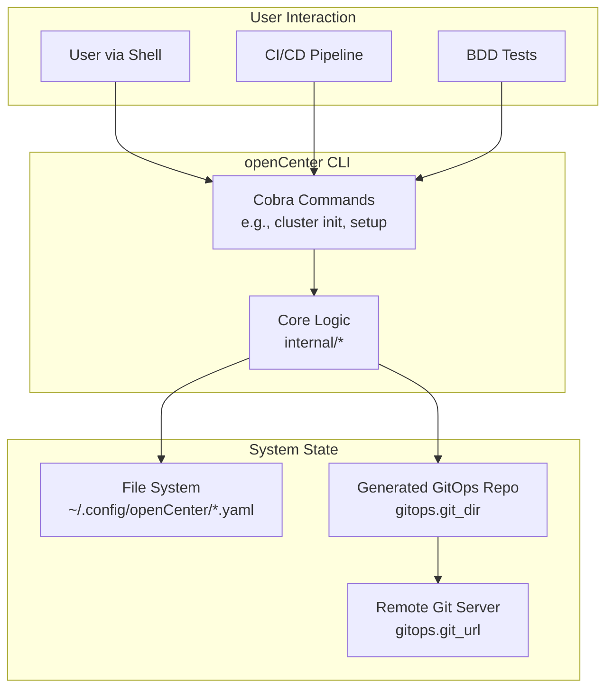

# Explanation: Architecture

This document provides a high-level overview of the `openCenter` architecture, its key components, and the flow of data through the system.

## Core Philosophy

The fundamental purpose of `openCenter` is to act as a **configuration-driven scaffolding tool**. It takes a single, declarative YAML file that describes a cluster and uses it to generate a fully-formed **GitOps repository**.

This approach provides a standardized, repeatable, and version-controlled method for bootstrapping complex cloud environments.

## Architectural Diagram

The following diagram illustrates the major components and their interactions:

## Key Components

The `openCenter` codebase is organized into several distinct components, each with a clear responsibility.

### 1. CLI Commands (`cmd/`)

This is the user-facing layer of the application. It is built using the [Cobra](https://cobra.dev/) library, which provides a robust framework for creating CLI applications.

*   Each subcommand (e.g., `cluster list`, `cluster init`) is defined in its own file (e.g., `cmd/cluster_list.go`).
*   This layer is responsible for parsing flags, arguments, and orchestrating calls to the core logic in the `internal/` packages.

### 2. Configuration Management (`internal/config/`)

This component is the heart of `openCenter`. It manages everything related to the cluster YAML files.

*   **`config.go`**: Defines the Go structs (e.g., `Config`, `Kubernetes`, `Cloud`) that map directly to the YAML structure. It also contains the logic for loading, saving, and validating configurations.
*   **`schema.go`**: Contains the logic to generate a JSON Schema from the Go structs, enabling IDE validation and autocompletion.
*   **Default Values**: When a new configuration is initialized or loaded, this component applies a set of sensible default values, so the user only needs to specify the fields they want to override.

### 3. GitOps Engine (`internal/gitops/`)

This component is responsible for turning a validated configuration into a working GitOps repository.

*   **Embedded Templates**: The source for the GitOps repository is a set of templates stored within the `internal/gitops/gitops-base-dir/` directory. These are embedded directly into the `openCenter` binary using Go's `embed.FS` feature.
*   **Rendering**: When `cluster setup --render` is run, the engine copies the embedded templates to the `gitops.git_dir` specified in the configuration.
*   **Templating**: Files with a `.tmpl` extension are processed by Go's `text/template` engine. Values from the cluster configuration (e.g., `{{ .ClusterName }}`, `{{ .Cloud.OpenStack.Region }}`) are injected into these templates. The powerful [Sprig](https://masterminds.github.io/sprig/) library is used to provide a rich set of template functions.
*   **Git Initialization**: After rendering, the `setup` command initializes a Git repository in the `git_dir`, preparing it for the `bootstrap` command.

### 4. Cloud Providers (`internal/cloud/`)

This package contains provider-specific logic. Currently, it is used for preflight checks.

*   **`internal/cloud/openstack/`**: Contains checks specific to OpenStack environments, such as verifying that OpenStack-related environment variables are set.
*   This component is designed to be extensible, allowing for new providers (e.g., AWS, GCP) to be added in the future.

## Data and Control Flow

The typical flow through the system is as follows:

1.  **`cluster init`**: A new `<name>.yaml` file is created in `~/.config/openCenter` by the **Configuration Management** component, populated with default values.
2.  **User Edits**: The user edits the YAML file to specify their desired cluster layout.
3.  **`cluster validate`**: The **Configuration Management** component loads the YAML file and runs a series of validation checks against it.
4.  **`cluster select`**: The CLI writes the name of the selected cluster to a `.active` file in the configuration directory.
5.  **`cluster setup`**:
    *   The **Configuration Management** component loads the active cluster's configuration.
    *   The **GitOps Engine** reads the configuration and uses it to render the embedded templates into the specified `gitops.git_dir`.
    *   The **GitOps Engine** initializes a Git repository in that directory.
6.  **`cluster bootstrap`**:
    *   The **GitOps Engine** adds the `gitops.git_url` as a remote, commits the rendered files, and pushes them to the remote server.

### Sources
*   `cmd/`
*   `internal/`
*   `README.md`
