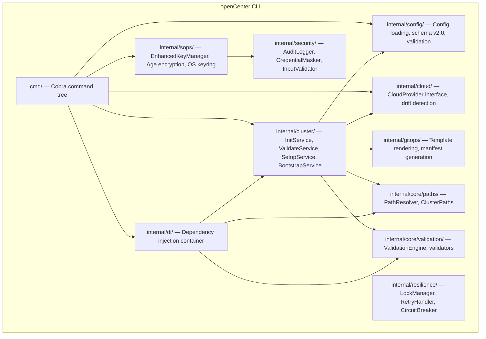
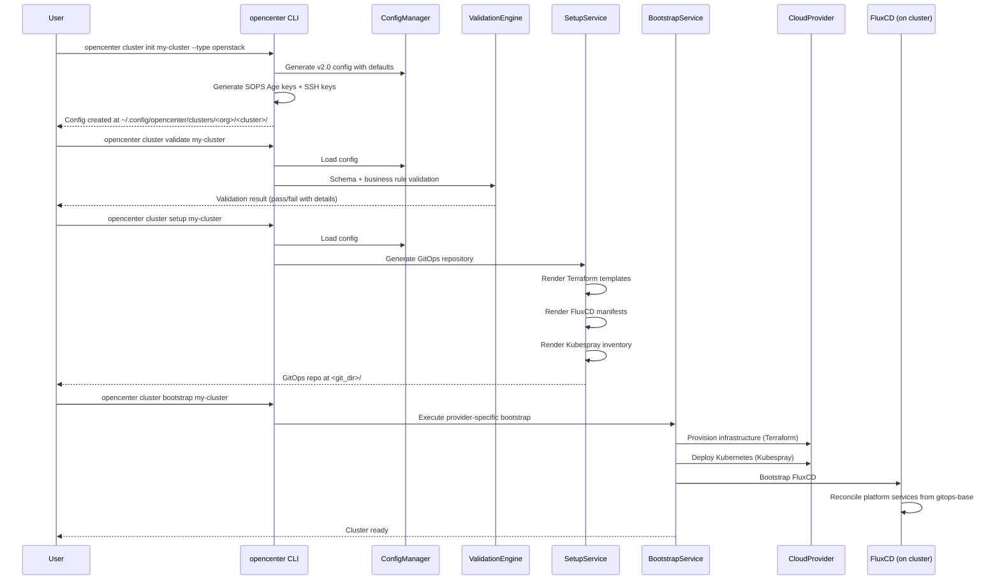

**Purpose:** For release architects and security reviewers, documents the complete GA-readiness state of the openCenter CLI for the 2026.01 release, covering implementation inventory, documentation parity, security posture, provider support, and blockers.

**Current execution tracker and ORR packet:** [`ga-orr-2026-01.md`](/Users/victor.palma/projects/openCenter-cloud/openCenter-cli/docs/ga-orr-2026-01.md)

Use the ORR packet as the current source of truth for execution status, linked evidence, checklist state, and signoff tracking. This assessment remains the baseline audit and recommended-work record.

---

# 1. Executive Summary

openCenter CLI is a Go-based tool for declarative Kubernetes cluster lifecycle management. It generates GitOps repository structures, manages SOPS-encrypted secrets, and orchestrates infrastructure provisioning across multiple cloud providers.

**GA scope (2026.01):** Four providers — `kind`, `openstack`, `vmware`, `baremetal`.

**Release versioning:** `2026.01.XX` where `XX` is the patch number. Four major releases per year (quarterly cadence).

**Current state:**

- The CLI implementation is mature. The command tree covers init, validate, preflight, setup, bootstrap, destroy, drift detection, backup, secrets management, and key lifecycle operations.
- The documentation site and CLI repo docs have been updated for the GA provider surface, including release notes, baremetal setup, planned/non-GA AWS positioning, and refreshed CLI reference pages. See the ORR packet for current evidence.
- Provider gating is implemented: `aws`, `gcp`, and `azure` are rejected at runtime with a clear error message (`cmd/provider_availability.go`).
- Security posture is strong: SOPS Age encryption with OS keyring, tamper-evident audit logging with HMAC, credential masking, Argon2 key derivation, and AES-256-GCM backup encryption.
- The deterministic GA gate passes. A broader `go test ./...` sweep still has residual failures outside that lane and remains a release decision point.

**Top risks:**

1. Human approval and signoff records are still missing across every required domain.
2. The full `go test ./...` sweep still fails in `internal/gitops`, `internal/operations`, `internal/provision`, and `tests/features/steps`.
3. CI-linked evidence has not yet been attached to the release packet; current evidence is captured from local execution.
4. The release team still needs to decide whether the deterministic GA lane or the full suite is the binding release gate.

**Overall assessment:** The planned GA implementation work is complete in the local workspace, and the deterministic GA lane is green. Release approval is still blocked on unresolved full-suite failures and missing human signoffs. See the ORR packet for the current release decision state.

---

# 2. GA Support Matrix

| Provider | Release Status | Supported Use Cases | Major Limitations | Notes |
|----------|---------------|---------------------|-------------------|-------|
| `kind` | **GA** | Local development, CI/CD testing, contributor workflows | Single control plane only; no Kubespray; no Terraform; ephemeral | Shells out to `kind` CLI; supports Docker and Podman via `CONTAINER_RUNTIME` / `KIND_EXPERIMENTAL_PROVIDER` env vars. Evidence: `internal/cloud/kind/provider.go` |
| `openstack` | **GA** | Production clusters on Rackspace OpenStack | Serial API calls required for CCM (ADR-002); OpenStack-specific services auto-included | Drift detection implemented (`internal/cloud/openstack/provider.go`). Terraform + Kubespray workflow. |
| `vmware` | **GA** | Production clusters on VMware vSphere 7.0+/8.0+ | Pre-provisioned VM model; requires vCenter API access | Terraform + Kubespray workflow. vSphere CSI driver included. Drift detection implemented in `internal/cloud/vmware/provider.go`. Use `vmware` as the canonical provider name; `vsphere` remains a compatibility alias. |
| `aws` | **Not available** | — | Rejected at runtime | `checkProviderAvailability()` returns error: "planned for a future release". Evidence: `cmd/provider_availability.go` |
| `gcp` | **Not available** | — | Rejected at runtime | Same gate as AWS. |
| `azure` | **Not available** | — | Rejected at runtime | Same gate as AWS. |
| `baremetal` | **GA** | Bring-your-own infrastructure; Kubespray deployment; FluxCD bootstrap | Does not provision hardware or OS — user provides pre-provisioned machines. No Terraform. No drift detection. | Evidence: `cmd/cluster_init.go` `--type` flag accepts `baremetal`; not in `checkProviderAvailability()` rejection list. |

---

# 3. Documentation Site Map

Proposed navigation tree for the docs site (`opencenter-docs/docs/`). Status reflects the current post-implementation state of each artifact.

| Section | Page | Status |
|---------|------|--------|
| **welcome/** | what-is-opencenter.md | existing / keep |
| | ecosystem.md | existing / keep |
| | golden-path.md | existing / keep |
| | quickstart.md | existing / keep |
| | personas.md | existing / keep |
| | glossary.md | existing / keep |
| | get-help.md | existing / keep |
| **installation/** | prerequisites.md | existing / updated |
| | cli-installation.md | existing / updated |
| | cluster-configuration.md | existing / updated |
| | validating-configuration.md | existing / updated |
| | kind-setup.md | existing / updated |
| | openstack-setup.md | existing / keep |
| | vmware-setup.md | existing / updated |
| | baremetal-setup.md | existing / created |
| | aws-provider-planned.md (moved from installation/) | existing / moved to planned non-GA section |
| **planning/** | architecture.md | existing / updated |
| | security-architecture.md | existing / keep |
| | capacity-sizing.md | existing / keep |
| | deployment-models.md | existing / updated |
| | connectivity-models.md | existing / keep |
| | provider-comparison.md | existing / updated |
| | reference-topologies.md | existing / keep |
| | reference-architecture/ | existing / keep |
| **cluster-provisioning/** | infrastructure-provisioning.md | existing / keep |
| | kubernetes-deployment.md | existing / keep |
| | fluxcd-bootstrap.md | existing / keep |
| | windows-worker-nodes.md | existing / updated (unsupported/non-GA note) |
| **cluster-operations/** | day2-overview.md | existing / keep |
| | drift-detection.md | existing / updated |
| | backup-restore.md | existing / keep |
| | kubernetes-upgrades.md | existing / keep |
| | service-upgrades.md | existing / keep |
| | add-worker-pools.md | existing / keep |
| | node-replacement.md | existing / keep |
| | resize-control-plane.md | existing / keep |
| | add-vm-disks.md | existing / keep |
| | pr-workflows.md | existing / keep |
| | cicd-integration.md | existing / keep |
| | data-portability.md | existing / keep |
| | migration-planning.md | existing / keep |
| | vmware-migration.md | existing / keep |
| **platform-services/** | service-catalog.md | existing / keep |
| | keycloak.md | existing / updated (backup durability limitation documented) |
| | (individual service pages) | existing / keep |
| **secrets/** | secrets-model.md | existing / keep |
| | sops-encryption.md | existing / keep |
| | sops-reference.md | existing / keep |
| | key-rotation.md | existing / keep |
| **security/** | defense-in-depth.md | existing / keep |
| | pod-security-admission.md | existing / keep |
| | kyverno-policy-catalog.md | existing / keep |
| | network-policies.md | existing / keep |
| | audit-evidence.md | existing / keep |
| | security-advisories.md | existing / keep |
| | airgap-compliance.md | existing / keep |
| **observability/** | stack-overview.md | existing / keep |
| | prometheus.md | existing / keep |
| | loki.md | existing / keep |
| | tempo.md | existing / keep |
| | opentelemetry.md | existing / keep |
| | dashboards-alerts.md | existing / keep |
| **application-deployment/** | (all pages) | existing / keep |
| **reference/** | cli-commands.md | existing / updated |
| | configuration-schema.md | existing / updated |
| | environment-variables.md | existing / updated |
| | default-values.md | existing / keep |
| | file-locations.md | existing / keep |
| | validation-rules.md | existing / keep |
| | customer-repo-structure.md | existing / keep |
| | fluxcd-resources.md | existing / keep |
| | kustomize-patterns.md | existing / keep |
| | helm-values-schema.md | existing / keep |
| | streaming-api.md | existing / keep |
| **releases/** | 2026-01-0.md | existing / created |
| **troubleshooting/** | (all pages) | existing / keep |
| **contributing/** | (all pages) | existing / keep |
| **blueprints/** | (all pages) | existing / keep |
| **airgap/** | (all pages) | existing / keep |
| **headlamp/** | (all pages) | existing / keep |
| **container-images/** | (all pages) | existing / keep |
| **adrs/** | (all pages) | existing / keep |

---

# 4. Architecture Document

## System Purpose

openCenter CLI (`opencenter`) is a command-line tool that manages the full lifecycle of Kubernetes clusters through a declarative YAML configuration model. It generates GitOps repository structures consumed by FluxCD, manages SOPS-encrypted secrets, and orchestrates infrastructure provisioning via OpenTofu/Terraform and Kubespray.

## Major Components



## Control Flow — Cluster Lifecycle



## Provider Abstraction Model

The CLI uses two distinct provider abstractions:

1. **Lifecycle providers** (bootstrap/destroy): Wired directly into `BootstrapService`. The Kind provider (`internal/cloud/kind/provider.go`) shells out to `kind` CLI. OpenStack and VMware use Terraform + Kubespray.

2. **Drift detection providers** (`CloudProvider` interface in `internal/cloud/factory.go`): Used by `cluster drift` command. Implementations now exist for OpenStack and VMware. AWS was removed from the GA drift registry. Kind is ephemeral, so drift detection is not applicable. Baremetal does not manage infrastructure, so drift detection is not applicable.

The `CloudProviderFactory` (`internal/cloud/factory.go`) maintains a registry of drift-detection providers. This is intentionally separate from lifecycle providers.

## Configuration Model

- Schema version: `2.0` only (v1 rejected with migration instructions)
- Root struct: `Config` in `internal/config/types.go`
- Sections: `opencenter` (cluster, infrastructure, services, gitops, meta), `opentofu`, `secrets`, `deployment`, `overrides`
- Storage: `~/.config/opencenter/clusters/<organization>/<cluster>/.<cluster>-config.yaml`
- Stages: init → preflight → setup → bootstrap → validate → (operate) → destroy
- Status tracking: pending → running → success/failed per stage

## Dependency Boundaries

| External Dependency | Purpose | Required For |
|---|---|---|
| `kind` CLI | Local cluster creation | Kind provider only |
| `kubectl` | Cluster readiness checks, kubeconfig operations | All providers |
| `terraform` / `tofu` | Infrastructure provisioning | OpenStack, VMware |
| Kubespray (Ansible) | Kubernetes deployment | OpenStack, VMware |
| `flux` CLI | GitOps bootstrap | All providers |
| `sops` | Secret encryption/decryption | All providers |
| `age-keygen` | Key generation (fallback) | Optional — CLI generates keys natively via `filippo.io/age` |
| OS keyring | Secure key storage | Optional — falls back to file storage |

## Trust Boundaries

1. **User workstation → CLI**: CLI trusts local config files. Config is validated at load time.
2. **CLI → Cloud provider APIs**: Credentials loaded from config or environment. TLS required for OpenStack/VMware.
3. **CLI → Git repositories**: SSH key authentication for FluxCD bootstrap.
4. **CLI → Local filesystem**: Config, keys, and audit logs stored with restricted permissions (0600/0700).
5. **Git repository → Kubernetes cluster**: FluxCD pulls manifests. SOPS decryption happens in-cluster.

## Error Handling

- All commands propagate errors via `fmt.Errorf` with context wrapping.
- `ConfigNotFoundError` triggers exit code 3 with remediation hints (`main.go`).
- Lock acquisition failures include guidance to check `cluster info` for lock status.
- Bootstrap is resumable — failed steps can be retried without restarting.
- Circuit breaker and retry patterns available in `internal/resilience/`.

## Observability

- Log levels: debug, info, warn (default), error. Set via `--log-level` flag or `OPENCENTER_LOG_LEVEL` env var.
- Debug mode: `OPENCENTER_DEBUG=true` enables additional artifacts.
- Audit logging: HMAC-signed JSON events at `~/.config/opencenter/audit/audit.log`. 100MB rotation, 30-day retention.
- Bootstrap logs: Per-run log files at `<git_dir>/infrastructure/clusters/<name>/logs/bootstrap-<timestamp>.log`.

---

# 5. Security Document

## Threat Model

| Threat | Impact | Likelihood | Mitigation | Evidence |
|--------|--------|------------|------------|----------|
| Plaintext secrets committed to Git | Credential exposure | Medium | SOPS Age encryption; pre-commit hook validates encryption; CLI auto-generates keys on init | `internal/sops/key_manager.go`, `.mise.toml` install-hooks task |
| Tampered audit logs | Loss of accountability | Low | HMAC-SHA256 signatures on every event; integrity verification via `VerifyIntegrity()` | `internal/security/audit_logger.go` |
| Credential leakage in logs | Credential exposure | Medium | `DefaultCredentialMasker` masks patterns (AWS keys, Age keys, passwords, tokens, bearer tokens) in all audit events | `internal/security/audit_logger.go` `maskMap()` |
| Key material on disk | Key theft | Medium | OS keyring preferred (macOS Keychain, Linux Secret Service, Windows Credential Manager); file fallback uses 0600 permissions; Argon2 + AES-256-GCM for backups | `internal/sops/key_manager.go` |
| Unauthorized cluster operations | Cluster compromise | Low | File-based locking with metadata (`internal/resilience/`); operations require explicit cluster selection | `cmd/cluster_bootstrap.go` lock acquisition |
| Supply chain attack via dependencies | Code execution | Low | Go module checksums in `go.sum`; dependencies pinned in `go.mod` | `go.mod`, `go.sum` |
| Command injection via config values | Code execution | Low | Template sandboxing (`internal/template/`); input validation (`internal/security/`); command sanitization | `internal/security/` package |

## Authentication Model

The CLI does not implement its own authentication. It delegates to provider-specific credential mechanisms:

- **OpenStack:** Application credentials (`application_credential_id` + `application_credential_secret`) stored in cluster config. Barbican token auth for secrets backend (`secrets login`).
- **VMware:** vCenter username/password stored in cluster config.
- **Kind:** No authentication required (local Docker/Podman).
- **SOPS:** Age key pairs. Primary storage: OS keyring (`zalando/go-keyring`). Fallback: file at `~/.config/sops/age/<cluster>.txt` with 0600 permissions.

## Secrets and Credential Handling

### SOPS Age Encryption

- Key generation: `filippo.io/age` library generates X25519 identity pairs natively.
- Key storage hierarchy: OS keyring → encrypted file → plaintext file (0600).
- Backup encryption: Argon2id key derivation (time=1, memory=64MB, threads=4, keylen=32) → AES-256-GCM with random nonce → SHA-256 integrity checksum.
- Multi-key support: Up to 10 keys per cluster for key rotation scenarios.
- SOPS config generation: `GenerateSOPSConfig()` creates `.sops.yaml` with path-based encryption rules for secrets, SSH keys, application overlays, and infrastructure files.
- Key rotation: `RotateClusterKeys()` backs up current keys before generating replacements.

Evidence: `internal/sops/key_manager.go`

### Credential Masking

The `DefaultCredentialMasker` in `internal/security/audit_logger.go` masks sensitive fields by name (`password`, `secret`, `token`, `api_key`, `private_key`, `age_key`, `aws_access_key_id`, `aws_secret_access_key`, `application_credential_secret`, `bearer`, `authorization`) and by pattern in string values.

### Audit Logging

- Format: JSON lines, one event per line.
- Integrity: HMAC-SHA256 signature per event using a 32-byte signing key.
- Signing key: Stored at `~/.config/opencenter/audit/audit.key` (0600). Auto-generated on first use.
- Rotation: 100MB file size trigger. Rotated files named `audit.log.<timestamp>`.
- Retention: 30 days automatic cleanup.
- Event types: `key.generated`, `key.accessed`, `key.rotated`, `key.revoked`, `key.expired`, `secrets.sync`, `secrets.drift_detected`, `secrets.validated`, `secret.decrypted`, `validation.failed`, `input.rejected`, `template.validation.failed`.
- Query support: Filter by time range, event type, actor, resource, action, result, correlation ID.

Evidence: `internal/security/audit_logger.go`

### Unsafe or Bypass Flags

| Flag | Command | Risk | Mitigation |
|------|---------|------|------------|
| `--force` | `cluster init`, `cluster setup`, `cluster destroy` | Overwrites existing config/repo; skips confirmation | Explicit user intent required |
| `--skip-validation` | `cluster setup` | Generates GitOps repo without validating config | User accepts risk of invalid manifests |
| `--no-keygen` | `cluster init` | Skips SOPS/SSH key generation | User must provide keys manually |
| `--show` | `secrets get` | Prints secret to stdout | Warning printed to stderr |

### Provider-Specific Security Considerations

**Kind:**
- Runs containers with host network access (Docker/Podman).
- No TLS between CLI and cluster (localhost).
- Kubeconfig stored locally with cluster-admin privileges.
- Suitable for development only.

**OpenStack:**
- Application credentials preferred over username/password.
- Credentials stored in SOPS-encrypted config.
- Barbican integration for external secrets management.
- Serial API calls enforced for CCM to prevent race conditions (ADR-002).

**VMware:**
- vCenter credentials stored in SOPS-encrypted config.
- TLS to vCenter API (certificate handling via vSphere SDK).
- Service account with scoped permissions recommended.

---

# 6. Functionality Matrix

| Feature / Workflow | Kind | OpenStack | VMware | Baremetal | Evidence |
|---|---|---|---|---|---|
| `cluster init` | ✅ | ✅ | ✅ | ✅ | `cmd/cluster_init.go` — `--type` flag accepts all four |
| `cluster validate` | ✅ | ✅ | ✅ | ✅ | `cmd/cluster_validate.go` — provider-agnostic + `--check-provider` |
| `cluster preflight` | ✅ | ✅ | ✅ | ✅ | `cmd/cluster.go` — registered subcommand |
| `cluster setup` (GitOps generation) | ✅ | ✅ | ✅ | ✅ | `cmd/cluster_setup.go` — provider availability checked |
| `cluster bootstrap` | ✅ (kind create) | ✅ (Terraform + Kubespray) | ✅ (Terraform + Kubespray) | ✅ (Kubespray only — no Terraform) | `cmd/cluster_bootstrap.go` |
| `cluster destroy` | ✅ (kind delete) | ✅ | ✅ | ✅ | `cmd/cluster_destroy.go` — Kind-specific path |
| `cluster drift` | ❌ (not applicable) | ✅ | ✅ | ❌ (not applicable) | `internal/cloud/factory.go`, `internal/cloud/vmware/provider.go` |
| `cluster backup` | ✅ | ✅ | ✅ | ✅ | `cmd/cluster.go` — registered subcommand |
| `cluster lock/unlock` | ✅ | ✅ | ✅ | ✅ | `internal/resilience/` — file-based locking |
| `cluster credentials` | ✅ | ✅ | ✅ | ✅ | `cmd/cluster.go` — registered subcommand |
| SOPS key generation | ✅ | ✅ | ✅ | ✅ | `internal/sops/key_manager.go` |
| SOPS key rotation | ✅ | ✅ | ✅ | ✅ | `RotateClusterKeys()` |
| Audit logging | ✅ | ✅ | ✅ | ✅ | `internal/security/audit_logger.go` |
| Secrets sync | ✅ | ✅ | ✅ | ✅ | `cmd/secrets_sync.go` |
| Secrets validate (drift) | ✅ | ✅ | ✅ | ✅ | `cmd/secrets_validate.go` |
| Secrets encrypt/decrypt | ✅ | ✅ | ✅ | ✅ | `cmd/secrets_sops.go` |
| Barbican backend | ❌ (not applicable) | ✅ (GA-supported) | ❌ (not applicable) | ❌ (not applicable) | `cmd/secrets.go` — `resolveBackend()` |
| Terraform provisioning | ❌ (not used) | ✅ | ✅ | ❌ (not used — user provisions hardware) | Kind and Baremetal skip Terraform |
| Kubespray deployment | ❌ (not used) | ✅ | ✅ | ✅ | Kind creates cluster directly; Baremetal uses Kubespray on pre-provisioned machines |
| FluxCD bootstrap | ✅ | ✅ | ✅ | ✅ | `cmd/cluster_bootstrap.go` |

---

# 7. CLI-to-Docs Parity Matrix

| Item Type | Name / Path | Implemented | Documented (docs site) | Documented (CLI repo) | Evidence | Status | Recommended Fix | Severity |
|---|---|---|---|---|---|---|---|---|
| Provider | `aws` | Rejected at runtime; removed from GA provider surface | ✅ `planning/aws-provider-planned.md` | ✅ `reference/providers.md`, `providers/README.md` | `cmd/provider_availability.go` | **Resolved** | Completed: AWS setup content was moved out of Installation and reframed as planned / non-GA. | High |
| Provider | `baremetal` | Accepted by `--type` flag; GA provider | ✅ `installation/baremetal-setup.md` | Partial | `cmd/cluster_init.go`, `docs/reference/providers.md` | **Partial** | Dedicated CLI-repo baremetal page is still missing, although provider index/reference coverage exists. | High |
| Help text | Root command Long description | Lists OpenStack, VMware, Kind, Baremetal | N/A | N/A | `cmd/root.go` | **Resolved** | Completed: AWS was removed from root help text. | High |
| Command | `cluster init --type` | Accepts: openstack, baremetal, kind, vmware | Partial | Partial | `cmd/cluster_init.go` flag definition | **Partial** | Exact accepted values are reflected in provider/config docs, but the CLI reference does not enumerate the `--type` values inline. | Medium |
| Command | `cluster drift` | Implemented with OpenStack and VMware coverage | ✅ `cluster-operations/drift-detection.md` | ✅ `explanation/drift-detection.md`, `reference/providers.md` | `cmd/cluster_drift.go`, `internal/cloud/vmware/provider.go` | **Resolved** | Completed: VMware drift detection is implemented and documented; Kind and Baremetal remain intentionally not applicable. | Medium |
| Command | `secrets encrypt` | Implemented | ✅ `secrets/sops-encryption.md` | ✅ `how-to/manage-secrets.md` | `cmd/secrets_sops.go` | OK | — | — |
| Command | `secrets decrypt` | Implemented | ✅ | ✅ | `cmd/secrets_sops.go` | OK | — | — |
| Command | `secrets status` | Implemented | ✅ | ✅ | `cmd/secrets_sops.go` | OK | — | — |
| Command | `secrets keys generate` | Implemented | ✅ | ✅ | `cmd/secrets_keys.go`, `docs/reference/cli-commands.md` | **Resolved** | Completed: both doc sets now list the command. | Low |
| Command | `secrets keys rotate` | Implemented | ✅ `secrets/key-rotation.md` | ✅ | `cmd/secrets_keys.go` | OK | — | — |
| Command | `secrets keys backup` | Implemented | Partial | Partial | `cmd/secrets_keys.go`, `docs/how-to/manage-secrets.md` | **Partial** | Command references exist, but a docs-site backup/restore workflow remains thin. | Medium |
| Command | `secrets keys validate` | Implemented | ✅ | ✅ | `cmd/secrets_keys.go`, `docs/reference/cli-commands.md` | **Resolved** | Completed: both doc sets now list the command. | Low |
| Command | `cluster validate-manifests` | Implemented | ✅ | ✅ | `cmd/cluster.go`, `docs/reference/cli-commands.md` | **Resolved** | Completed: command added to both CLI references. | Medium |
| Command | `cluster rotate-keys` | Implemented | ✅ `secrets/key-rotation.md` | ✅ | `cmd/cluster.go` | OK | — | — |
| Command | `cluster check-keys` | Implemented | ✅ | ✅ | `cmd/cluster.go`, `docs/reference/cli-commands.md` | **Resolved** | Completed: command added to both CLI references. | Low |
| Command | `cluster audit-log` | Implemented | ✅ `security/audit-evidence.md` | ✅ | `cmd/cluster.go`, `docs/reference/cli-commands.md` | OK | — | — |
| Command | `cluster revoke-key` | Implemented | ✅ | ✅ | `cmd/cluster.go`, `docs/reference/cli-commands.md` | **Resolved** | Completed: command added to both CLI references. | Medium |
| Command | `cluster install-hooks` | Implemented | ✅ | ✅ | `cmd/cluster.go`, `docs/reference/cli-commands.md` | **Resolved** | Completed: command added to both CLI references. | Low |
| Command | `cluster keys` | Implemented | ✅ | ✅ | `cmd/cluster.go`, `docs/reference/cli-commands.md` | **Resolved** | Completed: command added to both CLI references. | Low |
| Command | `cluster template` | Implemented (hidden/internal) | ❌ | ❌ | `cmd/cluster.go` | **Open** | Still undocumented. Decide whether to document it or keep it intentionally internal and remove it from parity expectations. | Low |
| Command | `cluster render` | Implemented | ✅ | ✅ | `cmd/cluster.go`, `docs/reference/cli-commands.md` | **Resolved** | Completed: command is now present in both references. | Low |
| Command | `cluster config` | Implemented | ✅ | ✅ | `cmd/cluster.go`, `docs/reference/cli-commands.md` | **Resolved** | Completed: subcommands are now listed in both references. | Low |
| Env var | `OPENCENTER_CONFIG_DIR` | ✅ | ✅ `reference/environment-variables.md` | ✅ `reference/environment-variables.md` | `cmd/root.go`, `main.go` | OK | — | — |
| Env var | `OPENCENTER_LOG_LEVEL` | ✅ | ✅ | ✅ | `cmd/root.go` `PersistentPreRunE` | OK | — | — |
| Env var | `OPENCENTER_DEBUG` | ✅ | Partial | Partial | `README.md`, `.mise.toml` | **Partial** | Behavior is described in repo-level docs, but not yet promoted into the primary environment-variable references. | Low |
| Env var | `CONTAINER_RUNTIME` | ✅ | ❌ | ❌ | `internal/cloud/kind/provider.go` `ResolveRuntime()` | **Open** | Add `CONTAINER_RUNTIME` to the environment-variable references and Kind setup docs. | Low |
| Env var | `KIND_EXPERIMENTAL_PROVIDER` | ✅ | ✅ | ✅ | `internal/cloud/kind/provider.go` `ResolveRuntime()`, `reference/environment-variables.md` | **Resolved** | Completed: env-var references were added. | Low |
| Env var | `SOPS_AGE_KEY_FILE` | Referenced for manual SOPS workflows | Partial | ✅ | `docs/reference/environment-variables.md`, `docs/how-to/manage-secrets.md` | **Partial** | Docs site still documents this mostly in SOPS/secrets pages rather than the primary environment-variable reference. | Low |
| Global flag | `--config` | ✅ | ✅ | ✅ | `cmd/root.go` `addGlobalFlags()` | **Resolved** | Completed: global flag is now included in both CLI references. | Low |
| Global flag | `--dry-run` | ✅ | ✅ | ✅ | `cmd/root.go` `addGlobalFlags()` | **Resolved** | Completed: global flag is now included in both CLI references. | Low |
| Global flag | `--log-level` | ✅ | ✅ | ✅ | `cmd/root.go` `addGlobalFlags()` | OK | — | — |
| Global flag | `--set` | ✅ | ✅ | ✅ | `cmd/root.go` `addGlobalFlags()`, `docs/reference/cli-commands.md` | **Resolved** | Completed: dot-notation syntax and examples were added. | Medium |
| Global flag | `--show-active` | ✅ | ✅ | ✅ | `cmd/root.go` `addGlobalFlags()`, `docs/reference/cli-commands.md` | **Resolved** | Completed: global flag is now included in both CLI references. | Low |
| Global flag | `--config-dir` | ✅ (legacy) | Partial | Partial | `cmd/root.go` `addGlobalFlags()` | **Partial** | The flag is listed, but the legacy status and preference for `OPENCENTER_CONFIG_DIR` are not yet consistently called out. | Low |
| Release notes | 2026.01 | N/A | ✅ `releases/2026-01-0.md` | N/A | `opencenter-docs/docs/releases/2026-01-0.md` | **Resolved** | Completed: release notes exist and the Releases sidebar section was restored. | High |
| Build targets | Supported platforms | linux/amd64, linux/arm64, darwin/amd64, darwin/arm64 | ✅ `installation/cli-installation.md` | ✅ `.mise.toml` build-all task | `.mise.toml` | OK | — | — |
| Build targets | Windows | Not supported (platform-specific file locking) | ✅ | Partial | `installation/cli-installation.md`, `releases/2026-01-0.md`, `windows-worker-nodes.md` | **Resolved** | Completed: user-facing docs now state Windows is outside the GA support boundary. | Medium |
| Schema version | v2.0 only | ✅ | ✅ | ✅ | `internal/config/types.go`, `docs/reference/configuration-schema.md` | **Resolved** | Completed: both doc sets now state that the CLI generates v2-only configuration and that v1 must be migrated. | Medium |
| Plugin system | `plugins` command | ✅ | Partial | Partial | `cmd/root.go` `NewPluginsCmd()`, `docs/reference/cli-commands.md` | **Partial** | Command references exist, but there is still no dedicated plugin usage guide. | Medium |
| Shell integration | `shell-init` command | ✅ | ✅ | ✅ | `cmd/shell_init.go`, `docs/reference/cli-commands.md` | **Resolved** | Completed: command references now cover shell integration. | Low |

---

# 8. Provider-Specific Pages

## 8a. Kind Provider — GA

### Purpose and When to Use

Kind (Kubernetes in Docker) creates local, ephemeral Kubernetes clusters inside Docker or Podman containers. Use it for:

- Local development and testing of openCenter configurations
- CI/CD pipeline testing
- Contributor workflows
- Validating GitOps manifests before production deployment

Do not use Kind for production workloads.

### Prerequisites

- Docker Desktop or Podman installed and running
- `kind` CLI installed (version compatible with target Kubernetes version)
- `kubectl` installed
- 8GB+ RAM available for the container runtime
- Ports 80 and 443 available on the host (for service port mapping)

Evidence: `internal/cloud/kind/provider.go` requires `kind` and `kubectl` on PATH.

### Authentication Model and Credential Sources

Kind requires no cloud credentials. The `kind` CLI interacts with the local Docker/Podman socket.

Container runtime selection precedence (from `ResolveRuntime()` in `internal/cloud/kind/provider.go`):
1. Explicit `--container-runtime` flag on `cluster bootstrap`
2. `CONTAINER_RUNTIME` environment variable
3. `KIND_EXPERIMENTAL_PROVIDER` environment variable
4. Default: `docker`

### Required Permissions

- Docker socket access (user must be in `docker` group or use rootless Docker)
- For Podman: rootless Podman configured, or root access

### Network Requirements

- Kind uses internal Docker networking
- Host port mapping for LoadBalancer services (no MetalLB)
- No external network access required for cluster creation (images pulled from registries)

### Storage Requirements

- Local path provisioner (no Longhorn, no CSI drivers)
- Ephemeral — data lost on cluster deletion

### Configuration Example

```yaml
opencenter:
  cluster:
    cluster_name: dev-cluster
  meta:
    organization: dev-team
  infrastructure:
    provider: kind
    cloud:
      kind:
        workers: 2
        control_planes: 1
        kubernetes_version: "1.33.5"
        runtime: docker  # or "podman"
        cluster_name_override: ""  # optional: override kind cluster name
```

### End-to-End Workflow

```bash
# Initialize
opencenter cluster init dev-cluster --org dev-team --type kind

# Configure
opencenter cluster edit dev-cluster

# Validate
opencenter cluster validate dev-cluster

# Generate GitOps repository
opencenter cluster setup dev-cluster

# Create cluster and bootstrap FluxCD
opencenter cluster bootstrap dev-cluster

# Verify
kubectl cluster-info --context kind-dev-cluster
kubectl get nodes
kubectl get kustomizations -n flux-system

# Destroy
opencenter cluster destroy dev-cluster
```

### Common Failure Modes

| Failure | Cause | Fix |
|---------|-------|-----|
| `kind create cluster` fails | Docker not running or insufficient resources | Start Docker; allocate ≥4GB RAM, ≥2 CPUs |
| Port conflict on 80/443 | Another process using the ports | Stop conflicting process or change Kind port mapping |
| `kubectl cluster-info` fails after create | Kubeconfig not exported | Run `kind export kubeconfig --name <cluster>` |
| Podman: cluster creation hangs | Podman socket not configured | Ensure `podman machine start` has been run |

### Limitations

- Single control plane only (no HA)
- No Kubespray — Kind creates the cluster directly
- No Terraform — no infrastructure provisioning
- No drift detection provider
- No persistent storage across cluster recreations
- Not suitable for performance testing (shared host resources)
- Port mapping instead of real load balancers

### Security Considerations

- Kubeconfig grants cluster-admin access — protect the file
- Containers run with host network access
- No TLS between CLI and cluster (localhost communication)
- No RBAC enforcement by default (single-user development)

---

## 8b. OpenStack Provider — GA

### Purpose and When to Use

OpenStack provider deploys production Kubernetes clusters on Rackspace OpenStack (or compatible OpenStack deployments). Use it for:

- Production workloads requiring HA control planes
- Multi-tenant environments with organization-based isolation
- Environments requiring Barbican secrets management
- Deployments needing OpenStack-native integrations (Cinder CSI, OpenStack CCM)

### Prerequisites

- Rackspace OpenStack account with API access
- Application credentials created (preferred over username/password)
- Network and subnet pre-provisioned (or permissions to create)
- Floating IP pool available (if using floating IPs for load balancers)
- Ubuntu 24.04 image available in the project
- Sufficient quota for VMs, volumes, floating IPs, security groups
- `terraform` or `tofu` CLI installed
- Ansible installed (for Kubespray)

### Authentication Model and Credential Sources

OpenStack uses application credentials stored in the cluster configuration:

```yaml
opencenter:
  infrastructure:
    cloud:
      openstack:
        auth_url: https://identity.api.rackspacecloud.com/v3
        region: sjc3
        application_credential_id: <id>
        application_credential_secret: <secret>
```

Credentials are encrypted with SOPS when stored in the GitOps repository. The `secrets login` command supports Barbican token authentication for the secrets backend.

Evidence: `cmd/secrets.go` `newSecretsLoginCmd()` — Barbican-specific login flow.

### Required Permissions / Roles

- Compute: create/delete/list servers
- Network: create/delete/list networks, subnets, ports, security groups, floating IPs
- Block Storage: create/delete/list volumes
- Load Balancer: create/delete/list load balancers (Octavia)
- Identity: application credential management

### Network Requirements

- Pre-provisioned network and subnet, or permissions to create
- Floating IP pool for external access
- Security groups auto-created by Terraform templates
- Serial API calls enforced for Cloud Controller Manager (ADR-002) to prevent load balancer race conditions

### Storage Requirements

- Cinder block storage for persistent volumes
- OpenStack CSI driver (`openstack-csi`) auto-included in service set
- External snapshotter for volume snapshot support
- Default StorageClass: `cinder-default` with `volumeType: __DEFAULT__`

### Configuration Example

```yaml
opencenter:
  cluster:
    cluster_name: prod-cluster
  meta:
    organization: my-org
  infrastructure:
    provider: openstack
    cloud:
      openstack:
        auth_url: https://identity.api.rackspacecloud.com/v3
        region: sjc3
        application_credential_id: ${OPENSTACK_APP_CRED_ID}
        application_credential_secret: ${OPENSTACK_APP_CRED_SECRET}
        network_name: my-network
        subnet_id: <subnet-uuid>
        floating_ip_pool: external
        image: Ubuntu-24.04
        flavor_control_plane: general1-8
        flavor_worker: general1-16
        availability_zone: nova
```

### End-to-End Workflow

```bash
# Initialize
opencenter cluster init prod-cluster --org my-org --type openstack

# Configure
opencenter cluster edit prod-cluster

# Validate (checks OpenStack API connectivity)
opencenter cluster validate prod-cluster --check-connectivity

# Generate GitOps repository
opencenter cluster setup prod-cluster

# Provision infrastructure
cd customers/my-org/infrastructure/clusters/prod-cluster/
terraform init && terraform apply

# Bootstrap FluxCD
opencenter cluster bootstrap prod-cluster

# Verify
kubectl get nodes
kubectl get kustomizations -n flux-system
```

### Common Failure Modes

| Failure | Cause | Fix |
|---------|-------|-----|
| Terraform apply fails with quota error | Insufficient OpenStack quota | Request quota increase or reduce node count |
| Application credential expired | Credentials have TTL | Regenerate credentials and update config |
| Load balancer creation timeout | Octavia service overloaded | Retry; serial API calls mitigate race conditions |
| Kubespray fails to reach nodes | Security group rules too restrictive | Verify SSH access from bastion to nodes |
| SOPS decryption fails in FluxCD | Age key secret missing in cluster | Recreate `sops-age` secret in `flux-system` namespace |

### Limitations

- Serial API calls for CCM reduce load balancer provisioning throughput
- Application credentials are project-scoped (no cross-project operations)
- Floating IP pool must be pre-configured
- Drift detection available but reconciliation is best-effort

### Security Considerations

- Application credentials preferred over username/password (scoped, revocable)
- All credentials SOPS-encrypted in GitOps repository
- Barbican integration available for external secrets management
- Network security groups auto-provisioned with least-privilege rules
- TLS required for Keystone API communication

---

## 8c. VMware vSphere Provider — GA

### Purpose and When to Use

VMware vSphere provider deploys production Kubernetes clusters on VMware infrastructure using pre-provisioned or template-based VMs. Use it for:

- On-premises production deployments
- Environments with existing VMware infrastructure
- Organizations requiring vSphere CSI for persistent storage
- Deployments where VMs are pre-provisioned by infrastructure teams

### Prerequisites

- VMware vSphere 7.0+ or 8.0+ environment
- vCenter Server with API access
- Service account with VM lifecycle, datastore, and network permissions
- VM template (Ubuntu 24.04) uploaded to vCenter content library or datastore
- DHCP or static IP range available for cluster nodes
- `terraform` or `tofu` CLI installed
- Ansible installed (for Kubespray)

### Authentication Model and Credential Sources

VMware uses vCenter credentials stored in the cluster configuration:

```yaml
opencenter:
  infrastructure:
    cloud:
      vmware:
        vcenter_server: vcenter.example.com
        username: ${VSPHERE_USER}
        password: ${VSPHERE_PASSWORD}
```

Credentials are encrypted with SOPS when stored in the GitOps repository.

### Required Permissions

- Virtual Machine: create, delete, power on/off, reconfigure, snapshot
- Datastore: allocate space, browse datastore
- Network: assign network
- Resource Pool: assign VM to resource pool
- Content Library: read (for VM templates)
- Folder: create/delete VM folders

### Network Requirements

- VM Network or distributed port group accessible to all cluster nodes
- Static IP assignment recommended for production (configured in Kubespray inventory)
- MetalLB for LoadBalancer service type (no cloud load balancer)

### Storage Requirements

- vSphere CSI driver (`vsphere-csi`) auto-included in service set
- Datastore with sufficient capacity for node disks and persistent volumes
- Default StorageClass uses thin provisioning on the configured datastore
- VMDK-backed persistent volumes

### Configuration Example

```yaml
opencenter:
  cluster:
    cluster_name: prod-cluster
  meta:
    organization: my-org
  infrastructure:
    provider: vmware
    cloud:
      vmware:
        vcenter_server: vcenter.example.com
        username: ${VSPHERE_USER}
        password: ${VSPHERE_PASSWORD}
        datacenter: DC1
        cluster: Cluster1
        datastore: datastore1
        network: VM Network
        template: ubuntu-24.04-template
        folder: /DC1/vm/opencenter
        resource_pool: /DC1/host/Cluster1/Resources
        control_plane:
          cpus: 4
          memory_mb: 8192
          disk_gb: 100
        worker:
          cpus: 8
          memory_mb: 16384
          disk_gb: 200
```

### End-to-End Workflow

```bash
# Initialize
opencenter cluster init prod-cluster --org my-org --type vmware

# Configure
opencenter cluster edit prod-cluster

# Validate
opencenter cluster validate prod-cluster

# Generate GitOps repository
opencenter cluster setup prod-cluster

# Provision infrastructure
cd customers/my-org/infrastructure/clusters/prod-cluster/
terraform init && terraform apply

# Bootstrap FluxCD
opencenter cluster bootstrap prod-cluster

# Verify
kubectl get nodes
kubectl get pods -n vmware-system-csi
kubectl get csidrivers | grep vsphere
kubectl get storageclass
```

### Common Failure Modes

| Failure | Cause | Fix |
|---------|-------|-----|
| Terraform fails to clone template | Template not found or permissions insufficient | Verify template path and service account permissions |
| VM creation fails with datastore error | Insufficient datastore capacity | Free space or use a different datastore |
| Kubespray fails SSH connection | Firewall rules or SSH key mismatch | Verify network connectivity and SSH key configuration |
| vSphere CSI driver pods crash | vCenter credentials incorrect or expired | Update credentials in cluster config and re-encrypt |
| MetalLB fails to assign IPs | IP range conflicts with existing DHCP | Configure non-overlapping IP range for MetalLB |

### Limitations

- Infrastructure drift detection is available, but reconciliation remains best-effort and depends on vCenter visibility into the managed VM inventory.
- No cloud-native load balancer — MetalLB provides L2/BGP load balancing
- VM template must be pre-created and maintained
- Static IP assignment requires manual inventory management
- Certificate handling for vCenter API depends on vSphere SDK defaults

### Non-Goals

- VMware NSX integration (not implemented)
- vSphere with Tanzu integration (not implemented)
- Automated VM template creation (out of scope — use Packer or manual process)

### Security Considerations

- vCenter credentials should use a dedicated service account with minimum required permissions
- All credentials SOPS-encrypted in GitOps repository
- TLS to vCenter API (certificate validation via vSphere SDK)
- Consider vCenter certificate thumbprint pinning for additional security (not currently enforced by CLI)

---

# 9. Historical GA Blockers

The table below preserves the original blocker framing, but the `Current Status` column reflects the post-implementation state in the workspace.

| # | Current Status | Severity | Historical Blocker | Why It Mattered | Fix Location | Resolution / Remaining Work |
|---|---|---|---|---|---|---|
| 1 | **Resolved** | **High** | Root command help text listed AWS as supported. | Users saw AWS in `opencenter --help` even though `cluster init --type aws` failed. | `cmd/root.go` | Completed: root help now advertises `OpenStack, VMware, Kind, Baremetal`. |
| 2 | **Partial** | **High** | `baremetal` was a GA provider with no docs. | Users could initialize baremetal clusters without a provider guide. | `opencenter-docs/docs/installation/`, `openCenter-cli/docs/providers/` | Docs site now has `baremetal-setup.md` and provider-comparison coverage. A dedicated CLI-repo baremetal page is still missing. |
| 3 | **Resolved** | **High** | `opencenter-docs/docs/releases/` was empty. | GA release packaging needs release notes. | `opencenter-docs/docs/releases/` | Completed: `2026-01-0.md` exists and the Releases sidebar section was restored. |
| 4 | **Resolved** | **High** | `cluster bootstrap` help mentioned AWS/GCP/Azure. | Non-GA providers appeared in a core help path. | `cmd/cluster_bootstrap.go` | Completed: help text now describes the GA provider behavior only. |
| 5 | **Resolved** | **Medium** | The AWS setup page exposed copy-pasteable non-GA commands. | Search users could land on guidance that cannot work for GA. | `opencenter-docs/docs/installation/aws-setup.md` | Completed: AWS content was moved to `planning/aws-provider-planned.md` and removed from Installation. |
| 6 | **Resolved** | **High** | VMware lacked a drift detection provider. | `cluster drift` on VMware was a genuine product gap. | `internal/cloud/factory.go`, `internal/cloud/vmware/` | Completed: VMware drift backend implemented and registered. |
| 7 | **Resolved** | **Medium** | Drift docs did not explain provider coverage. | Users could assume Kind/Baremetal drift support existed. | `opencenter-docs/docs/cluster-operations/drift-detection.md`, `openCenter-cli/docs/explanation/drift-detection.md` | Completed: provider support tables now describe OpenStack/VMware coverage and the non-applicable providers. |
| 8 | **Partial** | **Medium** | Several implemented commands were missing from CLI references. | Feature discoverability lagged behind the actual command tree. | `opencenter-docs/docs/reference/cli-commands.md`, `openCenter-cli/docs/reference/cli-commands.md` | Most items are resolved (`validate-manifests`, `install-hooks`, `cluster keys`, `shell-init`, `plugins`, config subcommands). `cluster template` remains undocumented and should either be documented or removed from parity expectations. |
| 9 | **Resolved** | **Medium** | `--set` lacked dot-notation docs. | Users had to read source to learn override syntax. | `opencenter-docs/docs/reference/cli-commands.md` | Completed: both CLI references now include `--set` examples. |
| 10 | **Resolved** | **Medium** | Windows unsupported status was undocumented. | Windows users had no clear GA support boundary. | `opencenter-docs/docs/releases/`, `opencenter-docs/docs/installation/cli-installation.md` | Completed: install and release docs now scope the GA support boundary to macOS/Linux and mark Windows worker content as unsupported/non-GA. |
| 11 | **Resolved** | **Medium** | Keycloak backup durability limitation was undocumented. | Operators could overestimate the platform-owned recovery story. | `opencenter-docs/docs/platform-services/`, `openCenter-cli/docs/open-tasks.md` | Completed: Keycloak docs and release notes now call out the operator-owned durability boundary. |
| 12 | **Resolved** | **Medium** | Deterministic config diff test asserted the wrong field. | Broke the default test signal. | `internal/config/comparison_test.go` | Completed: assertion was corrected. |
| 13 | **Resolved** | **Medium** | Active-cluster test failed because the parent directory was missing. | Broke the deterministic test lane. | `internal/config/config_test.go`, `internal/config/manager.go` | Completed: parent-directory handling now matches the test contract. |
| 14 | **Resolved** | **Medium** | Resolver property tests generated invalid empty env values. | Test contract disagreed with runtime behavior. | `internal/config/v2/resolver_property_test.go` | Completed: property generators/contracts were aligned. |
| 15 | **Resolved** | **Medium** | Max-depth property test used the wrong depth model. | Produced false expectations against resolver traversal. | `internal/config/v2/resolver_property_test.go` | Completed: property expectations were updated to match traversal semantics. |
| 16 | **Partial** | **Medium** | No test-tier separation existed. | Flaky/perf/property tests polluted the default release signal. | `.mise.toml`, CI configuration | `.mise.toml` now defines deterministic, property, integration, and perf lanes, and the memory regression test moved out of the default path. CI wiring, seed-capture guidance, and release-gate policy are still not fully closed. |
| 17 | **Resolved** | **Low** | `KIND_EXPERIMENTAL_PROVIDER` was undocumented. | Podman users lacked a supported discovery path. | `opencenter-docs/docs/reference/environment-variables.md` | Completed: env-var references now include it. |
| 18 | **Resolved** | **Low** | CLI installation docs referenced `v1.0.0`. | Versioned install examples were wrong for GA. | `opencenter-docs/docs/installation/cli-installation.md` | Completed: install guidance now matches the 2026.01 release line. |
| 19 | **Open** | **Low** | Three disabled config test stubs remain. | Dead code violates cleanup expectations even if it does not block release behavior. | `internal/config/config_test.go` | Still open: the `_DISABLED` tests are still present and should be deleted. |
| 20 | **Resolved** | **Low** | Shared test fixtures were invalid for schema v2. | Fixture drift caused repeated false negatives. | `cmd/`, `internal/config/`, `internal/config/v2/` test files | Completed: valid v2 fixture builders were centralized and reused. |
| 21 | **Partial** | **Low** | Developer testing docs did not match the real test tiers. | Contributors could not tell which lanes were deterministic. | `docs/dev/testing-guide.md`, `docs/reference/mise-tasks.md` | `docs/reference/mise-tasks.md` reflects the new lanes, but `docs/dev/testing-guide.md` still needs a full refresh. |
| 22 | **Resolved** | **Medium** | AWS drift code remained even though AWS is non-GA. | Dead code increased maintenance and attack surface. | `internal/cloud/aws/`, `go.mod` | Completed: AWS drift provider was removed and dependencies were pruned. |

Current release blockers after the original audit are now procedural rather than implementation-only: missing human signoffs, missing CI-linked evidence in the release packet, and unresolved failures outside the deterministic GA lane. Those are tracked in [`ga-orr-2026-01.md`](/Users/victor.palma/projects/openCenter-cloud/openCenter-cli/docs/ga-orr-2026-01.md).

---

# 10. Historical PR Plan

This PR plan is retained as the original execution sketch. Current status: PR 1, PR 2, PR 3, and PR 5 are effectively complete in the workspace; PR 4, PR 6, and PR 7 are only partially complete. The remaining release work is now centered on evidence, signoffs, and the final release-gate decision tracked in the ORR packet.

## PR 1: Code — Critical test fixes (Blockers #12, #13, #14, #15) — CRITICAL PATH

**Scope:** Code-only. Test-contract alignment — no production logic changes. A green test suite is a hard GA gate; this PR unblocks the release.

- `internal/config/comparison_test.go`: Fix `TestCompareConfigs_ServiceMapChanges` to assert on the `Email` field diff instead of `Enabled`; normalize or ignore metadata timestamps.
- `internal/config/config_test.go`: Fix `TestActiveClusterOperations` to create the parent clusters directory before calling `SetActive()`.
- `internal/config/v2/resolver_property_test.go`: Constrain `TestProperty_ReferenceResolutionCorrectness` generators to produce non-empty env values when success is expected.
- `internal/config/v2/resolver_property_test.go`: Update `TestProperty_MaxDepthProtection` to match actual resolver traversal semantics.

**Verification:** `go test ./internal/config/... -count=1` and `go test ./internal/config/v2/... -count=1` both green.

## PR 2: Code — Provider help text and bootstrap fixes (Blockers #1, #4)

**Scope:** Code-only. Minimal, safe changes.

- `cmd/root.go`: Remove "AWS" from root command Long description. Change to "Multi-cloud provider support (OpenStack, VMware, Kind, Baremetal)".
- `cmd/cluster_bootstrap.go`: Update Long description to remove "AWS/GCP/Azure" from the provider list. Change to "OpenStack/VMware: Runs Terraform to provision infrastructure".

**Important:** Do NOT add `baremetal` to `checkProviderAvailability()` — it is a GA provider. Do NOT remove `baremetal` from the `--type` flag.

**Tests:** Verify `opencenter --help` no longer mentions AWS. Verify `opencenter cluster bootstrap --help` only lists GA providers.

## PR 3: Docs — Release notes, AWS page, and version refs (Blockers #3, #5, #18)

**Scope:** Docs-only.

- Create `opencenter-docs/docs/releases/2026.01.0-release-notes.md` with:
  - GA scope and supported providers (kind, openstack, vmware, baremetal)
  - Known issues (Keycloak backup limitation)
  - Windows unsupported statement
  - Installation instructions
  - Upgrade notes
- Update `opencenter-docs/docs/installation/aws-setup.md`: add a second admonition at the bottom; add `draft: true` or `unlisted: true` in frontmatter to exclude from navigation/search if Docusaurus supports it; alternatively move to `planned/aws-setup.md`.
- Update `opencenter-docs/docs/installation/cli-installation.md`: replace `v1.0.0` references with `2026.01.0` or a version variable.

## PR 4: Docs — Baremetal provider page and provider docs (Blockers #2, #10, #11)

**Scope:** Docs-only.

- Create `opencenter-docs/docs/installation/baremetal-setup.md` provider page covering:
  - Purpose: bring-your-own infrastructure (pre-provisioned machines)
  - Prerequisites: pre-provisioned machines with SSH access, Ubuntu 24.04
  - Limitations: no hardware/OS provisioning, no Terraform, no drift detection
  - Workflow: init → edit → validate → setup → bootstrap (Kubespray takes a list of VMs + FluxCD — code is implemented)
  - Configuration example with VM inventory
- Add baremetal to `opencenter-docs/docs/planning/provider-comparison.md`.
- Add Windows unsupported statement to installation page and release notes.
- Document Keycloak backup limitation (backups lost on pod termination; no S3/Swift upload) in the Keycloak service page and release notes known-issues section.

## PR 5: Code — VMware drift detection provider (Blocker #6) — GA BLOCKER

**Scope:** Code + docs. Implements the missing VMware drift provider.

- Create `internal/cloud/vmware/provider.go` implementing the `CloudProvider` interface:
  - `GetCurrentState()`: Query vCenter API for VM state (servers, networks, storage) using existing vSphere SDK dependency.
  - `DetectDrift()`: Compare desired state from config against actual vCenter state.
  - `ReconcileDrift()`: Apply reconcilable changes (or return non-reconcilable report).
- Register the VMware provider in `CloudProviderFactory` initialization.
- Update `opencenter-docs/docs/cluster-operations/drift-detection.md` with provider support table showing: OpenStack ✅, VMware ✅, Kind ❌ (not applicable), Baremetal ❌ (not applicable).
- Update `openCenter-cli/docs/explanation/drift-detection.md` to reflect VMware support.

**Verification:** `go test ./internal/cloud/vmware/... -count=1` green. `opencenter cluster drift <vmware-cluster>` returns a valid drift report.

## PR 6: Docs — CLI reference completeness and drift docs (Blockers #7, #8, #9, #17)

**Scope:** Docs-only.

- Update `opencenter-docs/docs/reference/cli-commands.md` to include all implemented commands: `cluster validate-manifests`, `cluster install-hooks`, `cluster keys`, `cluster template`, `cluster config` (subcommands), `shell-init`, `plugins`.
- Add `--set` flag documentation with dot-notation syntax examples.
- Update `opencenter-docs/docs/reference/environment-variables.md` to include `KIND_EXPERIMENTAL_PROVIDER` and `OPENCENTER_DEBUG`.
- Add plugin system documentation (GA feature — not experimental).

## PR 7: Code — CI test tier separation and seed capture (Blocker #16)

**Scope:** Code + CI configuration.

- Define explicit CI lanes in `.mise.toml` and CI config:
  - `test-unit`: deterministic package tests
  - `test-cmd`: command-layer tests (`go test ./cmd -count=1`)
  - `test-property`: property-based tests with seed capture
  - `test-integration`: tooling- or environment-dependent tests
  - `test-perf`: memory/performance regression checks
- Move `TestMemoryUsageRegression` out of the default test path into the `perf` lane.
- Wire gopter seed capture into property test failure output for reproducibility (verify `gopter` seed capture API first).
- Isolate `TestProperty_KamajiDeploymentConstraints` from shared mutable state.

**Verification:** Default `mise run test` runs only deterministic unit + cmd tests. Property and perf tests run in separate lanes.

## PR 8: Code — Dead code cleanup, AWS removal, and test fixture hardening (Blockers #19, #20, #22)

**Scope:** Code-only. Low risk.

- Delete three `_DISABLED` test stubs from `internal/config/config_test.go`.
- Remove `internal/cloud/aws/` directory (dead code — AWS is not GA).
- Remove unused AWS SDK dependencies from `go.mod` / `go.sum` (run `go mod tidy`).
- Create a shared `testutil.ValidV2Config()` builder function that produces a schema-valid v2 config with all required fields (`deployment.method`, `opentofu.backend.local.path`, SSH key placeholders, GitOps defaults).
- Migrate existing hand-written YAML fixtures in `cmd/`, `internal/config/`, and `internal/config/v2/` tests to use the shared builder where applicable.

**Verification:** `go build ./...` compiles without AWS package. `go test ./... -count=1` still green.

## PR 9: Docs — Developer testing guide refresh (Blocker #21)

**Scope:** Docs-only.

- Update `docs/dev/testing-guide.md` to document:
  - Test tier definitions (unit, cmd, property, integration, perf)
  - Which categories are deterministic vs opt-in/environment-dependent
  - How to rerun property tests with a captured seed
  - Expected commands for each tier
- Update `docs/reference/mise-tasks.md` if new dedicated test lanes are added in PR 7.

## Priority Order

1. **PR 1** (code) — **Hard GA gate**: green test suite required before release. Critical path.
2. **PR 2** (code) — Blocks GA: users hit confusing errors from provider mismatches in help text.
3. **PR 3** (docs) — Blocks GA: no release notes exist; AWS page misleads users.
4. **PR 4** (docs) — Blocks GA: baremetal is a GA provider with zero documentation.
5. **PR 5** (code + docs) — **GA blocker**: VMware drift detection must be implemented before release.
6. **PR 6** (docs) — Improves GA quality: CLI reference completeness, plugin docs.
7. **PR 7** (code + CI) — Improves GA confidence: test suite produces reliable signal; gopter seed capture.
8. **PR 8** (code) — Cleanup: dead code removal (including AWS), fixture hardening.
9. **PR 9** (docs) — Cleanup: developer testing documentation.

---

# 11. Open Questions and Assumptions

All 15 original open questions have been answered by the release architect (12 on 2026-03-21, 3 on 2026-03-21). Answers have been incorporated into the relevant sections above. No remaining unknowns.

**Key decisions recorded:**

- `baremetal` is GA — does not provision hardware or OS. Do NOT add to `checkProviderAvailability()`.
- VMware drift detection absence is a gap, not intentional. Implement before GA (Blocker #6, PR 5).
- Release versioning: `2026.01.XX` (quarterly cadence, 4 major releases/year).
- AWS is not GA. AWS drift provider in `internal/cloud/aws/` is dead code — remove for GA (Blocker #22, PR 8).
- Barbican is GA-supported for OpenStack clusters.
- Plugin system is GA — document accordingly.
- Windows is unsupported — document in release notes and installation page.
- Keycloak backup limitation is not a blocker but must be documented.
- Go 1.25.2 is confirmed correct.
- Green test suite is a hard GA gate.
- Gopter seed capture should be wired into property test failure output.
- Baremetal uses Kubespray with a list of pre-provisioned VMs. Code is available and implemented — no engineering review needed for PR 4.

---

*Document generated 2026-03-21, updated 2026-03-21 with testing tasks, answers to all 15 open questions from the release architect, and final scope decisions (VMware drift: implement before GA; AWS dead code: remove; baremetal: Kubespray integration confirmed). Evidence sourced from `openCenter-cli/` and `opencenter-docs/` repositories. Claims not backed by execution are marked "inferred from code".*
