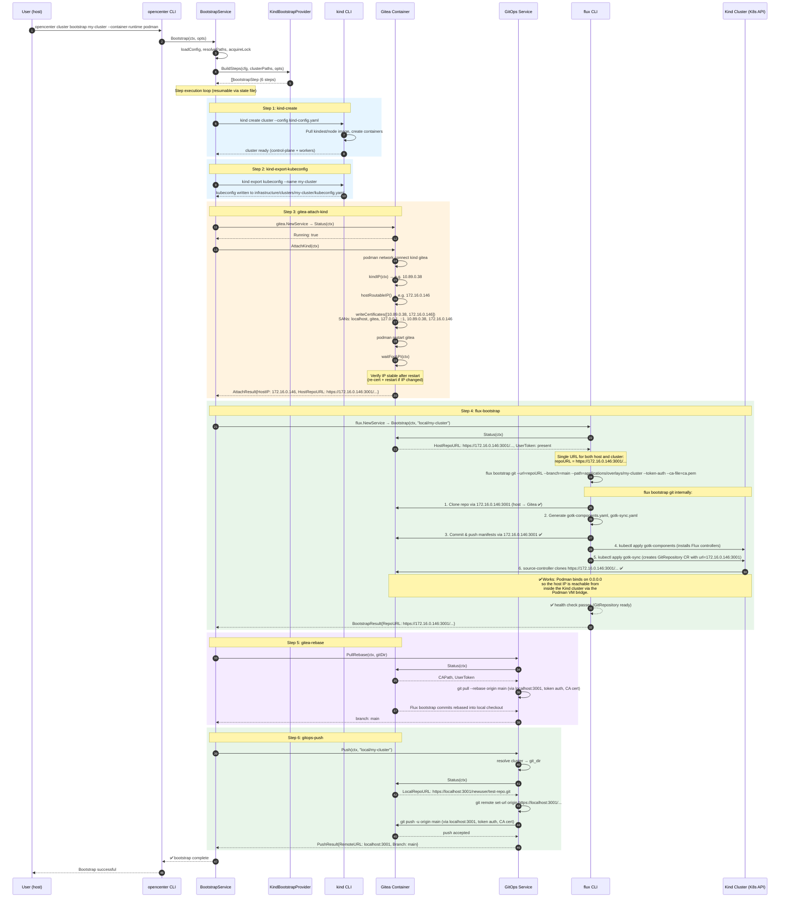

# Create a Local Kind Cluster

**Purpose:** For platform engineers and developers, shows how to stand up a local openCenter cluster on Kind with a disposable Gitea instance and FluxCD.

## Prerequisites

- Podman or Docker running
- `kind`, `flux` installed
- 8 GB RAM minimum
- This repository checked out locally

Install the CLI and the `opencenter-local` plugin:

```bash
mise run local-install
```

Verify:

```bash
opencenter version
opencenter local --help
kind --version
flux --version
```

## Bootstrap Flow

The sequence diagram below shows the internal calls made by `opencenter cluster bootstrap` for a Kind cluster. Podman binds the Gitea container port on `0.0.0.0`, so the host's routable IP (e.g. `172.16.0.146:3001`) is reachable from both the macOS host and from inside the Kind cluster. During `gitea-attach-kind`, the TLS certificate is regenerated with the host IP as a SAN, and all subsequent operations use this single URL.



The host's routable IP (`172.16.0.146`) works from both contexts because Podman binds the Gitea container port on `0.0.0.0`. The TLS certificate includes this IP as a SAN (added during `gitea-attach-kind`), so HTTPS verification succeeds everywhere. No post-bootstrap patching is needed.

## Steps

### 1. Start Local Gitea

```bash
opencenter local gitea up
```

Starts a disposable Gitea container (`docker.gitea.com/gitea:1.24.5`) and provisions a test user, API tokens, and a `test-repo` repository. State is written to `$OPENCENTER_CONFIG_DIR/local/` (typically `~/.config/opencenter/local/`).

Verify:

```bash
opencenter local gitea status
```

You should see `Running: true` and a repository URL at `https://localhost:3001/newuser/test-repo.git`.

### 2. Initialize the Cluster Configuration

```bash
opencenter cluster init my-cluster --org local --type kind
```

Creates a Kind cluster config under the `local` organization directory. Generates SOPS Age keys and an SSH key pair automatically.

Confirm the resolved paths:

```bash
opencenter cluster info my-cluster
```

### 3. Validate the Configuration

```bash
opencenter cluster validate my-cluster
```

### 4. Generate the GitOps Tree

```bash
opencenter cluster setup my-cluster --force
```

Produces the overlay tree under the cluster's `git_dir`: `applications/overlays/my-cluster/`, `infrastructure/clusters/my-cluster/`, and `secrets/`. The `flux-system/` directory does not exist yet; it is created later during bootstrap by `flux bootstrap git`.

### 5. Bootstrap the Cluster

```bash
opencenter cluster bootstrap my-cluster --container-runtime podman
```

Substitute `docker` if that is your runtime. This command runs the full Kind bootstrap sequence:

1. `kind-create` — Creates the Kind cluster using the generated `kind-config.yaml`
2. `kind-export-kubeconfig` — Exports the kubeconfig to the cluster's infrastructure directory
3. `gitea-attach-kind` — Connects the local Gitea container to the Kind network and reissues the TLS certificate with the in-cluster IP
4. `flux-bootstrap` — Runs `flux bootstrap git` against the in-cluster Gitea URL
5. `gitea-rebase` — Rebases the local checkout to include the Flux bootstrap commits from Gitea
6. `gitops-push` — Pushes the generated GitOps repository to the local Gitea instance

The command is resumable. If a step fails, fix the issue and re-run. Use `--restart` to re-run all steps from scratch, or `--from-step <id>` to resume from a specific step (e.g., `--from-step gitea-attach-kind`).

## Verification

```bash
GITOPS_DIR=$(opencenter cluster info my-cluster 2>/dev/null | grep "git_dir:" | awk '{print $2}')
export KUBECONFIG="$GITOPS_DIR/infrastructure/clusters/my-cluster/kubeconfig.yaml"

kubectl get nodes
kubectl get pods -n flux-system
flux get sources git -n flux-system
flux get kustomizations -n flux-system
```

All Kind nodes should be `Ready`, Flux pods running in `flux-system`, and the `flux-system` Git source `READY=True`.

## Cleanup

### Destroy the cluster

```bash
opencenter cluster destroy my-cluster --force
```

This runs `kind delete cluster`, removes the GitOps directory, the cluster configuration file, and the infrastructure and applications directories. It also clears the active cluster marker if `my-cluster` was selected.

The command prompts for confirmation unless `--force` is passed.

### Destroy the local Gitea instance

```bash
opencenter local gitea destroy
```

Stops the Gitea container and removes the local state directory (`$OPENCENTER_CONFIG_DIR/local/` — metadata, tokens, certificates, mounted data). This is separate from `cluster destroy` because a single Gitea instance can serve multiple local clusters.

### Verify nothing is left

```bash
kind get clusters                # should not list my-cluster
opencenter cluster list          # should not list my-cluster
```

## Troubleshooting

### `opencenter: unknown command "local"`

The plugin is not installed. Run `mise run local-install`.

### `kindest/node` Image Not Found

The selected Kubernetes version does not have a published `kindest/node` image. Pick a valid tag, update the config, then rerun:

```bash
opencenter cluster setup my-cluster --force
opencenter cluster bootstrap my-cluster --container-runtime podman --restart
```

### Bootstrap Fails at `gitea-attach-kind`

Gitea must be running before bootstrap. Verify with `opencenter local gitea status`. If it is not running, start it with `opencenter local gitea up` and re-run bootstrap.

### Bootstrap Fails at `gitops-push` With "rejected (fetch first)"

The remote Gitea repository already contains content from a previous run. Either destroy and recreate Gitea (`opencenter local gitea destroy && opencenter local gitea up`) or restart bootstrap from scratch:

```bash
opencenter cluster bootstrap my-cluster --container-runtime podman --restart
```

### Bootstrap Fails at `flux-bootstrap` With Connection Timeout

The Flux source-controller inside the cluster cannot reach Gitea at the host IP. Verify Gitea is attached to the Kind network and the host IP is set:

```bash
opencenter local gitea status
```

Check that `Kind Attached: true`, `Host IP` is set, and `Bootstrap repo URL` shows the host IP (not `localhost`). If not, re-run bootstrap from the attach step:

```bash
opencenter cluster bootstrap my-cluster --container-runtime podman --from-step gitea-attach-kind
```

If the host IP changed (e.g. after switching networks), destroy and recreate Gitea to regenerate the TLS certificate:

```bash
opencenter local gitea destroy
opencenter local gitea up
opencenter cluster bootstrap my-cluster --container-runtime podman --from-step gitea-attach-kind
```

### Stale Bootstrap Lock

If bootstrap was interrupted:

```bash
rm -f ~/.config/opencenter/locks/my-cluster.lock
opencenter cluster bootstrap my-cluster --container-runtime podman --restart
```

## Evidence

- Kind bootstrap provider (step definitions): `internal/cluster/kind_bootstrap_provider.go`
- Bootstrap service (step execution engine): `internal/cluster/bootstrap_service.go`
- Flux bootstrap logic: `internal/localdev/flux/service.go`
- GitOps push logic: `internal/localdev/gitops/service.go`
- Gitea service: `internal/localdev/gitea/service.go`
- Kind provider (create/delete/kubeconfig): `internal/cloud/kind/provider.go`
- Kind defaults: `internal/config/defaults/kind.yaml`
- Renderer vs bootstrap ownership: `docs/dev/rendering-contract.md`
