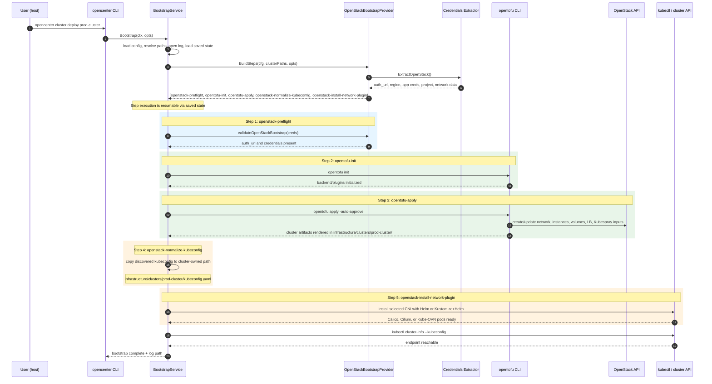

# Create an OpenStack Cluster

**Purpose:** For platform engineers and operators, shows how to generate the GitOps repository, provision OpenStack infrastructure with OpenTofu, and bring up an openCenter cluster that reconciles from Git.

This page covers the default Kubespray OpenStack flow. For Talos on OpenStack, see [Create a Talos Cluster on OpenStack](create-talos-cluster-openstack.md).

## Prerequisites

- openCenter CLI installed and on `PATH`
- `git`, `kubectl`, `openstack`, `opentofu` installed
- `flux` installed if you want to use the verification commands in the last section
- OpenStack application credentials with permission to create or manage networking, instances, volumes, security groups, and load balancer resources
- Existing OpenStack network, subnet, image, and external network IDs for the target region
- Enough quota for the default footprint: 1 bastion, 3 control planes, and 2 workers
- A Git remote for the generated GitOps repository

The current OpenStack bootstrap path reads **application credentials** from the v2 cluster config. Do not rely on username/password-only examples from older docs.

Verify local tooling and OpenStack access before you start:

```bash
opencenter version
git --version
kubectl version --client
openstack --version
opentofu version
openstack token issue
```

Useful discovery commands:

```bash
openstack image list --name Ubuntu
openstack network list
openstack subnet list
openstack network list --external
```

## Two Paths: Guided or Manual

openCenter supports two ways to configure an OpenStack cluster:

- **Guided** (`cluster configure --guided`): An interactive workflow that discovers your OpenStack resources (images, flavors, networks, availability zones) and walks you through each required field with prompts and validation. This is the recommended path for new clusters.
- **Manual** (`cluster init` + `cluster edit`): Creates a config with placeholder defaults, then you edit the YAML by hand. Useful when you already know all the values or want to script the process.

Both paths produce the same v2 configuration file. You can start with guided mode and refine with `cluster edit` afterward.

## Bootstrap Flow

The sequence diagram below shows the current OpenStack bootstrap path implemented by `opencenter cluster deploy`.



Unlike the Kind flow, the OpenStack bootstrap path does **not** run `flux bootstrap git` from the host. The host-side bootstrap sequence is OpenTofu-driven, and the command returns once the Kubernetes API is reachable. Flux and platform services continue reconciling afterward.

## Steps

### 1. Initialize the cluster configuration

You have two options here. Choose one.

#### Option A: Guided configuration (recommended)

The guided workflow creates the cluster config, authenticates to OpenStack, discovers available resources, and walks you through every required field interactively:

```bash
opencenter cluster configure prod-cluster --guided --org my-company --type openstack
```

The guided flow runs in phases:

1. **Provider authentication** — prompts for auth URL, region, project ID, project name, domain, application credential ID and secret, and optional TLS settings (insecure flag, CA bundle path). Once credentials are accepted, the CLI authenticates to Keystone and discovers available resources.
2. **Infrastructure selection** — presents discovered images, flavors, networks, subnets, external networks, and availability zones as selectable lists. If discovery fails, falls back to manual text input.
3. **Compute sizing** — prompts for control plane count (default: 3) and worker count (default: 2).
4. **Capability flows** — runs additional prompts for:
   - **Git authentication** — Git remote URL, SSH key paths, and branch.
   - **DNS** — DNS provider and cert-manager configuration (when cert-manager is enabled).
   - **Object storage** — Swift or S3 endpoint and credentials for Loki and Tempo backends (when those services are enabled).
5. **Review** — displays a summary of all changes grouped by category (Provider, Git Auth, DNS, Storage). You confirm or cancel before anything is written.

After confirmation, the CLI generates SSH and SOPS Age keys, writes managed files (such as clouds.yaml), validates the config, and saves it.

If the cluster already exists, guided mode loads the existing config and only prompts for fields that still have placeholder values or are missing.

```bash
# Re-run guided mode on an existing cluster to fill in remaining fields
opencenter cluster configure my-company/prod-cluster --guided
```

#### Option B: Manual initialization

```bash
opencenter cluster init prod-cluster --org my-company --type openstack
```

This creates a v2 config and organization-aware directory structure under:

- `~/.config/opencenter/clusters/my-company/infrastructure/clusters/prod-cluster/`
- `~/.config/opencenter/clusters/my-company/secrets/`

It also:

- writes the cluster config file to `infrastructure/clusters/prod-cluster/.prod-cluster-config.yaml`
- generates SSH keys for Git and node access
- generates SOPS Age keys
- enables OpenTofu with a local backend by default
- sets `opencenter.gitops.repository.local_dir` to the organization root (`~/.config/opencenter/clusters/my-company`) unless you override it explicitly

Additional `cluster init` flags:

| Flag | Description |
|---|---|
| `--org` | Organization name (defaults to `opencenter`) |
| `--type` | Cluster type: `openstack`, `baremetal`, `kind`, `vmware` |
| `--force` | Overwrite existing config file |
| `--no-keygen` | Skip automatic SSH and SOPS key generation |
| `--no-sops-keygen` | Skip only SOPS key generation |
| `--regenerate-keys` | Regenerate keys even if they already exist |
| `--full-schema` | Generate config with all available fields (useful as a reference) |
| `--kind-disable-default-cni` | Disable Kind's default CNI so cluster networking is managed by openCenter (Kind provider only) |
| `--server-pool` | Additional server pool configuration (repeatable) |

You can also override any config value at init time using dotted flag notation:

```bash
opencenter cluster init prod-cluster --org my-company --type openstack \
  opencenter.infrastructure.compute.master_count=5 \
  opencenter.infrastructure.compute.worker_count=3
```

Confirm the resolved paths:

```bash
opencenter cluster describe my-company/prod-cluster
```

### 2. Set OpenStack, GitOps, and cluster identity values (manual path only)

Skip this step if you used `cluster configure --guided` — the guided flow already collected these values.

Open the generated config:

```bash
opencenter cluster edit my-company/prod-cluster
```

Update the OpenStack and GitOps sections with real values. This fragment matches the fields used by the current v2 loader and render path:

```yaml
opencenter:
  meta:
    env: production
    region: sjc3

  cluster:
    cluster_fqdn: "prod-cluster.sjc3.k8s.example.com"
    admin_email: "platform@example.com"

  gitops:
    repository:
      url: "git@github.com:my-company/prod-cluster-gitops.git"
      branch: main
      # Optional: move the GitOps working tree out of ~/.config/opencenter/clusters/<org>
      # local_dir: "/Users/you/src/prod-cluster-gitops"

  infrastructure:
    cloud:
      openstack:
        auth_url: "https://identity.api.your-cloud.com/v3"
        region: sjc3
        project_id: "your-project-id"
        project_name: "your-project-name"
        tenant_name: "your-project-name"
        application_credential_id: "your-app-credential-id"
        application_credential_secret: "your-app-credential-secret"
        user_domain_name: "Default"
        project_domain_name: "Default"
        image_id: "799dcf97-3656-4361-8187-13ab1b295e33"
        availability_zone: "az1"
        network_id: "your-network-id"
        subnet_id: "your-subnet-id"
        floating_ip_pool: "PUBLICNET"
        router_external_network_id: "your-external-network-id"
        networking:
          network_id: "your-network-id"
          subnet_id: "your-subnet-id"
          floating_ip_pool: "PUBLICNET"
          router_external_network_id: "your-external-network-id"
          k8s_api_port_acl:
            - "203.0.113.0/24"
```

Notes:

- Set **both** `project_name` and `tenant_name` to the same project value. Some generated OpenStack and service templates still read `tenant_name`.
- Keep the top-level OpenStack network fields and the nested `openstack.networking` block in sync. Current validation reads the top-level fields, while some rendered OpenTofu templates still consume the nested block. The guided flow handles this automatically.
- Replace the default `repository.url` placeholder before `cluster generate` or `cluster deploy`.

### 3. Tune compute, storage, and networking

The OpenStack defaults are usable, but you should review them before provisioning. The current v2 defaults start with 3 control planes, 2 workers, Kubespray `v2.31.0`, Kubernetes `1.33.5`, Calico `v3.32.0` installed from bundled eBPF manifests after kubeconfig normalization, and a local OpenTofu state backend.

Edit these sections as needed:

```yaml
opencenter:
  infrastructure:
    compute:
      master_count: 3
      worker_count: 3
      flavor_bastion: "gp.0.2.2"
      flavor_master: "gp.0.4.8"
      flavor_worker: "gp.0.4.16"

    storage:
      default_storage_class: "csi-cinder-sc-delete"
      worker_volume_size: 40
      worker_volume_type: "HA-Standard"
      master_volume_size: 40
      master_volume_type: "HA-Standard"

    networking:
      subnet_nodes: "10.2.128.0/22"
      allocation_pool_start: "10.2.128.10"
      allocation_pool_end: "10.2.131.250"
      vrrp_ip: "10.2.128.5"
      vrrp_enabled: true
      use_octavia: false
      loadbalancer_provider: "ovn"
      dns_zone_name: "prod-cluster.sjc3.k8s.example.com"
      dns_nameservers:
        - "8.8.8.8"
        - "8.8.4.4"
      ntp_servers:
        - "time.sjc3.rackspace.com"
        - "time2.sjc3.rackspace.com"
```

If you enable `use_octavia`, review `vrrp_enabled` at the same time. The rendered infrastructure templates assume you are not trying to use both HA modes at once.

### 4. Review default services

`cluster init --type openstack` includes a set of platform services in the configuration. Some are enabled by default and others are present but disabled. The tables below reflect the defaults defined in `internal/config/v2/defaults.go` (function `defaultServiceMap`) combined with the OpenStack provider behavior defaults (function `applyProviderBehaviorDefaults`).

**Enabled by default:**

| Service | Category | Description |
|---|---|---|
| calico | Networking | CNI plugin for pod networking and network policy |
| gateway-api | Networking | Gateway API CRDs for modern ingress routing |
| gateway | Networking | Gateway API implementation (Envoy-based) |
| cert-manager | Security | Automated TLS certificate management via Let's Encrypt |
| keycloak | Security | Identity and access management (OIDC provider) |
| rbac-manager | Security | Declarative RBAC configuration (required by keycloak) |
| olm | Management | Operator Lifecycle Manager (required by keycloak) |
| postgres-operator | Management | PostgreSQL cluster management operator (required by keycloak) |
| headlamp | Management | Kubernetes dashboard with OIDC login |
| fluxcd | GitOps | GitOps continuous delivery controllers |
| sources | GitOps | FluxCD GitRepository source definitions |

**Disabled by default (present in config, set `enabled: true` to activate):**

| Service | Why disabled |
|---|---|
| kube-prometheus-stack | Observability stack (Prometheus, Grafana, Alertmanager) — enable when you need monitoring |
| loki | Log aggregation — requires object storage backend configuration |
| tempo | Distributed tracing — requires object storage backend configuration |
| harbor | Optional container registry, not needed for every cluster |
| velero | Cluster backup and disaster recovery — enable when backup strategy is defined |
| metallb | Bare-metal load balancing — OpenStack clusters use Octavia or OVN |
| openstack-ccm | OpenStack Cloud Controller Manager — enable for cloud-aware node management |
| openstack-csi | Cinder CSI driver — the storage plugin (`cinder_csi`) is enabled separately in `kubernetes.storage_plugin` |
| external-snapshotter | Volume snapshot controller — enable when you need volume snapshots |
| kyverno | Kubernetes policy enforcement engine |
| kafka-cluster | Workload-specific, enable when your applications need it |
| longhorn | Distributed storage — OpenStack clusters use Cinder CSI instead |
| mimir | Long-term metrics storage — default stack uses Prometheus local storage |
| opentelemetry-kube-stack | Alternative telemetry pipeline, overlaps with Prometheus + Loki + Tempo |
| sealed-secrets | Alternative to SOPS for in-cluster secret management |
| vsphere-csi | VMware-only CSI driver |
| weave-gitops | Optional FluxCD web UI |

To toggle a service, set `enabled: true` or `enabled: false` under `opencenter.services.<name>` in your cluster config:

```yaml
opencenter:
  services:
    harbor:
      enabled: true
    loki:
      enabled: true
```

Run `opencenter cluster validate` after changing services to catch missing required fields before setup.

For the full configuration options per service, see the [Platform Services Reference](../reference/platform-services.md).

### 5. Run preflight checks and validate the config

```bash
opencenter cluster doctor prod-cluster
opencenter cluster validate prod-cluster
```

Current behavior is worth knowing:

- `cluster doctor` checks that `git` and `kubectl` are on `PATH`. For OpenStack clusters, it also checks for the `openstack` CLI and warns if `auth_url` is empty. Talos deployment support uses native Go APIs instead of `talosctl`.
- `cluster validate` validates the v2 config shape and required provider fields such as `project_id`, `image_id`, and `network_id`. It performs schema validation, required field validation, and cross-field dependency validation.

Additional `cluster validate` flags:

| Flag | Description |
|---|---|
| `--validation online` | Run provider connectivity, provider discovery, and Git remote checks |
| `--output json` | Output validation results as JSON (for CI/CD pipelines) |
| `-v`, `--verbose` | Verbose output |
| `--generate-debug-config` | Generate a complete config for debugging |
| `--output-dir` | Directory to save debug config (defaults to current directory) |

`cluster doctor` does **not** authenticate to Keystone, so keep using the OpenStack CLI for the real connectivity check:

```bash
openstack token issue
```

### 6. Generate the GitOps repository

```bash
opencenter cluster generate prod-cluster
```

`cluster generate` does more than just render files. It currently:

1. copies the base GitOps skeleton into `git_dir`
2. renders the application overlay into `applications/overlays/prod-cluster/`
3. renders the infrastructure templates into `infrastructure/clusters/prod-cluster/`
4. writes `provider.tf` for the configured OpenTofu backend
5. initializes a git repository if `.git/` is missing
6. creates the first commit automatically

Additional `cluster generate` flags:

| Flag | Description |
|---|---|
| `--force` | Overwrite existing GitOps repository |
| `--dry-run` | Show what would be generated without writing files |
| `--skip-validation` | Skip configuration validation before setup |

For iterative development, `cluster generate --render-only` is an alternative that renders templates with safety checks and timestamped backups, but does not perform Git operations:

```bash
# Re-render all services and infrastructure
opencenter cluster generate prod-cluster --render-only --force
```

Verify the generated infrastructure directory:

```bash
GITOPS_DIR=$(opencenter cluster describe prod-cluster 2>/dev/null | grep "git_dir:" | awk '{print $2}')
ls "$GITOPS_DIR/infrastructure/clusters/prod-cluster"
git -C "$GITOPS_DIR" log --oneline -1
```

You should see files such as `main.tf`, `variables.tf`, `provider.tf`, and `Makefile`, plus an initial git commit.

### 7. Configure the remote and push the initial commit

`cluster generate` creates the commit, but it does not add `origin` for you. Push the generated GitOps tree before bootstrapping:

```bash
GITOPS_DIR=$(opencenter cluster describe prod-cluster 2>/dev/null | grep "git_dir:" | awk '{print $2}')

git -C "$GITOPS_DIR" remote add origin git@github.com:my-company/prod-cluster-gitops.git
git -C "$GITOPS_DIR" branch -M main
git -C "$GITOPS_DIR" push -u origin main
```

If the repository already has an `origin`, update it instead:

```bash
git -C "$GITOPS_DIR" remote set-url origin git@github.com:my-company/prod-cluster-gitops.git
```

`cluster deploy` checks that the local `origin` matches `opencenter.gitops.repository.url`, so keep those values aligned.

### 8. Bootstrap the cluster

```bash
opencenter cluster deploy prod-cluster
```

The OpenStack bootstrap provider runs these step IDs (defined in `internal/cluster/openstack_bootstrap_provider.go`):

1. `openstack-preflight` — validates OpenStack credentials and bootstrap prerequisites
2. `opentofu-init` — runs `opentofu init` in the cluster infrastructure directory
3. `opentofu-apply` — runs `opentofu apply -auto-approve` to provision infrastructure
4. `openstack-normalize-kubeconfig` — copies the discovered kubeconfig to the cluster-owned path
5. `openstack-install-network-plugin` — installs the selected CNI; Calico uses bundled `v3.32.0` eBPF manifests, while Cilium and Kube-OVN use Helm-backed flows

Additional runtime behavior to be aware of:

- OpenStack deploy does not use Kubespray to install CNIs. Set exactly one `network_plugin` to `enabled: true`; supported OpenStack `install_method` values are `helm` and `kustomize-helm`.
- OpenStack Calico does not download install manifests at deploy time. The CLI bundles native `projectcalico.org/v3` CRDs, the Tigera operator, and `custom-resources-bpf.yaml`; the target cluster still needs access to required container images or a mirrored registry.
- Bootstrap acquires a cluster-level lock to prevent concurrent operations. If a lock exists from a previous run, you are prompted to break it.
- Bootstrap writes a log under the openCenter state directory, by default `~/.local/state/opencenter/logs/bootstrap/<org>/<cluster>/`.
- Bootstrap keeps resumable state in `~/.local/state/opencenter/bootstrap/<org>/<cluster>/state.json`.
- If the GitOps working tree has uncommitted changes, bootstrap auto-commits them with `chore: auto-commit before bootstrap`.
- Use `--confirm-commit` if you want a prompt before that auto-commit happens.
- If a step fails, re-run with `--from-step <step-id>` or `--restart`.

Bootstrap flags:

| Flag | Description |
|---|---|
| `--dry-run` | Show planned actions without executing |
| `--restart` | Rerun all bootstrap steps and ignore saved state |
| `--step <id>` | Run a single bootstrap step by ID |
| `--from-step <id>` | Restart bootstrap from the specified step ID |
| `--confirm-commit` | Prompt for confirmation before auto-committing uncommitted changes |
| `--kubeconfig` | Path to kubeconfig (defaults to the cluster-owned kubeconfig path) |
| `--log` | Log file path (defaults to `<state_dir>/logs/bootstrap/<org>/<name>/bootstrap-<timestamp>.log`) |
| `--container-runtime` | Container runtime for Kind clusters: `docker` or `podman` (Kind provider only) |

Examples:

```bash
# Resume from the OpenTofu apply phase
opencenter cluster deploy prod-cluster --from-step opentofu-apply

# Run only the preflight step
opencenter cluster deploy prod-cluster --step openstack-preflight

# Re-run only CNI installation after fixing Helm values or chart access
opencenter cluster deploy prod-cluster --step openstack-install-network-plugin

# Throw away saved state and rerun the full sequence
opencenter cluster deploy prod-cluster --restart
```

## Verification

Bootstrap returns when `kubectl cluster-info` succeeds against the cluster-owned kubeconfig. Flux controllers and platform services may still be reconciling after that point.

```bash
GITOPS_DIR=$(opencenter cluster describe prod-cluster 2>/dev/null | grep "git_dir:" | awk '{print $2}')
export KUBECONFIG="$GITOPS_DIR/infrastructure/clusters/prod-cluster/kubeconfig.yaml"

kubectl cluster-info
kubectl get nodes -o wide
kubectl get pods -n flux-system
flux get sources git -n flux-system
flux get kustomizations -n flux-system
```

Expected state:

- `kubectl cluster-info` returns the cluster API endpoint
- control plane and worker nodes are `Ready`
- Flux controllers are running in `flux-system`
- Flux sources and kustomizations converge to `READY=True`

## Cleanup

Destroy the cluster infrastructure:

```bash
opencenter cluster destroy prod-cluster --force
```

By default, `cluster destroy --force` destroys cloud infrastructure (via OpenTofu) but preserves local configuration and GitOps files for inspection or recovery. The `--force` flag skips the interactive confirmation prompt.

To also remove local files (GitOps directory, cluster config directory, applications overlay, and the config file):

```bash
opencenter cluster destroy prod-cluster --force --remove-files
```

To skip infrastructure destruction and only remove local files:

```bash
opencenter cluster destroy prod-cluster --force --skip-infrastructure --remove-files
```

`cluster destroy` acquires a lock before running. If the destroyed cluster was the active cluster, the active marker is cleared. The Git remote is not deleted automatically — remove it manually if you no longer need it.

Confirm the OpenStack resources are gone:

```bash
openstack server list --name prod-cluster
openstack volume list --long | grep prod-cluster
```

## Troubleshooting

### `cluster validate` passes, but bootstrap fails immediately with OpenStack auth errors

`cluster validate` only checks the config shape. The runtime bootstrap path needs working application credentials.

Verify:

```bash
openstack token issue
```

Then confirm these fields are set in the cluster config:

- `opencenter.infrastructure.cloud.openstack.auth_url`
- `opencenter.infrastructure.cloud.openstack.application_credential_id`
- `opencenter.infrastructure.cloud.openstack.application_credential_secret`
- `opencenter.infrastructure.cloud.openstack.project_id`

### The rendered OpenTofu files have the wrong project or network values

Keep these fields synchronized:

- `project_name` and `tenant_name`
- top-level OpenStack `network_id` / `subnet_id`
- nested `openstack.networking.network_id` / `openstack.networking.subnet_id`

The guided configure flow (`cluster configure --guided`) keeps these fields in sync automatically. If you edit the config manually, you need to update both locations.

### Bootstrap fails during `opentofu-apply`

Open the bootstrap log printed by the command. By default it is written under:

```text
~/.local/state/opencenter/logs/bootstrap/<org>/<cluster>/
```

Then inspect the generated infrastructure directory:

```bash
GITOPS_DIR=$(opencenter cluster describe prod-cluster 2>/dev/null | grep "git_dir:" | awk '{print $2}')
cd "$GITOPS_DIR/infrastructure/clusters/prod-cluster"
opentofu init
opentofu plan
```

### Bootstrap completes, but Flux is not ready yet

That is expected. OpenStack bootstrap waits only for the Kubernetes API to become reachable. Keep watching the cluster until Flux and platform services finish reconciling:

```bash
kubectl get pods -A
flux get kustomizations -A
```

### Bootstrap fails with "lock already held"

A previous bootstrap run may have left a stale lock. The CLI prompts you to break it. If running non-interactively, use `--force` or manually remove the lock state file under `~/.local/state/opencenter/`.
