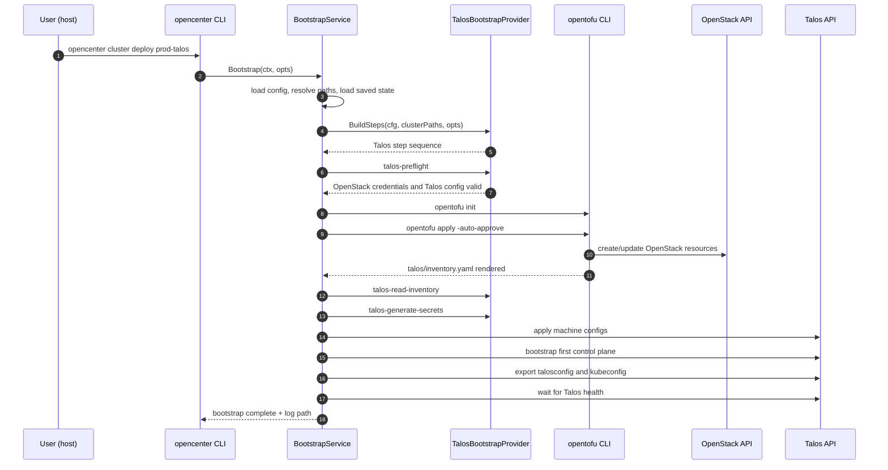

# Create a Talos Cluster on OpenStack

**Purpose:** For platform engineers and operators, shows how to provision OpenStack infrastructure with OpenTofu and bootstrap Kubernetes on Talos Linux through the openCenter CLI.

Talos is a deployment method for OpenStack infrastructure. Use `--type openstack --deployment talos`; do not use `--type talos`.

## Prerequisites

- openCenter CLI installed and on `PATH`
- `git`, `kubectl`, `openstack`, and `opentofu` installed
- `flux` installed if you want to use the verification commands in the last section
- OpenStack application credentials with permission to create or manage networking, instances, volumes, security groups, and load balancer resources
- Existing OpenStack network, subnet, Talos-compatible OpenStack image, and external network IDs for the target region
- Enough quota for the default footprint: 1 bastion, 3 control planes, and 2 workers
- A Git remote for the generated GitOps repository

Talos bootstrap uses native Talos Go machinery and client APIs from the CLI. `talosctl` is not required.

Verify local tooling and OpenStack access before you start:

```bash
opencenter version
git --version
kubectl version --client
openstack --version
opentofu version
openstack token issue
```

Useful discovery commands:

```bash
openstack image list --name Talos
openstack network list
openstack subnet list
openstack network list --external
```

## Bootstrap Flow

The sequence below shows the Talos OpenStack bootstrap path implemented by `opencenter cluster deploy`.



The bootstrap state file stores only step progress, timestamps, and error text under the openCenter state directory. Talos machine secrets and talosconfig are written under the cluster-owned `secrets/talos/<cluster>/` paths and are covered by the generated SOPS rules.

## Steps

### 1. Initialize the Talos OpenStack configuration

```bash
opencenter cluster init prod-talos --org my-company --type openstack --deployment talos
```

This creates a v2 config and organization-aware directory structure under:

- `~/.config/opencenter/clusters/my-company/infrastructure/clusters/prod-talos/`
- `~/.config/opencenter/clusters/my-company/secrets/`

It also:

- writes the cluster config file to `infrastructure/clusters/prod-talos/.prod-talos-config.yaml`
- sets `deployment.method: talos`
- writes Talos settings under `deployment.talos`
- removes Kubespray deployment settings from the generated config
- generates SSH and SOPS Age keys
- enables OpenTofu with a local backend by default
- enables Cilium defaults and disables kube-proxy through generated Talos patches

Important `cluster init` flags for Talos:

| Flag | Description |
|---|---|
| `--org` | Organization name (defaults to `opencenter`) |
| `--type openstack` | Infrastructure provider. Talos currently supports OpenStack only. |
| `--deployment talos` | Deployment method. This selects the Talos Go API bootstrap path. |
| `--force` | Overwrite existing config file |
| `--no-keygen` | Skip automatic SSH and SOPS key generation |
| `--no-sops-keygen` | Skip only SOPS key generation |
| `--regenerate-keys` | Regenerate keys even if they already exist |
| `--full-schema` | Generate config with all available fields |

You can override Talos values at init time with dotted flag notation:

```bash
opencenter cluster init prod-talos --org my-company --type openstack --deployment talos \
  deployment.talos.install.disk=/dev/vda \
  deployment.talos.network.talos_api_port=50001
```

Confirm the resolved paths:

```bash
opencenter cluster describe my-company/prod-talos
```

### 2. Set OpenStack, GitOps, and cluster identity values

Open the generated config:

```bash
opencenter cluster edit my-company/prod-talos
```

Update the OpenStack and GitOps sections with real values. For Talos, `image_id` should point to a Talos-compatible OpenStack image. The `deployment.talos.install.image` value is the Talos installer container used by machine config generation.

```yaml
opencenter:
  meta:
    env: production
    region: sjc3

  cluster:
    cluster_fqdn: "prod-talos.sjc3.k8s.example.com"
    admin_email: "platform@example.com"

  gitops:
    repository:
      url: "git@github.com:my-company/prod-talos-gitops.git"
      branch: main

  infrastructure:
    cloud:
      openstack:
        auth_url: "https://identity.api.your-cloud.com/v3"
        region: sjc3
        project_id: "your-project-id"
        project_name: "your-project-name"
        tenant_name: "your-project-name"
        application_credential_id: "your-app-credential-id"
        application_credential_secret: "your-app-credential-secret"
        user_domain_name: "Default"
        project_domain_name: "Default"
        image_id: "your-talos-openstack-image-id"
        availability_zone: "az1"
        network_id: "your-network-id"
        subnet_id: "your-subnet-id"
        floating_ip_pool: "PUBLICNET"
        router_external_network_id: "your-external-network-id"
        networking:
          network_id: "your-network-id"
          subnet_id: "your-subnet-id"
          floating_ip_pool: "PUBLICNET"
          router_external_network_id: "your-external-network-id"
          k8s_api_port_acl:
            - "203.0.113.0/24"
```

Notes:

- Set both `project_name` and `tenant_name` to the same project value. Some generated OpenStack templates still read `tenant_name`.
- Keep the top-level OpenStack network fields and the nested `openstack.networking` block in sync.
- Replace the default Git repository URL before `cluster generate` or `cluster deploy`.

### 3. Review Talos settings

Talos-specific settings live only under `deployment.talos`:

```yaml
deployment:
  method: talos
  talos:
    version: v1.8.0
    kubernetes_version: 1.33.5
    install:
      disk: /dev/sda
      image: ghcr.io/siderolabs/installer:v1.8.0
    network:
      pod_subnet: 10.42.0.0/16
      service_subnet: 10.43.0.0/16
      talos_api_port: 50000
    patches:
      static:
        - disable-cni
        - disable-kubeproxy
        - disable-node-cidr-allocator
        - ntp
```

Set `deployment.talos.endpoint` only when you need to override the generated Kubernetes API endpoint. When omitted, the OpenStack Talos template uses the OpenStack Kubernetes API address rendered by OpenTofu.

Review compute and network sizing before provisioning:

```yaml
opencenter:
  infrastructure:
    compute:
      master_count: 3
      worker_count: 2
      flavor_bastion: "gp.0.2.2"
      flavor_master: "gp.0.4.8"
      flavor_worker: "gp.0.4.16"

    networking:
      subnet_nodes: "10.2.128.0/22"
      allocation_pool_start: "10.2.128.10"
      allocation_pool_end: "10.2.131.250"
      vrrp_ip: "10.2.128.5"
      vrrp_enabled: true
      use_octavia: false
      loadbalancer_provider: "ovn"
      dns_nameservers:
        - "8.8.8.8"
        - "8.8.4.4"
      ntp_servers:
        - "time.cloudflare.com"
```

### 4. Validate and generate the GitOps repository

```bash
opencenter cluster doctor prod-talos
opencenter cluster validate prod-talos
opencenter cluster generate prod-talos
```

`cluster generate` renders OpenStack infrastructure plus Talos artifacts under the cluster infrastructure directory. Verify the generated files:

```bash
GITOPS_DIR=$(opencenter cluster describe prod-talos 2>/dev/null | grep "git_dir:" | awk '{print $2}')
ls "$GITOPS_DIR/infrastructure/clusters/prod-talos"
ls "$GITOPS_DIR/infrastructure/clusters/prod-talos/talos"
ls "$GITOPS_DIR/infrastructure/clusters/prod-talos/talos/patches"
```

You should see `main.tf`, `variables.tf`, `provider.tf`, `Makefile`, `talos/inventory.yaml`, and generated patch files. Kubespray inventory files are not rendered for Talos deployments.

### 5. Configure the remote and push the initial commit

`cluster generate` creates the initial Git commit, but it does not add `origin` for you.

```bash
GITOPS_DIR=$(opencenter cluster describe prod-talos 2>/dev/null | grep "git_dir:" | awk '{print $2}')

git -C "$GITOPS_DIR" remote add origin git@github.com:my-company/prod-talos-gitops.git
git -C "$GITOPS_DIR" branch -M main
git -C "$GITOPS_DIR" push -u origin main
```

If the repository already has an `origin`, update it instead:

```bash
git -C "$GITOPS_DIR" remote set-url origin git@github.com:my-company/prod-talos-gitops.git
```

### 6. Bootstrap the cluster

```bash
opencenter cluster deploy prod-talos
```

Talos OpenStack bootstrap runs these step IDs:

1. `talos-preflight` - validates OpenStack credentials and Talos prerequisites
2. `opentofu-init` - initializes OpenTofu in the cluster infrastructure directory
3. `opentofu-apply` - provisions OpenStack resources and renders `talos/inventory.yaml`
4. `talos-read-inventory` - reads the Talos inventory contract
5. `talos-generate-secrets` - creates or loads Talos machine secrets
6. `talos-apply-machine-configs` - generates machine configs in memory and applies them through Talos APIs
7. `talos-bootstrap-controlplane` - bootstraps the first control-plane node
8. `talos-export-talosconfig` - writes talosconfig under `secrets/talos/<cluster>/`
9. `talos-export-kubeconfig` - writes kubeconfig to the existing cluster-owned kubeconfig path
10. `talos-wait-ready` - checks Talos API health for all nodes

Generated machine configs are not persisted to disk.

Bootstrap flags:

| Flag | Description |
|---|---|
| `--dry-run` | Show planned actions without executing |
| `--restart` | Rerun all bootstrap steps and ignore saved state |
| `--step <id>` | Run a single bootstrap step by ID |
| `--from-step <id>` | Restart bootstrap from the specified step ID |
| `--confirm-commit` | Prompt for confirmation before auto-committing uncommitted GitOps changes |
| `--kubeconfig` | Path to kubeconfig (defaults to the cluster-owned kubeconfig path) |
| `--log` | Log file path (defaults to `<state_dir>/logs/bootstrap/<org>/<name>/bootstrap-<timestamp>.log`) |

Examples:

```bash
# Resume after OpenTofu provisions instances
opencenter cluster deploy prod-talos --from-step talos-read-inventory

# Re-apply generated machine configs through the Talos API
opencenter cluster deploy prod-talos --step talos-apply-machine-configs

# Throw away saved bootstrap state and rerun the full sequence
opencenter cluster deploy prod-talos --restart
```

## Verification

Bootstrap returns after Talos health checks complete and the kubeconfig has been exported. Use `cluster status --refresh` and `kubectl` to verify Kubernetes API readiness and workload reconciliation.

```bash
GITOPS_DIR=$(opencenter cluster describe prod-talos 2>/dev/null | grep "git_dir:" | awk '{print $2}')
export KUBECONFIG="$GITOPS_DIR/infrastructure/clusters/prod-talos/kubeconfig.yaml"

opencenter cluster status prod-talos --refresh
kubectl cluster-info
kubectl get nodes -o wide
kubectl get pods -n kube-system
kubectl get pods -n flux-system
flux get kustomizations -A
```

Expected state:

- `opencenter cluster status --refresh` reports Talos inventory, machine secrets, talosconfig, kubeconfig, Talos API health, and Kubernetes API readiness
- `kubectl cluster-info` returns the cluster API endpoint
- control plane and worker nodes are `Ready`
- Cilium pods are running
- Flux controllers are running in `flux-system`

## Cleanup

Destroy the OpenStack infrastructure:

```bash
opencenter cluster destroy prod-talos --force
```

By default, `cluster destroy --force` destroys cloud infrastructure through OpenTofu but preserves local configuration, secrets, and GitOps files for inspection or recovery.

To also remove local files:

```bash
opencenter cluster destroy prod-talos --force --remove-files
```

Confirm the OpenStack resources are gone:

```bash
openstack server list --name prod-talos
openstack volume list --long | grep prod-talos
```

## Troubleshooting

### `--type talos` fails during init

That is expected. Talos is a deployment method, not an infrastructure provider.

Use:

```bash
opencenter cluster init prod-talos --type openstack --deployment talos
```

### Bootstrap fails during `talos-read-inventory`

The inventory is generated by OpenTofu at:

```text
infrastructure/clusters/<cluster>/talos/inventory.yaml
```

Run or resume from OpenTofu apply, then inspect the file:

```bash
opencenter cluster deploy prod-talos --from-step opentofu-apply
```

### Bootstrap fails while applying machine configs

Confirm the OpenStack image is a Talos-compatible image and that the Talos API port is reachable from the host running the CLI. The default Talos API port is `50000`.

Review:

- `opencenter.infrastructure.cloud.openstack.image_id`
- `deployment.talos.network.talos_api_port`
- OpenStack security group rules rendered by the infrastructure module
- the bootstrap log under `~/.local/state/opencenter/logs/bootstrap/<org>/<cluster>/`

### Machine secrets or talosconfig cannot be read

Talos secrets are stored under:

```text
secrets/talos/<cluster>/machine-secrets.yaml
secrets/talos/<cluster>/talosconfig.yaml
```

The generated `.sops.yaml` includes `secrets/talos/.*\.ya?ml$`, so these files should be encrypted at rest when committed.

### Kubernetes API is reachable but workloads are still reconciling

Talos bootstrap waits for Talos health and exports kubeconfig. Kubernetes API checks, platform services, and Flux reconciliation can continue after `cluster deploy` exits.

```bash
kubectl get pods -A
flux get kustomizations -A
```
