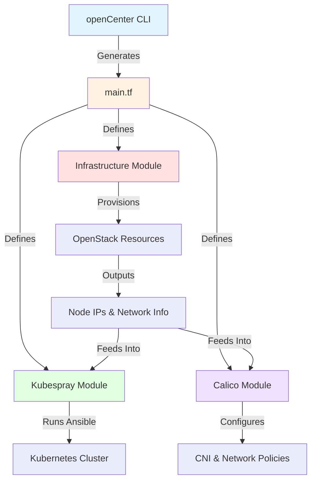
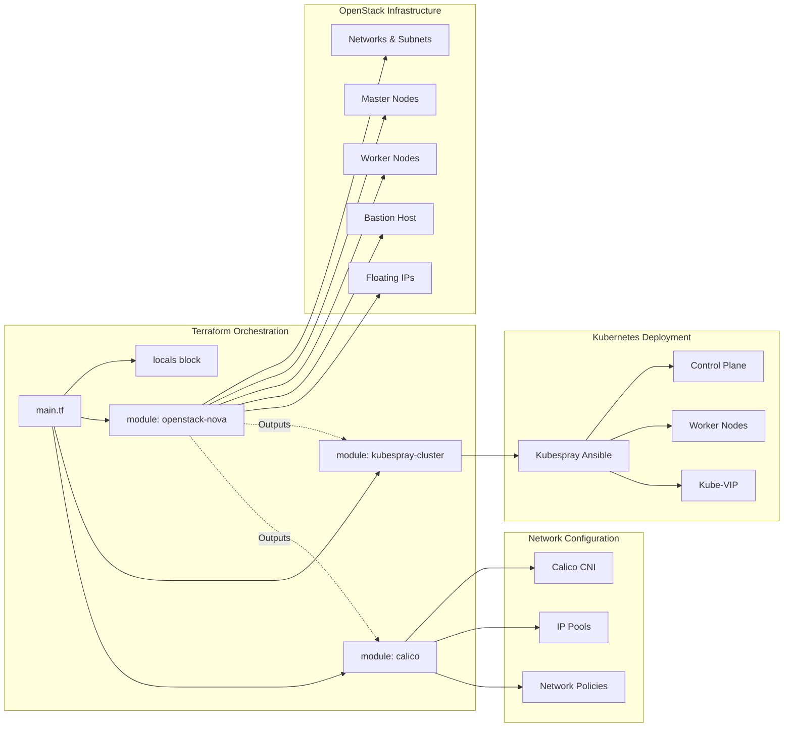
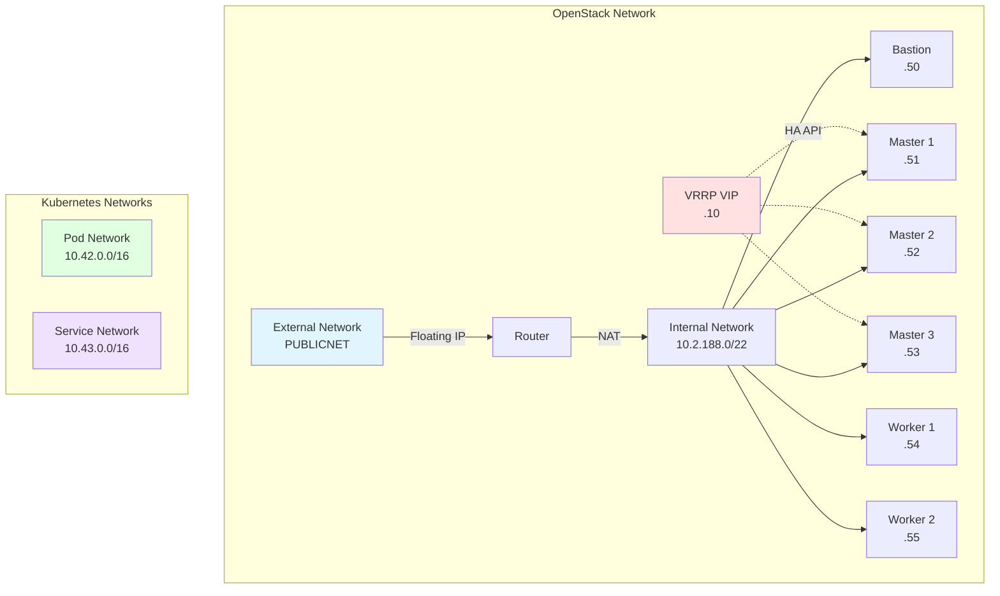
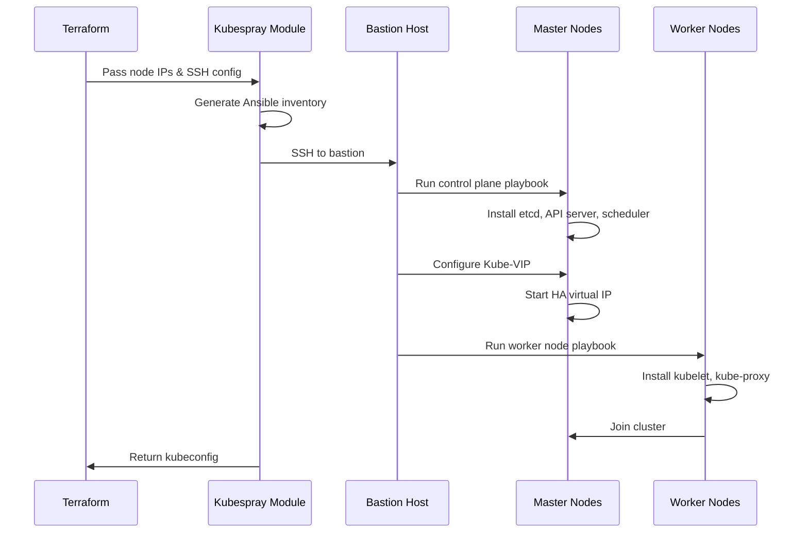
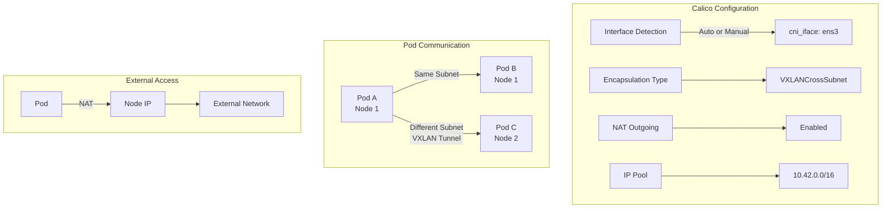
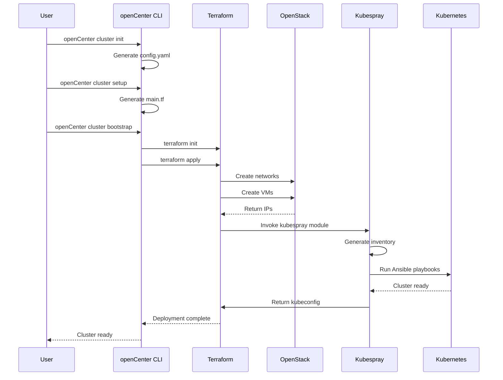
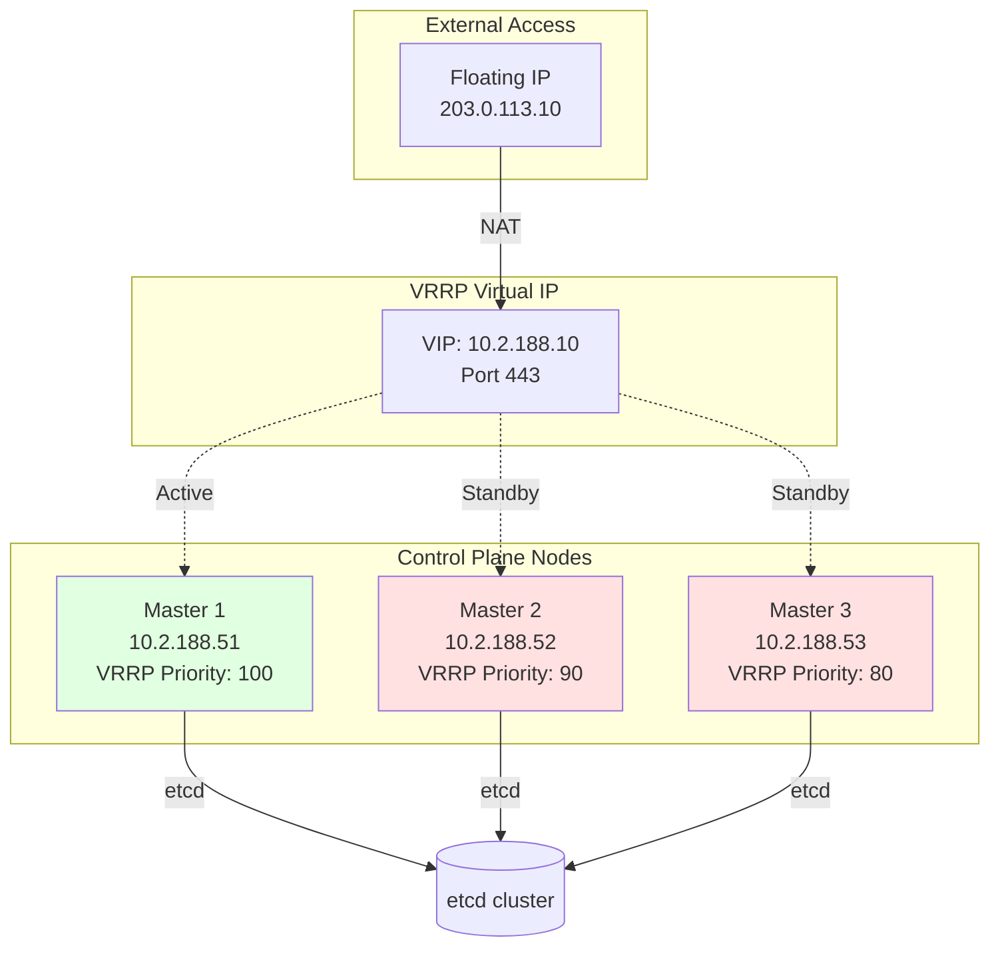

# Kubespray Provider Guide

## Overview

The Kubespray provider in openCenter uses a three-layer architecture to deploy production-ready Kubernetes clusters on OpenStack infrastructure. This approach combines **Terraform** for infrastructure provisioning, **Kubespray** (Ansible-based) for Kubernetes installation, and **Calico** for network configuration.

## Architecture

### High-Level Flow



### Three-Module Architecture

The generated `main.tf` orchestrates three Terraform modules that work together:

1. **openstack-nova** - Infrastructure provisioning
2. **kubespray-cluster** - Kubernetes installation via Ansible
3. **calico** - CNI configuration and network policies



## Module Breakdown

### 1. OpenStack Infrastructure Module

**Purpose:** Provisions the underlying compute, network, and storage resources on OpenStack.

**Source:** `github.com/rackerlabs/openCenter-gitops-base.git//install/iac/terraform-openstack`

**Key Responsibilities:**
- Create virtual networks and subnets
- Provision master and worker VMs
- Configure security groups and firewall rules
- Allocate floating IPs for external access
- Set up bastion host for SSH access
- Configure VRRP for HA control plane (optional)
- Create Octavia load balancer (optional)

**Critical Outputs:**
```hcl
output "bastion_floating_ip"    # SSH entry point
output "master_nodes"           # Control plane node details
output "worker_nodes"           # Worker node details
output "k8s_api_ip"            # Kubernetes API endpoint
output "k8s_internal_ip"       # Internal cluster IP
```

**Network Architecture:**


### 2. Kubespray Cluster Module

**Purpose:** Installs and configures Kubernetes using Ansible playbooks from the Kubespray project.

**Source:** `github.com/rackerlabs/openCenter-gitops-base.git//install/iac/kubespray`

**Key Responsibilities:**
- Generate Kubespray inventory from Terraform outputs
- Run Ansible playbooks to install Kubernetes
- Configure control plane components (API server, scheduler, controller-manager)
- Set up etcd cluster
- Install and configure kubelet on all nodes
- Deploy Kube-VIP for HA API endpoint
- Apply security hardening (CIS benchmarks)
- Configure OIDC authentication (optional)
- Rotate kubelet certificates

**Deployment Flow:**


**Key Configuration Options:**
- `kubernetes_version`: K8s version to install (e.g., "1.30.4")
- `kubespray_version`: Kubespray release tag (e.g., "v2.28.1")
- `network_plugin`: CNI plugin ("calico", "cilium", etc.)
- `kube_vip_enabled`: Enable HA virtual IP
- `k8s_hardening_enabled`: Apply CIS hardening
- `os_hardening_enabled`: Apply OS-level hardening

### 3. Calico Network Module

**Purpose:** Configures Calico CNI for pod networking and network policies.

**Source:** `github.com/rackerlabs/openCenter-gitops-base.git//install/iac/calico`

**Key Responsibilities:**
- Configure Calico IP pools for pod networking
- Set up BGP peering (if needed)
- Configure encapsulation (VXLAN, IPIP, or none)
- Enable NAT for outbound traffic
- Configure interface detection for multi-NIC nodes
- Support Windows worker nodes (optional)

**Network Encapsulation:**


**Encapsulation Modes:**
- **VXLANCrossSubnet**: VXLAN only for cross-subnet traffic (most efficient)
- **VXLAN**: Always use VXLAN encapsulation
- **IPIP**: IP-in-IP encapsulation (older, less efficient)
- **None**: Direct routing (requires BGP or cloud routing)

## Deployment Workflow

### Complete Deployment Sequence



### Step-by-Step Process

1. **Configuration Generation** (`openCenter cluster init`)
   - Creates `config.yaml` with cluster specifications
   - Sets provider to OpenStack
   - Defines node counts, flavors, and network settings

2. **GitOps Setup** (`openCenter cluster setup`)
   - Generates `main.tf` from templates
   - Creates GitOps repository structure
   - Renders Flux manifests

3. **Infrastructure Provisioning** (`openCenter cluster bootstrap`)
   - Runs `terraform init` to download providers
   - Executes `terraform apply` to create resources
   - Waits for VMs to be ready

4. **Kubernetes Installation** (automatic via Terraform)
   - Kubespray module generates Ansible inventory
   - Runs control plane installation playbook
   - Installs worker nodes
   - Configures networking

5. **Network Configuration** (automatic via Terraform)
   - Calico module applies CNI configuration
   - Sets up IP pools and routing
   - Enables network policies

## Key Configuration Parameters

### Infrastructure Settings

```yaml
# Node configuration
master_count: 3                    # 1 or 3 for HA
worker_count: 2                    # Scale as needed
flavor_master: "gp.0.4.4"         # 4 vCPU, 4GB RAM
flavor_worker: "gp.0.4.8"         # 4 vCPU, 8GB RAM

# Network configuration
subnet_nodes: "10.2.188.0/22"     # Node network
subnet_pods: "10.42.0.0/16"       # Pod network
subnet_services: "10.43.0.0/16"   # Service network
vrrp_ip: "10.2.188.10"            # HA VIP for API

# High availability
use_octavia: false                # Use Octavia LB
vrrp_enabled: true                # Use VRRP for HA
kube_vip_enabled: true            # Enable Kube-VIP
```

### Kubernetes Settings

```yaml
# Version control
kubernetes_version: "1.30.4"
kubespray_version: "v2.28.1"

# Networking
network_plugin: "calico"
cni_iface: "ens3"

# Security
k8s_hardening_enabled: true
os_hardening_enabled: true
kubelet_rotate_server_certificates: true
```

### Calico Settings

```yaml
# Interface detection
calico_interface_autodetect: false
cni_iface: "ens3"

# Encapsulation
calico_encapsulation_type: "VXLANCrossSubnet"
calico_nat_outgoing: true

# IP pool
calico_interface_autodetect_cidr: "10.2.188.0/22"
```

## High Availability Architecture

### Control Plane HA with VRRP



**VRRP (Virtual Router Redundancy Protocol):**
- Creates a virtual IP that floats between master nodes
- Active master holds the VIP
- Automatic failover if active master fails
- All API requests go through the VIP

**Alternative: Octavia Load Balancer:**
```yaml
use_octavia: true
vrrp_enabled: false
```
- Uses OpenStack's native load balancer
- More robust but requires Octavia service
- Distributes load across all masters

## Security Features

### Hardening Options

**Kubernetes Hardening** (`k8s_hardening_enabled: true`):
- CIS Kubernetes Benchmark compliance
- Pod Security Standards enforcement
- Restricted pod security policies
- Audit logging enabled
- Anonymous auth disabled

**OS Hardening** (`os_hardening_enabled: true`):
- CIS OS Benchmark compliance
- Firewall rules (iptables/nftables)
- SSH hardening
- Kernel parameter tuning
- File permission restrictions

### Certificate Management

```yaml
kubelet_rotate_server_certificates: true
```
- Automatic certificate rotation
- Prevents certificate expiration issues
- Uses Kubernetes CSR API

### OIDC Authentication (Optional)

```yaml
kube_oidc_auth_enabled: true
kube_oidc_url: "https://auth.example.com"
kube_oidc_client_id: "kubernetes"
kube_oidc_username_claim: "email"
kube_oidc_groups_claim: "groups"
```

## Troubleshooting

### Common Issues

**1. Ansible Connection Failures**
```bash
# Check bastion connectivity
ssh -i ~/.ssh/id_rsa ubuntu@<bastion-ip>

# Verify node reachability from bastion
ssh ubuntu@<node-ip>
```

**2. VRRP Not Working**
```bash
# Check VRRP status on masters
sudo systemctl status keepalived

# Verify VIP assignment
ip addr show | grep <vrrp-ip>
```

**3. Calico Pods Not Starting**
```bash
# Check Calico status
kubectl get pods -n kube-system | grep calico

# View Calico node logs
kubectl logs -n kube-system <calico-node-pod>

# Verify interface detection
kubectl exec -n kube-system <calico-node-pod> -- ip addr
```

**4. Nodes Not Joining Cluster**
```bash
# Check kubelet status
sudo systemctl status kubelet

# View kubelet logs
sudo journalctl -u kubelet -f

# Verify API server connectivity
curl -k https://<vrrp-ip>:443/healthz
```

### Debug Mode

Enable Ansible verbose output:
```yaml
# In config.yaml
ansible_verbosity: 2  # 0-4, higher = more verbose
```

## Performance Tuning

### Node Sizing Recommendations

| Cluster Size | Master Flavor | Worker Flavor | Master Count |
|--------------|---------------|---------------|--------------|
| Dev/Test     | gp.0.2.2      | gp.0.2.4      | 1            |
| Small Prod   | gp.0.4.4      | gp.0.4.8      | 3            |
| Medium Prod  | gp.0.8.8      | gp.0.8.16     | 3            |
| Large Prod   | gp.0.16.16    | gp.0.16.32    | 3            |

### Network Performance

**Encapsulation Impact:**
- **None** (direct routing): Best performance, requires BGP
- **VXLANCrossSubnet**: Good balance, ~5% overhead
- **VXLAN**: Moderate overhead, ~10-15%
- **IPIP**: Higher overhead, ~15-20%

**MTU Considerations:**
```yaml
mtu: 1450  # Reduce for VXLAN to avoid fragmentation
```

## Migration and Upgrades

### Kubernetes Version Upgrades

```yaml
# Update config.yaml
kubernetes_version: "1.31.0"

# Re-run bootstrap
mise run cluster-bootstrap
```

Kubespray handles rolling upgrades automatically.

### Kubespray Version Upgrades

```yaml
# Update config.yaml
kubespray_version: "v2.29.0"

# Re-run bootstrap
mise run cluster-bootstrap
```

**Note:** Check Kubespray release notes for breaking changes.

## Best Practices

1. **Always use 3 masters** for production clusters
2. **Enable hardening** for security compliance
3. **Use VRRP or Octavia** for HA API endpoint
4. **Size workers appropriately** for workload
5. **Monitor etcd health** regularly
6. **Backup etcd** before upgrades
7. **Test in dev** before production changes
8. **Use GitOps** for all configuration changes
9. **Enable certificate rotation** to avoid expiration
10. **Document custom configurations** in Git

## Related Documentation

- [OpenStack Provider Configuration](../openstack/)
- [Secrets Management](../../secrets.md)
- [Cluster Lifecycle](../../reference/cluster/)
- [Troubleshooting Guide](../../TROUBLESHOOTING.md)

## External References

- [Kubespray Documentation](https://kubespray.io/)
- [Calico Documentation](https://docs.tigera.io/calico/latest/about/)
- [Kubernetes Documentation](https://kubernetes.io/docs/)
- [OpenStack Documentation](https://docs.openstack.org/)
